# Diagramas Completos do Sistema - SmartSignage Pro

**Versão:** 2.1.0  
**Data:** Dezembro 2025

---

## 📑 Índice

1. [Modelo ER - Banco de Dados](#1-modelo-er---banco-de-dados)
2. [Visão do Cliente](#2-visão-do-cliente)
3. [Visão Comercial](#3-visão-comercial)
4. [Visão Técnica](#4-visão-técnica)
5. [Fluxos Principais do Negócio](#5-fluxos-principais-do-negócio)

---

## 1. Modelo ER - Banco de Dados

### 1.1. Modelo ER Completo - Entidades Principais

```mermaid
erDiagram
    %% ============================================
    %% ENTIDADES PRINCIPAIS
    %% ============================================
    
    SUBSCRIBERS ||--o{ CAMPAIGNS : "cria"
    SUBSCRIBERS ||--o{ MEDIAS : "possui"
    SUBSCRIBERS ||--o{ PLAYLISTS : "cria"
    SUBSCRIBERS ||--o{ SUBSCRIBER_BILLING : "gera"
    SUBSCRIBERS ||--o{ SUBSCRIBER_CONTRACTS : "possui"
    
    PUBLISHERS ||--o{ LOCALS : "tem"
    PUBLISHERS ||--o{ USERS : "tem"
    PUBLISHERS ||--o{ SUBSCRIPTIONS : "possui"
    PUBLISHERS ||--o{ PUBLISHER_BILLING : "gera"
    PUBLISHERS ||--o{ PUBLISHER_CONTRACTS : "possui"
    PUBLISHERS ||--o{ CAMPAIGN_PUBLISHERS : "participa"
    
    LOCALS ||--o{ TOTEMS : "contém"
    TOTEMS ||--o{ SMART_TVS : "controla"
    TOTEMS ||--o{ TOTEM_PLAYLIST_MIX : "gera"
    
    CAMPAIGNS ||--o{ CAMPAIGN_PLAYLISTS : "vincula"
    CAMPAIGNS ||--o{ CAMPAIGN_TOTEMS : "vincula"
    CAMPAIGNS ||--o{ CAMPAIGN_PUBLISHERS : "vincula"
    CAMPAIGNS ||--o{ QR_CODES : "gera"
    
    PLAYLISTS ||--o{ PLAYLIST_ITEMS : "contém"
    PLAYLISTS ||--o{ CAMPAIGN_PLAYLISTS : "vincula"
    
    MEDIAS ||--o{ PLAYLIST_ITEMS : "compõe"
    MEDIAS ||--o{ QR_CODES : "vincula"
    
    TOTEMS ||--o{ EXECUTION_LOGS : "gera"
    TOTEMS ||--o{ EVENT_LOGS : "gera"
    TOTEMS ||--o{ AI_CONTEXT_DATA : "coleta"
    
    TOTEM_PLAYLIST_MIX ||--o{ PLAYLIST_MIX_HISTORY : "gera histórico"
    TOTEMS ||--o{ PLAYLIST_MIX_RULES : "usa regras"
    
    SUBSCRIBER_BILLING ||--o{ INVOICES : "gera"
    PUBLISHER_BILLING ||--o{ INVOICES : "gera"
    
    %% ============================================
    %% DEFINIÇÕES DAS ENTIDADES
    %% ============================================
    
    SUBSCRIBERS {
        serial subscriber_id PK
        text name
        text email UK
        text phone
        boolean is_active
        timestamp created_at
    }
    
    PUBLISHERS {
        serial publisher_id PK
        text name
        text email
        text phone
        boolean active
        text client_type
        timestamp created_at
    }
    
    CAMPAIGNS {
        serial campaign_id PK
        serial subscriber_id FK
        text name
        text status
        date start_date
        date end_date
        numeric budget
        text commercial_tier
        numeric default_time_share_percent
        integer max_consecutive_slots
    }
    
    PLAYLISTS {
        serial playlist_id PK
        serial subscriber_id FK
        text name
        text description
        boolean is_active
        timestamp created_at
    }
    
    MEDIAS {
        serial media_id PK
        serial subscriber_id FK
        text title
        text file_path
        text media_type
        integer duration_seconds
        text storage_path
    }
    
    LOCALS {
        serial local_id PK
        serial publisher_id FK
        text name
        text address
        text location_type
        boolean is_active
    }
    
    TOTEMS {
        serial totem_id PK
        serial local_id FK
        text name
        text device_id
        text status
        text location_description
        timestamp last_heartbeat
    }
    
    SMART_TVS {
        serial smart_tv_id PK
        serial totem_id FK
        text device_model
        text screen_size
        text resolution
        boolean is_active
    }
    
    CAMPAIGN_PUBLISHERS {
        serial campaign_id FK
        serial publisher_id FK
        numeric time_share_percent
        jsonb daypart_config
        integer min_impressions_per_hour
        integer max_impressions_per_hour
    }
    
    TOTEM_PLAYLIST_MIX {
        serial mix_id PK
        serial totem_id FK
        jsonb mix_items
        integer total_items
        integer total_duration
        text mix_strategy
        jsonb context_snapshot
        boolean is_current
        timestamp generated_at
    }
    
    PLAYLIST_MIX_RULES {
        serial rule_id PK
        serial totem_id FK
        text rule_type
        numeric priority_weight
        numeric time_weight
        numeric tag_weight
        boolean ai_enabled
        text rotation_strategy
        boolean is_default
        boolean is_active
    }
    
    AI_CONTEXT_DATA {
        serial context_id PK
        serial totem_id FK
        integer pedestrian_count
        numeric density_score
        numeric sentiment_score
        text sentiment_label
        jsonb demographics
        jsonb performance_metrics
        timestamp collected_at
    }
    
    SUBSCRIBER_BILLING {
        serial billing_id PK
        serial subscriber_id FK
        text billing_type
        numeric amount
        text status
        date billing_period_start
        date billing_period_end
    }
    
    PUBLISHER_BILLING {
        serial billing_id PK
        serial publisher_id FK
        text billing_type
        numeric revenue_amount
        text status
        date billing_period_start
        date billing_period_end
    }
```

### 1.2. Modelo ER Simplificado - Foco em Relacionamentos de Negócio

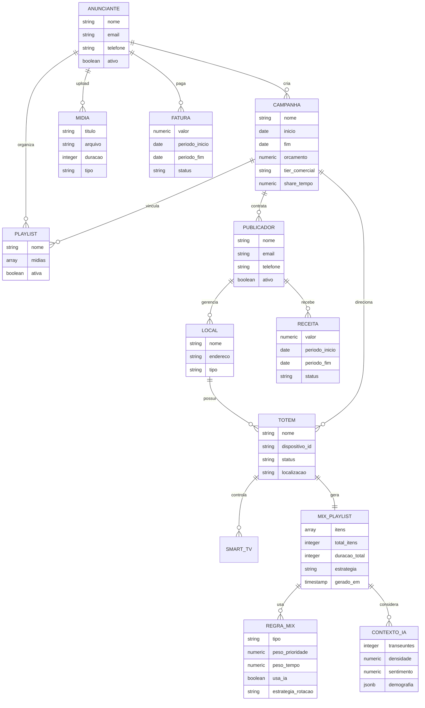
```mermaid
erDiagram
    %% ============================================
    %% MODELO SIMPLIFICADO - FOCO EM NEGÓCIO
    %% ============================================
    
    ANUNCIANTE ||--o{ CAMPANHA : "cria"
    ANUNCIANTE ||--o{ MIDIA : "upload"
    ANUNCIANTE ||--o{ PLAYLIST : "organiza"
    
    PUBLICADOR ||--o{ LOCAL : "gerencia"
    LOCAL ||--o{ TOTEM : "possui"
    TOTEM ||--o{ SMART_TV : "controla"
    
    CAMPANHA ||--o{ PLAYLIST : "vincula"
    CAMPANHA ||--o{ TOTEM : "direciona"
    CAMPANHA ||--o{ PUBLICADOR : "contrata"
    
    TOTEM ||--|| MIX_PLAYLIST : "gera"
    MIX_PLAYLIST ||--o{ REGRA_MIX : "usa"
    MIX_PLAYLIST ||--o{ CONTEXTO_IA : "considera"
    
    ANUNCIANTE ||--o{ FATURA : "paga"
    PUBLICADOR ||--o{ RECEITA : "recebe"
    
    ANUNCIANTE {
        string nome
        string email
        string telefone
        boolean ativo
    }
    
    PUBLICADOR {
        string nome
        string email
        string telefone
        boolean ativo
    }
    
    CAMPANHA {
        string nome
        date inicio
        date fim
        numeric orcamento
        string tier_comercial
        numeric share_tempo
    }
    
    PLAYLIST {
        string nome
        array midias
        boolean ativa
    }
    
    MIDIA {
        string titulo
        string arquivo
        integer duracao
        string tipo
    }
    
    LOCAL {
        string nome
        string endereco
        string tipo
    }
    
    TOTEM {
        string nome
        string dispositivo_id
        string status
        string localizacao
    }
    
    MIX_PLAYLIST {
        array itens
        integer total_itens
        integer duracao_total
        string estrategia
        timestamp gerado_em
    }
    
    REGRA_MIX {
        string tipo
        numeric peso_prioridade
        numeric peso_tempo
        boolean usa_ia
        string estrategia_rotacao
    }
    
    CONTEXTO_IA {
        integer transeuntes
        numeric densidade
        numeric sentimento
        jsonb demografia
    }
    
    FATURA {
        numeric valor
        date periodo_inicio
        date periodo_fim
        string status
    }
    
    RECEITA {
        numeric valor
        date periodo_inicio
        date periodo_fim
        string status
    }
```

---

## 2. Visão do Cliente

### 2.1. Jornada do Cliente - Subscriber (Anunciante)

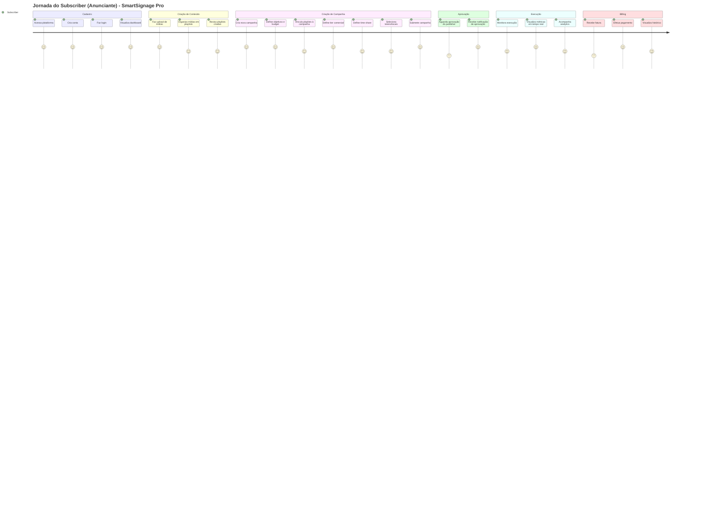
```mermaid
journey
    title Jornada do Subscriber (Anunciante) - SmartSignage Pro
    section Cadastro
        Acessa plataforma: 5: Subscriber
        Cria conta: 5: Subscriber
        Faz login: 5: Subscriber
        Visualiza dashboard: 5: Subscriber
    section Criação de Conteúdo
        Faz upload de mídias: 5: Subscriber
        Organiza mídias em playlists: 4: Subscriber
        Revisa playlists criadas: 4: Subscriber
    section Criação de Campanha
        Cria nova campanha: 5: Subscriber
        Define objetivos e budget: 5: Subscriber
        Vincula playlists à campanha: 4: Subscriber
        Define tier comercial: 5: Subscriber
        Define time share: 4: Subscriber
        Seleciona totens/locais: 4: Subscriber
        Submete campanha: 5: Subscriber
    section Aprovação
        Aguarda aprovação do publisher: 3: Subscriber
        Recebe notificação de aprovação: 5: Subscriber
    section Execução
        Monitora execução: 4: Subscriber
        Visualiza métricas em tempo real: 5: Subscriber
        Acompanha analytics: 4: Subscriber
    section Billing
        Recebe fatura: 3: Subscriber
        Efetua pagamento: 5: Subscriber
        Visualiza histórico: 4: Subscriber
```

### 2.2. Jornada do Cliente - Publisher (Publicador)

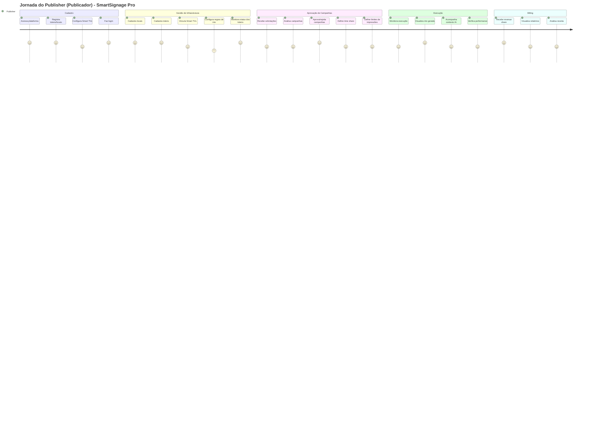
```mermaid
journey
    title Jornada do Publisher (Publicador) - SmartSignage Pro
    section Cadastro
        Acessa plataforma: 5: Publisher
        Registra totens/locais: 5: Publisher
        Configura Smart TVs: 4: Publisher
        Faz login: 5: Publisher
    section Gestão de Infraestrutura
        Cadastra locais: 5: Publisher
        Cadastra totens: 5: Publisher
        Vincula Smart TVs: 4: Publisher
        Configura regras de mix: 3: Publisher
        Monitora status dos totens: 5: Publisher
    section Aprovação de Campanhas
        Recebe solicitações: 4: Publisher
        Analisa campanhas: 4: Publisher
        Aprova/rejeita campanhas: 5: Publisher
        Define time share: 4: Publisher
        Define limites de impressões: 4: Publisher
    section Execução
        Monitora execução: 4: Publisher
        Visualiza mix gerada: 5: Publisher
        Acompanha contexto IA: 4: Publisher
        Verifica performance: 4: Publisher
    section Billing
        Recebe revenue share: 5: Publisher
        Visualiza relatórios: 4: Publisher
        Analisa receita: 4: Publisher
```

### 2.3. Fluxo de Uso - Subscriber

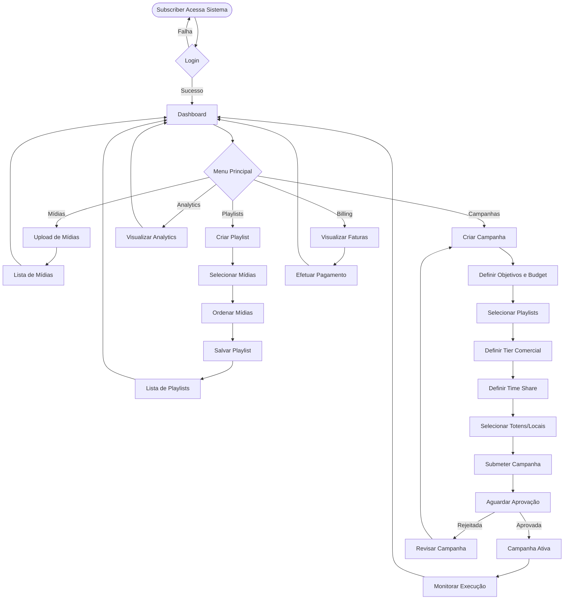
```mermaid
flowchart TD
    Start([Subscriber Acessa Sistema]) --> Login{Login}
    Login -->|Sucesso| Dashboard[Dashboard]
    Login -->|Falha| Start
    
    Dashboard --> Menu{Menu Principal}
    
    Menu -->|Mídias| UploadMidias[Upload de Mídias]
    UploadMidias --> ListaMidias[Lista de Mídias]
    ListaMidias --> Dashboard
    
    Menu -->|Playlists| CriarPlaylist[Criar Playlist]
    CriarPlaylist --> SelecionarMidias[Selecionar Mídias]
    SelecionarMidias --> OrdenarMidias[Ordenar Mídias]
    OrdenarMidias --> SalvarPlaylist[Salvar Playlist]
    SalvarPlaylist --> ListaPlaylists[Lista de Playlists]
    ListaPlaylists --> Dashboard
    
    Menu -->|Campanhas| CriarCampanha[Criar Campanha]
    CriarCampanha --> DefinirObjetivos[Definir Objetivos e Budget]
    DefinirObjetivos --> SelecionarPlaylists[Selecionar Playlists]
    SelecionarPlaylists --> DefinirTier[Definir Tier Comercial]
    DefinirTier --> DefinirTimeShare[Definir Time Share]
    DefinirTimeShare --> SelecionarTotens[Selecionar Totens/Locais]
    SelecionarTotens --> SubmeterCampanha[Submeter Campanha]
    SubmeterCampanha --> AguardarAprovacao[Aguardar Aprovação]
    AguardarAprovacao -->|Aprovada| CampanhaAtiva[Campanha Ativa]
    AguardarAprovacao -->|Rejeitada| RevisarCampanha[Revisar Campanha]
    RevisarCampanha --> CriarCampanha
    CampanhaAtiva --> MonitorarCampanha[Monitorar Execução]
    MonitorarCampanha --> Dashboard
    
    Menu -->|Analytics| Analytics[Visualizar Analytics]
    Analytics --> Dashboard
    
    Menu -->|Billing| Billing[Visualizar Faturas]
    Billing --> PagarFatura[Efetuar Pagamento]
    PagarFatura --> Dashboard
```

### 2.4. Fluxo de Uso - Publisher

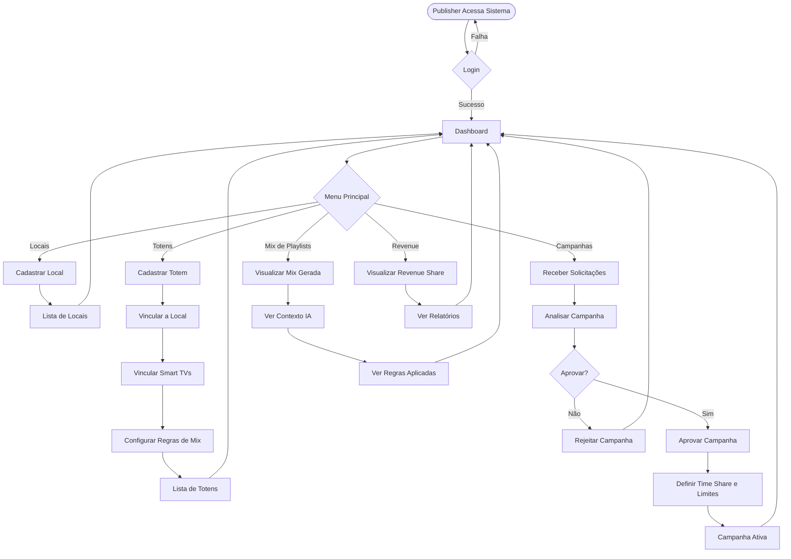
```mermaid
flowchart TD
    Start([Publisher Acessa Sistema]) --> Login{Login}
    Login -->|Sucesso| Dashboard[Dashboard]
    Login -->|Falha| Start
    
    Dashboard --> Menu{Menu Principal}
    
    Menu -->|Locais| CadastrarLocal[Cadastrar Local]
    CadastrarLocal --> ListaLocais[Lista de Locais]
    ListaLocais --> Dashboard
    
    Menu -->|Totens| CadastrarTotem[Cadastrar Totem]
    CadastrarTotem --> VincularLocal[Vincular a Local]
    VincularLocal --> VincularSmartTV[Vincular Smart TVs]
    VincularSmartTV --> ConfigurarRegrasMix[Configurar Regras de Mix]
    ConfigurarRegrasMix --> ListaTotens[Lista de Totens]
    ListaTotens --> Dashboard
    
    Menu -->|Campanhas| ReceberSolicitacoes[Receber Solicitações]
    ReceberSolicitacoes --> AnalisarCampanha[Analisar Campanha]
    AnalisarCampanha --> Decisao{Aprovar?}
    Decisao -->|Sim| AprovarCampanha[Aprovar Campanha]
    Decisao -->|Não| RejeitarCampanha[Rejeitar Campanha]
    AprovarCampanha --> DefinirParametros[Definir Time Share e Limites]
    DefinirParametros --> CampanhaAtiva[Campanha Ativa]
    CampanhaAtiva --> Dashboard
    RejeitarCampanha --> Dashboard
    
    Menu -->|Mix de Playlists| VisualizarMix[Visualizar Mix Gerada]
    VisualizarMix --> VerContextoIA[Ver Contexto IA]
    VerContextoIA --> VerRegras[Ver Regras Aplicadas]
    VerRegras --> Dashboard
    
    Menu -->|Revenue| Revenue[Visualizar Revenue Share]
    Revenue --> Relatorios[Ver Relatórios]
    Relatorios --> Dashboard
```

---

## 3. Visão Comercial

### 3.1. Modelo de Receita e Pricing

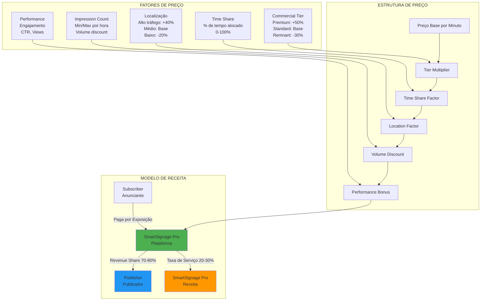
```mermaid
graph TB
    subgraph "MODELO DE RECEITA"
        S[Subscriber<br/>Anunciante] -->|Paga por Exposição| PL[SmartSignage Pro<br/>Plataforma]
        PL -->|Revenue Share 70-80%| P[Publisher<br/>Publicador]
        PL -->|Taxa de Serviço 20-30%| SS[SmartSignage Pro<br/>Receita]
    end
    
    subgraph "FATORES DE PREÇO"
        T1[Commercial Tier<br/>Premium: +50%<br/>Standard: Base<br/>Remnant: -30%]
        T2[Time Share<br/>% de tempo alocado<br/>0-100%]
        T3[Impression Count<br/>Min/Max por hora<br/>Volume discount]
        T4[Performance<br/>Engajamento<br/>CTR, Views]
        T5[Localização<br/>Alto tráfego: +40%<br/>Médio: Base<br/>Baixo: -20%]
    end
    
    subgraph "ESTRUTURA DE PREÇO"
        P1[Preço Base por Minuto]
        P2[Tier Multiplier]
        P3[Time Share Factor]
        P4[Location Factor]
        P5[Volume Discount]
        P6[Performance Bonus]
    end
    
    T1 --> P2
    T2 --> P3
    T3 --> P5
    T4 --> P6
    T5 --> P4
    
    P1 --> P2
    P2 --> P3
    P3 --> P4
    P4 --> P5
    P5 --> P6
    P6 --> PL
    
    style PL fill:#4CAF50
    style P fill:#2196F3
    style SS fill:#FF9800
```

### 3.2. Fluxo Financeiro Completo

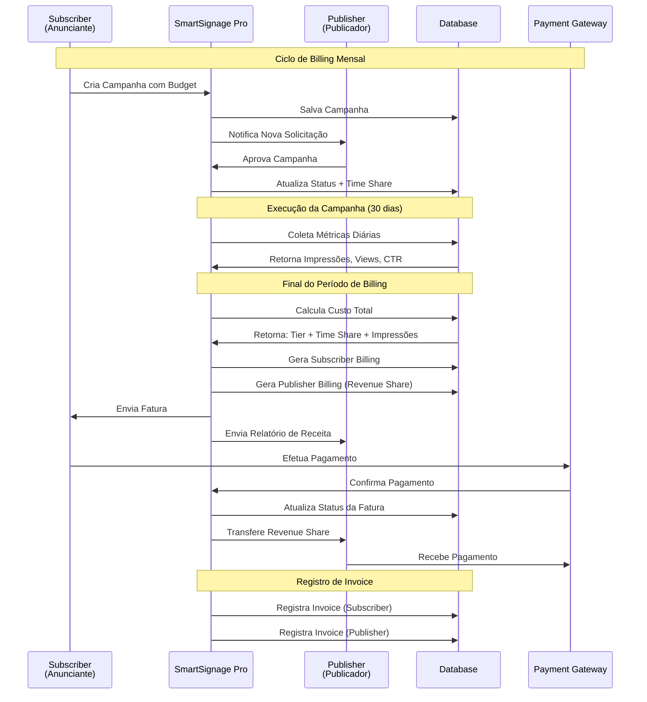
```mermaid
sequenceDiagram
    participant S as Subscriber<br/>(Anunciante)
    participant PL as SmartSignage Pro
    participant P as Publisher<br/>(Publicador)
    participant DB as Database
    participant PAY as Payment Gateway
    
    Note over S,PAY: Ciclo de Billing Mensal
    
    S->>PL: Cria Campanha com Budget
    PL->>DB: Salva Campanha
    PL->>P: Notifica Nova Solicitação
    
    P->>PL: Aprova Campanha
    PL->>DB: Atualiza Status + Time Share
    
    Note over PL,DB: Execução da Campanha (30 dias)
    
    PL->>DB: Coleta Métricas Diárias
    DB->>PL: Retorna Impressões, Views, CTR
    
    Note over PL,DB: Final do Período de Billing
    
    PL->>DB: Calcula Custo Total
    DB->>PL: Retorna: Tier + Time Share + Impressões
    
    PL->>DB: Gera Subscriber Billing
    PL->>DB: Gera Publisher Billing (Revenue Share)
    
    PL->>S: Envia Fatura
    PL->>P: Envia Relatório de Receita
    
    S->>PAY: Efetua Pagamento
    PAY->>PL: Confirma Pagamento
    PL->>DB: Atualiza Status da Fatura
    
    PL->>P: Transfere Revenue Share
    P->>PAY: Recebe Pagamento
    
    Note over PL,DB: Registro de Invoice
    PL->>DB: Registra Invoice (Subscriber)
    PL->>DB: Registra Invoice (Publisher)
```

### 3.3. Estrutura de Tiers Comerciais

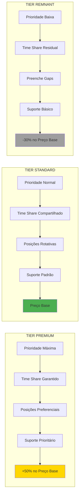
```mermaid
graph LR
    subgraph "TIER PREMIUM"
        P1[Prioridade Máxima]
        P2[Time Share Garantido]
        P3[Posições Preferenciais]
        P4[Suporte Prioritário]
        P5[+50% no Preço Base]
    end
    
    subgraph "TIER STANDARD"
        S1[Prioridade Normal]
        S2[Time Share Compartilhado]
        S3[Posições Rotativas]
        S4[Suporte Padrão]
        S5[Preço Base]
    end
    
    subgraph "TIER REMNANT"
        R1[Prioridade Baixa]
        R2[Time Share Residual]
        R3[Preenche Gaps]
        R4[Suporte Básico]
        R5[-30% no Preço Base]
    end
    
    P1 --> P2 --> P3 --> P4 --> P5
    S1 --> S2 --> S3 --> S4 --> S5
    R1 --> R2 --> R3 --> R4 --> R5
    
    style P5 fill:#FFD700
    style S5 fill:#4CAF50
    style R5 fill:#9E9E9E
```

### 3.4. Revenue Share Model

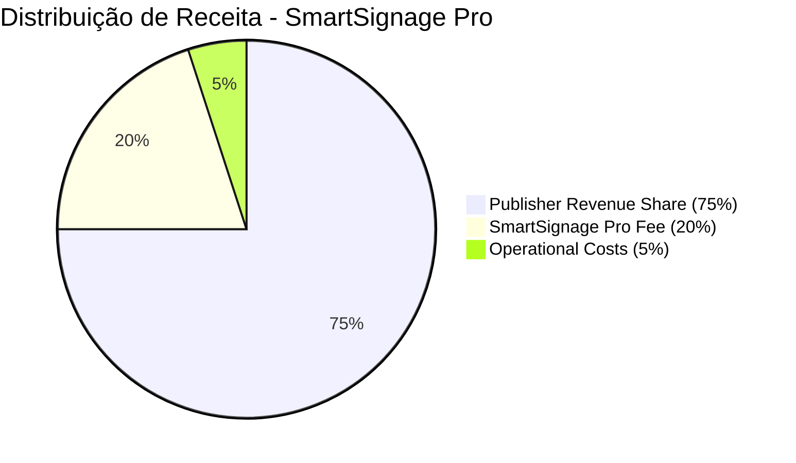
```mermaid
pie title Distribuição de Receita - SmartSignage Pro
    "Publisher Revenue Share (75%)" : 75
    "SmartSignage Pro Fee (20%)" : 20
    "Operational Costs (5%)" : 5
```

---

## 4. Visão Técnica

### 4.1. Arquitetura Técnica Completa

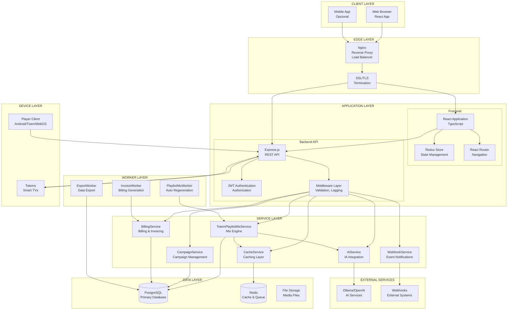
```mermaid
graph TB
    subgraph "CLIENT LAYER"
        WEB[Web Browser<br/>React App]
        MOBILE[Mobile App<br/>Opcional]
    end
    
    subgraph "EDGE LAYER"
        NGINX[Nginx<br/>Reverse Proxy<br/>Load Balancer]
        SSL[SSL/TLS<br/>Termination]
    end
    
    subgraph "APPLICATION LAYER"
        subgraph "Frontend"
            REACT[React Application<br/>TypeScript]
            REDUX[Redux Store<br/>State Management]
            ROUTER[React Router<br/>Navigation]
        end
        
        subgraph "Backend API"
            EXPRESS[Express.js<br/>REST API]
            JWT[JWT Authentication<br/>Authorization]
            MIDDLEWARE[Middleware Layer<br/>Validation, Logging]
        end
    end
    
    subgraph "SERVICE LAYER"
        MIX_SERVICE[TotemPlaylistMixService<br/>Mix Engine]
        CAMPAIGN_SERVICE[CampaignService<br/>Campaign Management]
        AI_SERVICE[AIService<br/>IA Integration]
        BILLING_SERVICE[BillingService<br/>Billing & Invoicing]
        CACHE_SERVICE[CacheService<br/>Caching Layer]
        WEBHOOK_SERVICE[WebhookService<br/>Event Notifications]
    end
    
    subgraph "DATA LAYER"
        POSTGRES[(PostgreSQL<br/>Primary Database)]
        REDIS[(Redis<br/>Cache & Queue)]
        STORAGE[File Storage<br/>Media Files]
    end
    
    subgraph "WORKER LAYER"
        MIX_WORKER[PlaylistMixWorker<br/>Auto Regeneration]
        INVOICE_WORKER[InvoiceWorker<br/>Billing Generation]
        EXPORT_WORKER[ExportWorker<br/>Data Export]
    end
    
    subgraph "EXTERNAL SERVICES"
        OLLAMA[Ollama/OpenAI<br/>AI Services]
        WEBHOOKS[Webhooks<br/>External Systems]
    end
    
    subgraph "DEVICE LAYER"
        TOTEMS[Totems<br/>Smart TVs]
        PLAYER[Player Client<br/>Android/Tizen/WebOS]
    end
    
    WEB --> NGINX
    MOBILE --> NGINX
    NGINX --> SSL
    SSL --> REACT
    SSL --> EXPRESS
    
    REACT --> REDUX
    REACT --> ROUTER
    REACT --> EXPRESS
    
    EXPRESS --> JWT
    EXPRESS --> MIDDLEWARE
    MIDDLEWARE --> MIX_SERVICE
    MIDDLEWARE --> CAMPAIGN_SERVICE
    MIDDLEWARE --> AI_SERVICE
    MIDDLEWARE --> BILLING_SERVICE
    MIDDLEWARE --> CACHE_SERVICE
    MIDDLEWARE --> WEBHOOK_SERVICE
    
    MIX_SERVICE --> POSTGRES
    CAMPAIGN_SERVICE --> POSTGRES
    AI_SERVICE --> OLLAMA
    BILLING_SERVICE --> POSTGRES
    CACHE_SERVICE --> REDIS
    WEBHOOK_SERVICE --> WEBHOOKS
    
    MIX_SERVICE --> CACHE_SERVICE
    MIX_SERVICE --> AI_SERVICE
    
    MIX_WORKER --> MIX_SERVICE
    INVOICE_WORKER --> BILLING_SERVICE
    EXPORT_WORKER --> POSTGRES
    
    TOTEMS --> EXPRESS
    PLAYER --> EXPRESS
    EXPRESS --> TOTEMS
```

### 4.2. Fluxo de Dados - Sistema de Mixagem

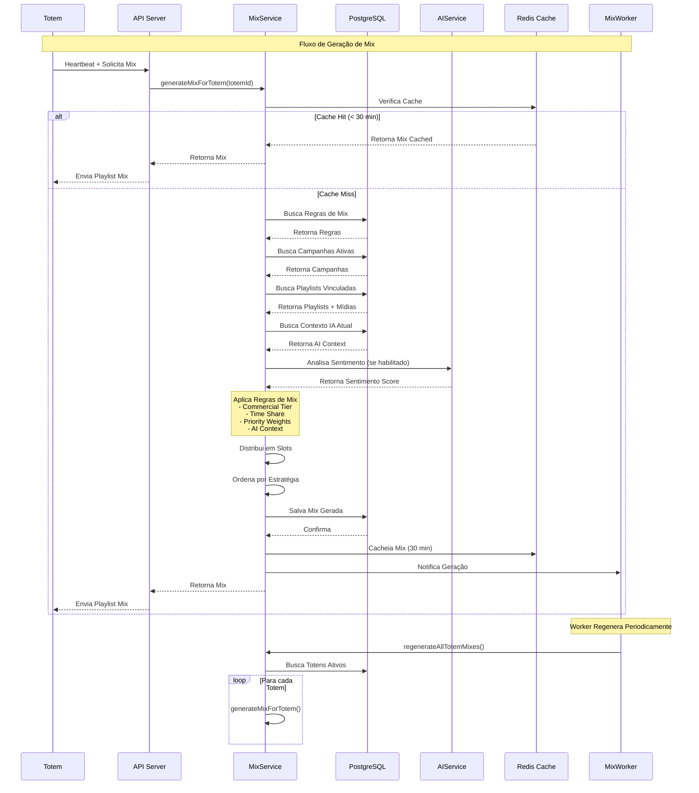
```mermaid
sequenceDiagram
    participant T as Totem
    participant API as API Server
    participant MS as MixService
    participant DB as PostgreSQL
    participant AI as AIService
    participant CACHE as Redis Cache
    participant WORKER as MixWorker
    
    Note over T,WORKER: Fluxo de Geração de Mix
    
    T->>API: Heartbeat + Solicita Mix
    API->>MS: generateMixForTotem(totemId)
    
    MS->>CACHE: Verifica Cache
    alt Cache Hit (< 30 min)
        CACHE-->>MS: Retorna Mix Cached
        MS-->>API: Retorna Mix
        API-->>T: Envia Playlist Mix
    else Cache Miss
        MS->>DB: Busca Regras de Mix
        DB-->>MS: Retorna Regras
        
        MS->>DB: Busca Campanhas Ativas
        DB-->>MS: Retorna Campanhas
        
        MS->>DB: Busca Playlists Vinculadas
        DB-->>MS: Retorna Playlists + Mídias
        
        MS->>DB: Busca Contexto IA Atual
        DB-->>MS: Retorna AI Context
        
        MS->>AI: Analisa Sentimento (se habilitado)
        AI-->>MS: Retorna Sentimento Score
        
        Note over MS: Aplica Regras de Mix<br/>- Commercial Tier<br/>- Time Share<br/>- Priority Weights<br/>- AI Context
        
        MS->>MS: Distribui em Slots
        MS->>MS: Ordena por Estratégia
        
        MS->>DB: Salva Mix Gerada
        DB-->>MS: Confirma
        
        MS->>CACHE: Cacheia Mix (30 min)
        MS->>WORKER: Notifica Geração
        
        MS-->>API: Retorna Mix
        API-->>T: Envia Playlist Mix
    end
    
    Note over WORKER: Worker Regenera Periodicamente
    WORKER->>MS: regenerateAllTotemMixes()
    MS->>DB: Busca Totens Ativos
    loop Para cada Totem
        MS->>MS: generateMixForTotem()
    end
```

### 4.3. Stack Tecnológico

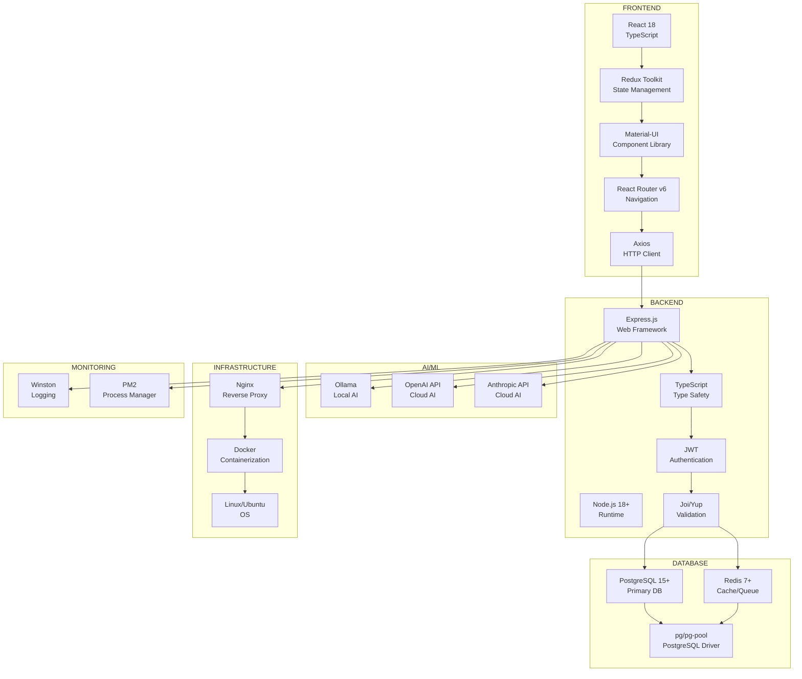
```mermaid
graph TB
    subgraph "FRONTEND"
        REACT[React 18<br/>TypeScript]
        REDUX[Redux Toolkit<br/>State Management]
        MUI[Material-UI<br/>Component Library]
        ROUTER[React Router v6<br/>Navigation]
        AXIOS[Axios<br/>HTTP Client]
    end
    
    subgraph "BACKEND"
        NODE[Node.js 18+<br/>Runtime]
        EXPRESS[Express.js<br/>Web Framework]
        TS[TypeScript<br/>Type Safety]
        JWT[JWT<br/>Authentication]
        VALIDATOR[Joi/Yup<br/>Validation]
    end
    
    subgraph "DATABASE"
        POSTGRES[PostgreSQL 15+<br/>Primary DB]
        REDIS[Redis 7+<br/>Cache/Queue]
        PG[pg/pg-pool<br/>PostgreSQL Driver]
    end
    
    subgraph "AI/ML"
        OLLAMA[Ollama<br/>Local AI]
        OPENAI[OpenAI API<br/>Cloud AI]
        ANTHROPIC[Anthropic API<br/>Cloud AI]
    end
    
    subgraph "INFRASTRUCTURE"
        NGINX[Nginx<br/>Reverse Proxy]
        DOCKER[Docker<br/>Containerization]
        LINUX[Linux/Ubuntu<br/>OS]
    end
    
    subgraph "MONITORING"
        WINSTON[Winston<br/>Logging]
        PM2[PM2<br/>Process Manager]
    end
    
    REACT --> REDUX
    REDUX --> MUI
    MUI --> ROUTER
    ROUTER --> AXIOS
    AXIOS --> EXPRESS
    
    EXPRESS --> TS
    TS --> JWT
    JWT --> VALIDATOR
    VALIDATOR --> POSTGRES
    VALIDATOR --> REDIS
    
    POSTGRES --> PG
    REDIS --> PG
    
    EXPRESS --> OLLAMA
    EXPRESS --> OPENAI
    EXPRESS --> ANTHROPIC
    
    EXPRESS --> NGINX
    NGINX --> DOCKER
    DOCKER --> LINUX
    
    EXPRESS --> WINSTON
    EXPRESS --> PM2
```

---

## 5. Fluxos Principais do Negócio

### 5.1. Fluxo Completo: Criação de Campanha até Exibição

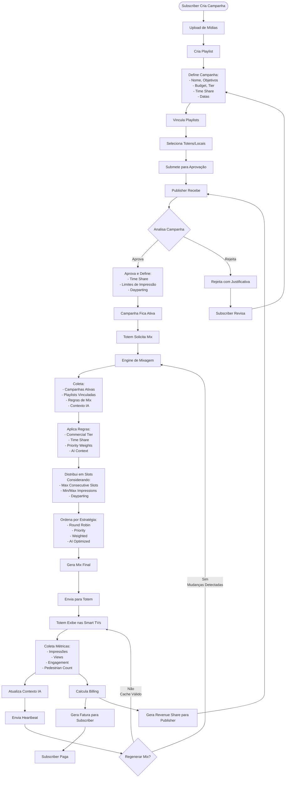
```mermaid
flowchart TD
    Start([Subscriber Cria Campanha]) --> UploadMidias[Upload de Mídias]
    UploadMidias --> CriarPlaylist[Cria Playlist]
    CriarPlaylist --> DefinirCampanha[Define Campanha:<br/>- Nome, Objetivos<br/>- Budget, Tier<br/>- Time Share<br/>- Datas]
    DefinirCampanha --> VincularPlaylist[Vincula Playlists]
    VincularPlaylist --> SelecionarTotens[Seleciona Totens/Locais]
    SelecionarTotens --> Submeter[Submete para Aprovação]
    
    Submeter --> PublisherRecebe[Publisher Recebe Notificação]
    PublisherRecebe --> Analisar{Analisa Campanha}
    
    Analisar -->|Aprova| Aprovar[Aprova e Define:<br/>- Time Share<br/>- Limites de Impressão<br/>- Dayparting]
    Analisar -->|Rejeita| Rejeitar[Rejeita com Justificativa]
    Rejeitar --> SubscriberRevisa[Subscriber Revisa]
    SubscriberRevisa --> DefinirCampanha
    
    Aprovar --> CampanhaAtiva[Campanha Fica Ativa]
    CampanhaAtiva --> TotemSolicita[Totem Solicita Mix]
    
    TotemSolicita --> MixEngine[Engine de Mixagem]
    MixEngine --> ColetarDados[Coleta:<br/>- Campanhas Ativas<br/>- Playlists Vinculadas<br/>- Regras de Mix<br/>- Contexto IA]
    
    ColetarDados --> AplicarRegras[Aplica Regras:<br/>- Commercial Tier<br/>- Time Share<br/>- Priority Weights<br/>- AI Context]
    
    AplicarRegras --> DistribuirSlots[Distribui em Slots<br/>Considerando:<br/>- Max Consecutive Slots<br/>- Min/Max Impressions<br/>- Dayparting]
    
    DistribuirSlots --> OrdenarMix[Ordena por Estratégia:<br/>- Round Robin<br/>- Priority<br/>- Weighted<br/>- AI Optimized]
    
    OrdenarMix --> GerarMix[Gera Mix Final]
    GerarMix --> EnviarTotem[Envia para Totem]
    
    EnviarTotem --> TotemExibe[Totem Exibe nas Smart TVs]
    TotemExibe --> ColetarMetricas[Coleta Métricas:<br/>- Impressões<br/>- Views<br/>- Engagement<br/>- Pedestrian Count]
    
    ColetarMetricas --> AtualizarContextoIA[Atualiza Contexto IA]
    AtualizarContextoIA --> EnviarHeartbeat[Envia Heartbeat]
    EnviarHeartbeat --> RegenerarMix{Regenerar Mix?}
    
    RegenerarMix -->|Sim<br/>Mudanças Detectadas| MixEngine
    RegenerarMix -->|Não<br/>Cache Válido| TotemExibe
    
    ColetarMetricas --> Billing[Calcula Billing]
    Billing --> GerarFatura[Gera Fatura para Subscriber]
    Billing --> GerarRevenue[Gera Revenue Share para Publisher]
    
    GerarFatura --> SubscriberPaga[Subscriber Paga]
    GerarRevenue --> PublisherRecebe[Publisher Recebe]
```

### 5.2. Fluxo de Mixagem Inteligente - Detalhado

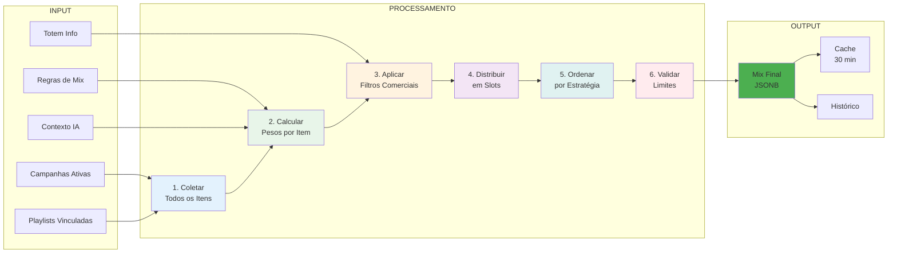
```mermaid
flowchart LR
    subgraph "INPUT"
        C[Campanhas Ativas]
        P[Playlists Vinculadas]
        R[Regras de Mix]
        AI[Contexto IA]
        T[Totem Info]
    end
    
    subgraph "PROCESSAMENTO"
        STEP1[1. Coletar<br/>Todos os Itens]
        STEP2[2. Calcular<br/>Pesos por Item]
        STEP3[3. Aplicar<br/>Filtros Comerciais]
        STEP4[4. Distribuir<br/>em Slots]
        STEP5[5. Ordenar<br/>por Estratégia]
        STEP6[6. Validar<br/>Limites]
    end
    
    subgraph "OUTPUT"
        MIX[Mix Final<br/>JSONB]
        CACHE[Cache<br/>30 min]
        HIST[Histórico]
    end
    
    C --> STEP1
    P --> STEP1
    R --> STEP2
    AI --> STEP2
    T --> STEP3
    
    STEP1 --> STEP2
    STEP2 --> STEP3
    STEP3 --> STEP4
    STEP4 --> STEP5
    STEP5 --> STEP6
    STEP6 --> MIX
    
    MIX --> CACHE
    MIX --> HIST
    
    style STEP1 fill:#E3F2FD
    style STEP2 fill:#E8F5E9
    style STEP3 fill:#FFF3E0
    style STEP4 fill:#F3E5F5
    style STEP5 fill:#E0F2F1
    style STEP6 fill:#FFEBEE
    style MIX fill:#4CAF50
```

### 5.3. Ciclo de Vida de uma Campanha

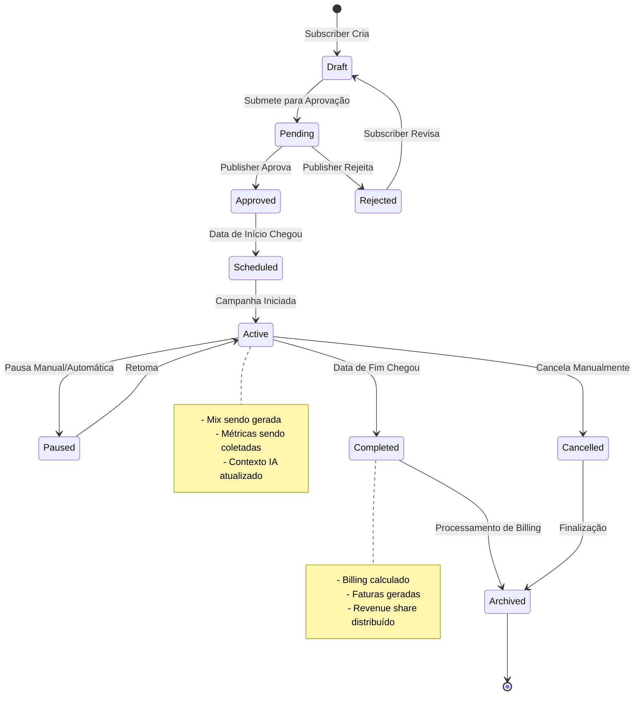
```mermaid
stateDiagram-v2
    [*] --> Draft: Subscriber Cria
    
    Draft --> Pending: Submete para Aprovação
    
    Pending --> Approved: Publisher Aprova
    Pending --> Rejected: Publisher Rejeita
    Rejected --> Draft: Subscriber Revisa
    
    Approved --> Scheduled: Data de Início Chegou
    
    Scheduled --> Active: Campanha Iniciada
    
    Active --> Paused: Pausa Manual/Automática
    Paused --> Active: Retoma
    
    Active --> Completed: Data de Fim Chegou
    Active --> Cancelled: Cancela Manualmente
    
    Completed --> Archived: Processamento de Billing
    Cancelled --> Archived: Finalização
    
    Archived --> [*]
    
    note right of Active
        - Mix sendo gerada
        - Métricas sendo coletadas
        - Contexto IA atualizado
    end note
    
    note right of Completed
        - Billing calculado
        - Faturas geradas
        - Revenue share distribuído
    end note
```

### 5.4. Processo de Billing e Revenue Share

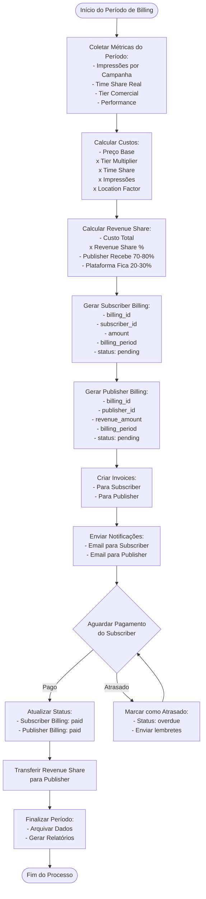
```mermaid
flowchart TD
    Start([Início do Período de Billing]) --> ColetarMetricas[Coletar Métricas do Período:<br/>- Impressões por Campanha<br/>- Time Share Real<br/>- Tier Comercial<br/>- Performance]
    
    ColetarMetricas --> CalcularCustos[Calcular Custos:<br/>- Preço Base<br/>x Tier Multiplier<br/>x Time Share<br/>x Impressões<br/>x Location Factor]
    
    CalcularCustos --> CalcularRevenue[Calcular Revenue Share:<br/>- Custo Total<br/>x Revenue Share %<br/>- Publisher Recebe 70-80%<br/>- Plataforma Fica 20-30%]
    
    CalcularRevenue --> GerarSubscriberBilling[Gerar Subscriber Billing:<br/>- billing_id<br/>- subscriber_id<br/>- amount<br/>- billing_period<br/>- status: pending]
    
    GerarSubscriberBilling --> GerarPublisherBilling[Gerar Publisher Billing:<br/>- billing_id<br/>- publisher_id<br/>- revenue_amount<br/>- billing_period<br/>- status: pending]
    
    GerarPublisherBilling --> CriarInvoices[Criar Invoices:<br/>- Para Subscriber<br/>- Para Publisher]
    
    CriarInvoices --> EnviarNotificacoes[Enviar Notificações:<br/>- Email para Subscriber<br/>- Email para Publisher]
    
    EnviarNotificacoes --> AguardarPagamento{Aguardar Pagamento<br/>do Subscriber}
    
    AguardarPagamento -->|Pago| AtualizarStatus[Atualizar Status:<br/>- Subscriber Billing: paid<br/>- Publisher Billing: paid]
    
    AguardarPagamento -->|Atrasado| MarcarAtrasado[Marcar como Atrasado:<br/>- Status: overdue<br/>- Enviar lembretes]
    
    MarcarAtrasado --> AguardarPagamento
    
    AtualizarStatus --> TransferirRevenue[Transferir Revenue Share<br/>para Publisher]
    
    TransferirRevenue --> Finalizar[Finalizar Período:<br/>- Arquivar Dados<br/>- Gerar Relatórios]
    
    Finalizar --> End([Fim do Processo])
```

---

## 📝 Notas Finais

Estes diagramas fornecem uma visão completa do sistema SmartSignage Pro, cobrindo:

1. **Modelo ER**: Estrutura completa do banco de dados com todas as entidades e relacionamentos
2. **Visão do Cliente**: Jornadas e fluxos de uso para Subscribers e Publishers
3. **Visão Comercial**: Modelo de receita, pricing, tiers e revenue share
4. **Visão Técnica**: Arquitetura, stack tecnológico e fluxos de dados
5. **Fluxos Principais**: Processos de negócio end-to-end

Todos os diagramas estão em formato Mermaid e podem ser visualizados em qualquer renderizador compatível (GitHub, GitLab, VS Code com extensão Mermaid, etc.).

