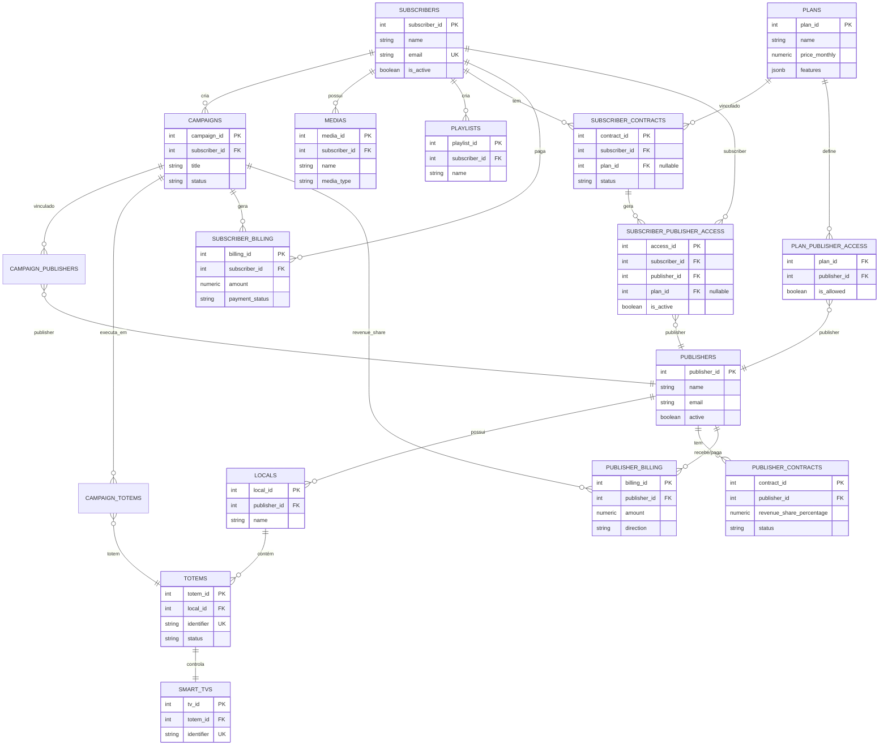

# Diagrama ER Simplificado - Smart Signage Pro v2.1

**Versão do Sistema:** 2.1.0  
**Data:** 2026-01-02

---

## 🎯 **DIAGRAMA ER SIMPLIFICADO (Entidades Principais)**

Este diagrama mostra apenas as entidades principais e seus relacionamentos mais importantes.



---

## 📊 **HIERARQUIA DE INFRAESTRUTURA**

```
PUBLISHERS (1)
    │
    └── LOCALS (N)
            │
            └── TOTEMS (N)
                    │
                    └── SMART_TVS (1)
```

---

## 🔄 **FLUXO DE CAMPANHAS**

```
SUBSCRIBERS (1)
    │
    └── CAMPAIGNS (N)
            │
            ├── CAMPAIGN_PUBLISHERS (N) ──→ PUBLISHERS (N)
            │
            └── CAMPAIGN_TOTEMS (N) ──→ TOTEMS (N)
```

---

## 🔐 **FLUXO DE ACESSOS**

```
PLANS (1)
    │
    ├── PLAN_PUBLISHER_ACCESS (N) ──→ PUBLISHERS (N)
    │
    └── SUBSCRIBER_CONTRACTS (N)
            │
            └── SUBSCRIBER_PUBLISHER_ACCESS (N) ──→ PUBLISHERS (N)
```

---

## 💰 **FLUXO DE BILLING**

```
CAMPAIGNS (1)
    │
    ├── SUBSCRIBER_BILLING (N) ──→ SUBSCRIBERS (1)
    │
    └── PUBLISHER_BILLING (N) ──→ PUBLISHERS (1)
```

---

**Última atualização:** 2026-01-02  
**Versão do Documento:** 1.0.0

