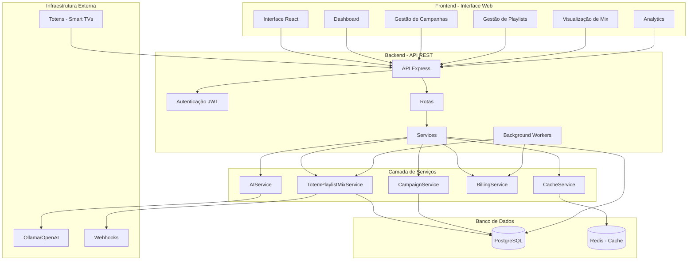
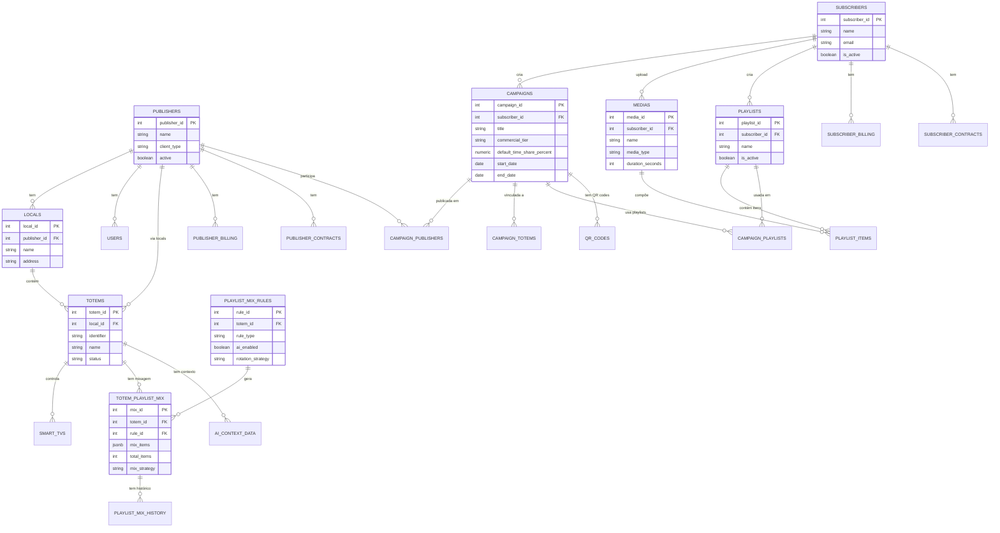
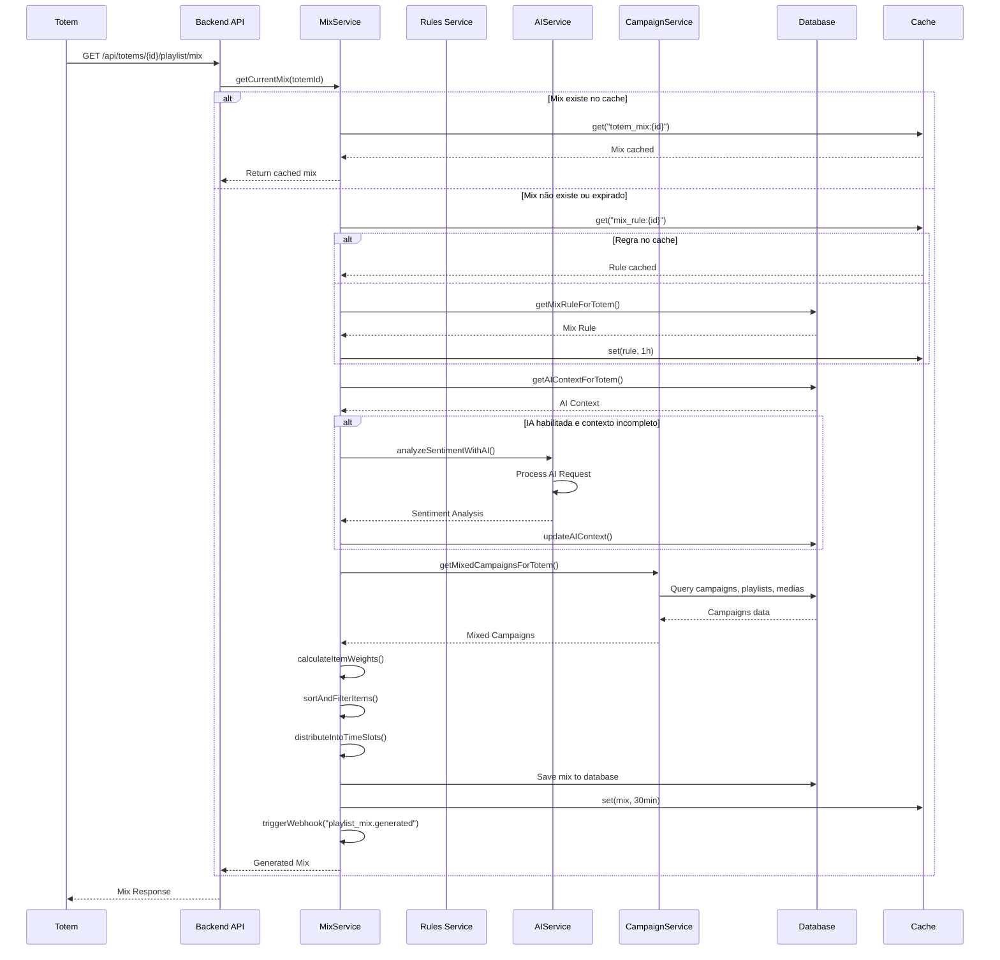
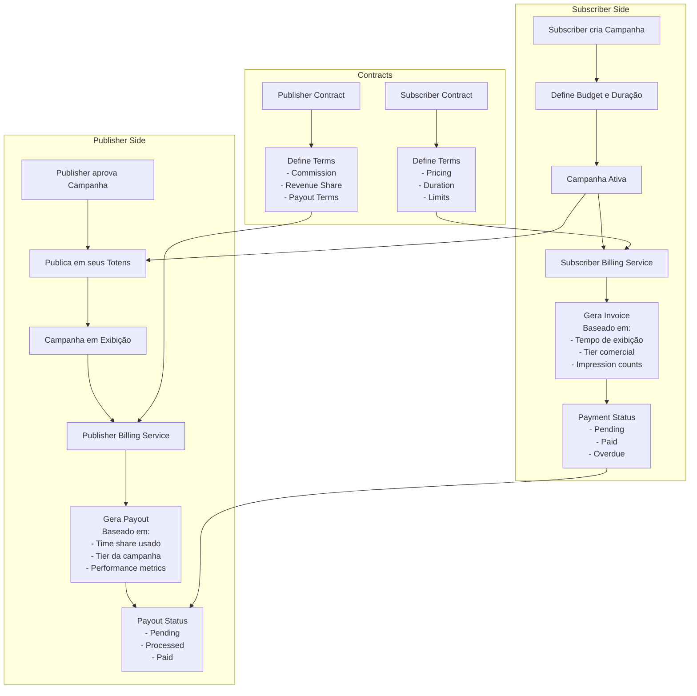
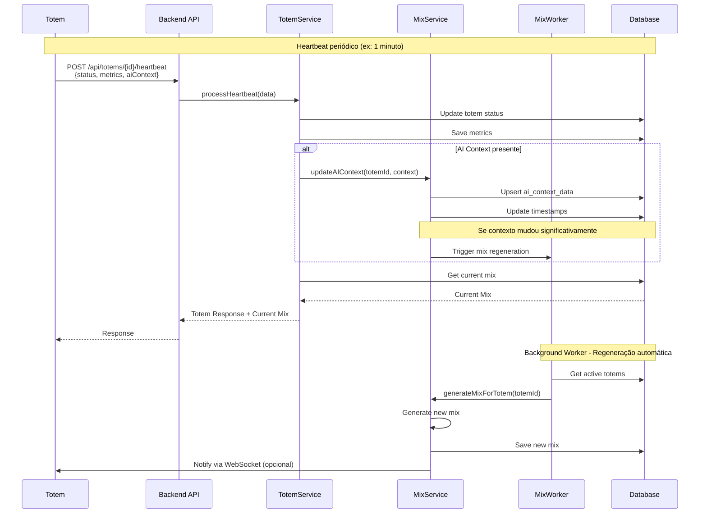
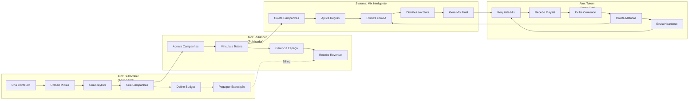
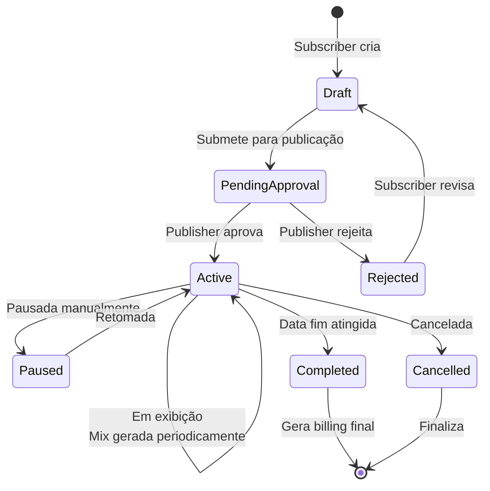

# Diagrama Funcional do Sistema - SmartSignage Pro

**Versão:** 2.1.0  
**Data:** Dezembro 2025

---

## 📊 Índice de Diagramas

1. [Arquitetura Geral do Sistema](#1-arquitetura-geral-do-sistema)
2. [Modelo de Negócio - Entidades e Relacionamentos](#2-modelo-de-negócio---entidades-e-relacionamentos)
3. [Fluxo de Mixagem de Playlists](#3-fluxo-de-mixagem-de-playlists)
4. [Fluxo Completo de Conteúdo](#4-fluxo-completo-de-conteúdo)
5. [Processo de Geração de Mix para Totem](#5-processo-de-geração-de-mix-para-totem)
6. [Sistema de Billing e Contratos](#6-sistema-de-billing-e-contratos)

---

## 1. Arquitetura Geral do Sistema

---

## 2. Modelo de Negócio - Entidades e Relacionamentos

---

## 3. Fluxo de Mixagem de Playlists

---

## 4. Fluxo Completo de Conteúdo

```mermaid
flowchart TD
    Start([Subscriber cria conteúdo]) --> UploadMedia[Upload de Mídia]
    UploadMedia --> CreatePlaylist[Cria Playlist]
    CreatePlaylist --> AddMedia[Adiciona Mídias à Playlist]
    AddMedia --> CreateCampaign[Subscriber cria Campanha]
    
    CreateCampaign --> SetCommercialFields[Define Campos Comerciais<br/>- Commercial Tier<br/>- Time Share<br/>- Impression Limits]
    SetCommercialFields --> LinkPlaylist[Vincula Playlists à Campanha]
    LinkPlaylist --> AssignPublisher[Publicador aprova Campanha]
    
    AssignPublisher --> SetPublisherRules[Define Regras por Publisher<br/>- Time Share<br/>- Dayparting<br/>- Impression Limits]
    SetPublisherRules --> AssignTotems[Vincula Campanha a Totens]
    
    AssignTotems --> CreateMixRule[Create/Update Mix Rule<br/>- Tipo: Systematic/AI/Hybrid<br/>- Pesos e Estratégias]
    CreateMixRule --> UpdateAIContext[Atualiza Contexto de IA<br/>- Pedestrian Count<br/>- Sentiment<br/>- Performance]
    
    UpdateAIContext --> GenerateMix[Gera Mixagem Inteligente]
    
    GenerateMix --> CalculateWeights[Calcula Pesos<br/>- Priority<br/>- Time<br/>- Tags<br/>- Commercial Tier<br/>- AI Context]
    CalculateWeights --> SortItems[Ordena Itens<br/>- Round Robin<br/>- Priority<br/>- Weighted<br/>- AI Optimized]
    SortItems --> DistributeSlots[Distribui em Slots<br/>- Time Share<br/>- Max Consecutive<br/>- Impression Limits]
    
    DistributeSlots --> SaveMix[Salva Mix no Banco]
    SaveMix --> CacheMix[Cacheia Mixagem]
    CacheMix --> NotifyWebhook[Notifica Webhooks]
    NotifyWebhook --> TotemRequest[Totem requisita Mix]
    
    TotemRequest --> GetMix[Obtém Mix Atual]
    GetMix --> DisplayContent[Exibe Conteúdo nas Smart TVs]
    
    DisplayContent --> CollectMetrics[Coleta Métricas]
    CollectMetrics --> UpdateContext[Atualiza Contexto de IA]
    UpdateContext --> RegenerateMix{Regenera Mix?}
    
    RegenerateMix -->|Sim - Horário/Evento| GenerateMix
    RegenerateMix -->|Não| DisplayContent
    
    DisplayContent --> Analytics[Analytics e Relatórios]
    Analytics --> Billing[Geração de Billing]
    Billing --> End([Fim do Ciclo])
```

---

## 5. Processo de Geração de Mix para Totem

```mermaid
flowchart LR
    subgraph "1. Coleta"
        A1[Regra de Mixagem] --> A2[Contexto de IA]
        A2 --> A3[Campanhas Ativas]
        A3 --> A4[Playlists Vinculadas]
        A4 --> A5[Mídias das Playlists]
    end
    
    subgraph "2. Agregação"
        B1[Itens de Mídia] --> B2[Metadados<br/>- Prioridade<br/>- Tags<br/>- Duração]
        B2 --> B3[Campos Comerciais<br/>- Tier<br/>- Time Share<br/>- Limits]
        B3 --> B4[Contexto de IA<br/>- Sentiment<br/>- Pedestrians<br/>- Performance]
    end
    
    subgraph "3. Ordenação"
        C1[Calcular Pesos] --> C2{Aplica Regra}
        C2 -->|Systematic| C3[Ordena por Pesos<br/>Sistemáticos]
        C2 -->|AI| C4[Otimiza com IA]
        C2 -->|Hybrid| C5[Combina Ambos]
        C3 --> C6[Aplica Estratégia]
        C4 --> C6
        C5 --> C6
        C6 -->|Round Robin| C7[Intercala Campanhas]
        C6 -->|Priority| C8[Ordena por Prioridade]
        C6 -->|Weighted| C9[Ordena por Peso]
        C6 -->|AI Optimized| C10[Otimização IA]
    end
    
    subgraph "4. Distribuição"
        D1[Itens Ordenados] --> D2[Distribui em Slots<br/>10 minutos cada]
        D2 --> D3[Respeita Time Share]
        D3 --> D4[Respeita Max Consecutive]
        D4 --> D5[Respeita Impression Limits]
        D5 --> D6[Dayparting Rules]
    end
    
    subgraph "5. Geração Final"
        E1[Slots Distribuídos] --> E2[Mix Final]
        E2 --> E3[Salva no Banco]
        E3 --> E4[Cacheia Resultado]
        E4 --> E5[Notifica Webhooks]
        E5 --> E6[Mix Pronto para Totem]
    end
    
    A5 --> B1
    B4 --> C1
    C7 --> D1
    C8 --> D1
    C9 --> D1
    C10 --> D1
    D6 --> E1
```

---

## 6. Sistema de Billing e Contratos

---

## 7. Fluxo de Heartbeat e Atualização de Contexto

---

## 8. Arquitetura de Regras de Mixagem

```mermaid
graph TD
    subgraph "Regras Systemáticas"
        S1[Priority Weight] --> S2[Ordena por Prioridade]
        S3[Time Weight] --> S4[Ajusta por Horário]
        S5[Tag Weight] --> S6[Filtra/Ordena por Tags]
        S7[Subscriber Weight] --> S8[Prioriza Subscribers]
    end
    
    subgraph "Regras de IA"
        AI1[Pedestrian Detection] --> AI2[Ajusta por Densidade]
        AI3[Sentiment Analysis] --> AI4[Ajusta por Sentimento]
        AI5[Context Awareness] --> AI6[Ajusta por Contexto]
        AI7[Historical Optimization] --> AI8[Aprende com Histórico]
    end
    
    subgraph "Estratégias de Rotação"
        E1[Round Robin] --> E2[Intercala Campanhas]
        E3[Priority] --> E4[Ordena por Prioridade]
        E5[Weighted] --> E6[Ordena por Peso Calculado]
        E7[AI Optimized] --> E8[Otimização com IA]
    end
    
    subgraph "Campos Comerciais"
        C1[Commercial Tier] --> C2[Premium > Standard > Remnant]
        C3[Time Share] --> C4[Aloca % de Tempo]
        C5[Impression Limits] --> C6[Min/Max por Hora]
        C7[Max Consecutive] --> C8[Limita Sequências]
    end
    
    S2 --> Mix[Mixagem Final]
    S4 --> Mix
    S6 --> Mix
    S8 --> Mix
    AI2 --> Mix
    AI4 --> Mix
    AI6 --> Mix
    AI8 --> Mix
    E2 --> Mix
    E4 --> Mix
    E6 --> Mix
    E8 --> Mix
    C2 --> Mix
    C4 --> Mix
    C6 --> Mix
    C8 --> Mix
```

---

## 9. Visão Geral do Negócio

---

## 10. Ciclo de Vida de uma Campanha

---

## 📝 Legenda e Notas

### Componentes Principais

- **Subscriber (Anunciante)**: Cliente que cria campanhas e conteúdo
- **Publisher (Publicador)**: Proprietário dos totens/espaços publicitários
- **Totem**: Dispositivo físico com Smart TVs que exibe conteúdo
- **Mix Service**: Serviço que gera playlists inteligentes misturadas
- **Campaign**: Campanha publicitária com múltiplas playlists
- **Playlist**: Sequência ordenada de mídias
- **Media**: Arquivo de mídia (vídeo, imagem)

### Fluxos Principais

1. **Criação de Conteúdo**: Subscriber → Playlists → Campanhas
2. **Publicação**: Publisher aprova e vincula a totens
3. **Mixagem**: Sistema gera mix inteligente combinando campanhas
4. **Exibição**: Totem recebe e exibe mixagem
5. **Feedback**: Totem envia métricas → Contexto IA → Regenera mix

### Tecnologias

- **Backend**: Node.js, Express, TypeScript
- **Frontend**: React, TypeScript
- **Database**: PostgreSQL
- **Cache**: Redis (opcional)
- **IA**: Ollama/OpenAI/Anthropic
- **Workers**: node-cron para tarefas agendadas

---

**Para visualizar os diagramas:**
- Use um editor que suporte Mermaid (GitHub, GitLab, VS Code com extensão)
- Ou acesse: https://mermaid.live/

