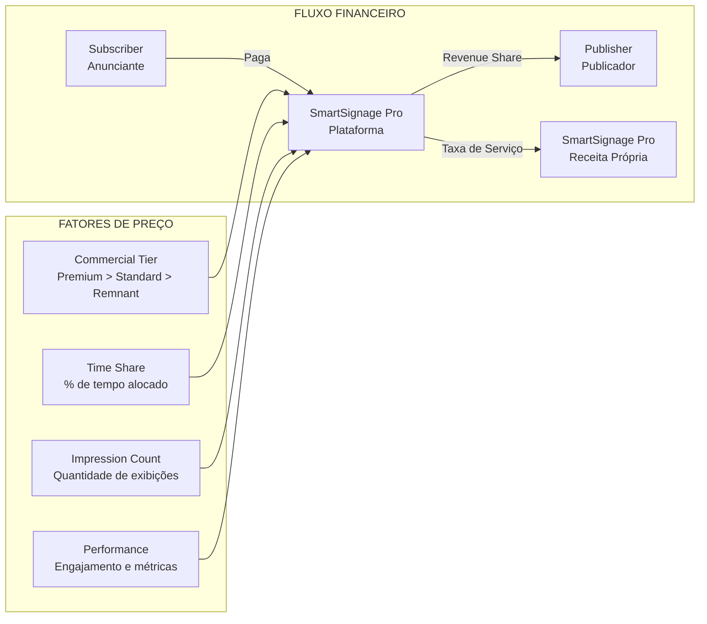
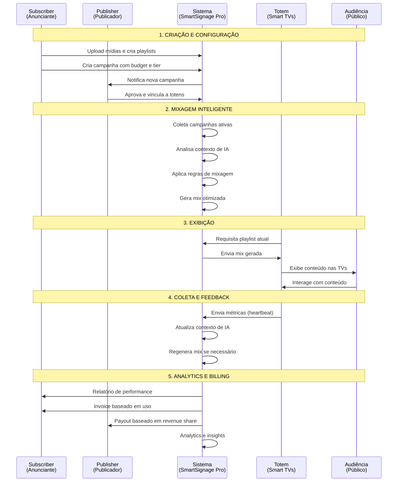
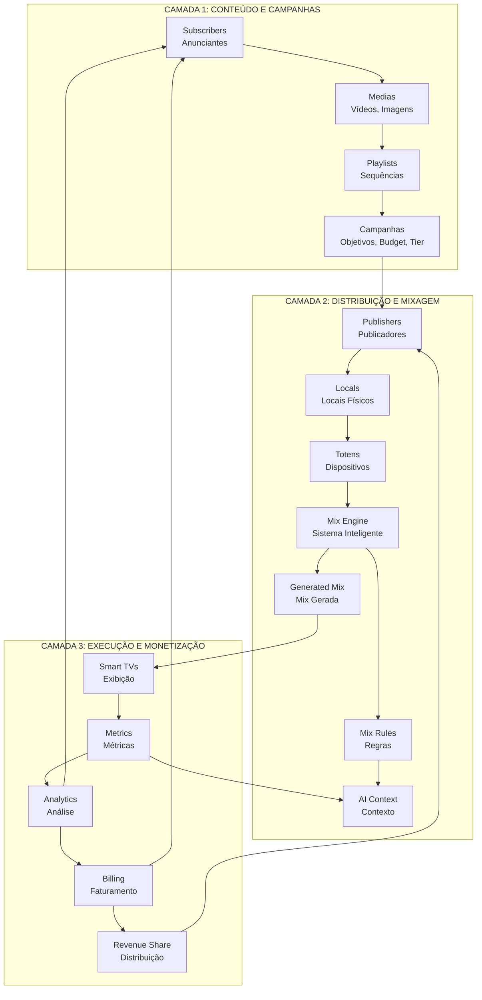
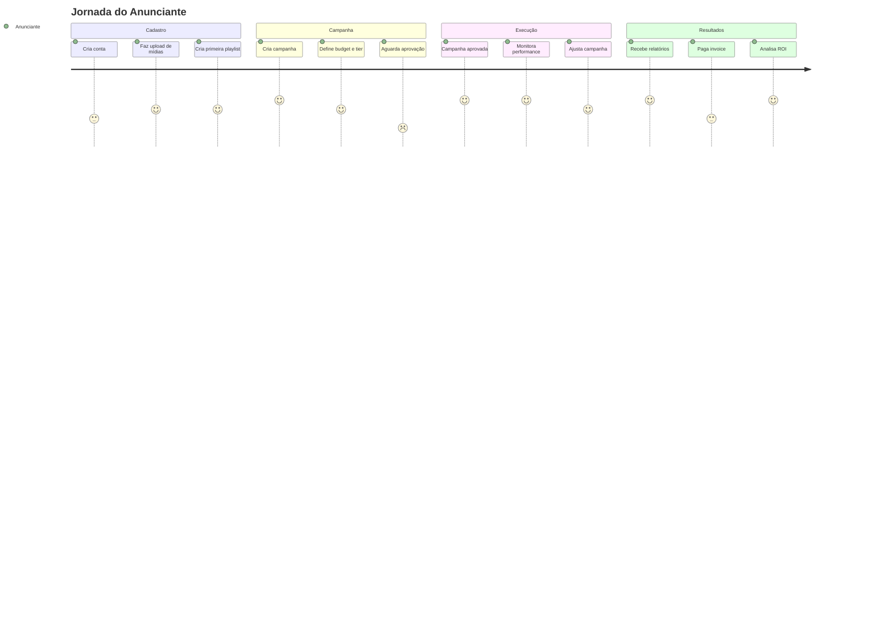
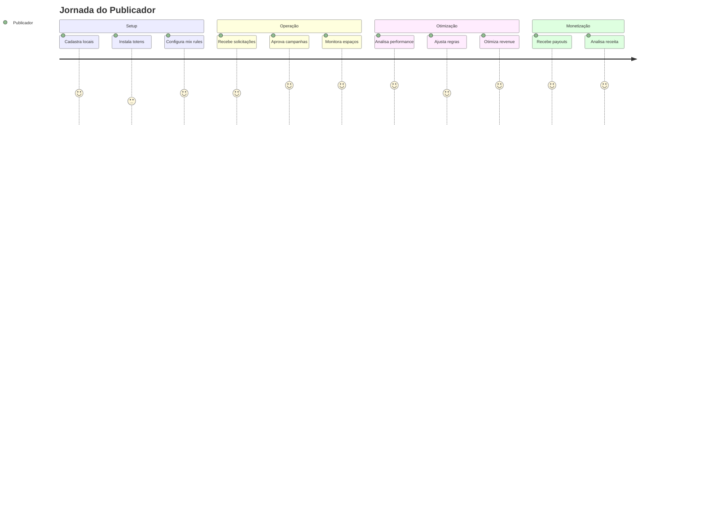
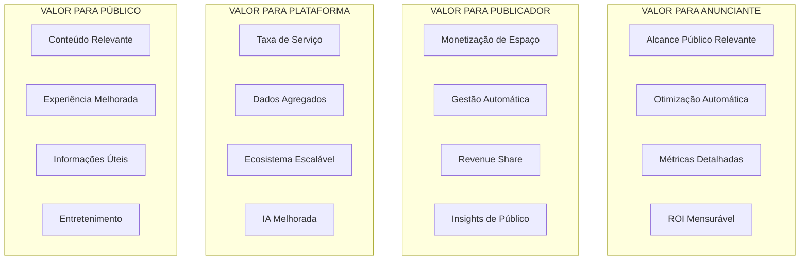
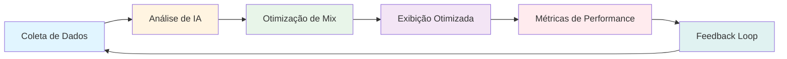
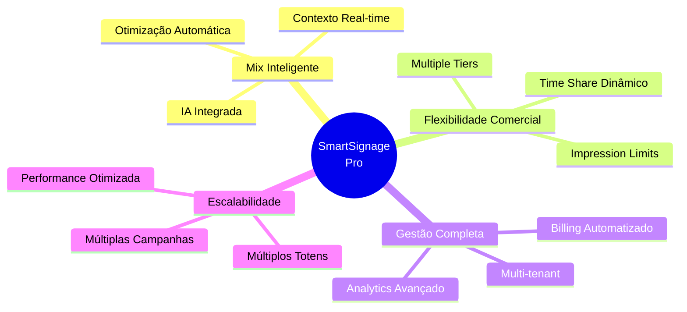

# Diagrama de Visão de Negócio - SmartSignage Pro

**Versão:** 2.1.0  
**Data:** Dezembro 2025

---

## 🎯 Visão Geral do Modelo de Negócio

```mermaid
graph TB
    subgraph "ECOSSISTEMA SMART SIGNAGE PRO"
        subgraph "1. CRIAÇÃO DE CONTEÚDO"
            A1[Anunciante/Subscriber<br/>Upload de Mídias]
            A2[Cria Playlists<br/>Sequências de Conteúdo]
            A3[Cria Campanhas<br/>Define Objetivos e Budget]
            A1 --> A2 --> A3
        end
        
        subgraph "2. PUBLICAÇÃO"
            B1[Publicador/Publisher<br/>Aprova Campanhas]
            B2[Vincula a Locais<br/>Shopping, Food Court, etc]
            B3[Vincula a Totens<br/>Dispositivos Específicos]
            B1 --> B2 --> B3
        end
        
        subgraph "3. MIXAGEM INTELIGENTE"
            C1[Sistema Coleta<br/>- Campanhas Ativas<br/>- Playlists Vinculadas<br/>- Contexto de IA]
            C2[Aplica Regras<br/>- Systemáticas<br/>- IA/Híbridas<br/>- Comerciais]
            C3[Distribui em Slots<br/>- Time Share<br/>- Tier Comercial<br/>- Limites]
            C4[Gera Mix Final<br/>Playlist Otimizada]
            C1 --> C2 --> C3 --> C4
        end
        
        subgraph "4. EXIBIÇÃO"
            D1[Totem requisita Mix]
            D2[Recebe Playlist]
            D3[Exibe nas Smart TVs]
            D4[Coleta Métricas]
            D1 --> D2 --> D3 --> D4
        end
        
        subgraph "5. FEEDBACK E OTIMIZAÇÃO"
            E1[Métricas enviadas]
            E2[Contexto IA atualizado]
            E3[Mix regenerada]
            E4[Analytics e Relatórios]
            E1 --> E2 --> E3 --> E4
        end
        
        subgraph "6. BILLING"
            F1[Subscriber paga<br/>por exposição]
            F2[Publisher recebe<br/>revenue share]
            F3[Sistema gerencia<br/>contratos e invoices]
            F1 --> F3 --> F2
        end
    end
    
    A3 --> B1
    B3 --> C1
    C4 --> D1
    D4 --> E1
    E3 --> C1
    A3 --> F1
    B3 --> F2
```



---

## 💰 Modelo de Receita



---

## 🎬 Fluxo Detalhado de Valor



---

## 🏗️ Arquitetura de Negócio - 3 Camadas



---

## 🎯 Personas e Jornadas

### Persona 1: Anunciante (Subscriber)



### Persona 2: Publicador (Publisher)



---

## 📊 Matriz de Valor



---

## 🔄 Ciclo de Otimização Contínua



---

## 📈 Evolução do Sistema

```mermaid
timeline
    title Evolução do Sistema SmartSignage Pro
    
    section Fase 1: Básico
        Upload de Conteúdo : Playlists Estáticas
                              : Exibição Simples
                              : Billing Manual
    
    section Fase 2: Inteligente
        Mix Automática : Regras Systemáticas
                        : Campos Comerciais
                        : Analytics Básico
    
    section Fase 3: IA Avançada
        IA Integrada : Análise de Sentimento
                      : Contexto Inteligente
                      : Otimização Automática
    
    section Fase 4: Futuro
        ML Avançado : Otimização Contínua
                     : Detecção de Transeuntes
                     : Personalização Extrema
```

---

## 🎨 Diferenciais Competitivos



---

**Última atualização:** Dezembro 2025

