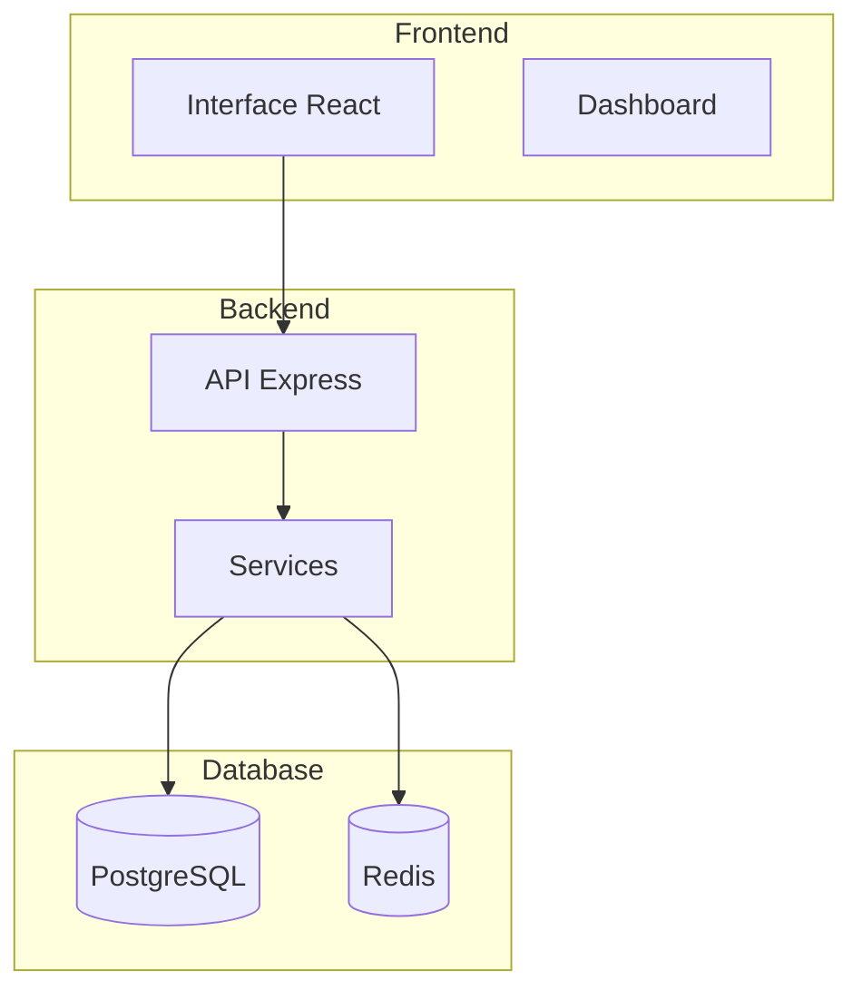
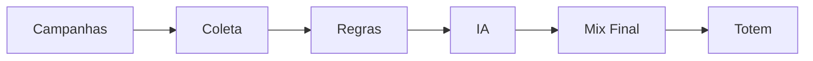
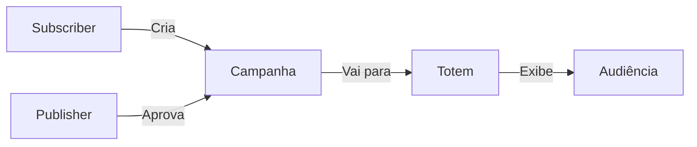

# Exemplo de Visualização - Diagramas Mermaid

Este documento mostra exemplos dos diagramas criados e como visualizá-los.

---

## 📊 Exemplo 1: Arquitetura Geral do Sistema



**Como visualizar:**
1. Copie o código entre ```mermaid e ```
2. Cole em https://mermaid.live/
3. Visualize e exporte como PNG/SVG

---

## 📊 Exemplo 2: Fluxo de Mixagem



---

## 📊 Exemplo 3: Modelo de Negócio



---

## 🎨 Todos os Diagramas

Todos os diagramas nos arquivos seguem o formato:

```markdown
```mermaid
[ código do diagrama aqui ]
```
```

### Arquivos com Diagramas Mermaid:

1. **DIAGRAMA_FUNCIONAL_SISTEMA.md** - 10 diagramas técnicos
2. **DIAGRAMA_VISAO_NEGOCIO.md** - 10+ diagramas de negócio

### Tipos de Diagramas Usados:

- `graph TB` / `graph LR` - Grafos direcionados
- `flowchart TD` / `flowchart LR` - Fluxogramas
- `sequenceDiagram` - Diagramas de sequência
- `erDiagram` - Diagramas entidade-relacionamento
- `stateDiagram-v2` - Diagramas de estado
- `journey` - Jornadas do usuário
- `mindmap` - Mapas mentais
- `timeline` - Linhas do tempo

---

## ✅ Verificação

Todos os diagramas criados **usam Mermaid** e estão prontos para renderização em:
- GitHub/GitLab (automático)
- VS Code (com extensão)
- Mermaid Live Editor (https://mermaid.live/)
- Qualquer gerador de documentação que suporte Mermaid

