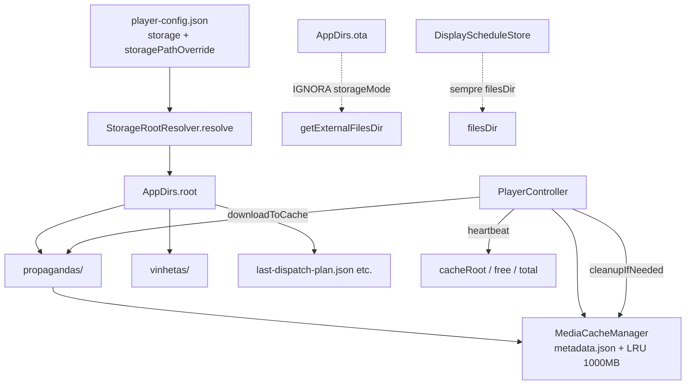

# Handoff I.A. — Sistema de armazenamento e cache (Player-AD)

**Data:** 2026-07-27 (Fases A + B + C)  
**Versão app analisada / alvo:** Player-AD **1.88** (`versionCode` 88)  
**Branch típica:** `SmartSignage-direc-totem`  
**Pacote Android:** `br.com.smartchannel.playerad`  
**Âmbito:** storage root, modos `storage`, cache de mídias (`propagandas/`), LRU, telemetria, docs, gaps e plano de continuidade.

> Documento escrito para **outra I.A. (ou humano) assumir o trabalho sem redescobrir o sistema**.  
> Fonte da verdade = **código**.

### Estado Fase A (executado 2026-07-27)

| ID | Item | Estado |
|---|---|---|
| A1–A4 | LRU pressão, gate disco, purge metadata, docs | ✅ |

### Estado Fase B (executado 2026-07-27)

| ID | Item | Estado |
|---|---|---|
| B1–B4 | Remote storage, heartbeat %, maxCacheSizeMb/%, default external_primary | ✅ |

### Estado Fase C (executado 2026-07-27)

| ID | Item | Estado |
|---|---|---|
| C1 | `StorageVolumeMonitor` + reinício debounce em `MainActivity` | ✅ |
| C2 | `StorageRootMigrator` (copy missing) + prefs `last_storage_root` | ✅ |
| C3 | `probeWritableDirectory` (create+delete) | ✅ |
| C4 | Testes JVM (`PlayerConfigStorageParseTest`, `MediaCacheManagerTest`, `StorageRootMigratorTest`) | ✅ |
| C5 | `docs/Player-AD-CACHE-E-METADADOS.md` criado | ✅ |

**Próximo (opcional):** migrar sobrescrita inteligente; StorageManager callback API 24+ além de broadcasts; instrumented tests na TV Box.

### Defaults actuais

| Item | Valor |
|---|---|
| `serverUrl` | `https://totemdigital.app.br` |
| `storage` (ausente/default) | `external_primary` |
| `maxCacheSizeMb` | `1000` (50–8192) |
| `maxCachePercentOfVolume` | opcional 1–90 |

---

## 0. Respostas rápidas (perguntas frequentes)

| Pergunta | Resposta factual |
|---|---|
| Usa memória interna se não houver USB/SD? | **Sim** como último fallback de qualquer modo com fallback. Default de campo é **external_primary** (não AUTO). |
| Qual % da memória interna é permitido? | Teto por `maxCacheSizeMb` (default 1000) e opcionalmente `maxCachePercentOfVolume` do volume do root — **não** é % fixo só do interno. |
| Prioridade com várias memórias (`AUTO`)? | 1) Removível → 2) Externo não-primário → 3) API30 → 4) Externo primário → 5) Interno. |
| Campo JSON do modo? | `"storage"` (+ `"storagePathOverride"` se `path_override`). |
| Remote `apply_player_config` muda storage? | **Sim** (Fase B). |
| Há testes unitários de storage? | **Sim** (Fase C) — `./gradlew :Player-AD:test` ou `Player-AD/gradlew test`. |

---

## 1. Contexto de produto e regras do repositório

- Árvore principal: `backend/`, `frontend/`, `database/`, `scripts/`, `Player-AD/`.  
- Schema DB: ficheiros definitivos em `database/` (não patches temporários).  
- Player-AD é o player Android TV BOX em produção deste projeto (não confundir com `SmartSignage-AD`, `player-client/`, nem pasta `Player-AD - (Vs Operacional…)`).  
- Build local: `Player-AD/gradlew.bat assembleRelease` com JDK 17 (`Eclipse Adoptium` funciona; JBR do Android Studio pode estar quebrado).  
- Install ADB típico: `adb install -r Player-AD/build/outputs/apk/release/Player-AD-release.apk`  
- Launch: `adb shell am start -n br.com.smartchannel.playerad/.ui.MainActivity`  
- Copiar APK também para `install-pendrive/apk/Player-AD-release.apk` quando rebuild operacional.

### Defaults de instalação (estado 2026-07)

| Item | Valor |
|---|---|
| `serverUrl` default embutido | `https://totemdigital.app.br` |
| `uin` / `deviceId` kit | `T1000` / `T1000-EXTERMINATOR` |
| `storage` default | `auto` |
| Cache max | 1000 MB (hardcoded) |

---

## 2. Mapa mental do sistema



**Importante:** `AppDirs.root()` **relê a config a cada chamada** e resolve de novo. O `MediaCacheManager` só recarrega metadados se o path absoluto de `propagandas/` mudou (`reloadStorageRootsIfNeeded`), tipicamente ao reiniciar o loop após debug config.

---

## 3. Arquivos-chave (paths absolutos no repo Windows)

| Path | Papel |
|---|---|
| `Player-AD/src/main/java/.../config/PlayerStorageMode.kt` | Enum dos modos |
| `Player-AD/src/main/java/.../util/StorageRootResolver.kt` | Resolução + fallbacks |
| `Player-AD/src/main/java/.../util/AppDirs.kt` | `root`, `propagandas`, `vinhetas`, `ota` |
| `Player-AD/src/main/java/.../cache/MediaCacheManager.kt` | Cache + LRU |
| `Player-AD/src/main/java/.../cache/PortraitVideoCacheProcessor.kt` | Normalização vídeo no cache |
| `Player-AD/src/main/java/.../config/PlayerConfig.kt` | Modelo |
| `Player-AD/src/main/java/.../config/PlayerConfigLoader.kt` | Load + parse aliases |
| `Player-AD/src/main/java/.../config/PlayerConfigStore.kt` | Save interno + `/sdcard/smartsignage/` |
| `Player-AD/src/main/java/.../playback/PlayerController.kt` | Pré-cache, purge, heartbeat, remote config |
| `Player-AD/src/main/java/.../ui/DebugConfigActivity.kt` | UI storage |
| `Player-AD/src/main/java/.../ui/MainActivity.kt` | `reloadStorageRootsIfNeeded` |
| `Player-AD/src/main/java/.../PlayerAdApplication.kt` | Init cache + seed fallback |
| `Player-AD/src/main/res/values/arrays.xml` | Spinner modos |
| `Player-AD/scripts/generate-default-player-config.json` | Default kit (sem `storage` hoje) |
| `install-pendrive/config/exemplo-player-config.json` | Idem |

---

## 4. Modos de storage — contrato e prioridade

### 4.1 Valores JSON (`"storage"`)

| JSON | Enum | Comportamento resumido |
|---|---|---|
| `auto` (default) | `AUTO` | Removível → não-primário → API30 → externo primário → interno |
| `internal` | `INTERNAL` | Só `filesDir` |
| `external_primary` / `external` | `EXTERNAL_PRIMARY` | `getExternalFilesDir(null)` → interno |
| `sdcard` / `microsd` | `SD_CARD` | Não-primário → removível → API30 → externo → interno |
| `removable_preferred` / `usb` / `removable` | `REMOVABLE_PREFERRED` | Removível → API30 → não-primário → externo → interno |
| `path_override` / `path` / `custom` | `PATH_OVERRIDE` | Path absoluto em `storagePathOverride`; se inválido → externo → interno |

Serialização estável ao gravar: `SD_CARD` → `"sdcard"`; restantes → `enum.name.lowercase()`.

### 4.2 Cadeia `AUTO` (código)

```kotlin
// StorageRootResolver — PlayerStorageMode.AUTO
firstRemovableExternalFilesDir(appContext)
  ?: firstNonPrimaryExternalFilesDir(appContext)
  ?: removableNonPrimaryVolumeDirApi30(appContext)
  ?: appContext.getExternalFilesDir(null)
  ?: appContext.filesDir
```

Critérios:
- **Removível:** `Environment.isExternalStorageRemovable(dir)` sobre `getExternalFilesDirs(null)`.
- **Não-primário:** primeiro dir de `getExternalFilesDirs` cujo path canónico ≠ `getExternalFilesDir(null)`.
- **Usável:** `mkdirs` + `isDirectory` + `canWrite()` (sem probe de ficheiro real).

### 4.3 Exceções (não seguem `storageMode`)

| Componente | Local |
|---|---|
| OTA backups (`AppDirs.ota`) | Sempre `getExternalFilesDir(null)/OTA` (ou `filesDir`) |
| `DisplayScheduleStore` | Sempre `filesDir` |
| Config JSON | Preferência de **leitura**: interno → `/sdcard/smartsignage/player-config.json` → defaults. **Escrita**: tenta ambos. |

---

## 5. Cache de mídias — regras reais

### 5.1 Layout no root

```
<root>/
  propagandas/          # cache de mídias + metadata.json
  vinhetas/             # vinhetas locais / seed
  last-dispatch-plan.json
  current-plan-source.txt
  screenshots/          # se usado
```

Path típico em TV BOX (externo primário):  
`/sdcard/Android/data/br.com.smartchannel.playerad/files/...`  
Com `AUTO` + USB montado como removível app-specific, o root **pode** ser o USB.

### 5.2 Limites (`MediaCacheManager`)

| Parâmetro | Valor | Notas |
|---|---|---|
| `maxCacheSizeBytes` | **1000L * 1024 * 1024** (1000 MB) | Hardcoded no ctor; **não** configurável via JSON |
| Limpeza | LRU por `lastAccessed` | Só se `currentSize > max` |
| Elegível a remoção | `valid=true` **e** `now - lastAccessed >= 8 dias` | Se tudo foi tocado < 8 dias, **não limpa** mesmo > 1000 MB |
| % disco / `usableSpace` | **Ausente** | Downloads podem falhar em disco cheio (catch silencioso no download) |
| Vinhetas / screenshots / plano | Fora do cálculo de tamanho | Só entradas `valid` em `metadata.json` |

### 5.3 Fluxo operacional

1. `preloadPlan`: remove IDs fora da playlist → `cleanupIfNeeded()` → download/normalize.  
2. `downloadToCache`: ficheiro `{mediaId}.{ext}` + `onDownloadCompleted`.  
3. Playback: prefere ficheiro local válido; senão stream URL (vídeo tenta download síncrono antes).  
4. Remote `purge_cache`: apaga ficheiros em `propagandas/` e chama `init()` — **cuidado:** metadata pode ficar com `valid=true` órfão (bug conhecido, secção 8).

### 5.4 Heartbeat (telemetria storage)

Campos em health metrics (`PlayerController.buildHealthMetrics`):

- `cacheRoot`, `propagandasCount`, `propagandasCacheValidCount`
- `storageFreeBytes`, `storageTotalBytes`
- `heapUsedBytes`, `heapMaxBytes`

**Não reporta:** modo `storage`, `storagePathOverride`, `cacheSizeBytes`, `maxCacheSizeBytes`, `% livre`.

---

## 6. Config remota vs local

### 6.1 `apply_player_config` aplica hoje

`displayRotation` / `screenOrientation`, `kioskMode`, `batimentoCardiaco`, `maxSecondsWithoutServerCheck`, `pollAdaptive`, `acceptImagesInPlaylist`, `allowPlaybackAudio`, `displaySchedule`, e identidade (`serverUrl`/`uin`/`deviceId`) **só** com `allowIdentityChange=true`.

Agenda restart após save.

### 6.2 Não aplica (gap)

- `storage`
- `storagePathOverride`
- `maxCacheSizeBytes` (nem existe no modelo de config)

Para mudar storage em campo: UI debug, ficheiro JSON, ou evoluir o comando remoto (P1).

---

## 7. Conferência documentação ↔ código ↔ kit

| Afirmação em docs/kit | Realidade no código | Status |
|---|---|---|
| Cache em `/sdcard/Android/data/.../files` | Só se root for externo primário; `AUTO` pode escolher USB/SD | ⚠️ Parcial |
| Exemplos JSON sem `"storage"` | Default runtime = `auto` | ⚠️ Omissão operacional |
| Arquitetura §5.1 lista campos config | Omite `storage` / `storagePathOverride` / kiosk / poll / etc. | ❌ Desatualizado |
| Referência a `Player-AD-CACHE-E-METADADOS.md` | Ficheiro **não existe** | ❌ Doc fantasma |
| Limite 1000 MB / 8 dias | Código sim; manuais quase silenciosos | ⚠️ Subdocumentado |
| Spinner UI `arrays.xml` | Alinhado com `storageModeToJsonValue` | ✅ OK |
| `RESUMO-EXECUTIVO` “external → filesDir” | Simplifica demais vs `AUTO` | ⚠️ Simplificado |
| Kit `exemplo-player-config.json` | Sem `storage` | ⚠️ Deveria declarar intenção (`external_primary` ou `auto`) |

---

## 8. Riscos e bugs confirmados / latentes

### P0 — estabilidade

1. **LRU fraco sob pressão:** playlist grande + plays recentes → cache > 1000 MB sem purge.  
2. **Sem gate de espaço livre** antes de download → falhas / disco cheio.  
3. **`purge_cache` vs metadata:** ficheiros apagados; `init()` relê JSON ainda com `valid=true` → estado fantasma até preload limpar.

### P1 — operação em campo

4. Pendrive de instalação pode virar root de cache (`AUTO` + removível).  
5. USB ejetado a meio: handles ExoPlayer / paths mortos; reload só no restart do loop.  
6. Mudança de modo **não migra** ficheiros do root antigo.  
7. Remote não controla storage; heartbeat não expõe modo.  
8. `PATH_OVERRIDE` em Android 10+ sem permissões amplas falha com frequência (só app-specific é seguro).  
9. Sem `MANAGE_EXTERNAL_STORAGE` / write amplo no manifest (intencional para scoped storage).

### P2 — qualidade

10. Tamanho do cache usa `size` em metadata, não `File.length()` pós-normalize.  
11. `checksum` no download fica `null`.  
12. Zero testes automatizados de resolver/LRU/parse.  
13. OTA e DisplaySchedule fora do root de mídias (pode ser OK, mas deve ser consciente).

---

## 9. Soluções adequadas (plano priorizado para continuidade)

### Fase A — corrigir sem mudar contrato de campo (recomendado primeiro)

| ID | Mudança | Onde |
|---|---|---|
| A1 | Após janela 8 dias, se ainda `> max`, LRU **sem** filtro de idade | `MediaCacheManager.cleanupIfNeeded` |
| A2 | Antes de download: se `usableSpace < size * margem`, limpar agressivo ou abortar com log | `PlayerController.downloadToCache` |
| A3 | `purge_cache`: limpar `metadata.json` ou `markAsRemoved` em todos | `executePurgeCache` |
| A4 | Documentar: este handoff + actualizar §5.1 arquitetura + exemplo JSON com `"storage"` | docs + kit |

### Fase B — contrato operacional

| ID | Mudança |
|---|---|
| B1 | `apply_player_config` aceitar `storage` + `storagePathOverride` (validar + restart já existe) |
| B2 | Heartbeat: `storage`, `cacheSizeBytes`, `maxCacheSizeBytes`, `storageFreePercent` |
| B3 | Config JSON: `maxCacheSizeMb` e/ou `maxCachePercentOfVolume` (ex. 40% do total ou do livre — decidir produto) |
| B4 | Default de campo: se política for “nunca USB de instalação”, mudar default kit para `external_primary` e documentar |

### Fase C — robustez

| ID | Mudança |
|---|---|
| C1 | Broadcast eject / StorageManager callback → fallback + reload + re-preload |
| C2 | Migração opcional ao mudar root (copy propagandas/vinhetas/plano) |
| C3 | Probe de escrita real (create+delete) em `isDirUsable` |
| C4 | Testes JVM: parse aliases, cadeias AUTO mockadas, LRU com/sem 8 dias, purge limpa metadata |
| C5 | Criar ou remover referência a `Player-AD-CACHE-E-METADADOS.md` |

### Decisão de produto a confirmar com o dono (não assumir)

1. Em TV BOX de produção, o desejado é **sempre** externo primário (eMMC/`/sdcard` da app) e USB só para kit de install — ou `AUTO` com USB de conteúdo é feature?  
2. Limite por **MB fixo**, por **% do volume**, ou **min free bytes**?  
3. Cache interno máximo aceitável em boxes 8/16 GB com SO + apps?

**Recomendação técnica default (se não houver resposta):**  
- Kit/campo: `"storage": "external_primary"`  
- Manter `AUTO` disponível na UI  
- Limite: `maxCacheSizeMb` configurável (default 1000) + hard stop se `usableSpace < 200MB`  
- LRU: 8 dias preferencial; sob pressão, sem janela

---

## 10. Checklist de validação manual (TV BOX)

```text
[ ] adb devices — device autorizado
[ ] Instalar APK 1.85+; confirmar versionName via dumpsys package
[ ] Sem USB: log STORAGE / cacheRoot em filesDir ou external_primary
[ ] Com USB FAT32 montado app-specific: com storage=auto, observar se root muda para USB
[ ] Forçar storage=internal na UI debug → Aplicar; confirmar reload path
[ ] Baixar playlist > espaço livre: observar falha/log (hoje frágil)
[ ] Remote purge_cache: listar propagandas/ + metadata.json (procurar órfãos valid=true)
[ ] Heartbeat no servidor: cacheRoot / free / total coerentes
[ ] Ejetar USB com AUTO: player recupera após restart? (hoje limitado)
```

---

## 11. Como buildar / instalar (continuidade imediata)

```powershell
$env:JAVA_HOME = 'C:\Program Files\Eclipse Adoptium\jdk-17.0.18.8-hotspot'
$env:PATH = "$env:JAVA_HOME\bin;$env:PATH"
Set-Location C:\TotemDigital-Studio\Player-AD
.\gradlew.bat assembleRelease --no-daemon
Copy-Item -Force build\outputs\apk\release\Player-AD-release.apk C:\TotemDigital-Studio\install-pendrive\apk\Player-AD-release.apk
adb install -r build\outputs\apk\release\Player-AD-release.apk
adb shell am start -n br.com.smartchannel.playerad/.ui.MainActivity
```

Bump de versão: `Player-AD/build.gradle` → `versionCode` / `versionName`.

---

## 12. Trabalho adjacente recente (não misturar sem pedido)

| Tema | Estado |
|---|---|
| Flicker / frame residual vídeo | Mitigado 1.83–1.84 (véu, first frame, ImageView preto) |
| Escala vídeo 100% viewport | Pendente: `docs/PLAYER-AD-VIEWPORT-ESCALA-PENDENTE.md` — **não implementar até pedido** |
| Streaming matriz / paridade player-web | Adiado |
| Install servidor Ubuntu (tee/nginx/psql peer) | Fixes 2.1.17 / 2.1.18 no install |
| Default `serverUrl` → `https://totemdigital.app.br` | Em código + kit (1.89+); HTTPS unificado 443 |

---

## 13. Prompt sugerido para a próxima I.A.

```text
Lê Player-AD/docs/HANDOFF-IA-SISTEMA-ARMAZENAMENTO-CACHE.md e assume o trabalho.
Objetivo imediato: implementar Fase A (A1–A4) sem mudar default de storage
salvo confirmação do utilizador. Depois propor B1–B3.
Não implementar viewport/escala pendente. Não criar migrations DB.
Commits só se o utilizador pedir. Responder em português.
Validar em TV BOX via ADB após rebuild (bump patch version).
```

---

## 14. Índice de leitura mínima (ordem)

1. Este ficheiro  
2. `StorageRootResolver.kt` + `PlayerStorageMode.kt` + `AppDirs.kt`  
3. `MediaCacheManager.kt` (`cleanupIfNeeded`, ctor)  
4. `PlayerConfigLoader.kt` (parse storage) + `executeApplyPlayerConfig` / `executePurgeCache` em `PlayerController.kt`  
5. `arrays.xml` + secção Armazenamento em `activity_debug_config.xml`  
6. Manuais só depois — cruzar com secção 7 deste handoff  

---

*Gerado por análise total (código + docs + kit + telemetria + gaps). Actualizar este ficheiro quando Fase A/B/C avançar.*
