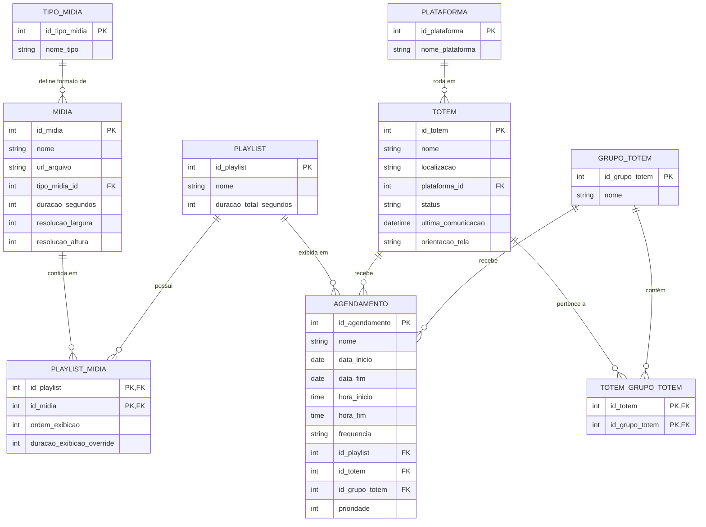

# Modelo Entidade-Relacionamento (E.R.) para Sistema de Publicidade em Smart TV

Este documento detalha o modelo Entidade-Relacionamento proposto para um sistema de gerenciamento de publicidade em Smart TVs, abrangendo plataformas como webOS, Tizen e Android TV. O objetivo é permitir que um backend gerencie a distribuição de mídias para totens específicos, garantindo flexibilidade e controle sobre o conteúdo exibido.

## Entidades e Atributos

### 1. Mídia
Representa os arquivos de conteúdo publicitário (vídeos, imagens, páginas web, etc.).

| Atributo           | Tipo de Dado | Descrição                                        | Observações                                     |
| :----------------- | :----------- | :----------------------------------------------- | :---------------------------------------------- |
| `id_midia`         | INT          | Chave Primária, identificador único da mídia.    | Auto-incremento.                                |
| `nome`             | VARCHAR(255) | Nome descritivo da mídia.                        |                                                 |
| `descricao`        | TEXT         | Descrição detalhada da mídia.                    |                                                 |
| `url_arquivo`      | VARCHAR(512) | URL ou caminho para o arquivo de mídia.          | Pode ser um link para um CDN ou armazenamento.  |
| `tipo_midia_id`    | INT          | Chave Estrangeira para `TipoMidia`.              | Define o formato da mídia (vídeo, imagem, etc.).|
| `duracao_segundos` | INT          | Duração da mídia em segundos.                    | Para vídeos/áudios, ou tempo de exibição padrão para imagens/web. |
| `data_upload`      | DATETIME     | Data e hora do upload da mídia.                  |                                                 |
| `resolucao_largura`| INT          | Largura da resolução em pixels.                  |                                                 |
| `resolucao_altura` | INT          | Altura da resolução em pixels.                   |                                                 |
| `tamanho_bytes`    | BIGINT       | Tamanho do arquivo em bytes.                     |                                                 |
| `hash_arquivo`     | VARCHAR(64)  | Hash do arquivo para verificação de integridade. | Ex: SHA256.                                     |

### 2. TipoMidia
Categoriza os diferentes tipos de conteúdo que podem ser exibidos.

| Atributo           | Tipo de Dado | Descrição                                   | Observações                                     |
| :----------------- | :----------- | :------------------------------------------ | :---------------------------------------------- |
| `id_tipo_midia`    | INT          | Chave Primária, identificador único do tipo. | Auto-incremento.                                |
| `nome_tipo`        | VARCHAR(50)  | Nome do tipo de mídia (ex: 'Video', 'Imagem', 'WebPage'). |                                                 |
| `extensoes_suportadas` | VARCHAR(255) | Lista de extensões de arquivo suportadas.   | Ex: '.mp4,.avi' ou '.jpg,.png'.                 |

### 3. Totem
Representa cada dispositivo Smart TV ou display que exibirá a publicidade.

| Atributo           | Tipo de Dado | Descrição                                        | Observações                                     |
| :----------------- | :----------- | :----------------------------------------------- | :---------------------------------------------- |
| `id_totem`         | INT          | Chave Primária, identificador único do totem.    | Auto-incremento.                                |
| `nome`             | VARCHAR(255) | Nome identificador do totem (ex: 'Totem Loja A').|                                                 |
| `localizacao`      | VARCHAR(255) | Descrição da localização física do totem.        | Ex: 'Shopping X - Praça de Alimentação'.        |
| `codigo_ativacao`  | VARCHAR(50)  | Código para o registro inicial do totem.         | Usado para parear o dispositivo com o backend.  |
| `plataforma_id`    | INT          | Chave Estrangeira para `Plataforma`.             | Define o SO do totem (webOS, Tizen, Android TV).|
| `status`           | VARCHAR(20)  | Status atual do totem.                           | Ex: 'Online', 'Offline', 'Erro', 'Atualizando'. |
| `ultima_comunicacao`| DATETIME     | Data e hora da última comunicação com o backend. | Para monitoramento de conectividade.            |
| `versao_player`    | VARCHAR(50)  | Versão do aplicativo player instalado no totem.  |                                                 |
| `orientacao_tela`  | VARCHAR(10)  | Orientação da tela.                              | 'Paisagem' ou 'Retrato'.                        |
| `resolucao_largura`| INT          | Largura da resolução do totem em pixels.         |                                                 |
| `resolucao_altura` | INT          | Altura da resolução do totem em pixels.          |                                                 |
| `espaco_disco_total`| BIGINT       | Espaço total em disco do totem em bytes.         |                                                 |
| `espaco_disco_usado`| BIGINT       | Espaço em disco usado pelo totem em bytes.       |                                                 |

### 4. Plataforma
Define os sistemas operacionais das Smart TVs suportadas.

| Atributo           | Tipo de Dado | Descrição                                        | Observações                                     |
| :----------------- | :----------- | :----------------------------------------------- | :---------------------------------------------- |
| `id_plataforma`    | INT          | Chave Primária, identificador único da plataforma.| Auto-incremento.                                |
| `nome_plataforma`  | VARCHAR(50)  | Nome da plataforma (ex: 'webOS', 'Tizen', 'Android TV'). |                                                 |
| `descricao`        | TEXT         | Descrição da plataforma.                         |                                                 |

### 5. Playlist
Uma sequência ordenada de mídias para exibição.

| Atributo           | Tipo de Dado | Descrição                                        | Observações                                     |
| :----------------- | :----------- | :----------------------------------------------- | :---------------------------------------------- |
| `id_playlist`      | INT          | Chave Primária, identificador único da playlist. | Auto-incremento.                                |
| `nome`             | VARCHAR(255) | Nome da playlist.                                |                                                 |
| `descricao`        | TEXT         | Descrição da playlist.                           |                                                 |
| `data_criacao`     | DATETIME     | Data e hora de criação da playlist.              |                                                 |
| `duracao_total_segundos` | INT          | Duração total da playlist em segundos.           | Soma das durações das mídias na playlist.       |

### 6. PlaylistMidia (Tabela Associativa)
Associa mídias a playlists e define a ordem de exibição e duração específica dentro da playlist.

| Atributo                   | Tipo de Dado | Descrição                                        | Observações                                     |
| :------------------------- | :----------- | :----------------------------------------------- | :---------------------------------------------- |
| `id_playlist`              | INT          | Chave Primária, Chave Estrangeira para `Playlist`.|                                                 |
| `id_midia`                 | INT          | Chave Primária, Chave Estrangeira para `Mídia`.  |                                                 |
| `ordem_exibicao`           | INT          | Ordem em que a mídia será exibida na playlist.   |                                                 |
| `duracao_exibicao_override`| INT          | Duração de exibição específica para esta mídia nesta playlist. | Opcional, se nulo, usa `duracao_segundos` da Mídia. |

### 7. GrupoTotem
Permite agrupar totens para gerenciamento e agendamento em massa.

| Atributo           | Tipo de Dado | Descrição                                        | Observações                                     |
| :----------------- | :----------- | :----------------------------------------------- | :---------------------------------------------- |
| `id_grupo_totem`   | INT          | Chave Primária, identificador único do grupo.    | Auto-incremento.                                |
| `nome`             | VARCHAR(255) | Nome do grupo de totens.                         | Ex: 'Totens Loja Centro', 'Totens Praça Alimentação'. |
| `descricao`        | TEXT         | Descrição do grupo.                              |                                                 |

### 8. TotemGrupoTotem (Tabela Associativa)
Associa totens a grupos de totens.

| Atributo         | Tipo de Dado | Descrição                                        | Observações                                     |
| :--------------- | :----------- | :----------------------------------------------- | :---------------------------------------------- |\n| `id_totem`       | INT          | Chave Primária, Chave Estrangeira para `Totem`.  |                                                 |
| `id_grupo_totem` | INT          | Chave Primária, Chave Estrangeira para `GrupoTotem`.|                                                 |

### 9. Agendamento
Define quando e onde uma playlist será exibida.

| Atributo           | Tipo de Dado | Descrição                                        | Observações                                     |
| :----------------- | :----------- | :----------------------------------------------- | :---------------------------------------------- |
| `id_agendamento`   | INT          | Chave Primária, identificador único do agendamento.| Auto-incremento.                                |
| `nome`             | VARCHAR(255) | Nome do agendamento.                             |                                                 |
| `data_inicio`      | DATE         | Data de início do agendamento.                   |                                                 |
| `data_fim`         | DATE         | Data de término do agendamento.                  | Opcional, se nulo, agendamento contínuo.        |
| `hora_inicio`      | TIME         | Hora de início diária do agendamento.            |                                                 |
| `hora_fim`         | TIME         | Hora de término diária do agendamento.           |                                                 |
| `frequencia`       | VARCHAR(20)  | Frequência de repetição.                         | 'Diário', 'Semanal', 'Mensal', 'UmaVez'.        |
| `dias_semana`      | VARCHAR(15)  | Dias da semana para agendamentos semanais.       | Ex: 'SEG,TER,QUA,QUI,SEX'. Nulo para diário/mensal/uma vez. |
| `id_playlist`      | INT          | Chave Estrangeira para `Playlist`.               | A playlist a ser exibida.                       |
| `id_totem`         | INT          | Chave Estrangeira para `Totem`.                  | O totem específico para o agendamento. Opcional se `id_grupo_totem` for usado. |
| `id_grupo_totem`   | INT          | Chave Estrangeira para `GrupoTotem`.             | O grupo de totens para o agendamento. Opcional se `id_totem` for usado. |
| `prioridade`       | INT          | Prioridade do agendamento.                       | Para resolver conflitos de agendamento.         |

## Relacionamentos

*   **Mídia** `N:1` **TipoMidia**: Uma mídia pertence a um tipo de mídia. Um tipo de mídia pode ter várias mídias.
*   **Totem** `N:1` **Plataforma**: Um totem roda em uma plataforma. Uma plataforma pode ter vários totens.
*   **Playlist** `N:M` **Mídia** (via **PlaylistMidia**): Uma playlist contém várias mídias, e uma mídia pode estar em várias playlists. A tabela `PlaylistMidia` gerencia a ordem e a duração específica da mídia na playlist.
*   **Totem** `N:M` **GrupoTotem** (via **TotemGrupoTotem**): Um totem pode pertencer a vários grupos de totens, e um grupo de totens pode conter vários totens.
*   **Agendamento** `N:1` **Playlist**: Um agendamento exibe uma playlist. Uma playlist pode ser referenciada por vários agendamentos.
*   **Agendamento** `N:1` **Totem**: Um agendamento pode ser direcionado a um totem específico. (Opcional, se for para um grupo).
*   **Agendamento** `N:1` **GrupoTotem**: Um agendamento pode ser direcionado a um grupo de totens. (Opcional, se for para um totem específico).

## Considerações Adicionais

*   **Conflitos de Agendamento**: A `prioridade` no `Agendamento` pode ser usada para resolver conflitos quando múltiplos agendamentos se sobrepõem para o mesmo totem/grupo de totens.
*   **Cache Offline**: Os players nos totens devem ter a capacidade de baixar e armazenar mídias localmente para exibição offline, garantindo a continuidade mesmo sem conexão à internet.
*   **Monitoramento**: O campo `ultima_comunicacao` em `Totem` é crucial para monitorar a saúde e conectividade dos dispositivos.
*   **Extensibilidade**: O modelo é flexível para adicionar futuras funcionalidades como relatórios de exibição, controle de volume, ou interatividade.

Este modelo fornece uma base robusta para o desenvolvimento do backend, permitindo um gerenciamento eficiente e escalável das mídias publicitárias em diversas plataformas de Smart TV.

## Diagrama Entidade-Relacionamento

