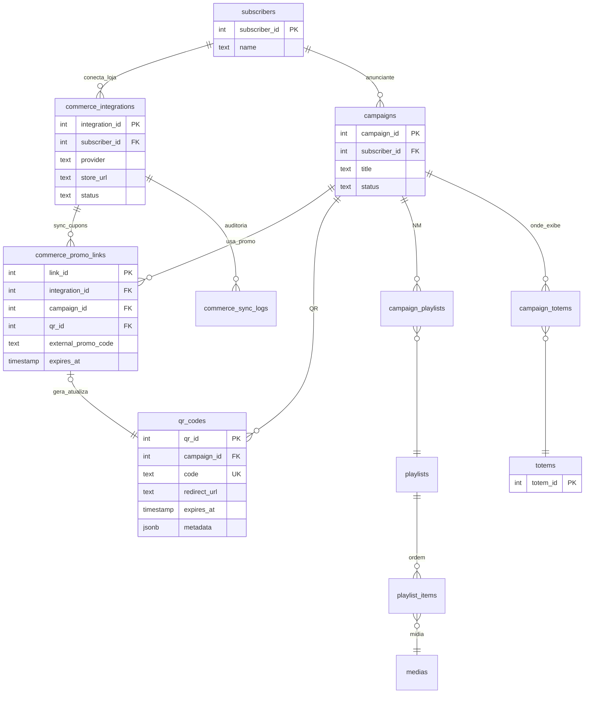
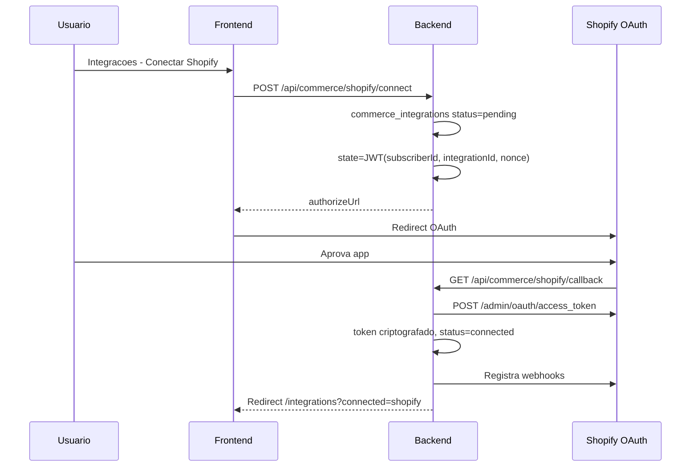
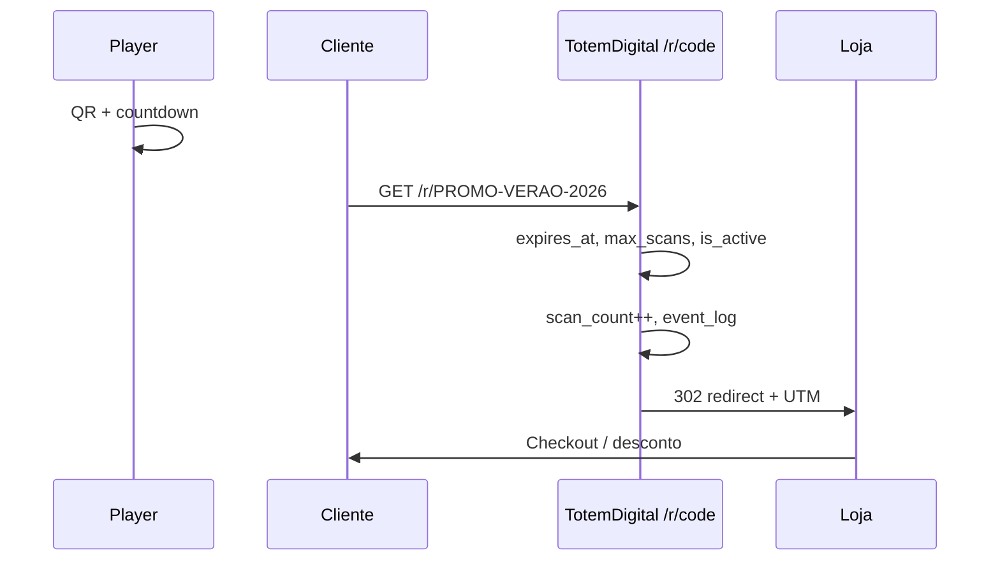

# Especificação — QR Promo + E-commerce + Wizard de Campanha

**Data:** 2026-07-04  
**Status:** Proposta de design (não implementado)  
**Branch de referência:** `Smart-Signage-Studio-Vx5`  
**PDF:** [COMMERCE-QR-WIZARD-SPEC.pdf](./COMMERCE-QR-WIZARD-SPEC.pdf) · **Índice:** [docs/README.md](./README.md)

---

## Objetivo

Definir a arquitetura e os contratos para:

1. Exibir **QR code com countdown** no totem (Player-AD), ligado a campanha/promo.
2. Integrar lojas **Shopify** e **WooCommerce** (conectores padrão).
3. Reservar **Magento** para tier **premium**.
4. Wizard UI **“Usar cupom em campanha”** — do cupom da loja até o dispatch no totem.

O totem **nunca** processa pagamento. Checkout ocorre no celular do cliente após scan.

---

## Decisões de produto

| Decisão | Escolha |
|---------|---------|
| Conectores padrão | **Shopify** (OAuth) + **WooCommerce** (REST API keys) |
| Conector premium | **Magento 2** (Integration token), gated por flag |
| Core (todos os planos) | QR + countdown + redirect `/r/{code}` + analytics |
| Render no player | **WebView HTML** (`mediaType: qr_promo`) — MVP |
| Escopo de integração | **Por anunciante** (`subscriber_id`), não global |
| Credenciais do app Shopify | **Plataforma** (`system_settings`), como SMTP |

---

## Camadas do produto

```
┌─────────────────────────────────────────┐
│           TotemDigital Core             │
│  campaigns · qr_codes · dispatch · /r   │
└─────────────────┬───────────────────────┘
                  │ PromotionProvider (interface)
        ┌─────────┼─────────┬──────────────┐
        ▼         ▼         ▼              ▼
    Native    Shopify   WooCommerce   Magento (premium)
```

| Camada | O quê | Cliente |
|--------|--------|---------|
| **Core** | QR + countdown + redirect + scan_count | Qualquer anunciante |
| **Connect Standard** | Shopify ou WooCommerce | PME com loja existente |
| **Connect Premium** | Magento 2 | Enterprise, catálogo grande, B2B |

---

## Comparação rápida — Shopify vs WooCommerce vs Magento

| Critério | WooCommerce | Shopify | Magento |
|----------|-------------|---------|---------|
| API | REST WP + plugins | REST + GraphQL maduros | REST complexo, multi-store |
| Velocidade de integração | Média | **Alta** | Baixa (premium) |
| Autenticação | Consumer Key + Secret | **OAuth 2.0** | Integration token |
| Cupom / promo | `/wc/v3/coupons` | Discount codes API | Cart/catalog rules |
| Webhooks | Sim (WP) | **Sim** (nativo) | Sim |
| Melhor para | Cliente BR com WP/Woo | Integração rápida e estável | Enterprise |

**Ordem de implementação:** Shopify → WooCommerce → Magento (premium).

---

## Onde vive cada configuração

| Escopo | Onde | Exemplo |
|--------|------|---------|
| Plataforma (admin) | `system_settings` | Client ID/Secret app Shopify TotemDigital |
| Anunciante | `commerce_integrations` | Token da loja `loja-x.myshopify.com` |
| Campanha / QR | `qr_codes` + `commerce_promo_links` | Cupom VERAO30 → campanha #15 |

Diferente do **Financeiro** (SMTP/WhatsApp globais), e-commerce é **multi-tenant por subscriber**.

---

## Schema proposto

Arquivos alvo (quando implementar):

- `database/smartchannel-db-v2-refactored-part6-tables-other.sql`
- `database/smartchannel-db-v2-refactored-part7-foreign-keys.sql`
- `database/seeds-default-settings.sql`

### `commerce_integrations`

```sql
CREATE TABLE IF NOT EXISTS commerce_integrations (
    integration_id SERIAL PRIMARY KEY,
    subscriber_id INTEGER NOT NULL,

    provider TEXT NOT NULL,  -- 'shopify' | 'woocommerce' | 'magento'
    store_name TEXT,
    store_url TEXT NOT NULL,
    external_store_id TEXT,

    status TEXT NOT NULL DEFAULT 'pending',
    -- pending | connected | error | disconnected | revoked

    access_token_encrypted TEXT,
    refresh_token_encrypted TEXT,
    api_key_encrypted TEXT,
    api_secret_encrypted TEXT,
    webhook_secret TEXT,

    token_expires_at TIMESTAMP,
    scopes TEXT[] DEFAULT '{}',

    sync_enabled BOOLEAN DEFAULT true,
    last_sync_at TIMESTAMP,
    last_sync_status TEXT,
    last_sync_error TEXT,

    metadata JSONB DEFAULT '{}'::jsonb,
    is_active BOOLEAN DEFAULT true,
    created_at TIMESTAMP DEFAULT CURRENT_TIMESTAMP,
    updated_at TIMESTAMP DEFAULT CURRENT_TIMESTAMP,

    CONSTRAINT chk_commerce_provider
        CHECK (provider IN ('shopify', 'woocommerce', 'magento')),
    CONSTRAINT chk_commerce_status
        CHECK (status IN ('pending', 'connected', 'error', 'disconnected', 'revoked')),
    CONSTRAINT uq_commerce_subscriber_store
        UNIQUE (subscriber_id, provider, store_url)
);
```

### `commerce_promo_links`

```sql
CREATE TABLE IF NOT EXISTS commerce_promo_links (
    link_id SERIAL PRIMARY KEY,
    integration_id INTEGER NOT NULL,
    campaign_id INTEGER NOT NULL,
    qr_id INTEGER,

    external_promo_type TEXT NOT NULL,
    external_promo_id TEXT NOT NULL,
    external_promo_code TEXT,
    title TEXT,
    expires_at TIMESTAMP,
    landing_url TEXT,

    sync_state TEXT DEFAULT 'active',
    metadata JSONB DEFAULT '{}'::jsonb,

    last_synced_at TIMESTAMP,
    is_active BOOLEAN DEFAULT true,
    created_at TIMESTAMP DEFAULT CURRENT_TIMESTAMP,
    updated_at TIMESTAMP DEFAULT CURRENT_TIMESTAMP,

    CONSTRAINT uq_commerce_promo_external
        UNIQUE (integration_id, external_promo_type, external_promo_id)
);
```

### `commerce_sync_logs`

```sql
CREATE TABLE IF NOT EXISTS commerce_sync_logs (
    log_id SERIAL PRIMARY KEY,
    integration_id INTEGER NOT NULL,
    action TEXT NOT NULL,
    status TEXT NOT NULL,
    details JSONB DEFAULT '{}'::jsonb,
    created_at TIMESTAMP DEFAULT CURRENT_TIMESTAMP
);
```

### Extensão em `qr_codes` (via `metadata`, sem ALTER obrigatório)

```json
{
  "commerce": {
    "integration_id": 7,
    "provider": "shopify",
    "external_promo_id": "gid://shopify/DiscountCode/123",
    "coupon_code": "VERAO30",
    "landing_path": "/discount/VERAO30"
  },
  "utm": {
    "source": "totem",
    "medium": "qr",
    "campaign": "verao-2026"
  }
}
```

**Evolução futura:** adicionar `qr_type = 'promo'` ao CHECK de `qr_codes` (hoje: `url`, `text`, `wifi`, etc.).

---

## Seeds — `system_settings` (plataforma)

| Chave | Uso |
|-------|-----|
| `commerce.shopify.client_id` | App público TotemDigital na Shopify |
| `commerce.shopify.client_secret` | Secret (mascarado na UI) |
| `commerce.shopify.scopes` | `read_discounts,read_products,read_price_rules` |
| `commerce.shopify.redirect_uri` | `https://{host}/api/commerce/shopify/callback` |
| `commerce.webhook_base_url` | Base pública para webhooks |
| `commerce.magento_premium_enabled` | `false` por padrão |
| `commerce.sync_interval_minutes` | `15` |
| `commerce.default_redirect_template` | UTM padrão |

Serviço espelhando `financialIntegrationConfigService.ts`: **`commerceIntegrationConfigService.ts`** — resolve settings globais, cache ~30s, mascaramento de secrets.

---

## Diagrama ER



**Regra:** o player lê apenas o **dispatch**; nunca chama API da loja diretamente.

---

## OAuth — Shopify



**Scopes mínimos (MVP):** `read_discounts`, `read_products`, `read_price_rules`

**Webhooks:**

| Tópico | Ação |
|--------|------|
| `discounts/update` | Atualiza `commerce_promo_links` + `qr_codes.expires_at` |
| `discounts/delete` | `sync_state = revoked`, desativa QR |
| `app/uninstalled` | `status = revoked`, limpa tokens |

---

## WooCommerce — API keys (sem OAuth simples)

Fluxo wizard em 3 passos:

1. URL da loja: `https://minhaloja.com.br`
2. Consumer Key + Consumer Secret (Woo → Avançado → REST API, permissão **Leitura**)
3. Testar: `GET /wp-json/wc/v3/coupons?per_page=5`

```
POST /api/commerce/woocommerce/connect
  { subscriberId, storeUrl, consumerKey, consumerSecret }

POST /api/commerce/integrations/:id/register-webhooks  (opcional)
  → coupon.updated, coupon.deleted
```

---

## Magento — tier premium

- Gated por `commerce.magento_premium_enabled` + plano do subscriber.
- `POST /api/commerce/magento/connect { storeUrl, accessToken }`
- UI com badge **Premium** se flag desligada.

---

## UI — Settings e Integrações

### Admin — nova aba **E-commerce** em Configurações

Permissão: `admin` / `platform_admin`.

- Client ID / Client Secret app Shopify (mascarado)
- Redirect URI (readonly, copiar)
- Scopes
- URL base webhooks
- Flag Magento premium
- Intervalo sync (minutos)

### Anunciante — `/integrations` ou `/subscribers/:id/integrations`

- Cards: Shopify | WooCommerce | Magento (Premium)
- Lista lojas conectadas + sync manual + desconectar
- Lista cupons → botão **Usar em campanha**

---

## API — rotas novas

| Método | Rota | Quem |
|--------|------|------|
| GET | `/api/commerce/integrations` | Anunciante (scope subscriber) |
| POST | `/api/commerce/shopify/connect` | Inicia OAuth |
| GET | `/api/commerce/shopify/callback` | Callback público |
| POST | `/api/commerce/woocommerce/connect` | CK/CS + teste |
| POST | `/api/commerce/magento/connect` | Premium |
| POST | `/api/commerce/integrations/:id/test` | Teste conexão |
| POST | `/api/commerce/integrations/:id/sync` | Sync manual |
| DELETE | `/api/commerce/integrations/:id` | Desconectar |
| GET | `/api/commerce/integrations/:id/promos` | Lista cupons |
| POST | `/api/commerce/promo-links/wizard` | Wizard passo 3 |
| POST | `/api/commerce/promo-links/:id/attach-playlist` | Wizard passo 4 |
| POST | `/api/commerce/promo-links/:id/finalize` | Wizard passo 5 |
| POST | `/api/commerce/webhooks/shopify/:integrationId` | Webhook |
| POST | `/api/commerce/webhooks/woocommerce/:integrationId` | Webhook |
| GET | `/r/:code` | Redirect público (scan) |

**GET integration (sem secrets):**

```json
{
  "integrationId": 7,
  "provider": "shopify",
  "storeUrl": "loja-x.myshopify.com",
  "status": "connected",
  "lastSyncAt": "2026-07-04T12:00:00Z",
  "promoCountActive": 8,
  "credentialsMasked": { "hasAccessToken": true }
}
```

---

## Wizard — “Usar cupom em campanha”

Entrada: **Integrações → cupom → Usar em campanha** ou **Campanha → Importar da loja**.

### Passo 0 — Pré-requisitos

```
GET /api/commerce/integrations?subscriberId=42&status=connected
GET /api/campaigns?subscriberId=42&status=active,draft,approved
```

### Passo 1 — Cupom

```http
GET /api/commerce/integrations/7/promos?activeOnly=true&page=1&limit=20
```

```json
{
  "success": true,
  "data": {
    "integrationId": 7,
    "provider": "shopify",
    "promos": [{
      "externalPromoType": "discount_code",
      "externalPromoId": "gid://shopify/DiscountCode/123456",
      "code": "VERAO30",
      "title": "Verão -30%",
      "discountSummary": "30% off",
      "expiresAt": "2026-07-15T23:59:59Z",
      "usageLimit": 500,
      "usageCount": 127,
      "landingPath": "/discount/VERAO30",
      "isActive": true
    }]
  }
}
```

### Passo 2 — Campanha

**Existente:** `GET /api/campaigns/15` — validar `subscriberId`.

**Nova campanha rápida:**

```http
POST /api/campaigns
```

```json
{
  "subscriberId": 42,
  "title": "Verão -30% Totem Shopping",
  "campaignType": "scheduled",
  "status": "draft",
  "startDate": "2026-07-04T00:00:00Z",
  "endDate": "2026-07-15T23:59:59Z",
  "priority": 5,
  "metadata": { "source": "commerce_wizard", "commerceProvider": "shopify" }
}
```

### Passo 3 — QR + countdown

```http
POST /api/commerce/promo-links/wizard
```

```json
{
  "integrationId": 7,
  "campaignId": 15,
  "externalPromoType": "discount_code",
  "externalPromoId": "gid://shopify/DiscountCode/123456",
  "couponCode": "VERAO30",
  "qr": {
    "code": "PROMO-VERAO-2026",
    "title": "Verão -30% — escaneie!",
    "subtitle": "Válido só hoje no shopping",
    "expiresAt": "2026-07-15T23:59:59Z",
    "maxScans": 500,
    "trackingEnabled": true,
    "countdown": {
      "enabled": true,
      "position": "above",
      "format": "HH:mm:ss",
      "showWhenExpired": "message",
      "expiredMessage": "Promo encerrada"
    }
  },
  "utm": { "source": "totem", "medium": "qr", "campaign": "verao-2026" }
}
```

**Response:**

```json
{
  "success": true,
  "data": {
    "linkId": 901,
    "qrId": 42,
    "code": "PROMO-VERAO-2026",
    "scanUrl": "https://totem.seudominio.com/r/PROMO-VERAO-2026",
    "renderHtmlUrl": "https://cdn.seudominio.com/qr/render/PROMO-VERAO-2026.html",
    "expiresAt": "2026-07-15T23:59:59Z",
    "serverNow": "2026-07-04T12:00:00Z"
  }
}
```

**Backend (transação):** upsert `commerce_promo_links` → insert/update `qr_codes` → gerar HTML/PNG.

### Passo 4 — Playlist

```http
POST /api/commerce/promo-links/901/attach-playlist
```

```json
{
  "mode": "full_screen_item",
  "durationSeconds": 30,
  "playlistId": 88,
  "createPlaylistIfMissing": true,
  "playlistName": "Promo Verão QR",
  "insertPosition": "end"
}
```

Cria `medias` sintética (`mediaType: qr_promo`) + `playlist_items`.

### Passo 5 — Totens + ativar

```http
POST /api/commerce/promo-links/901/finalize
```

```json
{
  "totemIds": [7, 12],
  "activateCampaign": true,
  "campaignStatus": "active"
}
```

Upsert `campaign_totems`, opcionalmente `campaigns.status = active`, invalidar cache dispatch.

---

## Validações do wizard

| Regra | HTTP |
|-------|------|
| `integration.subscriber_id === campaign.subscriber_id` | 403 |
| Cupom expirado na loja | 409 `PROMO_EXPIRED` |
| Código QR duplicado | 409 ou sufixo automático |
| Campanha sem contrato (se política exigir) | 422 + aviso UI |
| Totem fora do escopo do publisher | 403 |

---

## Contrato dispatch — item `qr_promo`

Estende `DispatchMediaItem` existente (`backend/src/types/dispatcherTotem.types.ts`).

```json
{
  "mediaId": 90001,
  "order": 4,
  "duration": 30,
  "url": "https://cdn.seudominio.com/qr/render/PROMO-VERAO-2026.html",
  "mediaType": "qr_promo",
  "cacheBucket": "propagandas",
  "mediaName": "QR Promo VERAO30",
  "metadata": {
    "mimeType": "text/html",
    "qr": {
      "qrId": 42,
      "code": "PROMO-VERAO-2026",
      "campaignId": 15,
      "title": "Verão -30% — escaneie!",
      "subtitle": "Válido só hoje no shopping",
      "expiresAt": "2026-07-15T23:59:59Z",
      "serverNow": "2026-07-04T12:00:00Z",
      "maxScans": 500,
      "scanCount": 0,
      "scanUrl": "https://totem.seudominio.com/r/PROMO-VERAO-2026",
      "qrImageUrl": "https://cdn.seudominio.com/qr/PROMO-VERAO-2026.png",
      "countdown": {
        "enabled": true,
        "position": "above",
        "format": "HH:mm:ss",
        "showWhenExpired": "message",
        "expiredMessage": "Promo encerrada"
      },
      "commerce": {
        "provider": "shopify",
        "integrationId": 7,
        "externalPromoId": "gid://shopify/DiscountCode/123456",
        "couponCode": "VERAO30",
        "storeDomain": "loja-x.myshopify.com",
        "landingPath": "/discount/VERAO30"
      }
    }
  }
}
```

| Campo | Função |
|-------|--------|
| `expiresAt` + `serverNow` | Countdown sincronizado (calibra drift local) |
| `scanUrl` | URL no QR — sempre domínio TotemDigital |
| `duration` | Tempo na tela (ex.: 30s); ≠ validade da promo |
| `showWhenExpired` | `hide` \| `message` \| `fallback_media_id` |

**Player-AD (MVP):** tratar `qr_promo` como HTML/WebView (similar a `html`/`widget` em `HtmlWebViewPlayback.kt`).

**Alternativa fase 2:** overlay fixo via `plan.metadata.overlays[]`.

---

## Fluxo de scan



**Redirect Shopify:**

```
https://loja-x.myshopify.com/discount/VERAO30
  ?utm_source=totem&utm_medium=qr&utm_campaign=verao-2026
  &totem_id=7&qr_code=PROMO-VERAO-2026
```

**Redirect WooCommerce:**

```
https://minhaloja.com.br/?coupon-code=VERAO30
  ?utm_source=totem&utm_medium=qr&totem_id=7
```

---

## Worker de sync

```
commerceSyncWorker (intervalo: commerce.sync_interval_minutes)
  FOR EACH integration WHERE status=connected AND sync_enabled
    syncPromos(provider)
      → upsert commerce_promo_links
      → atualiza qr_codes (expires_at, redirect_url, is_active)
      → commerce_sync_logs
```

Webhooks = invalidação imediata; job = fallback.

---

## Estado atual no repositório (baseline)

| Área | Status |
|------|--------|
| Schema `qr_codes` | Existe (`part6-tables-other.sql`) |
| Backend `qrcodeService.ts` | Parcial; trechos legados |
| Frontend `/qr-codes` | Básico (nome + URL) |
| Player-AD QR | **Não exibe** — só vídeo/imagem/HTML |
| `commerce_*` | **Não existe** |
| Dispatch `qr_promo` | **Não existe** |

---

## Roadmap de implementação

| # | Entrega |
|---|---------|
| 1 | Schema `commerce_*` + seeds platform + `commerceIntegrationConfigService` |
| 2 | `POST /api/commerce/promo-links/wizard` + `GET /r/:code` |
| 3 | Wizard UI (passos 3→5) + página Integrações |
| 4 | OAuth Shopify + listagem cupons |
| 5 | WooCommerce connect + cupons |
| 6 | `attach-playlist` + dispatch `qr_promo` |
| 7 | Player-AD WebView `qr_promo` + countdown |
| 8 | Sync worker + webhooks |
| 9 | Magento premium |

---

## Referências no código

| Área | Path |
|------|------|
| Dispatch types | `backend/src/types/dispatcherTotem.types.ts` |
| QR schema | `database/smartchannel-db-v2-refactored-part6-tables-other.sql` |
| QR service | `backend/src/services/qrcodeService.ts` |
| Settings Financeiro (padrão secrets) | `backend/src/services/financialIntegrationConfigService.ts` |
| Settings UI | `frontend/src/pages/Settings/Settings.tsx` |
| QR UI (básica) | `frontend/src/pages/QRCodes/QRCodes.tsx` |
| Player HTML | `Player-AD/.../HtmlWebViewPlayback.kt` |

---

## Histórico

| Data | Nota |
|------|------|
| 2026-07-04 | Documento inicial — design acordado em sessão de produto (QR + e-commerce) |
