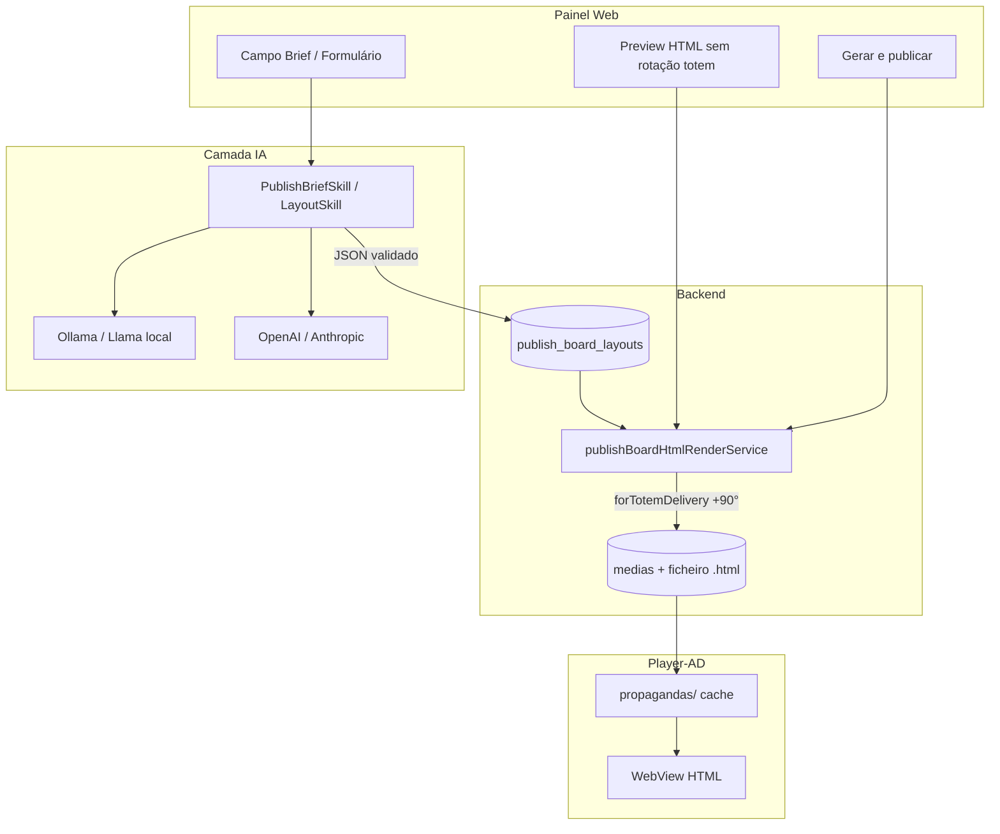

# Documentação da conversa — Publish Board, HTML5, UX e IA

**Data:** 23 de junho de 2026  
**Branch:** `Smart-Signage-Studio-Vx5`  
**Commit principal desta entrega:** `bf0b80d` — `fix(publish-board): reeditar HTML sem duplicar midia e melhorias de UX`  
**Contexto:** sessão de correções de rotação vídeo (já estável), melhorias de UI/publicação automática, análise de integração IA + Llama local.

---

## 1. Resumo executivo

A conversa cobriu quatro eixos:

1. **Rotação de vídeo** (painel ↔ servidor ↔ Player-AD) — contrato fechado e validado pelo utilizador.
2. **UX de mídias e publicação automática** — previews, modo Criar, edição a partir do anunciante, thumbs HTML.
3. **HTML5 no totem** — rotação +90° e tipografia maior via ficheiro de entrega (não via novo APK).
4. **Análise conceptual** — IA (Ollama/Llama local ou providers do sistema) integrada à criação dinâmica sem gerar HTML livre no totem.

---

## 2. Estado da rotação de vídeo (referência)

| Camada | Comportamento acordado |
|--------|------------------------|
| **UI** | Preview/thumbnail 9:16 em pé (WYSIWYG) |
| **Servidor** | Ficheiro landscape 1920×1080, rotação pré-aplicada no ffmpeg |
| **Totem** | `user_rotation=1` (Allwinner); Player-AD v1.66 sem rotação runtime (`MediaViewportRotation.ENABLED = false`) |

Regras em `backend/src/services/mediaService.ts` → `resolveDeliveryRotationFromStream()`.

**Player-AD:** não é necessário reinstalar para as alterações de HTML/publicação; vídeo já estava OK com v1.66.

---

## 3. Alterações implementadas (commit `bf0b80d`)

### 3.1 Backend

| Ficheiro | Alteração |
|----------|-----------|
| `publishBoardHtmlRuntime.ts` | Base `font-size: 22px`; `offlineFitScript` com rotação +90° para entrega totem (`TOTEM_HTML_DELIVERY_ROTATE_DEG`) |
| `publishBoardHtmlRenderService.ts` | Tipografia ~50% maior; `forTotemDelivery` controla rotação no HTML gravado |
| `publishBoardService.ts` | Gera thumb 9:16 ao criar HTML; **substitui mídia existente** em vez de duplicar nome |
| `mediaService.ts` | `replaceMediaFileContent()`; thumb on-demand para HTML; **ver bug §6.1** |
| `autoPublishOrchestratorService.ts` | Suporte `replaceMediaId` |
| `routes/publish-board.ts` | `replaceMediaId` em `auto-publish` e `render-html` |

### 3.2 Frontend

| Ficheiro | Alteração |
|----------|-----------|
| `utils/publishBoardMedia.ts` | Deteção `publish-board`, preset nas tags, URL modo Criar |
| `Subscribers.tsx` | Botão ✨ Editar conteúdo; cards menores; metadados consolidados |
| `QuickPublish.tsx` | Preserva `mode=create`; previews ~50% menores; iframe HTML |
| `MediaViewDialog.tsx` | Preview via `preview-html`; metadados limpos |
| `CreatePublishPanel.tsx` | `replaceMediaId`; mensagens de substituição |
| `PublishBoardStudio.tsx` | Navegação com `mode=create` |

### 3.3 Deploy

```bash
git pull && bash scripts/fix-upload-502-server.sh
```

Republicar HTML no painel para aplicar rotação/fontes no totem (cache do player atualiza na próxima descarga).

---

## 4. Onde ficam ficheiros e cache

### 4.1 Servidor — mídias e thumbs HTML

**Raiz configurável:** setting `media.storage.path` ou env `UPLOAD_PATH`  
**Padrão produção:** `/opt/smart-signage/public/assets/uploads`

```
/opt/smart-signage/public/assets/uploads/subscriber-{ID}/medias/
  Nome-do-quadro — Cardápio Digital (HTML).html
  Nome-do-quadro — Cardápio Digital (HTML)_thumb.jpg   ← thumb 360×640
```

**API:** `GET /api/media/:id/thumbnail`  
**Cache temporário (placeholder):** `{TMP}/smartsignage/thumbnails/placeholder-{id}.jpg`

### 4.2 Totem — Player-AD

```
{raiz_storage_player}/propagandas/
  metadata.json
  ficheiros por media_id (.html, vídeo, imagem)
```

Raiz depende de `player-config.json` (`storageMode`: interno, SD, USB).  
**Não confundir** com pasta de uploads do servidor.

### 4.3 Layout editável (não é ficheiro de mídia)

Tabela `publish_board_layouts` — um layout por **anunciante + preset** (`menu`, `promotion`, etc.).  
Cada auto-publish gera um **snapshot** `.html`; editar layout ≠ editar ficheiro antigo automaticamente (agora substitui-se a mídia alvo via `replaceMediaId` ou deteção por nome/tags).

---

## 5. Fluxos de utilizador documentados

### 5.1 Editar publicação automática (fluxo preferido)

1. **Anunciantes** → Editar → aba **Mídias**
2. Mídia HTML com tags `publish-board` + `menu` (etc.)
3. Botão **✨ Editar conteúdo** → `/quick-publish?mode=create&subscriber=…&preset=…&mediaIds=…`
4. Ajustar no **CreatePublishPanel** → **Gerar e publicar agora**
5. Sistema **substitui** o HTML existente (mesmo `media_id`)

Botão **lápis** = apenas metadados (nome, descrição, tags).

### 5.2 Erro corrigido: “Nome de mídia já existe”

**Causa:** cada republicação chamava `createMedia` com o mesmo nome.  
**Correção:** `replaceMediaFileContent` + deteção por `replaceMediaId`, nome ou tags `publish-board`+preset.

---

## 6. Problemas conhecidos (captura 06/2026 04:12)

### 6.1 `column "size_bytes" of relation "medias" does not exist`

**Sintoma:** erro vermelho ao republicar/substituir HTML.

**Causa:** `mediaService.replaceMediaFileContent()` usa coluna `size_bytes`; o schema v2 define **`file_size_bytes`** (`database/smartchannel-db-v2-refactored-part3-tables-dependent.sql`).

**Correção aplicada:** `replaceMediaFileContent` usa `file_size_bytes` (schema v2). Hotfix pós-`bf0b80d`.

### 6.2 `connect ECONNREFUSED ::1:11434`

**Sintoma:** aviso amarelo ao usar **Sugerir textos com IA**.

**Causa:** `AIService` aponta para Ollama em `localhost:11434` (IPv6 `::1`); serviço não está a correr ou não escuta nessa interface.

**Ações operacionais:**

```bash
# No servidor onde corre o backend
ollama serve
ollama pull llama3.2:3b   # ou modelo em AI_MODEL
curl http://127.0.0.1:11434/api/tags
```

**Config:** `AI_PROVIDER=ollama`, `AI_OLLAMA_BASE_URL`, `AI_MODEL` em `.env` ou `backend/src/config/env.ts`.

**Nota:** falha de IA **não deve bloquear** publicação se `useAi=false`; o auto-publish continua com textos manuais.

---

## 7. Análise conceptual — IA + HTML5 dinâmico

### 7.1 Arquitetura atual

```
Brief / formulário
       ↓
publish_board_layouts (JSON)
       ↓
publishBoardHtmlRenderService (templates fixos, totem-safe)
       ↓
ficheiro .html → totem (WebView)
       ↑
publishBriefAiService.suggestCopy → AIService (Ollama | OpenAI | Anthropic)
```

A IA **só preenche campos de texto** em presets (`promotion`, `ad`, `announcement`, `institutional`). Cardápio usa catálogo ao vivo.

### 7.2 Princípio recomendado

> **A IA autora briefs estruturados (JSON); o sistema autora o HTML de entrega.**

Evita: HTML livre da IA no totem (rotação, offline, XSS, fontes externas).

### 7.3 Três caminhos avaliados

| Caminho | Descrição | Recomendação |
|---------|-----------|--------------|
| **A — Layout JSON** | IA devolve `PublishBoardLayout`; renderizador gera HTML | **Núcleo da v1** |
| **B — HTML livre** | IA gera `<html>` completo | Só laboratório/sandbox |
| **C — Híbrido** | Brief NL → JSON → render → (opcional) revisão cloud | **Visão de produto** |

### 7.4 Llama local vs cloud

| | Ollama / Llama local | OpenAI / Anthropic |
|--|----------------------|---------------------|
| Privacidade | Alta | Contrato/DPA |
| Custo | GPU/servidor fixo | Por token |
| Copy curto PT-BR | `llama3.2:3b`–`8b` OK | Excelente |
| JSON estruturado | Prompt + validação + retry | Mais estável |

**Política sugerida:** um único `AIService`; skills por feature (`PublishBriefSkill`, `GenerateLayoutFromBriefSkill`); plano define provider e quotas (`subscriberHasAiTextAssist`).

### 7.5 Exemplo conceptual — brief em linguagem natural

**Utilizador:**  
*“Comunicado check-up para idosos, tom acolhedor, vertical, evento terças 14h.”*

**IA (JSON, não HTML):**

```json
{
  "preset": "announcement",
  "preferredOrientation": "portrait",
  "accentColor": "#2e7d32",
  "boardTitle": "Saúde em dia",
  "content": {
    "headline": "Check-up para a melhor idade",
    "message": "Cuidar de si é o melhor presente.",
    "eventInfo": "Todas as terças · 14h · Recepção"
  }
}
```

**Pipeline:** validar schema → `saveLayout` → `preview-html` → `renderToMediaHtml(forTotemDelivery: true)` → `replaceMediaId` se edição.

### 7.6 Roadmap sugerido (fases)

| Fase | Entrega | Provider |
|------|---------|----------|
| 1 | Brief NL → layout JSON completo | Ollama |
| 2 | IA provider/modelo nas Settings (admin) | — |
| 3 | RAG: cardápio + marca no prompt | Ollama |
| 4 | 2–3 variantes de copy na UI | Ollama/cloud |
| 5 | Chat de refinamento | Qualquer |
| 6 | HTML custom experimental (sandbox) | Cloud, opcional |

### 7.7 Guardrails obrigatórios

- Comprimento máximo por campo (legibilidade totem).
- Menu: **nunca** inventar preços — só catálogo.
- Validador pós-IA (Zod); 1 retry se JSON inválido.
- HTML de entrega sempre via `wrapHtmlDocument` + `forTotemDelivery`.
- Auditoria: `subscriber_id`, `preset`, tokens em `AIService`.

---

## 8. Ficheiros-chave no repositório

| Área | Caminhos |
|------|----------|
| Render HTML | `backend/src/services/publishBoardHtmlRenderService.ts`, `publishBoardHtmlRuntime.ts` |
| Layout / publish | `backend/src/services/publishBoardService.ts`, `autoPublishOrchestratorService.ts` |
| IA textos | `backend/src/services/publishBriefAiService.ts`, `aiService.ts` |
| UI criar | `frontend/src/components/Publish/CreatePublishPanel.tsx`, `pages/QuickPublish/QuickPublish.tsx` |
| Editar anunciante | `frontend/src/pages/Subscribers/Subscribers.tsx`, `utils/publishBoardMedia.ts` |
| Player totem | `Player-AD/.../HtmlWebViewPlayback.kt`, `MediaCacheManager.kt` |
| Schema layout | `database/.../part6-tables-other.sql` → `publish_board_layouts` |
| Schema mídia | `file_size_bytes` em `medias` (part3) |

---

## 9. Commits relacionados (histórico recente)

| Commit | Descrição |
|--------|-----------|
| `12025c6` | Rotação WhatsApp/landscape HD + entrega totem |
| `14f8b4e` | Fix TS enrichDeliveryPreviewFields |
| `7a5d06e` | UI: previews autenticados, dialogs Ver/Editar |
| `bf0b80d` | Publish-board: reeditar HTML, thumbs, UX, rotação/fontes HTML |

---

## 10. Perguntas em aberto (para próxima sessão)

1. Brief em linguagem natural é obrigatório na v1 de IA, ou evoluir só o `suggestCopy`?
2. Ollama no mesmo host do backend ou servidor GPU dedicado?
3. No cardápio: IA sugere só textos ou também **quais produtos** entram no quadro?
4. ~~Corrigir `size_bytes` → `file_size_bytes` e fazer deploy de hotfix~~ **Feito**
5. Documentar no admin como ligar Ollama e testar `GET /api/.../ai-assist-status`?

---

## 11. Diagrama — visão alvo IA + publicação



---

*Documento gerado a partir da conversa em Cursor (sessão Publish Board / TotemDigital). Para alterações de schema, seguir regra do repositório: editar ficheiros definitivos em `database/` e instalador, não migrations ad hoc.*
