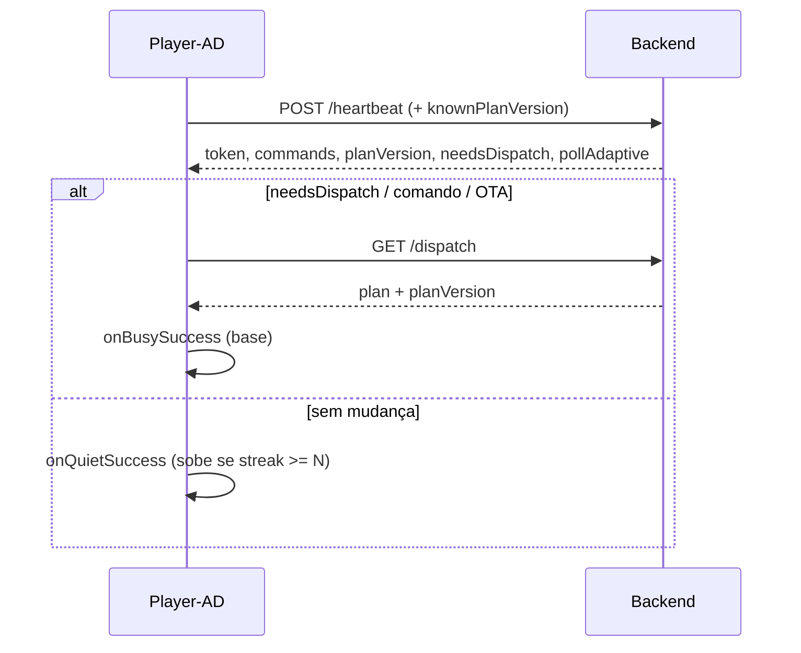

# Sonolência do batimento (pollAdaptive)

**Data:** 2026-07-24  
**Escopo:** Player-AD + `totems.player_settings.pollAdaptive` + painel (Editar totem)  
**Objetivo:** reduzir tráfego HTTP desnecessário (heartbeat / dispatch) sem perder comandos remotos nem atualização de plano quando há mudança.

---

## 1. Problema

Com batimento fixo (ex.: 15–30 s) e dispatch frequente, N totens geram carga constante mesmo quando:

- o plano de mídia não mudou;
- não há comandos remotos / OTA;
- a tela está **fora do horário** (idle preto).

Isso dispara rate-limit (`429`) e aumenta custo de rede/CPU no servidor.

---

## 2. Modelo

Dois polls no Player-AD (`AdaptivePollScheduler`), com papéis distintos:

| Poll | Papel | Base ativa | Base idle | Teto |
|------|-------|------------|-----------|------|
| Heartbeat | Mensageiro (token, comandos, OTA, **planVersion**) | `batimentoCardiaco` | `idleHeartbeatSeconds` | `maxHeartbeatSeconds` |
| Dispatch | GET `/dispatch` **só sob demanda** | safety `maxSecondsWithoutServerCheck` | `idleDispatchSeconds` | `maxDispatchSeconds` |

### Unificação heartbeat ↔ dispatch (`planVersion`)

O GET `/dispatch` **deixa de ser periódico** no caminho feliz:

1. Player envia `knownPlanVersion` nas metrics do heartbeat.
2. Servidor responde `planVersion` + `needsDispatch` (compara sticky/cache/DB).
3. Player faz GET `/dispatch` apenas se:
   - `needsDispatch == true`, ou
   - comando remoto pediu refresh, ou
   - boot / fallback de segurança (sem versão ou sem fetch há ≥ `maxSecondsWithoutServerCheck`).

Após cada GET `/dispatch`, o servidor grava sticky `dispatcher:totem:{id}:planVersion`.  
Regenerar playlist (`playlistEngine.generatePlaylistForTotem`) e mudanças de mídia/direct **invalidam** esse cache → próximo heartbeat marca `needsDispatch=true`.

### Estados

```text
ATIVO + mudança     → intervalo = base ativa (acorda)
ATIVO + N iguais    → cresce × sleepGrowthFactor até teto (sonolência)
IDLE (tela off)     → base = idle*; sonolência continua até teto
Falha / 429         → dobra (respeita Retry-After) até teto
```

### O que conta como “mudança” (busy)

- Heartbeat: comandos pendentes, `refreshDispatch`, `otaUpdate`, ou `needsDispatch`
- Dispatch (quando ocorre): assinatura do plano diferente (`mediaId:order:contentVersion`)

### O que conta como “quieto”

- Heartbeat OK sem comandos/OTA/needsDispatch
- Safety dispatch OK com plano idêntico

---

## 3. Contrato JSON (`pollAdaptive`)

Persistido em:

1. `player-config.json` no aparelho  
2. `totems.player_settings.pollAdaptive` (cadastro) — devolvido no **heartbeat**

```json
{
  "enabled": true,
  "unchangedStreakBeforeSleep": 2,
  "sleepGrowthFactor": 2.0,
  "maxHeartbeatSeconds": 600,
  "maxDispatchSeconds": 1800,
  "idleHeartbeatSeconds": 120,
  "idleDispatchSeconds": 600
}
```

| Campo | Default | Descrição |
|-------|---------|-----------|
| `enabled` | `true` | Se `false`, não cresce em respostas iguais (só falha/backoff) |
| `unchangedStreakBeforeSleep` | `2` | Sucessos quietos antes de começar a subir |
| `sleepGrowthFactor` | `2.0` | Fator por passo (1.1–4.0) |
| `maxHeartbeatSeconds` | `600` | Teto do batimento |
| `maxDispatchSeconds` | `1800` | Teto do poll de safety do dispatch |
| `idleHeartbeatSeconds` | `120` | Base do HB com tela idle |
| `idleDispatchSeconds` | `600` | Base do safety dispatch com tela idle |

Bases ativas: `batimentoCardiaco` e `maxSecondsWithoutServerCheck` (este último = teto de segurança sem GET `/dispatch`, não intervalo fixo de poll).

### Heartbeat (campos novos)

```json
{
  "planVersion": "a1b2c3…",
  "needsDispatch": false
}
```

Metrics do player:

```json
{ "knownPlanVersion": "a1b2c3…" }
```

GET `/dispatch` devolve o mesmo `planVersion` no `data`.

---

## 4. Fluxo



---

## 5. Onde configurar

| Local | Campos |
|-------|--------|
| **Editar totem** (painel) | Secção “Sonolência do batimento” → `player_settings.pollAdaptive` |
| **Config Player-AD** | Mesmos campos + batimento/dispatch base |
| **Heartbeat** | Servidor envia `pollAdaptive`; player persiste em `player-config.json` |

Alteração via `apply_player_config` reinicia o app (como outras configs remotas). Sync só via heartbeat atualiza o JSON; o loop em curso usa os limites com que foi iniciado até o próximo restart (o perfil idle/ativo e a sonolência por streak já atuam em runtime).

---

## 6. Defaults recomendados (campo)

| Cenário | HB base | Safety dispatch | Idle HB | Teto HB |
|---------|---------|-----------------|---------|---------|
| Rede estável, poucos totens | 30 s | 180 s | 120 s | 600 s |
| Muitos totens / NAT | 60 s | 300 s | 180 s | 900 s |
| Fora do horário longo | — | — | ≥ 120 s | ≥ 600 s |

---

## 7. Relação com horário de tela

`displaySchedule` continua a controlar **saída visual** (overlay preto + keep-alive).  
`pollAdaptive` controla **frequência de rede**. Fora do horário, `setIdleMode(true)` sobe a base do poll sem matar o processo.

---

## 8. Código de referência

- `Player-AD/.../AdaptivePollScheduler.kt`
- `Player-AD/.../PollAdaptiveConfig.kt`
- `Player-AD/.../PlayerController.kt` (`runDueServerPolls`)
- `backend/.../dispatchPlanVersion.ts`
- `backend/.../dispatcherTotemService.ts` (`peekPlanVersion` / `rememberPlanVersion`)
- `backend/.../dispatcherRouter.ts` (heartbeat + dispatch)
- `frontend/.../TotemEditDialog.tsx`

---

## 9. Versões

- Player-AD **≥ 1.81** (planVersion / needsDispatch)
- Backend **≥ 2.1.5**
- Frontend painel com UI de sonolência (**≥ 2.1.8**)
