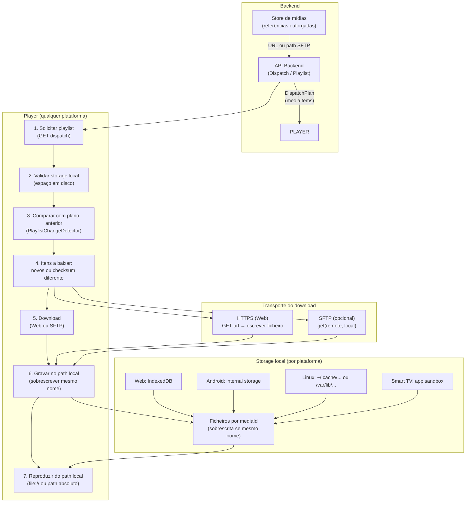
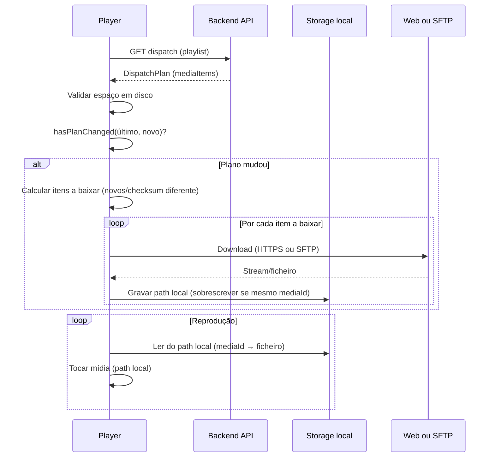

# Design: Players por plataforma — storage local e download (Web / SFTP)

Documento de design para alinhar os players de cada plataforma (web, Android, Linux, Smart TVs) às mesmas regras e funcionalidades do **player-web**, com foco em: solicitar playlist, validar storage local, sobrescrever mídias de mesmo nome, detectar alterações e realizar download (Web ou SFTP). As mídias passam a ser reproduzidas a partir do **path local** após o download.

---

## 1. Regras e funcionalidades (espelho do web-player)

As mesmas regras do player-web devem valer para todos os players (Android, Linux, webOS, Tizen, etc.):

| Regra | Descrição |
|-------|-----------|
| **Solicitar playlist** | Player obtém o DispatchPlan (playlist) via API do backend (referências outorgadas ao totem/UIN). |
| **Validar storage local** | Antes de baixar, verificar espaço em disco (ou quota) e garantir que há espaço para as mídias da playlist. |
| **Sobrescrita por nome** | Mídias com o mesmo identificador (ex.: `mediaId` ou nome de ficheiro) devem ser **sobrescritas** no storage local, não duplicadas. |
| **Detecção de alteração** | Comparar o plano recebido com o último plano (playlistId, quantidade de itens, ordem, checksums, validade). Só baixar o que for **novo ou alterado**. |
| **Reprodução do path local** | Após o download, a reprodução deve usar **sempre o path local** (ficheiro no disco/armazenamento interno), não streaming direto da URL remota. |

No web-player hoje:
- **Playlist**: `loadDispatchPlan()` → API `/api/player/dispatch` (ou equivalente).
- **Detecção de mudança**: `PlaylistChangeDetector.hasPlanChanged(oldPlan, newPlan)` (playlistId, quantidade, ordem, checksums, validity).
- **Cache**: `MediaCacheManager.processDispatchPlan(plan, apiClient)` → para cada item: se já existe e checksum OK, skip; senão `downloadMedia()` (HTTP) e guarda em IndexedDB; `ensureCacheSpace()` libera espaço se necessário.
- **Reprodução**: primeiro tenta `getCachedMediaBlobURL(mediaId)`; se existir, toca do cache; senão streaming + download em background.

Nas outras plataformas o “cache” será **filesystem** (pasta local), mas a lógica é a mesma.

---

## 2. Fluxo geral (resumo)

1. **Solicitar playlist** → Backend devolve DispatchPlan (lista de `mediaItems` com `mediaId`, `url`, `metadata.checksum`, etc.).
2. **Validar storage** → Verificar espaço livre; se necessário, remover mídias antigas (LRU ou fora da playlist atual) até haver espaço.
3. **Comparar com plano anterior** → Se o plano mudou (IDs, ordem, checksums), determinar **quais itens baixar** (novos ou com checksum diferente).
4. **Download** → Para cada item a baixar: obter ficheiro via **Web (HTTPS)** ou **SFTP** (conforme configuração); gravar no **path local** com nome estável (ex.: `mediaId` ou nome normalizado); **sobrescrever** se já existir.
5. **Reprodução** → Para cada item, tocar a partir do **path local** (file:// ou path absoluto no app). Se o ficheiro ainda não existir localmente, opcional: streaming uma vez + download em background para a próxima.

---

## 3. Onde gravar (storage local por plataforma)

### 3.1 Path fixo: `/propagandas`

**Regra:** As mídias da playlist devem **sempre** ser gravadas e lidas a partir do path **`/propagandas`** (ou, em path completo, `{pathBase}/propagandas/`). Ou seja, em todas as plataformas o diretório onde ficam os ficheiros de mídia é **propagandas** — não `media`, `cache` nem outro nome. O `pathBase` pode ser o **storage interno** ou, quando presente, o **storage USB** (o player usa ambos; ver secção 3.3).

- **Gravar:** Ao fazer download, o player grava em `{pathBase}/propagandas/{mediaId}.{ext}` (pathBase = **externo por defeito**, configurável na opção administrativa; ver 3.3).
- **Ler:** Ao reproduzir, o player lê de `{pathBase}/propagandas/{mediaId}.{ext}` (resolução conforme config: por defeito **externo primeiro**, depois interno).
- **Vantagem:** Convenção única; uso de **storage externo por defeito** não compromete o espaço do dispositivo; configurável na opção administrativa.

### 3.2 Path base por plataforma

| Plataforma | Path base típico | Path completo das mídias |
|------------|------------------|---------------------------|
| **Web (browser)** | IndexedDB ou PWA storage | Equivalente a “store” nomeado `propagandas`; ou `{root}/propagandas/` se usar filesystem. |
| **Android (totem)** | Armazenamento interno do app (ex.: `getFilesDir()` ou diretório dedicado) | `{appInternalStorage}/propagandas/` |
| **Linux (totem/Electron)** | Ex.: `~/.cache/smartsignage` ou `STORAGE_PATH` | `{pathBase}/propagandas/` |
| **Linux (C++)** | Idem (env `STORAGE_PATH` ou `~/.cache/smartsignage`); USB via `/proc/mounts` | `{pathBase}/propagandas/` |
| **Smart TV (webOS/Tizen)** | Sandbox da app (path da API da plataforma; webOS: /media/internal, /media/external; Tizen: documents, removable) | `{pathBase}/propagandas/` |

Em todos os casos:
- O **path base** pode ser configurável (ex.: `storagePath` ou `mediaRootDir`).
- A **pasta das mídias** é sempre **`propagandas`** — `pathBase + "/propagandas"`.
- Opcional: subpasta por UIN dentro de `propagandas` se múltiplos totens no mesmo dispositivo (ex.: `propagandas/{uin}/`).
- Ficheiros nomeados segundo a **convenção de nomes** (secção 4).

### 3.3 Storage: externo por defeito, configurável na opção administrativa

O player deve usar **storage externo** (USB / volume externo) **por defeito**, pela capacidade de armazenamento e para **não comprometer o espaço do dispositivo**. O comportamento deve ser **configurável na opção administrativa** (dashboard ou definições do totem), podendo o administrador escolher usar apenas externo, apenas interno, ou a ordem de preferência.

**Regras:**

1. **Preferência por defeito: storage externo**
   - **Default**: Gravar e reproduzir a partir do **storage externo** (USB pendrive, volume externo) quando disponível. Assim evita-se ocupar o espaço interno do dispositivo e aproveita-se a maior capacidade do externo.
   - Se o storage externo **não estiver presente ou não for utilizável**, o player usa **storage interno** como fallback (path base do app).

2. **Configurável na opção administrativa**
   - A definição deve ser **configurável na opção administrativa** (interface de administração / dashboard): o administrador pode escolher, por totem ou globalmente:
     - **Externo apenas (default)**: usar só storage externo quando disponível; fallback para interno quando externo não existir.
     - **Interno apenas**: usar só storage interno (útil para dispositivos sem USB ou em testes).
     - **Externo primeiro, depois interno** (ou outra ordem): ordem de resolução para gravar e ler (ex.: procurar no externo, depois no interno).
   - O valor pode ser guardado no backend (ex.: configuração do totem ou definição de sistema) e enviado ao player via API de config (ex.: `/api/player/config`) ou incluído no heartbeat/config do dispositivo, para o player aplicar ao arranque ou quando a config for atualizada.
   - **Backend**: O endpoint `/api/player/config` deve incluir o campo `storageUseExternalFirst` (boolean, opcional). Se presente, o player Android aplica-o ao StorageHelper; Linux pode obter da mesma API ou via variável de ambiente `STORAGE_USE_EXTERNAL_FIRST` / ficheiro `config.json`.

3. **Deteção de storage**
   - Em cada arranque (e ao detetar eventos de montagem), o player descobre:
     - **Storage interno**: path base do app (ex.: `getFilesDir()` no Android, path configurado no Linux, sandbox no webOS/Tizen).
     - **Storage externo**: USB pendrive ou volume externo (ex.: `/media/usb0`, `getExternalFilesDirs()` segundo volume no Android, ou API da plataforma).
   - A pasta de mídias é sempre **`propagandas`**: `{pathBase}/propagandas/` em cada root considerado. Convenção de nomes: `{mediaId}.{ext}`.

4. **Resolução para gravar e reproduzir**
   - **Gravar (download)**: usar o path base definido pela configuração (por defeito = primeiro storage externo utilizável; senão interno).
   - **Reproduzir**: resolver o path de `{mediaId}.{ext}` na ordem configurada (por defeito: externo primeiro; se não existir, interno). Usar o primeiro path onde o ficheiro exista.

5. **Plataformas**
   - **Android (TV)**: interno = `getFilesDir()`; externo = volumes USB/removíveis. Default = preferir externo; configurável via API.
   - **Linux (Electron)**: interno = path configurado ou `~/.cache/smartsignage`; externo = `/proc/mounts` (/media, /mnt). Default = preferir externo; configurável via API ou env `STORAGE_USE_EXTERNAL_FIRST`.
   - **Linux (C++)**: idem; StorageHelper em C++; config via `GET /api/player/config` e env `STORAGE_USE_EXTERNAL_FIRST`; reprodução com path local em propagandas quando disponível.
   - **webOS**: interno = /media/internal/smartsignage; externo = /media/external quando disponível. Default = preferir externo; configurável via API.
   - **Tizen**: paths relativos a `documents` e `removable`; mesma lógica: default externo, configurável via API.

6. **Botão [Debug] e visibilidade do storage**
   - O painel de debug deve mostrar: **storage em uso** (externo ou interno), path(es) detetados, ordem de resolução, listagem/conta de ficheiros em `propagandas` e espaço livre; botão “Atualizar info storage”. Assim o operador confirma que o storage externo está a ser usado quando configurado.

Com isto, em **todas as plataformas** o player usa **storage externo por defeito** (sem comprometer o espaço do dispositivo), com possibilidade de **configurar na opção administrativa** (externo apenas, interno apenas, ou ordem de preferência).

### 3.4 Player nativo em loop

**Regra:** Em cada plataforma, o player deve usar o **player nativo** recomendado (tabela abaixo) e reproduzir a playlist **em loop**: ao terminar o último item, recomeçar do primeiro, sem parar. A fonte do que é reproduzido é sempre o ficheiro local em `.../propagandas/{fileName}` (resolvido conforme secção 3.3: interno ou USB quando presente).

### 3.5 Player nativo sugerido por plataforma (ordem de foco)

Prioridade de implementação: **1) Android TV → 2) LG (webOS) → 3) Tizen → 4) Linux.**

| # | Plataforma | Player nativo sugerido | Notas |
|---|------------|------------------------|--------|
| 1 | **Android TV** | **ExoPlayer** | Biblioteca recomendada pela Google para Android/Android TV. Suporta vídeo (MP4, HLS, DASH), imagem, playlists, loop, ficheiro local e streaming. API estável, boa performance e controlo (prepared, onEnded, next item). Alternativa de baixo nível: `MediaPlayer` + `SurfaceView`, mas ExoPlayer simplifica lista e transições. |
| 2 | **LG (webOS)** | **HTML5 `<video>` / ``** ou **AVPlay (webOS)** | Apps web (JavaScript) na TV: usar `<video>` e `` com `src` apontando para ficheiros em `propagandas/` (path da sandbox webOS). Para app nativa (C++/Qt): usar a API **AVPlay** do webOS (com.webos.service.avoutput / MediaController) para reprodução a partir de path local. Em ambos os casos: playlist em memória e avanço para o próximo item ao terminar (loop). |
| 3 | **Tizen (Samsung)** | **HTML5 `<video>` / ``** ou **AVPlay (Tizen)** | Apps web (Tizen TV): `<video>` e `` com ficheiros em `propagandas/`. Para app nativa (Tizen .NET ou C): usar a API **AVPlay** do Tizen para vídeo/imagem a partir de path local. Tizen AVPlay suporta `prepareAsync`, callbacks de conclusão e playlists; implementar loop na aplicação. |
| 4 | **Linux** | **mpv** ou **GStreamer** | **mpv**: leve, ótimo para kiosk/signage, suporta playlists (--playlist), loop (--loop-playlist), ficheiro local, sem UI. Integração via subprocesso ou libmpv. **GStreamer**: mais flexível, usado em muitos totens profissionais; pipeline `filesrc ! decodebin ! autovideosink`; playlists e loop na aplicação. Para Raspberry Pi ou SBC, mpv ou GStreamer com hardware decoding (e.g. omx, v4l2) conforme disponível. |

Resumo por plataforma:
- **Android TV**: ExoPlayer (vídeo + imagem, playlist, loop, path local).
- **LG webOS**: HTML5 ou AVPlay; fonte = ficheiro em `.../propagandas/`.
- **Tizen**: HTML5 ou AVPlay; mesma lógica de playlist em loop.
- **Linux**: mpv (recomendado para simplicidade) ou GStreamer (para integração mais profunda).

---

## 4. Convenção de nomes de ficheiro no storage

Para que todas as plataformas gravem e leiam as mídias de forma consistente e permitam **sobrescrever** quando o mesmo item for atualizado, usa-se uma convenção de nome de ficheiro **estável e previsível**.

### 4.1 mediaId como UIN (identificador único em toda a plataforma)

O **mediaId** deve ser um **identificador único em toda a plataforma** (UIN — Unique Identification Number). Isto é crítico porque o **dispatcher mistura campanhas de todos os assinantes** que têm campanhas apontando para o mesmo totem: na playlist final podem coexistir mídias de vários subscribers; um mesmo valor de `mediaId` tem de identificar **uma e uma só** mídia em todo o sistema.

- **Formato**: O UIN do mediaId é **alfanumérico** (opaco, não sequencial), gerado no Postgres. Duas opções válidas:
  - **`gen_random_uuid()`** (built-in a partir do Postgres 13): devolve um UUID v4 (ex.: `a0eebc99-9c0b-4ef8-bb6d-6bb9bd380a11`). Para uso como mediaId pode guardar-se com hífens (caracteres `[0-9a-f-]`) ou sem: `replace(gen_random_uuid()::text, '-', '')` → 32 caracteres hex. Não requer extensões; unicidade garantida; seguro para URLs e nomes de ficheiro.
  - **Função customizada** (ex.: `generate_uin_alphanumeric(n)` com `gen_random_bytes()`): UIN com `[A-Za-z0-9]` e comprimento fixo (ex.: 12 caracteres). Útil se se quiser IDs mais curtos ou alfabeto completo.
- **Âmbito atual**: Por agora o UIN é usado **apenas no mediaId** (tabela `medias`). As restantes chaves primárias (campanhas, playlists, totems, etc.) mantêm-se como estão até uma fase posterior.
- **Evolução futura**: A intenção é **evoluir para que todas as chaves primárias passem a ser UIN** (campaign_id, playlist_id, totem_id, subscriber_id, etc.), de forma consistente na API e no storage. A migração será feita em fases (começando pelo mediaId).
- **Geração**: O identificador é **gerado automaticamente pelo backend/banco** (função Postgres ou DEFAULT na coluna). Não deve ser definido nem editável pelo utilizador.
- **Frontend**: O campo **mediaId** (ou `media_id` / `media_uin`) é **somente leitura** na interface: ao criar uma mídia, o backend persiste o registo e devolve o UIN atribuído; o frontend apenas o mostra. Em formulários de edição, o campo não é editável.
- **Unicidade**: A coluna que armazena o UIN na tabela `medias` tem constraint UNIQUE/PRIMARY KEY; o DispatchPlan e os players usam esse valor como referência estável para download e nome do ficheiro (`{mediaId}.{ext}`).

Com isso evita-se colisões entre mídias de diferentes assinantes e garante-se que, em qualquer totem, cada item da playlist mixada corresponde a um único recurso.

### 4.2 Formato padrão: `{mediaId}.{ext}`

- **Regra**: O ficheiro no storage local deve ser nomeado **`{mediaId}.{ext}`**, onde:
  - `mediaId` é o **UIN** do item (alfanumérico gerado pelo backend/banco; ver 4.1).
  - `ext` é a extensão do ficheiro (ex.: `mp4`, `jpg`, `png`), derivada do tipo de mídia ou da URL.

- **Sobrescrita**: Dois itens com o mesmo `mediaId` devem corresponder ao **mesmo ficheiro**. Ao gravar, o player **sobrescreve** o ficheiro existente (não cria `mediaId (1).mp4`).

- **Exemplos**:
  - `a0eebc999c0b4ef8bb6d6bb9bd380a11.mp4` → vídeo com `mediaId` UUID (ex.: `gen_random_uuid()` sem hífens)
  - `7kR2mNp9xQw1.mp4` → vídeo com `mediaId === '7kR2mNp9xQw1'` (UIN alfanumérico customizado)
  - `42.mp4` → vídeo com `mediaId === 42` (ex.: em transição ou fallback legado)
  - `fb-propagandas-3.mp4` → item de fallback com `mediaId === 'fb-propagandas-3'`

### 4.3 Onde fazer a sanitização: na origem (backend / banco)

**Recomendação:** A sanitização do identificador usado no nome do ficheiro deve ser feita **na origem** — no **backend** e, quando aplicável, já ao persistir no **banco** — de modo que o valor fique correto desde o início e todos os players recebam um `mediaId` (ou `storageKey`) já seguro, sem precisar sanitizar em cada plataforma.

- **Backend ao construir o DispatchPlan**: Ao montar a resposta da API (playlist para o totem), o backend deve enviar um identificador já seguro para uso em ficheiro. Por exemplo:
  - Para mídias da BD: `media_id` (ou coluna UIN) é o **UIN** gerado pelo banco (ver 4.1). Se for alfanumérico, já está seguro para nome de ficheiro; se for inteiro (transição), `String(media_id)` é segura.
  - Para itens de fallback ou compostos: ao gerar o `mediaId` em string (ex.: `fb-propagandas-0`), gerar já com caracteres permitidos (ex.: `fb_propagandas_0` ou manter hífen, que é permitido); nunca incluir espaços, `/`, `\`, etc.
- **Banco (opcional, para o futuro)**: Se existir ou for criado um campo “storage key” ou “slug” na tabela de mídias (ex.: para nomes amigáveis), esse valor deve ser sanitizado no backend **ao criar ou atualizar** o registo (INSERT/UPDATE), de forma a ficar correto no banco desde o início.
- **Frontend (upload/criação)**: Se o frontend enviar um nome ou identificador que venha a ser usado como parte do nome de ficheiro no storage, o backend deve sanitizar esse valor ao processar o pedido (antes de gravar na BD ou de o incluir no DispatchPlan). Assim a regra fica centralizada no backend.

Com isso, os **players** (web, Android, Linux, Smart TVs) apenas **utilizam** o `mediaId` (ou `storageKey`) recebido na API; não precisam de lógica de sanitização, reduzindo duplicação e risco de inconsistência.

### 4.4 Regras da sanitização (aplicadas no backend)

O `mediaId` (ou o campo usado como base do nome do ficheiro) pode ser numérico ou string. Quando for string, a sanitização no backend deve seguir:

- **Caracteres permitidos**: apenas `[a-zA-Z0-9_-]`. Qualquer outro (espaços, `/`, `\`, `..`, etc.) deve ser substituído por `_` ou removido.
- **Comprimento**: limitar o tamanho (ex.: primeiros 200 caracteres) para respeitar limites do filesystem (ex.: 255 bytes).
- **Exemplo (pseudo-código no backend)**:
  - `storageKey = sanitizeForStorage(mediaId)`
  - `sanitizeForStorage(id)`: se for número, `String(id)`; se for string, substituir `[^a-zA-Z0-9_-]` por `_` e truncar se necessário.

Assim, o path final em qualquer player fica sempre dentro de `{storagePath}/{fileName}` sem risco de path traversal.

### 4.5 Obtenção da extensão (`ext`)

A extensão deve ser obtida por ordem de prioridade:

1. **Metadados do item**: se `mediaItem.metadata?.mimeType` ou `mediaItem.metadata?.extension` existir, mapear para extensão (ex.: `video/mp4` → `mp4`, `image/jpeg` → `jpg`).
2. **URL**: se `mediaItem.url` tiver extensão (ex.: `.../file.mp4`), usar essa extensão.
3. **Tipo de mídia**: se `mediaItem.mediaType === 'video'` usar `mp4` por defeito; se `image` usar `jpg` por defeito.
4. **Fallback**: `bin` ou `dat`.

**Mapa MIME → extensão sugerido:**

| MIME type        | ext  |
|------------------|------|
| video/mp4        | mp4  |
| video/webm       | webm |
| video/ogg        | ogv  |
| image/jpeg       | jpg  |
| image/png        | png  |
| image/gif        | gif  |
| image/webp       | webp |

### 4.5 Path completo no storage

- **Path base**: configurável por plataforma (ex.: `mediaRootDir`, `storagePath`). Ver secção 3.
- **Pasta das mídias**: sempre **`propagandas`** — as mídias da playlist são sempre gravadas e lidas em `{pathBase}/propagandas/`.
- **Path do ficheiro**: `{pathBase}/propagandas/{fileName}` (ex.: `{pathBase}/propagandas/42.mp4`). Opcional: `{pathBase}/propagandas/{uin}/{fileName}` se houver múltiplos totens.
- **Resolução para reprodução**: dado o `mediaId` (ou `storageKey`) já recebido da API — sanitizado no backend —, o player forma `fileName = mediaId + '.' + ext` e o path final é `{pathBase}/propagandas/{fileName}`. A extensão pode ser guardada num índice local ao fazer o download. Os players não precisam de sanitizar; só concatenar extensão e usar o path `.../propagandas/...`.

### 4.6 Resumo da convenção

| Regra | Implementação |
|-------|----------------|
| Nome do ficheiro | `{sanitize(mediaId)}.{ext}` |
| Sobrescrita | Sempre que gravar com o mesmo `mediaId`, sobrescrever o ficheiro existente. |
| Extensão | Prioridade: metadata → URL → mediaType → `bin`. |
| Sanitização | Feita **no backend** (e no banco ao persistir); apenas `[a-zA-Z0-9_-]`; resto → `_`. Players usam o valor já correto. |

---

## 5. Como fazer o download: Web (HTTPS) vs SFTP

**Decisão aplicada:** O método de download **padrão** em todas as plataformas é **Web (HTTPS)**. O mesmo fluxo do web-player (GET na URL do backend, gravar no storage local) deve ser usado por Android, Linux e Smart TVs. SFTP fica como canal **opcional** e configurável numa fase posterior.

### 5.1 Web (HTTPS) — padrão obrigatório

- **Padrão**: Todas as plataformas utilizam **HTTPS como método de download por defeito**. Não exige porta 22, funciona em qualquer rede (NAT, firewall, DMZ), com TLS integrado.
- **Alinhamento**: Mesma API que o web-player usa hoje: `mediaItem.url` ou endpoint `/api/player/media?mediaId=...` (com UIN/token).
- **Fluxo**: Backend expõe as mídias via URL; o player faz `GET`, grava o corpo da resposta no ficheiro local com o nome definido pela convenção (ex.: `{mediaId}.mp4`). Sobrescreve se já existir.
- **Uso**: Totens em loja, TVs em rede corporativa, ambientes sem SFTP — um único fluxo para todas as plataformas.

### 5.2 SFTP (Secure FTP) — opcional (fase posterior)

- **Opcional**: SFTP é um canal **alternativo** configurável (ex.: config `useSftp` ou `downloadTransport: "sftp"`). Só é usado quando explicitamente configurado.
- **Vantagens**: Redes onde o acesso é apenas por SFTP; integração com sistemas de ficheiros existentes.
- **Requisitos**: Backend (ou serviço) expõe acesso SFTP às mídias; player precisa de credenciais e path remoto. O path local de gravação segue a **mesma convenção de nomes** que no download Web.

### 5.3 Implementação

- **Fase 1 (atual)**: Apenas **download via Web (HTTPS)** em todas as plataformas. Fluxo único e alinhado ao web-player.
- **Fase 2**: SFTP como canal alternativo; o player escolhe conforme config: Web (`GET url` → path local) ou SFTP (`get(remote, local)` → mesmo path local).

Em ambos os casos, a **reprodução** é sempre a partir do **path local** após o download.

---

## 6. Diagrama do fluxo (Mermaid)

---

## 7. Diagrama simplificado (visão sequencial)

---

## 8. DispatchPlan: descartar mídias inexistentes e alertar (estado atual vs desejado)

### 8.1 Estado atual no backend

Ao construir o **DispatchPlan** e ao usar mídias da BD, o comportamento hoje é o seguinte:

| Aspecto | Estado atual |
|--------|---------------|
| **Fonte dos itens** | Itens vêm da BD (`playlist_items` + `medias`, ou `totem_playlist_items` + `medias`). Só entram mídias com `is_active = true` e `status IN ('approved', 'published')`. |
| **file_path** | O campo `file_path` da tabela `medias` é usado como `url` no `mediaItem` (ou passado por `normalizeDownloadUrl()` para URL relativa `/assets/uploads/...`). |
| **Verificação de ficheiro na origem** | **Não existe.** O backend **não** verifica se o ficheiro existe em disco (servidor/origem). Se `file_path` apontar para um ficheiro apagado ou inacessível, o item **continua** no DispatchPlan e o player recebe uma URL que pode devolver 404. |
| **Remoção de itens inválidos** | **Não.** Itens sem `file_path` são apenas sinalizados em `validateMixIntegrity()` (array `errors`), usado noutro fluxo (validação de mix). Na construção do plano (`convertMixToDispatchPlan`, `generateDispatchPlan`) **não** se remove nenhum item por ficheiro em falta. |
| **Alerta / log para o dashboard** | **Não.** Não há envio de alerta nem registo no sistema de log/dashboard quando uma mídia referenciada na playlist não existe no servidor. |
| **Sanitização do identificador** | **Parcial.** O `mediaId` enviado é o `media_id` (inteiro) da BD → `String(media_id)` é seguro. Para itens de fallback (propagandas/vinhetas) usa-se `mediaId: 0` ou sem identificador estável; não há função `sanitizeForStorage()` aplicada explicitamente. |

**Resumo:** Hoje o DispatchPlan **não** descarta mídias cujo ficheiro não exista na origem; **não** envia alerta para o sistema de log/dashboard nesses casos; e o identificador só é “seguro” por ser inteiro — não há sanitização explícita de strings (ex.: futuros slugs).

### 8.2 Comportamento desejado

- **Ao construir o DispatchPlan** (e ao criar/atualizar mídias, quando aplicável):
  1. **Resolver** o `file_path` da mídia para o path absoluto no servidor (ex.: `getStoragePath()` + parte relativa de `file_path`).
  2. **Verificar** se o ficheiro existe na origem (ex.: `fs.existsSync(absolutePath)`).
  3. **Descartar** da playlist os itens cujo ficheiro **não existir**: não incluir no `mediaItems` do plano enviado ao player.
  4. **Registar alerta** para o sistema de log/dashboard para cada mídia descartada (ex.: “Mídia {media_id} removida do DispatchPlan: ficheiro não encontrado em {path}”), de forma a aparecer no dashboard e em logs.
  5. **Garantir** que o identificador usado no nome do ficheiro e na playlist sai **sanitizado** (aplicar `sanitizeForStorage(mediaId)` ao construir o plano; ver secção 4).

Assim, a playlist enviada ao player contém apenas mídias cujo ficheiro existe no servidor; o operador fica a par via alertas/log; e o identificador permanece correto para storage em todas as plataformas.

### 8.3 Sugestões e pontos de atenção para implementação

- **Resolução de path no servidor**  
  Não existe hoje uma função que converta `file_path` (BD) em path absoluto no disco. Criar um helper (ex.: em `pathHelper` ou junto de `getStoragePath()`): dado `file_path` (ex.: `/assets/uploads/subscriber-11/medias/ficheiro.jpg`), devolver `path.join(getStoragePath(), parteRelativa)`, onde a parte relativa é o que vem após `/assets/uploads/` (ou equivalente). Tratar caminhos já absolutos que estejam sob `getStoragePath()` e evitar path traversal (não permitir `..` fora da base).

- **Onde aplicar o filtro**  
  Aplicar a verificação de existência e o descarte em **três** pontos: (1) `convertMixToDispatchPlan`, (2) `generateDispatchPlan`, (3) `getFallbackPlanFromTotemPlaylist`. Em (1) a (3) o `file_path` vem da BD. **Nota:** o dispatcher **já não** monta plano a partir de listas em disco (`propagandas`/`vinhetas` no servidor); o fallback de servidor é apenas a playlist consolidada do totem.

- **URL enviada ao player**  
  Para cada item que **permaneça** no plano, a `url` do `mediaItem` deve ser a URL normalizada para download (ex.: `normalizeDownloadUrl(file_path)`) para o player poder fazer GET; a verificação de existência usa apenas o path absoluto no servidor (helper acima).

- **Registo no log/dashboard**  
  - **dispatcher_log**: Ao gravar a decisão (ex.: `logDispatchDecision`), incluir em `validation_details` um campo com as mídias descartadas, ex.: `discardedMedia: [{ mediaId, file_path, reason: 'file_not_found' }]`, para o dashboard de histórico do dispatcher mostrar avisos.  
  - **Logger**: Para cada mídia descartada fazer `logWarn` (ou equivalente) com `media_id`, `file_path`, `totemId`, `playlistId`, para aparecer nos logs da aplicação.  
  - **AlertService (opcional)**: Se existir integração com o dashboard de alertas, considerar um tipo `media_file_missing` e enviar alerta (ex.: agrupado por mídia ou com rate-limit para não spammar email/Slack quando a mesma mídia falta em muitos totems).

- **Ordem e duração após filtro**  
  Depois de remover itens, reindexar o campo `order` dos `mediaItems` (1, 2, 3, …) e recalcular `totalDuration` como a soma das durações dos itens restantes.

- **Plano vazio**  
  Se, após filtrar, `mediaItems.length === 0`, o método que gera o plano deve devolver `null` (ou o equivalente) para o caller poder usar o próximo nível de fallback no servidor (**playlist consolidada** `totem_playlists`), em vez de devolver um plano com playlist vazia. **Não** há nível seguinte no servidor baseado em ficheiros locais de `propagandas`/`vinhetas`.

- **Sanitização do identificador**  
  Implementar `sanitizeForStorage(id: number | string): string` (ex.: número → `String(id)`; string → apenas `[a-zA-Z0-9_-]`, resto → `_`, truncar se necessário). Usar ao montar cada `mediaItem` no DispatchPlan (e, no futuro, ao criar/atualizar mídias). Se a API expuser um campo tipo `storageKey` ou o nome do ficheiro, esse valor deve ser já sanitizado; caso contrário, garantir que o valor de `mediaId` usado para construir o nome do ficheiro no player (ex.: `{mediaId}.{ext}`) seja sempre o resultado de `sanitizeForStorage(mediaId)`.

- **Segurança e robustez**  
  Ao resolver `file_path` para path absoluto, validar que o resultado está dentro de `getStoragePath()` (evitar path traversal). Se `file_path` for vazio ou inválido, tratar como “ficheiro inexistente” (descartar e registar).

- **Performance**  
  Para playlists típicas, usar `fs.existsSync(absolutePath)` por item é aceitável. Se no futuro houver listas muito grandes, avaliar batch ou cache de “paths existentes” por diretório; não bloquear o pedido com I/O desnecessário.

---

## 9. Pontos de implementação (checklist conceptual)

- [ ] **mediaId como UIN e somente leitura**  
  Garantir que o mediaId é um **UIN alfanumérico** gerado pelo backend/banco (ex.: função Postgres `generate_uin_alphanumeric`) e que no frontend o campo é **somente leitura**. Evolução futura: estender UIN a todas as chaves primárias; ver secção 4.1.

- [ ] **Descartar mídias inexistentes e alertar**  
  Ao construir o DispatchPlan: resolver `file_path` para path absoluto no servidor; verificar existência do ficheiro; descartar itens cujo ficheiro não exista; registar alerta no sistema de log/dashboard para cada mídia removida; garantir identificador sanitizado (secção 8).

- [ ] **API de playlist**  
  Manter ou expor endpoint que devolve o DispatchPlan (referências outorgadas ao totem). Cada `mediaItem` deve ter pelo menos: `mediaId` (ou `storageKey`) **já sanitizado para uso em ficheiro**, `url` (para Web), opcionalmente `sftpPath`/credenciais se SFTP for suportado, `metadata.checksum`, `metadata.size`.

- [ ] **Sanitização na origem (backend)**  
  Ao construir o DispatchPlan (e ao criar/atualizar mídias ou qualquer campo que venha a ser usado como nome de ficheiro): aplicar `sanitizeForStorage(id)` para que o valor fique correto no banco e na API desde o início; os players não sanitizam.

- [ ] **Validação de storage**  
  Em cada plataforma: obter espaço livre; estimar tamanho necessário para a playlist; se insuficiente, remover mídias antigas (LRU ou que não estejam no plano atual) até haver espaço; só então iniciar downloads.

- [ ] **Convenção de nomes e sobrescrita**  
  Usar `{mediaId}.{ext}` no storage local (ver secção 4). O **backend** deve enviar `mediaId` (ou `storageKey`) já **sanitizado** na API (e no banco ao persistir); os players só concatenam a extensão. Extensão a partir de metadata/URL/mediaType. Ao gravar, sempre **sobrescrever** o ficheiro existente com o mesmo `mediaId`.

- [ ] **Detecção de alteração**  
  Reutilizar a mesma lógica do `PlaylistChangeDetector`: comparar `playlistId`, quantidade, ordem, `mediaId`, `checksum` por item, validade. Só marcar como “a baixar” os itens novos ou com checksum diferente.

- [ ] **Download Web (HTTPS) — padrão**  
  Em todas as plataformas, o download é por defeito via **Web (HTTPS)**: GET na URL (ou endpoint com `mediaId` + auth); escrever resposta no path local com nome `{mediaId}.{ext}`; validar tamanho/checksum se disponível; sobrescrever se já existir.

- [ ] **Download SFTP (opcional)**  
  Configuração (host, port, user, key/password, path remoto base). Por item: path remoto derivado de `mediaId` ou URL; `get(remote, local)`; sobrescrever ficheiro local.

- [ ] **Path fixo `/propagandas`**  
  Em todas as plataformas, as mídias da playlist são **sempre** gravadas e lidas em `{pathBase}/propagandas/`. Não usar outra pasta (ex.: `media`, `cache`). Path do ficheiro: `{pathBase}/propagandas/{mediaId}.{ext}`.

- [ ] **Storage externo por defeito, configurável na opção administrativa**  
  O player usa **storage externo** (USB/volume externo) **por defeito** para gravar e reproduzir (não comprometer espaço do dispositivo). Comportamento **configurável na opção administrativa** (externo apenas, interno apenas, ou ordem de preferência). Fallback para interno quando externo não disponível. Pasta `.../propagandas/`; convenção `{mediaId}.{ext}`. Ver secção 3.3.

- [ ] **Debug: visibilidade de storage**  
  O botão [Debug] deve mostrar storage em uso (externo/interno), path(es), ordem de resolução, listagem/conta em `propagandas` e espaço livre; acção “Atualizar info storage”. Ver secção 3.3.

- [ ] **Player nativo em loop**  
  Por plataforma usar o player nativo sugerido (secção 3.5): **Android TV** ExoPlayer, **LG webOS** HTML5 ou AVPlay, **Tizen** HTML5 ou AVPlay, **Linux** mpv ou GStreamer; reproduzir a playlist **em loop**. Fonte: sempre o ficheiro local em `.../propagandas/...` (resolver path conforme 3.3 se houver USB).

- [ ] **Reprodução do path local**  
  Após download (ou se já existir), o player usa **apenas** o path local em `.../propagandas/...` para reproduzir (vídeo/imagem). Fallback: se não existir ainda (ex.: primeiro sync), pode usar streaming uma vez e gravar em background em `propagandas/` para a próxima.

Este documento serve como referência para a implementação da feature nas várias plataformas (player-web já segue este fluxo; Android, Linux e Smart TVs devem espelhar as mesmas regras: storage em `propagandas`, player nativo em loop, download Web ou SFTP). A secção 8 descreve o estado atual do backend em relação ao DispatchPlan e mídias inexistentes, e o comportamento desejado (descartar + alertar + identificador sanitizado).
