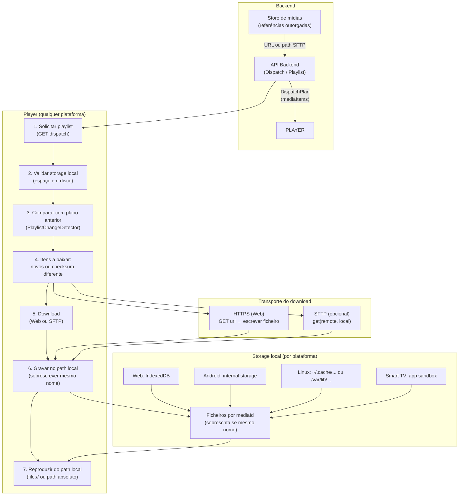
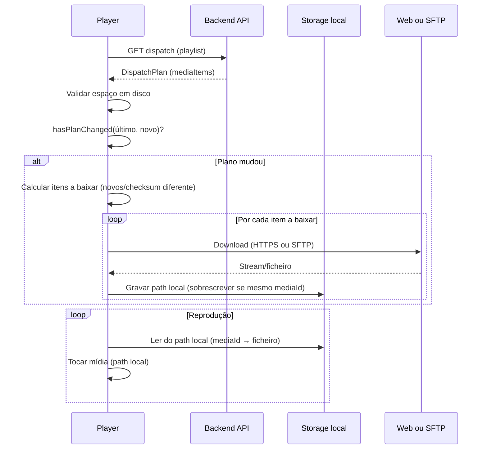

# Design: Players por plataforma — storage local e download (Web / SFTP)

Documento de design para alinhar os players de cada plataforma (web, Android, Linux, Smart TVs) às mesmas regras e funcionalidades do **player-web**, com foco em: solicitar playlist, validar storage local, sobrescrever mídias de mesmo nome, detectar alterações e realizar download (Web ou SFTP). As mídias passam a ser reproduzidas a partir do **path local** após o download.

---

## 1. Regras e funcionalidades (espelho do web-player)

As mesmas regras do player-web devem valer para todos os players (Android, Linux, webOS, Tizen, etc.):

| Regra | Descrição |
|-------|-----------|
| **Solicitar playlist** | Player obtém o DispatchPlan (playlist) via API do backend (referências outorgadas ao totem/UIN). |
| **Validar storage local** | Antes de baixar, verificar espaço em disco (ou quota) e garantir que há espaço para as mídias da playlist. |
| **Sobrescrita por nome** | Mídias com o mesmo identificador (ex.: `mediaId` ou nome de ficheiro) devem ser **sobrescritas** no storage local, não duplicadas. |
| **Detecção de alteração** | Comparar o plano recebido com o último plano (playlistId, quantidade de itens, ordem, checksums, validade). Só baixar o que for **novo ou alterado**. |
| **Reprodução do path local** | Após o download, a reprodução deve usar **sempre o path local** (ficheiro no disco/armazenamento interno), não streaming direto da URL remota. |

No web-player hoje:
- **Playlist**: `loadDispatchPlan()` → API `/api/player/dispatch` (ou equivalente).
- **Detecção de mudança**: `PlaylistChangeDetector.hasPlanChanged(oldPlan, newPlan)` (playlistId, quantidade, ordem, checksums, validity).
- **Cache**: `MediaCacheManager.processDispatchPlan(plan, apiClient)` → para cada item: se já existe e checksum OK, skip; senão `downloadMedia()` (HTTP) e guarda em IndexedDB; `ensureCacheSpace()` libera espaço se necessário.
- **Reprodução**: primeiro tenta `getCachedMediaBlobURL(mediaId)`; se existir, toca do cache; senão streaming + download em background.

Nas outras plataformas o “cache” será **filesystem** (pasta local), mas a lógica é a mesma.

---

## 2. Fluxo geral (resumo)

1. **Solicitar playlist** → Backend devolve DispatchPlan (lista de `mediaItems` com `mediaId`, `url`, `metadata.checksum`, etc.).
2. **Validar storage** → Verificar espaço livre; se necessário, remover mídias antigas (LRU ou fora da playlist atual) até haver espaço.
3. **Comparar com plano anterior** → Se o plano mudou (IDs, ordem, checksums), determinar **quais itens baixar** (novos ou com checksum diferente).
4. **Download** → Para cada item a baixar: obter ficheiro via **Web (HTTPS)** ou **SFTP** (conforme configuração); gravar no **path local** com nome estável (ex.: `mediaId` ou nome normalizado); **sobrescrever** se já existir.
5. **Reprodução** → Para cada item, tocar a partir do **path local** (file:// ou path absoluto no app). Se o ficheiro ainda não existir localmente, opcional: streaming uma vez + download em background para a próxima.

---

## 3. Onde gravar (storage local por plataforma)

| Plataforma | Storage local típico | Observação |
|------------|----------------------|------------|
| **Web (browser)** | IndexedDB (como hoje) | Mantido; ou futuramente File System Access / pasta fixa se PWA. |
| **Android (totem)** | Armazenamento interno do app (ex.: `getFilesDir()` / `getCacheDir()` ou diretório dedicado em internal storage). | Evitar SD externo para não depender de montagem. |
| **Linux (totem/Electron)** | Diretório configurável, ex.: `~/.cache/smartsignage/media` ou `/var/lib/smartsignage/media`. | Permissões e quota por utilizador ou por serviço. |
| **Smart TV (webOS/Tizen)** | Armazenamento interno da TV (path fornecido pela API da plataforma, ex.: app sandbox). | Limites de quota; validar espaço antes de baixar. |

Em todos os casos:
- Um **path base** configurável (ex.: `storagePath` ou `mediaRootDir`).
- Subpasta ou prefixo por UIN/totem se múltiplos perfis no mesmo dispositivo.
- Ficheiros nomeados segundo a **convenção de nomes** definida na secção 4.

---

## 4. Convenção de nomes de ficheiro no storage

Para que todas as plataformas gravem e leiam as mídias de forma consistente e permitam **sobrescrever** quando o mesmo item for atualizado, usa-se uma convenção de nome de ficheiro **estável e previsível**.

### 4.1 Formato padrão: `{mediaId}.{ext}`

- **Regra**: O ficheiro no storage local deve ser nomeado **`{mediaId}.{ext}`**, onde:
  - `mediaId` é o identificador único do item (ex.: número ou string definida pelo backend).
  - `ext` é a extensão do ficheiro (ex.: `mp4`, `jpg`, `png`), derivada do tipo de mídia ou da URL.

- **Sobrescrita**: Dois itens com o mesmo `mediaId` devem corresponder ao **mesmo ficheiro**. Ao gravar, o player **sobrescreve** o ficheiro existente (não cria `mediaId (1).mp4`).

- **Exemplos**:
  - `42.mp4`  → vídeo com `mediaId === 42`
  - `42.jpg`  → imagem com `mediaId === 42` (se a mesma campanha trocar vídeo por imagem, o nome base é o mesmo; a extensão muda e o ficheiro antigo pode ser removido ou sobrescrito conforme política)
  - `fb-propagandas-3.mp4` → item de fallback com `mediaId === 'fb-propagandas-3'`

### 4.2 Onde fazer a sanitização: na origem (backend / banco)

**Recomendação:** A sanitização do identificador usado no nome do ficheiro deve ser feita **na origem** — no **backend** e, quando aplicável, já ao persistir no **banco** — de modo que o valor fique correto desde o início e todos os players recebam um `mediaId` (ou `storageKey`) já seguro, sem precisar sanitizar em cada plataforma.

- **Backend ao construir o DispatchPlan**: Ao montar a resposta da API (playlist para o totem), o backend deve enviar um identificador já seguro para uso em ficheiro. Por exemplo:
  - Para mídias da BD: `media_id` é inteiro → a string `String(media_id)` é sempre segura (ex.: `"42"`). Nenhuma alteração necessária.
  - Para itens de fallback ou compostos: ao gerar o `mediaId` em string (ex.: `fb-propagandas-0`), gerar já com caracteres permitidos (ex.: `fb_propagandas_0` ou manter hífen, que é permitido); nunca incluir espaços, `/`, `\`, etc.
- **Banco (opcional, para o futuro)**: Se existir ou for criado um campo “storage key” ou “slug” na tabela de mídias (ex.: para nomes amigáveis), esse valor deve ser sanitizado no backend **ao criar ou atualizar** o registo (INSERT/UPDATE), de forma a ficar correto no banco desde o início.
- **Frontend (upload/criação)**: Se o frontend enviar um nome ou identificador que venha a ser usado como parte do nome de ficheiro no storage, o backend deve sanitizar esse valor ao processar o pedido (antes de gravar na BD ou de o incluir no DispatchPlan). Assim a regra fica centralizada no backend.

Com isso, os **players** (web, Android, Linux, Smart TVs) apenas **utilizam** o `mediaId` (ou `storageKey`) recebido na API; não precisam de lógica de sanitização, reduzindo duplicação e risco de inconsistência.

### 4.3 Regras da sanitização (aplicadas no backend)

O `mediaId` (ou o campo usado como base do nome do ficheiro) pode ser numérico ou string. Quando for string, a sanitização no backend deve seguir:

- **Caracteres permitidos**: apenas `[a-zA-Z0-9_-]`. Qualquer outro (espaços, `/`, `\`, `..`, etc.) deve ser substituído por `_` ou removido.
- **Comprimento**: limitar o tamanho (ex.: primeiros 200 caracteres) para respeitar limites do filesystem (ex.: 255 bytes).
- **Exemplo (pseudo-código no backend)**:
  - `storageKey = sanitizeForStorage(mediaId)`
  - `sanitizeForStorage(id)`: se for número, `String(id)`; se for string, substituir `[^a-zA-Z0-9_-]` por `_` e truncar se necessário.

Assim, o path final em qualquer player fica sempre dentro de `{storagePath}/{fileName}` sem risco de path traversal.

### 4.4 Obtenção da extensão (`ext`)

A extensão deve ser obtida por ordem de prioridade:

1. **Metadados do item**: se `mediaItem.metadata?.mimeType` ou `mediaItem.metadata?.extension` existir, mapear para extensão (ex.: `video/mp4` → `mp4`, `image/jpeg` → `jpg`).
2. **URL**: se `mediaItem.url` tiver extensão (ex.: `.../file.mp4`), usar essa extensão.
3. **Tipo de mídia**: se `mediaItem.mediaType === 'video'` usar `mp4` por defeito; se `image` usar `jpg` por defeito.
4. **Fallback**: `bin` ou `dat`.

**Mapa MIME → extensão sugerido:**

| MIME type        | ext  |
|------------------|------|
| video/mp4        | mp4  |
| video/webm       | webm |
| video/ogg        | ogv  |
| image/jpeg       | jpg  |
| image/png        | png  |
| image/gif        | gif  |
| image/webp       | webp |

### 4.5 Path completo no storage

- **Path base**: configurável por plataforma (ex.: `mediaRootDir`, `storagePath`).
- **Path do ficheiro**: `{pathBase}/{fileName}` ou `{pathBase}/{uin}/{fileName}` se houver múltiplos totens no mesmo dispositivo.
- **Resolução para reprodução**: dado o `mediaId` (ou `storageKey`) já recebido da API — sanitizado no backend —, o player forma `fileName = mediaId + '.' + ext`. A extensão pode ser guardada num índice local ao fazer o download. Alternativa: ao gravar, guardar um mapa `mediaId → path absoluto` no storage. Os players não precisam de sanitizar; só concatenar extensão.

### 4.6 Resumo da convenção

| Regra | Implementação |
|-------|----------------|
| Nome do ficheiro | `{sanitize(mediaId)}.{ext}` |
| Sobrescrita | Sempre que gravar com o mesmo `mediaId`, sobrescrever o ficheiro existente. |
| Extensão | Prioridade: metadata → URL → mediaType → `bin`. |
| Sanitização | Feita **no backend** (e no banco ao persistir); apenas `[a-zA-Z0-9_-]`; resto → `_`. Players usam o valor já correto. |

---

## 5. Como fazer o download: Web (HTTPS) vs SFTP

**Decisão aplicada:** O método de download **padrão** em todas as plataformas é **Web (HTTPS)**. O mesmo fluxo do web-player (GET na URL do backend, gravar no storage local) deve ser usado por Android, Linux e Smart TVs. SFTP fica como canal **opcional** e configurável numa fase posterior.

### 5.1 Web (HTTPS) — padrão obrigatório

- **Padrão**: Todas as plataformas utilizam **HTTPS como método de download por defeito**. Não exige porta 22, funciona em qualquer rede (NAT, firewall, DMZ), com TLS integrado.
- **Alinhamento**: Mesma API que o web-player usa hoje: `mediaItem.url` ou endpoint `/api/player/media?mediaId=...` (com UIN/token).
- **Fluxo**: Backend expõe as mídias via URL; o player faz `GET`, grava o corpo da resposta no ficheiro local com o nome definido pela convenção (ex.: `{mediaId}.mp4`). Sobrescreve se já existir.
- **Uso**: Totens em loja, TVs em rede corporativa, ambientes sem SFTP — um único fluxo para todas as plataformas.

### 5.2 SFTP (Secure FTP) — opcional (fase posterior)

- **Opcional**: SFTP é um canal **alternativo** configurável (ex.: config `useSftp` ou `downloadTransport: "sftp"`). Só é usado quando explicitamente configurado.
- **Vantagens**: Redes onde o acesso é apenas por SFTP; integração com sistemas de ficheiros existentes.
- **Requisitos**: Backend (ou serviço) expõe acesso SFTP às mídias; player precisa de credenciais e path remoto. O path local de gravação segue a **mesma convenção de nomes** que no download Web.

### 5.3 Implementação

- **Fase 1 (atual)**: Apenas **download via Web (HTTPS)** em todas as plataformas. Fluxo único e alinhado ao web-player.
- **Fase 2**: SFTP como canal alternativo; o player escolhe conforme config: Web (`GET url` → path local) ou SFTP (`get(remote, local)` → mesmo path local).

Em ambos os casos, a **reprodução** é sempre a partir do **path local** após o download.

---

## 6. Diagrama do fluxo (Mermaid)

---

## 7. Diagrama simplificado (visão sequencial)

---

## 8. Pontos de implementação (checklist conceptual)

- [ ] **API de playlist**  
  Manter ou expor endpoint que devolve o DispatchPlan (referências outorgadas ao totem). Cada `mediaItem` deve ter pelo menos: `mediaId` (ou `storageKey`) **já sanitizado para uso em ficheiro**, `url` (para Web), opcionalmente `sftpPath`/credenciais se SFTP for suportado, `metadata.checksum`, `metadata.size`.

- [ ] **Sanitização na origem (backend)**  
  Ao construir o DispatchPlan (e ao criar/atualizar mídias ou qualquer campo que venha a ser usado como nome de ficheiro): aplicar `sanitizeForStorage(id)` para que o valor fique correto no banco e na API desde o início; os players não sanitizam.

- [ ] **Validação de storage**  
  Em cada plataforma: obter espaço livre; estimar tamanho necessário para a playlist; se insuficiente, remover mídias antigas (LRU ou que não estejam no plano atual) até haver espaço; só então iniciar downloads.

- [ ] **Convenção de nomes e sobrescrita**  
  Usar `{mediaId}.{ext}` no storage local (ver secção 4). O **backend** deve enviar `mediaId` (ou `storageKey`) já **sanitizado** na API (e no banco ao persistir); os players só concatenam a extensão. Extensão a partir de metadata/URL/mediaType. Ao gravar, sempre **sobrescrever** o ficheiro existente com o mesmo `mediaId`.

- [ ] **Detecção de alteração**  
  Reutilizar a mesma lógica do `PlaylistChangeDetector`: comparar `playlistId`, quantidade, ordem, `mediaId`, `checksum` por item, validade. Só marcar como “a baixar” os itens novos ou com checksum diferente.

- [ ] **Download Web (HTTPS) — padrão**  
  Em todas as plataformas, o download é por defeito via **Web (HTTPS)**: GET na URL (ou endpoint com `mediaId` + auth); escrever resposta no path local com nome `{mediaId}.{ext}`; validar tamanho/checksum se disponível; sobrescrever se já existir.

- [ ] **Download SFTP (opcional)**  
  Configuração (host, port, user, key/password, path remoto base). Por item: path remoto derivado de `mediaId` ou URL; `get(remote, local)`; sobrescrever ficheiro local.

- [ ] **Reprodução do path local**  
  Após download (ou se já existir), o player usa **apenas** o path local para reproduzir (vídeo/imagem). Fallback: se não existir ainda (ex.: primeiro sync), pode usar streaming uma vez e gravar em background para a próxima.

Este documento serve como referência para a implementação da feature nas várias plataformas (player-web já segue este fluxo; Android, Linux e Smart TVs devem espelhar as mesmas regras, com storage em disco e opção de download Web ou SFTP).
