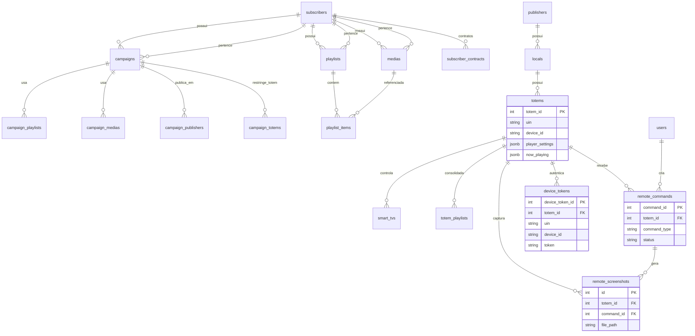

# Modelo ER — Mídias, campanhas, totens e Smart TVs

Documento de referência para o **modelo de dados** e os **fluxos** usados para gerir mídias em **totens** e **Smart TVs** no SmartSignage Pro.  
Alinha-se ao **schema definitivo** em `database/smartchannel-db-v2-refactored-part*.sql` e à **carga de demonstração v6** em `database/carga-inicial-v6.sql` (validação: `database/validate-v6.js`).

**Diagrama visual de todo o sistema (PNG):** [`diagrams/SmartSignage-ER-sistema-completo.png`](./diagrams/SmartSignage-ER-sistema-completo.png) — lista completa de tabelas por ficheiro `part*.sql`; ver também [`diagrams/SmartSignage-ER-sistema-completo-detalhe.png`](./diagrams/SmartSignage-ER-sistema-completo-detalhe.png).

> **Sobre o ZIP** `docs/ModeloERparaGerenciarMídiasEmTvsSmart.zip`: permanece no repositório como **anexo** (diagramas / export). A **fonte de verdade** para o modelo em evolução é o SQL em `database/` + este Markdown (o ZIP pode ficar desfasado entre releases).

---

## 1. Visão geral

| Conceito | Descrição |
|----------|-----------|
| **Subscriber** | Dono das mídias, playlists e campanhas (`subscribers`). |
| **Publisher** | Dono dos locais, totens e da infraestrutura física (`publishers`). |
| **Totem** | Ponto de exibição / dispositivo de campo (`totems` → `locals` → `publishers`); espelho Player-AD em `player_settings` / `now_playing`. |
| **Smart TV** | Ecrã ligado a um totem (relação **1 totem : N TVs**, `smart_tvs.totem_id`). |
| **Mídia** | Ficheiro metadado em `medias` (sempre com `subscriber_id`). |
| **Campanha** | Agrega conteúdo e regras de exibição (`campaigns`). |
| **Playlist** | Lista ordenada de mídias (`playlists` + `playlist_items`). |
| **Controlo remoto** | Comandos e capturas (`remote_commands`, `remote_screenshots`) + sessão do player (`device_tokens`). |

O **dispatcher** escolhe campanhas elegíveis para um `totemId` e gera um **plano de reprodução** (JSON) consumido pelos players (`GET /api/player/dispatch`, ver `backend/src/routes/player.ts`).

---

## 2. Tabelas centrais (resumo)

### 2.1 Conteúdo do assinante

- **`medias`**: ficheiros (vídeo/imagem/HTML…), `subscriber_id`, estado (`status`, `is_active`).
- **`playlists`**: conjuntos reutilizáveis, `subscriber_id`.
- **`playlist_items`**: ordem e duração por mídia dentro da playlist.

### 2.2 Campanha e ligações N:N

Definidas em `database/smartchannel-db-v2-refactored-part5-tables-relationships.sql`:

| Tabela | Função |
|--------|--------|
| **`campaigns`** | Campanha (`subscriber_id`, datas, `contract_id`, etc.). |
| **`campaign_playlists`** | Campanha ↔ playlist (prioridade, `metadata` JSONB). |
| **`campaign_medias`** | Campanha ↔ mídia **direta** (sem playlist), com `order_index`, `display_seconds`, `metadata`. |
| **`campaign_publishers`** | Campanha ↔ publisher (forma “por grupo” / contrato-plano). |
| **`campaign_totems`** | Campanha ↔ totem (restrição explícita de destino). |
| **`campaign_locals`** | Campanha ↔ local (quando aplicável). |

### 2.3 Infraestrutura do publisher

- **`locals`**: locais físicos do publisher.
- **`totems`**: dispositivos por `local_id`. Colunas relevantes para Player-AD / admin remota:
  - `uin`, `device_id`, `status`, `last_heartbeat`
  - **`player_settings`** (JSONB): espelho da config do player (`displayRotation`, `screenOrientation`, `kioskMode`, …)
  - **`now_playing`** (JSONB): última mídia em reprodução reportada no heartbeat
- **`smart_tvs`**: TVs associadas ao totem (`totem_id`), plataforma (`webOS`, `Tizen`, `Android TV`, …), `orientation` landscape/portrait.

### 2.4 Controlo remoto, autenticação do player e OTA

Definidas sobretudo em `database/smartchannel-db-v2-refactored-part6-tables-other.sql`:

| Tabela | Função |
|--------|--------|
| **`remote_commands`** | Fila de comandos ao totem (`screenshot`, `apply_player_config`, `refresh_dispatch`, `purge_cache`, `restart_app`, …). |
| **`remote_screenshots`** | Capturas de ecrã enviadas pelo Player-AD (`file_path`, opcionalmente ligadas a `command_id`). |
| **`device_tokens`** | Token HMAC / sessão do player (`uin`, `device_id`, `platform`, heartbeat). |
| **`ota_updates`** / **`totem_update_status`** | Pacotes OTA e estado de atualização por totem. |

---

## 3. Diagrama ER (Mermaid)

> Sintaxe simplificada: cardinalidades indicativas. FKs completas estão no SQL das `part7` (foreign keys).

---

## 4. Duas formas de a campanha chegar ao totem

Documento detalhado: [`duas-formas-propaganda-chegar-ao-totem.md`](./duas-formas-propaganda-chegar-ao-totem.md).

- **Forma 1**: contrato/plano → `plan_publisher_access` → publishers → locais → totens; campanha ligada em `campaign_publishers`.
- **Forma 2**: `campaign_totems` — restrição explícita a totens (aba Totens na UI).

---

## 5. Dispatch: playlist + mídias diretas da campanha

Na geração do plano para o player, o serviço **`DispatcherTotemService`** consolida:

1. Itens vindos de **`playlist_items`** (playlist da campanha vencedora).
2. Itens vindos de **`campaign_medias`** (mídias diretas da mesma campanha).

Regras gerais:

- Filtro de mídias ativas e aprovadas/publicadas (alinhado às queries do serviço).
- **Deduplicação** por `media_id` com ordem determinística (`order_index`, origem playlist vs campanha).
- Metadados do plano podem incluir contagens `playlistItemsCount`, `campaignMediaCount`, `mergedItemsCount` (ver `backend/src/types/dispatcherTotem.types.ts`).

Isto garante que campanhas com **só mídias diretas** ou **playlist + extras** produzem lista coerente para o player.

---

## 6. Smart TV vs totem

- O **player liga-se ao totem** (identificador/UIN no fluxo de registro e dispatch).
- **`smart_tvs`** regista ecrãs sob o totem (inventário, heartbeat, capacidades).
- Agendamentos específicos por ecrã podem usar tabelas como **`totem_playlists`** com `smart_tv_id` quando o schema prevê segmentação por TV (ver comentários em `part5`).

---

## 7. Player-AD: orientação, config remota e screenshot

Alinhado ao plano em [`PLANO-TOTEM-ORIENTACAO-CONFIG-REMOTA-SCREENSHOT.md`](./PLANO-TOTEM-ORIENTACAO-CONFIG-REMOTA-SCREENSHOT.md) e ao schema `totems` / `remote_*`:

| Fluxo | Tabelas / campos |
|-------|------------------|
| Montagem do painel no player | Config local do app + espelho em `totems.player_settings` (`displayRotation` / `screenOrientation`) |
| Comando remoto (config, sync, captura) | `remote_commands` (`apply_player_config`, `screenshot`, `refresh_dispatch`, …) |
| Preview no painel web | `remote_screenshots` (ficheiro no storage do servidor) |
| Presença / token | `device_tokens` + `totems.last_heartbeat` / `now_playing` |

Defaults de kit de instalação (exemplo): `uin=T1000`, `deviceId=T1000-Exterminator` — ver `install-pendrive/config/exemplo-player-config.json`.

---

## 8. Leituras relacionadas

| Documento | Tema |
|-----------|------|
| [`duas-formas-propaganda-chegar-ao-totem.md`](./duas-formas-propaganda-chegar-ao-totem.md) | Elegibilidade campanha ↔ totem |
| [`cadastro-atrelar-campanha-totem.md`](./cadastro-atrelar-campanha-totem.md) | UI: abas Publicadores / Totens |
| [`analise-dispatcher-midias-vazias-e-duplicados.md`](./analise-dispatcher-midias-vazias-e-duplicados.md) | Mix e listas vazias |
| [`PLANO-TOTEM-ORIENTACAO-CONFIG-REMOTA-SCREENSHOT.md`](./PLANO-TOTEM-ORIENTACAO-CONFIG-REMOTA-SCREENSHOT.md) | Orientação, admin remota, screenshot |
| [`platform/06-totemdigital-monousuario-er-e-fluxo.md`](./platform/06-totemdigital-monousuario-er-e-fluxo.md) | ER Pro vs TotemDigital monousuário |
| [`INTEGRACAO_SCHEMA_PRINCIPAL.md`](./INTEGRACAO_SCHEMA_PRINCIPAL.md) | Política schema sem migrations paliativas |
| [`README_INSTALACAO_SERVIDOR.md`](./README_INSTALACAO_SERVIDOR.md) | Instalação |
| [`PORTAS_E_SERVICOS_EXCLUSIVOS.md`](./PORTAS_E_SERVICOS_EXCLUSIVOS.md) | Portas e serviços |

---

## 9. Evolução e validação (v6)

- **Seeds / dados demo:** `database/carga-inicial-v6.sql`
- **Validação pós-instalação:** `node database/validate-v6.js` (requer `pg`; pode usar `NODE_PATH` apontando para `backend/node_modules`)
- **Regenerar PNG ER:** `python scripts/generate-er-system-png.py --detalhe` (requer Graphviz `dot`)

Desenvolvimento: apenas árvore principal (`backend/`, `frontend/`, `database/`, `scripts/`). Cópias paralelas `ssp-clean` e `client_v2` foram removidas do repositório.

---

**Última revisão:** julho de 2026.
