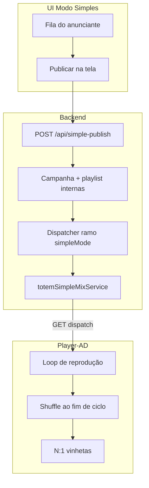

# Modo simples — totem com mix multi-anunciante

Data: 2026-06-23  
Estado: **F1–F4 + F2/F3/F5 parcial** — mix round-robin com flag `totem.simple_mode_enabled`, API `POST /api/simple-publish`, UI oculta campanhas no modo simples, shuffle no player v1.22.

## Objetivo

Permitir que **vários anunciantes** publiquem no **mesmo totem** com experiência simples:

- O operador escolhe **tela + conteúdo** (fila do anunciante).
- O sistema monta **uma programação única** na tela, misturando todos os anunciantes elegíveis.
- **Sem agendamento** visível (hora, dias, vigência na UI do modo simples).
- **Vinhetas** entram pela regra híbrida já existente (globais no dispatch + N:1 no player).
- Ao **terminar um ciclo completo** de reprodução, a ordem é **embaralhada** para a próxima volta não ser monótona.

> Princípio de produto: *não simplificar a arquitetura; simplificar a oferta.*  
> Campanha, playlist e dispatcher continuam existindo **por baixo**, automáticos e invisíveis.

---

## O que o usuário vê vs o que o sistema faz

| Superfície (modo simples) | Bastidor (automático) |
|---------------------------|------------------------|
| Anunciante publica mídias numa **fila** | Playlist interna por `subscriber_id` |
| Escolhe **totem(ns)** | `campaign_totems` + elegibilidade contrato/plano |
| Botão **Publicar** | Campanha interna `status=active`, sem UI de campanha |
| Tela toca “tudo que está publicado” | Dispatcher gera **plano mix** `source: mix` |
| (Opcional) ordem da fila do anunciante | Ordem **dentro** do anunciante respeitada |
| — | Ordem **entre** anunciantes: round-robin + shuffle por ciclo |

---

## Regras de programação

### 1. Elegibilidade (quem entra no totem)

Um anunciante entra no mix do totem `T` quando:

1. Tem **contrato ativo** cujo plano permite o **publisher** do totem (`plan_publisher_access`).
2. Tem conteúdo **publicado** (mídia `approved`/`published` na fila interna).
3. Está **vinculado ao totem** (publicação simples grava `campaign_totems` ou equivalente).
4. No modo simples: **ignorar** validação temporal de hora/dias na UI; no bastidor, campanhas internas podem usar vigência “aberta” (sem janela restritiva).

Não entra: campanha sem mídia, contrato expirado, totem inativo.

### 2. Mix entre anunciantes (entre filas)

**Default:** round-robin justo entre anunciantes.

```
Anunciante A: [a1, a2, a3]
Anunciante B: [b1, b2]
Anunciante C: [c1]

Ordem base (1º ciclo): a1 → b1 → c1 → a2 → b2 → a3 → (repete pools conforme necessário)
```

- **Dentro** de cada anunciante: ordem da fila (cronológica / `order_index`).
- **Entre** anunciantes: intercalar uma peça de cada fila por vez; quando uma fila esgota, os restantes continuam em round-robin.
- **Não** “só o vencedor” (estratégia SINGLE/PRIORITY do motor clássico).
- **Não** blocos eternos de um só anunciante.

Reutilizar lógica próxima de `interleaveMixItemPools` / `expandMixItemsForPlaybackCycle` (`backend/src/utils/mixPlaybackCycle.ts`), aplicada por **subscriber_id** em vez de diretas vs playlist.

### 3. Dentro de um anunciante (playlist + diretas)

Se a campanha interna tiver playlist **e** mídias diretas, manter regra actual:

- **N diretas : 1 playlist** (`fallbackPropagandasPerVinheta`, default 3).

### 4. Vinhetas

Sem mudar o modelo híbrido actual:

| Camada | Papel |
|--------|--------|
| **Dispatch (servidor)** | Injeta vinhetas globais no plano (`dispatchVinhetaEnrichment`) |
| **Player** | Reaplica mix N propagandas : 1 vinheta (`applyVinhetaMixToDispatchPlan`) |

No shuffle por ciclo: embaralhar **propagandas**; depois **reaplicar** regra N:1 de vinhetas (vinhetas não precisam do mesmo shuffle).

### 5. Shuffle ao fim de cada ciclo

**Gatilho:** quando o player percorre todos os itens do plano e volta ao índice 0 (ciclo completo).

**Comportamento:**

1. Mantém o **mesmo conjunto** de mídias (até o próximo dispatch em `maxSecondsWithoutServerCheck`).
2. **Reordena aleatoriamente** as propagandas, preservando:
   - regra de vinhetas (reaplicar após shuffle);
   - opcional: evitar duas peças seguidas do **mesmo** anunciante (configurável).
3. **Não** pedir novo dispatch só por fim de ciclo (já separado em v1.21: heartbeat 120s, dispatch 600s).

**Onde implementar (recomendado):** **Player-AD** — menos carga no servidor; variedade local por box.

Alternativa: servidor envia `shuffleSeed` ou `reshuffleEachCycle: true` no metadata do plano.

### 6. Sem agendamento (UI)

No modo simples **não exibir**:

- hora início/fim do dia;
- dias da semana;
- vigência manual na publicação.

No bastidor, campanhas auto-criadas podem usar:

- `start_date` = agora ou null;
- `end_date` = null ou far future;
- `start_time` / `end_time` / `days_of_week` = null (sempre válido).

O motor clássico continua disponível no **modo avançado** (Studio completo).

---

## Diferença em relação ao motor actual (2026-06)

Hoje (`dispatcherTotemService.decideStrategy`):

| Cenário | Hoje | Modo simples |
|---------|------|----------------|
| 1 candidato válido | SINGLE → 1 campanha | Mix com 1 anunciante (ok) |
| Vários, prioridade diferente | PRIORITY → 1 vencedor | **Sempre mix** se modo simples no totem |
| Vários, mesmo subscriber | PRIORITY ou mix interno | Fila única do anunciante |
| Vários subscribers | MIX se regras baterem | **Sempre mix** round-robin |
| JSON `source` | `direct` / `campaign` / `mix` | `mix` + `metadata.simpleMode: true` |
| Fim de ciclo | Repete mesma ordem | Shuffle local |

O JSON que o utilizador viu (`source: "direct"`, 1 campanha, 1 mídia) é o fluxo **clássico SINGLE**, não o modo simples.

---

## Arquitetura proposta



### Backend

1. **Flag por totem ou instalação:** `simple_mode_enabled` (settings ou `totems.metadata`).
2. **`totemSimpleMixService`** (novo):
   - Lista anunciantes elegíveis + filas consolidadas;
   - Round-robin entre subscribers;
   - Dentro de cada um: `getConsolidatedDispatchItems` ou fila dedicada;
   - Expande ciclo (`expandMixItemsForPlaybackCycle`);
   - Devolve plano `source: 'mix'`, `metadata.simpleMode: true`, `metadata.subscriberIds`.
3. **`dispatcherTotemService`:** se totem em modo simples e há ≥1 anunciante com mídia → **sempre** ramo simple mix (não SINGLE/PRIORITY).
4. **`simplePublishService`:** wrap de `quickPublish` / fila — cria/atualiza campanha interna oculta, `campaign_totems`, invalida cache dispatch.

### Player-AD

1. Após ciclo completo (`index == 0` após percorrer lista): `shufflePropagandasPreserveVinhetas(plan)`.
2. Config opcional: `shuffleEachCycle: true` (default true em modo simples detectado via `plan.metadata.simpleMode`).

### Frontend

1. Fluxo **Publicar** (já próximo de Quick Publish) sem ecrãs de campanha.
2. Esconder campanha/playlist/agendamento quando `installationCapabilities.simpleTotemMode`.
3. Fila por anunciante: drag-and-drop ordem → `playlist_items.order_index`.

---

## Contrato JSON do plano (modo simples)

Campos adicionais sugeridos em `plan.metadata`:

```json
{
  "simpleMode": true,
  "mixStrategy": "round_robin_subscribers",
  "subscriberIds": [3, 5, 7],
  "shuffleEachCycle": true,
  "itemsPerAdvertiser": { "3": 2, "5": 1, "7": 4 }
}
```

`mediaItems[]` pode incluir `metadata.subscriberId` e `metadata.campaignId` para debug e shuffle justo.

---

## Fases de implementação

| Fase | Entrega | Dependência |
|------|---------|-------------|
| **F1** | `totemSimpleMixService` + ramo dispatcher `simpleMode` | Flag totem |
| **F2** | `simplePublishService` + API | F1 |
| **F3** | UI esconde campanha; publicação = fila + totem | F2 |
| **F4** | Player shuffle ao fim de ciclo | F1 (metadata) |
| **F5** | Testes + painel candidatos mostra “modo simples” | F1–F4 |

---

## Critérios de aceite

1. Dois anunciantes publicam no mesmo totem → dispatch com **≥2 subscribers** e **≥2 itens** intercalados.
2. Terceiro anunciante publica → próximo dispatch inclui o novo sem reconfigurar campanha manual.
3. Fim de um ciclo completo → ordem diferente na volta seguinte (com mesmas mídias).
4. Vinhetas respeitam N:1 após shuffle.
5. UI modo simples não pede horário nem dias da semana.
6. Modo avançado (Studio) inalterado.

---

## Referências no repositório

- `backend/src/services/dispatcherTotemService.ts` — `decideStrategy`, `generateDispatchPlan`
- `backend/src/services/totemPlaylistMixService.ts` — mix clássico (AI, pesos)
- `backend/src/utils/mixPlaybackCycle.ts` — intercalação e expansão de ciclo
- `backend/src/services/quickPublishService.ts` — publicação rápida actual
- `Player-AD/.../PlayerController.kt` — loop, heartbeat, dispatch, vinhetas
- `docs/duas-formas-propaganda-chegar-ao-totem.md` — elegibilidade
- `docs/PRODUCT_VISION_TOTEM_DIGITAL_V3X.md` — visão produto
