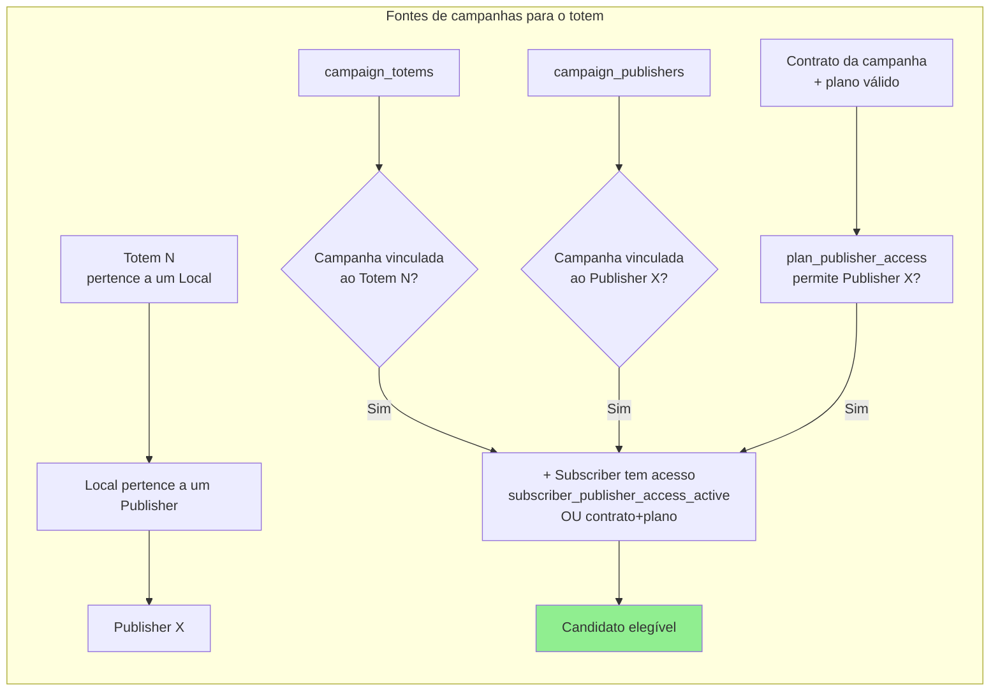
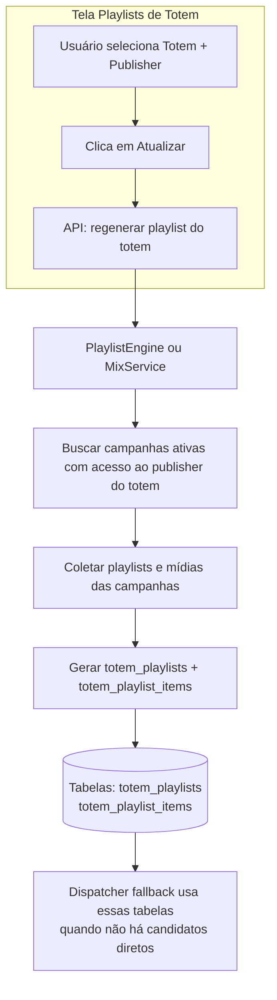
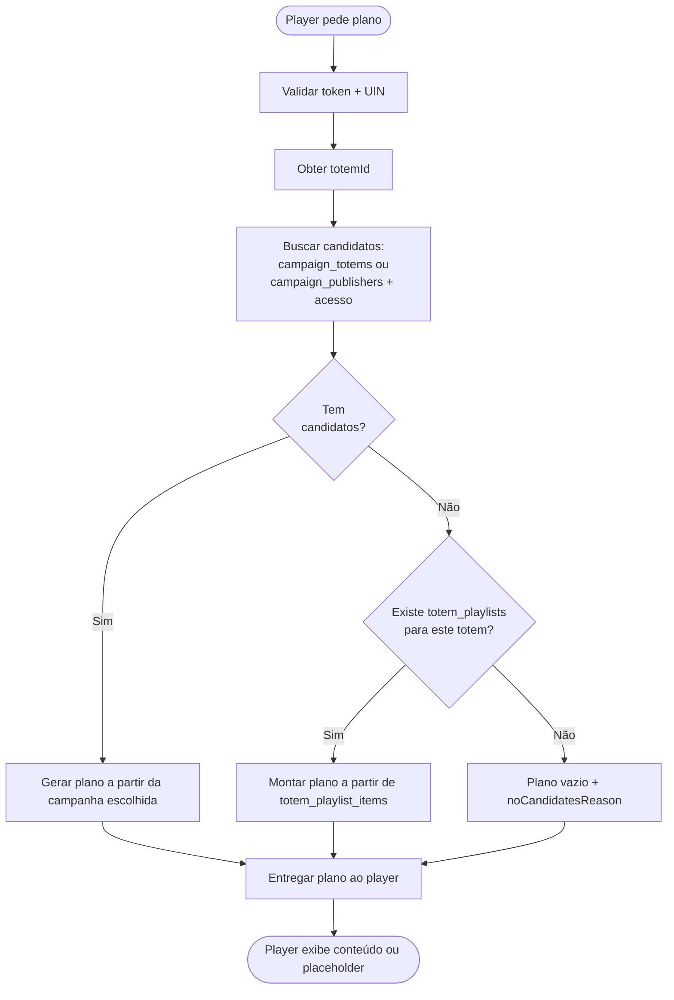

# Fluxograma: Do pedido do player ao conteúdo exibido

Este diagrama mostra como o **player** obtém o plano de exibição (playlist/mídias) para um totem, desde o pedido até a decisão de qual conteúdo usar.

---

## 1. Fluxo principal – Dispatch Plan

```mermaid
flowchart TD
    subgraph Player["🎬 Player (UIN = td-academia)"]
        A[Player solicita plano] --> B[GET /api/player/dispatch?uin=td-academia&token=...]
    end

    B --> C[Backend: validar token e UIN]
    C --> D[Resolver totemId pelo UIN<br/>ex: td-academia → totemId 10]
    D --> E[Dispatcher: dispatch(totemId, timestamp)]

    subgraph Dispatcher["⚙️ Dispatcher (motor de decisão)"]
        E --> F{Candidatos<br/>encontrados?}
        F -->|Sim| G[getCandidateSchedules]
        G --> H[Campanhas via campaign_totems<br/>OU campaign_publishers<br/>+ acesso subscriber ao publisher]
        H --> I[Para cada campanha: buscar playlists<br/>campaign_playlists → playlist_items → medias]
        I --> J[Validar regras comerciais e temporais]
        J --> K[Resolver conflitos / prioridade]
        K --> L[Gerar DispatchPlan com mediaItems]
        L --> M[Retornar plano ao player]

        F -->|Não| N[Tentar fallback]
        N --> O{Existe playlist<br/>em totem_playlists<br/>para este totem?}
        O -->|Sim| P[getFallbackPlanFromTotemPlaylist]
        P --> Q[Ler totem_playlists + totem_playlist_items<br/>+ medias → montar DispatchPlan]
        Q --> M
        O -->|Não| R[Retornar plano vazio<br/>+ metadata.noCandidatesReason]
        R --> S[Player exibe mensagem / placeholder]
    end

    M --> T[Player recebe mediaItems e exibe conteúdo]
```

---

## 2. De onde vêm os “candidatos”?

O dispatcher considera uma campanha como candidata para um totem se **pelo menos uma** das regras abaixo for verdadeira:

1. **Direto (campaign_totems):** campanha vinculada ao totem + subscriber tem acesso ao publisher.
2. **Por publisher (campaign_publishers):** campanha vinculada ao publisher do totem + subscriber tem acesso (via `subscriber_publisher_access_active` ou contrato+plano).
3. **Por contrato/plano (regra de validade):** campanha tem um **contrato designado**; o **plano** desse contrato está dentro das regras de validade (contrato ativo, datas) e o plano permite o **publisher do totem** (`plan_publisher_access`). Não exige que a campanha esteja em `campaign_publishers`.



---

## 3. Playlist consolidada (tela “Playlists de Totem”)



---

## 4. Resumo em uma página



---

## Como visualizar

- **GitHub:** abra este `.md` no repositório; o Mermaid é renderizado automaticamente.
- **VS Code:** instale a extensão “Markdown Preview Mermaid Support” e abra a pré-visualização deste ficheiro.
- **Online:** copie o bloco de código entre ` ```mermaid ` e ` ``` ` e cole em [mermaid.live](https://mermaid.live).

---

## Legenda rápida

| Elemento | Significado |
|----------|-------------|
| **Candidatos** | Campanhas que o dispatcher considera: vinculadas ao totem, ao publisher do totem (com acesso do assinante), ou cujo contrato designado tem plano válido que permite o publisher do totem. |
| **Fallback** | Quando não há candidatos, usa a playlist já gerada e guardada em `totem_playlists` (tela “Playlists de Totem”). |
| **Plano vazio** | Nenhum candidato e nenhuma playlist consolidada → player recebe `mediaItems: []` e a mensagem em `metadata.noCandidatesReason`. |
