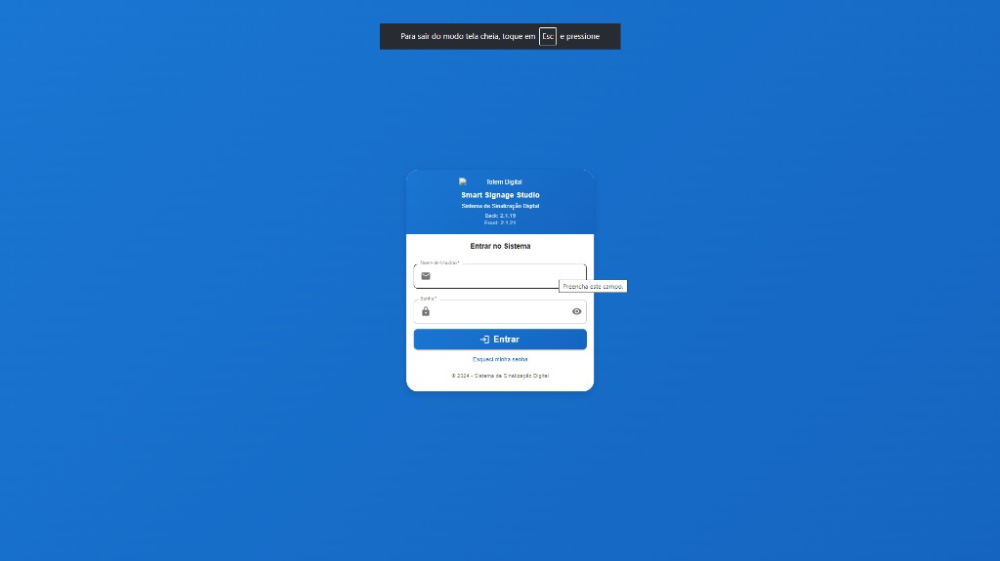
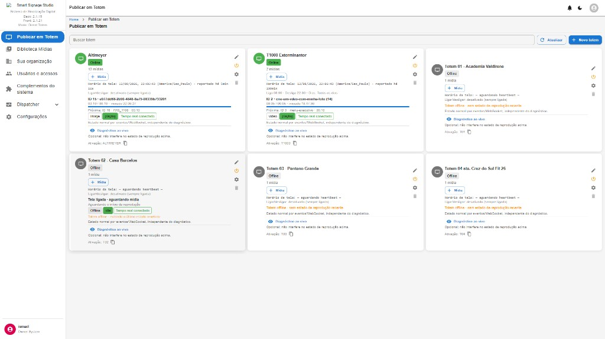
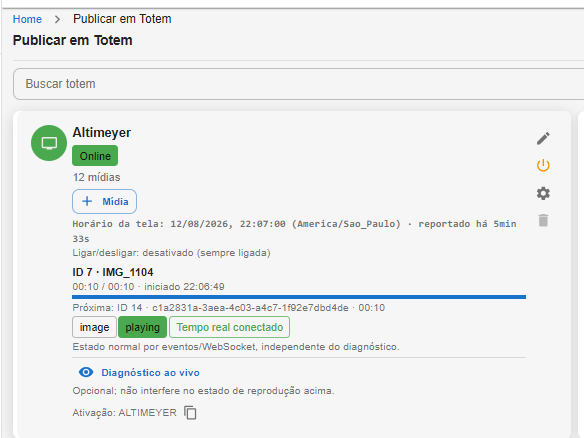
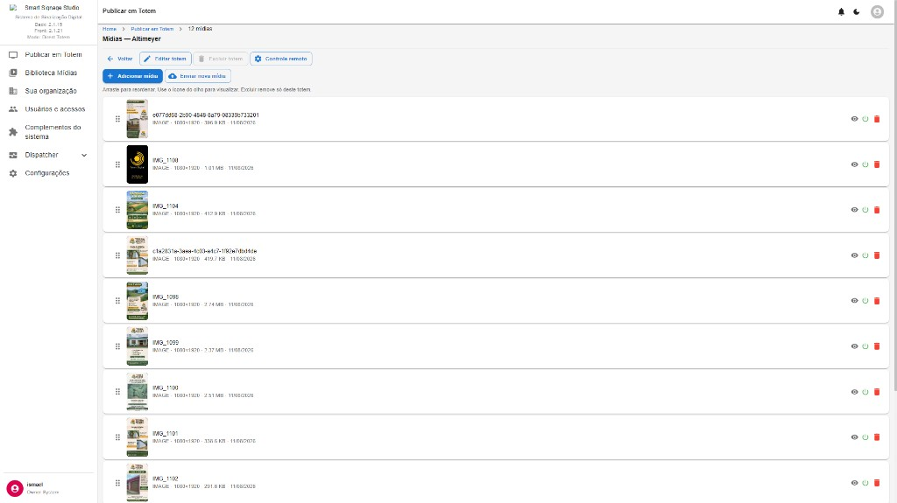
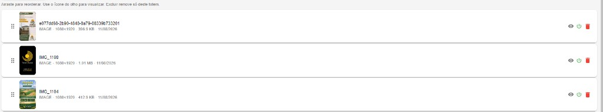
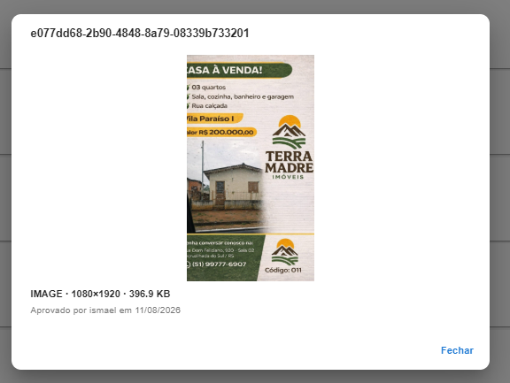
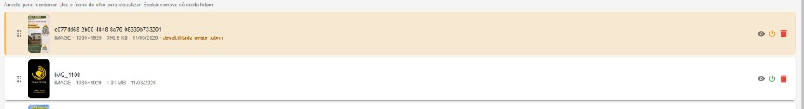
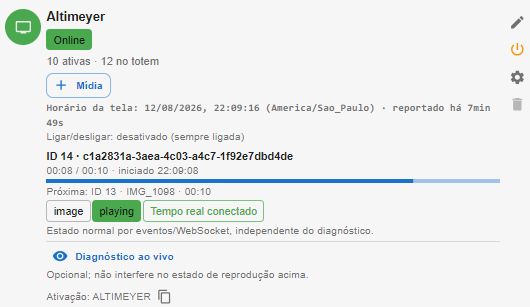
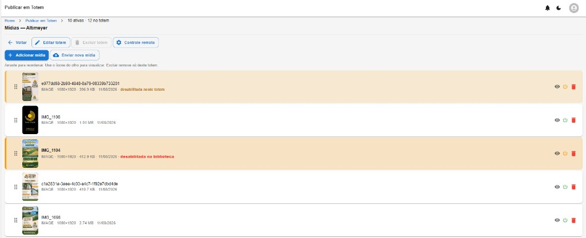

# 08 — Telas: Login e Publicar em Totem

**Modo:** Direct Totem · **Front:** 2.1.21  
**Autor:** Julio Cesar Eyras (J.C.E.) / Eyras Sistemas e Soluções  
**Licença:** proprietária

## 08.1 Login — `/login`

| Campo / acção | Função |
|---|---|
| Nome de utilizador * | Login (não é e-mail obrigatório; o ícone é só visual) |
| Senha * | Palavra-passe; ícone de olho mostra/esconde |
| **Entrar** | Autentica e redirecciona para a home Direct (`Publicar em Totem`) |
| Esqueci minha senha | Recuperação de senha |

**Notas:** campos obrigatórios; validação do browser se vazios. Rodapé ainda mostra «© 2024» (marca antiga — titular canónico é J.C.E. 2026).

---

## 08.2 Publicar em Totem — lista (home Direct)

Home do modo Direct. Cada **card** = um totem.

| Recurso | Função |
|---|---|
| Buscar totem | Filtra pelo nome |
| Actualizar | Recarrega estados (online/offline, now playing) |
| **+ Novo totem** | Cria totem (UIN / activação) |
| Card Online | Verde; mídias; now playing; progresso; tags `playing` / tempo real |
| Card Offline | Cinza; «aguardando heartbeat» |
| + Mídia | Atalho para adicionar conteúdo àquele totem |
| Diagnóstico ao vivo | Telemetria opcional (não bloqueia playback) |
| Código de activação | UIN (ex. `ALTIMEYER`); ícone copiar |
| Ícones no card | Editar · reiniciar/remoto · definições · excluir |

---

## 08.3 Card detalhado (Altimeyer online)

| Dado | Significado |
|---|---|
| Online | Heartbeat / WS activo |
| N mídias | Inventário neste totem |
| Horário da tela | Relógio do aparelho + timezone |
| Reportado há … | Atraso do último relatório |
| Ligar/desligar | Agenda de ecrã (aqui: desactivada = sempre ligada) |
| ID · ficheiro · progresso | Mídia actual |
| Próxima | Próximo item da fila |
| Tempo real conectado | Canal WebSocket OK |

---

## 08.4 Mídias do totem — `Publicar em Totem > N mídias`

| Acção | Função |
|---|---|
| Voltar | Volta à lista de totens |
| Editar totem | Diálogo de config Player-AD (rotação, kiosk, Wi‑Fi remoto, …) |
| Excluir totem | Apaga o totem (pode estar desactivado se houver regras) |
| Controle remoto | Comandos: restart, screenshot, `configure_wifi`, force ecrã, … |
| + Adicionar mídia | Escolhe da biblioteca |
| Enviar nova mídia | Upload directo para este totem |
| Arrastar | Reordena a playlist do totem |
| Olho | Pré-visualização |
| Interruptor | Activa / desactiva **só neste totem** |
| Lixo | Remove **só deste totem** (não apaga a biblioteca) |

Estados visíveis: **desabilitada neste totem** vs **desabilitada na biblioteca**.

---

## 08.5 Pré-visualização de mídia

Modal: UUID, imagem 1080×1920, tamanho, «Aprovado por … em …», **Fechar**.

---

## 08.6 Mídia desactivada no totem

Linha laranja + interruptor laranja = pausada neste ecrã; permanece na lista e na biblioteca.

---

## 08.7 Card após alterar inventário activo

O card passa a mostrar **10 activas · 12 no totem** (2 desactivadas não entram no playback).

---

## 08.8 Lista com os dois tipos de desactivação

Breadcrumb: `10 ativas · 12 no totem`. Distinguir:

1. desabilitada neste totem  
2. desabilitada na biblioteca (global — não deve reproduzir em lado nenhum)
