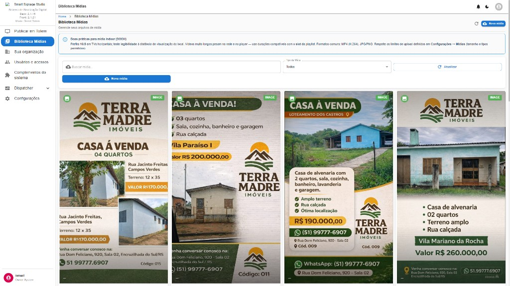
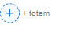
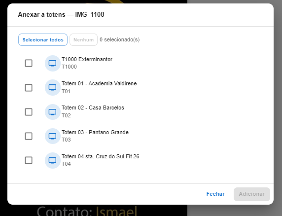
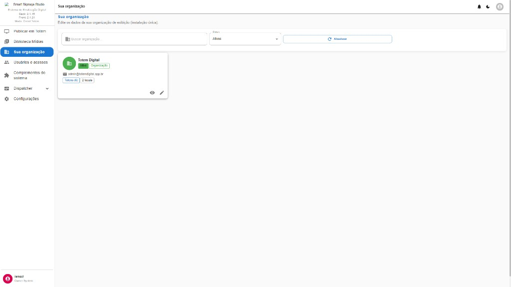
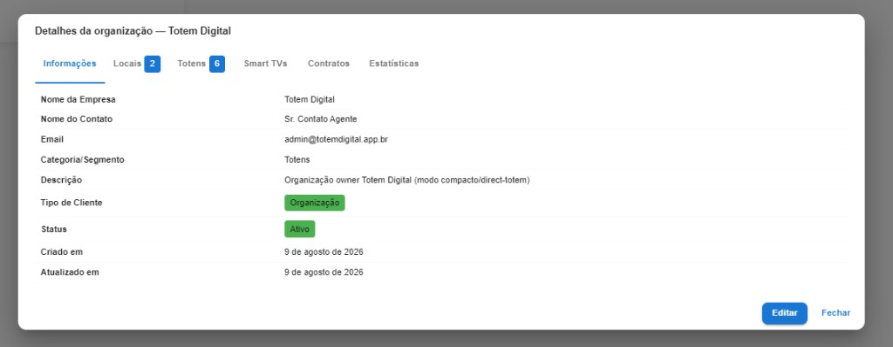
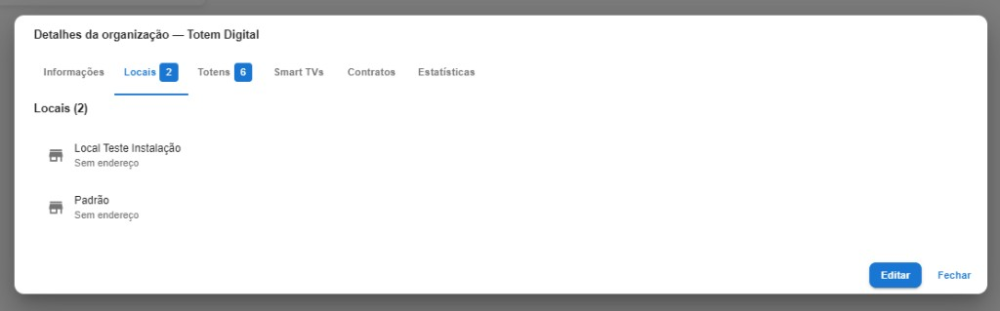
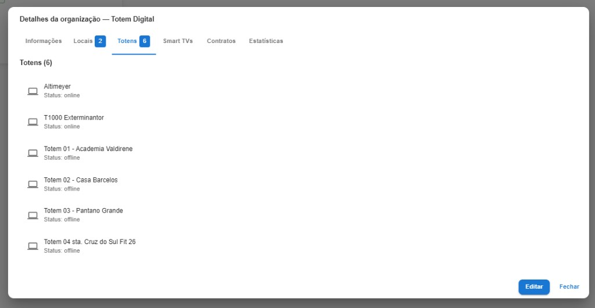
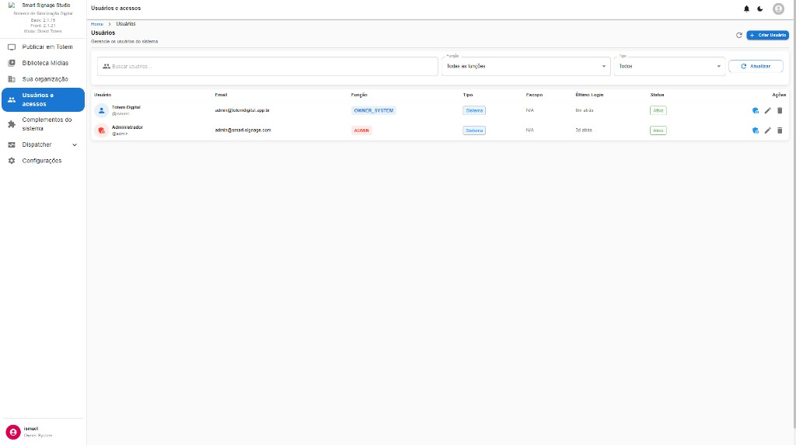
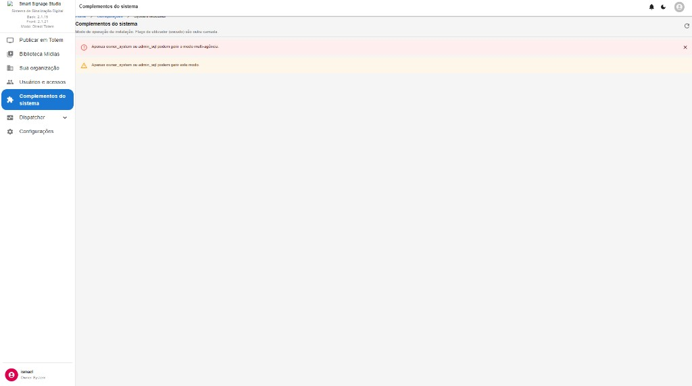

# 09 — Telas: Biblioteca, Organização, Usuários e Complementos

**Modo:** Direct Totem · **Front:** 2.1.21  
**Autor:** Julio Cesar Eyras (J.C.E.) / Eyras Sistemas e Soluções

## 09.1 Biblioteca de Mídias — `/media` (Direct)

| Recurso | Função |
|---|---|
| + Nova mídia | Upload para a biblioteca da org |
| Buscar mídia | Filtro por nome |
| Tipo de mídia | Todos / imagem / vídeo / … |
| Actualizar | Recarrega a grelha |
| Banner DOOH | Boas práticas (16:9 vs retrato 1080×1920, MP4/JPG/PNG, limites em Configurações) |

---

## 09.2 Cards da biblioteca (profundidade)

Por card: miniatura · nome/UUID · `IMAGE 1080×1920` · badge **N totem(ns)** · aprovação · barra de acções (pré-visualizar, editar, activar/desactivar, apagar, anexar a totens).

---

## 09.3 Mídia desactivada na biblioteca

Banner vermelho **Desabilitada na biblioteca** + «1 totem(ns)». O interruptor (power) volta a activar. Enquanto globalmente off, o totem também a trata como desabilitada.

---

## 09.4 Atalho «+ totem»

Atalho no card da mídia para **anexar a totens** (abre o modal seguinte).

---

## 09.5 Modal Anexar a totens

| Controlo | Função |
|---|---|
| Seleccionar todos / Nenhum | Selecção em massa |
| N seleccionado(s) | Contador |
| Checkbox por totem | Nome + UIN (T1000, T01, …) |
| Adicionar | Só activo com ≥1 seleccionado |
| Fechar | Cancela |

---

## 09.6 Sua organização — lista Direct

Em Direct há **uma** org de exibição. Filtros: buscar · status (Activos) · Actualizar. Card: Totem Digital · e-mail · **Totens (6)** · **2 locais** · ver / editar.

---

## 09.7 Detalhes da org — Informações

Separadores: Informações · Locais · Totens · Smart TVs · Contratos · Estatísticas.  
Campos: nome, contacto, e-mail, segmento, descrição (modo compacto/direct-totem), tipo Organização, status Activo, datas. **Editar** / **Fechar**.

---

## 09.8 Detalhes — Locais (2)

Lista de locais (ex.: Local Teste Instalação, Padrão). «Sem endereço» se o cadastro estiver incompleto.

---

## 09.9 Detalhes — Totens (6)

Mesmos totens da home, com online/offline. **Editar** altera a org; a operação diária dos totens é em **Publicar em Totem**.

---

## 09.10 Usuários e acessos

| Recurso | Função |
|---|---|
| Buscar / Função / Tipo | Filtros |
| + Criar Usuário | Novo utilizador |
| Colunas | Utilizador, e-mail, função, tipo, âmbito, último login, status, acções |
| Chave / lápis / lixo | Reset senha ou permissões · editar · excluir |

Exemplo Direct: `ismael` = `OWNER_SYSTEM` (Sistema); `admin` = `ADMIN`. Âmbito N/A no Direct (não há multi-org por utilizador).

---

## 09.11 Complementos do sistema

Define Direct / Lite / Pro. **Deve** ser gerível por `owner_system` / `admin_sql`.

**Gate:** só `owner_system` / `admin_sql` alteram o modo. O papel é normalizado (maiúsculas/aliases); `Owner System` deve ver e gerir o switch. O modo correcto em Direct gere-se aqui ou em Configurações → `installation.modules` / `installation.profile`.
