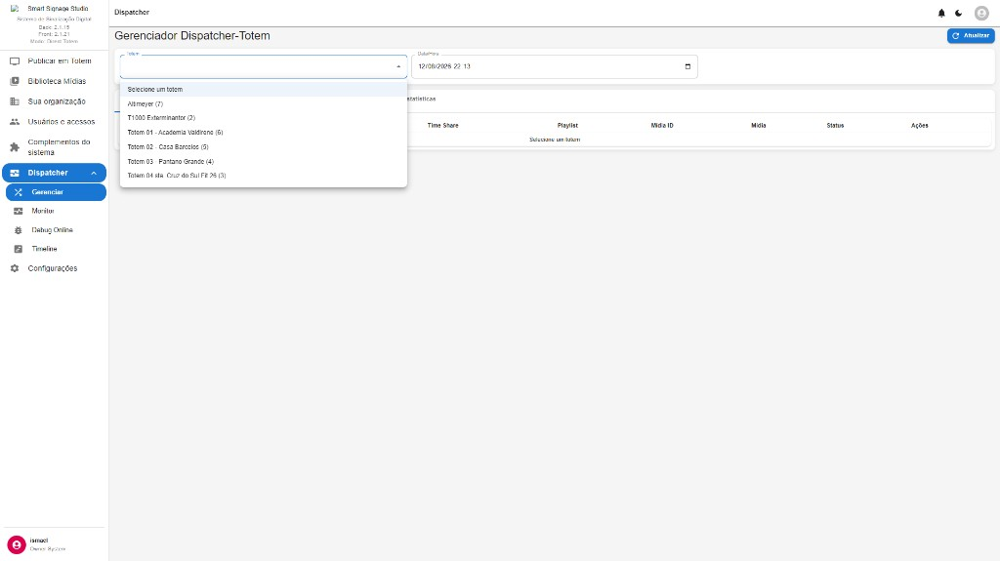
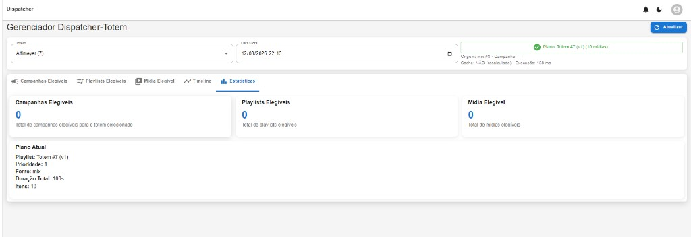
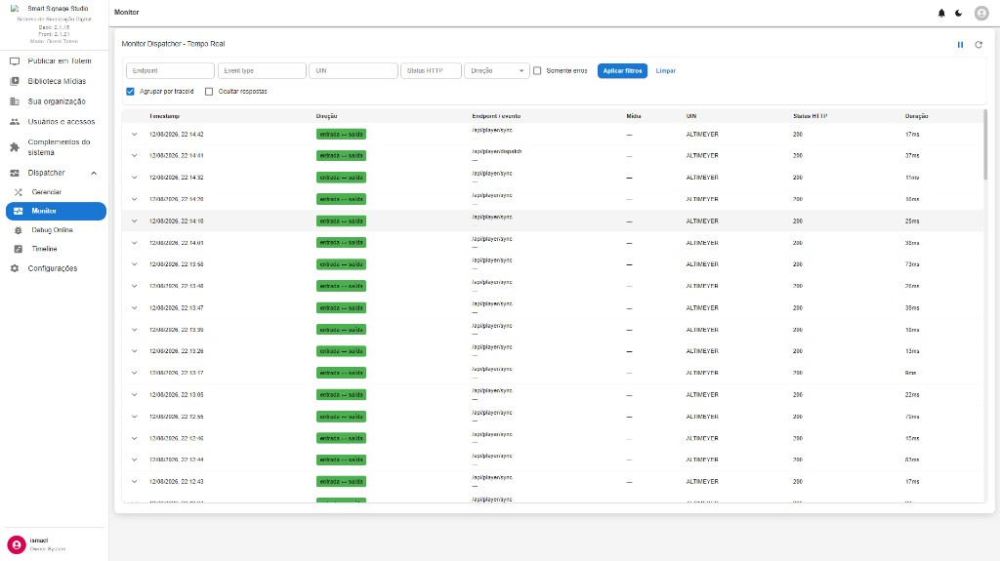
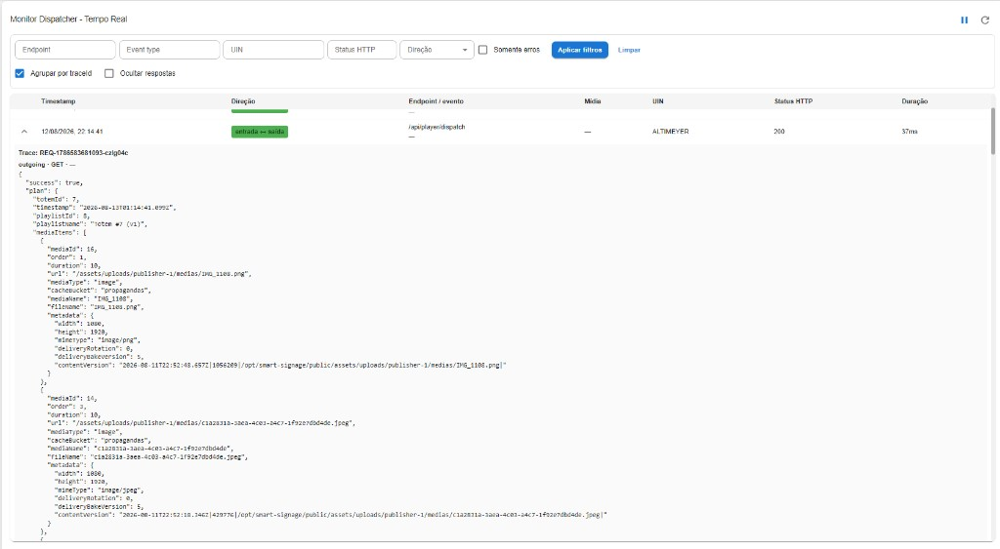
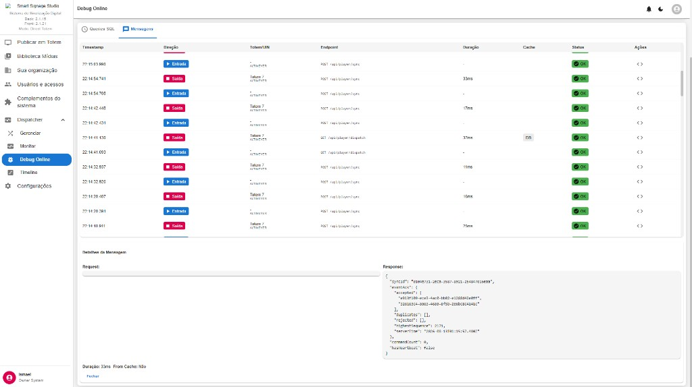
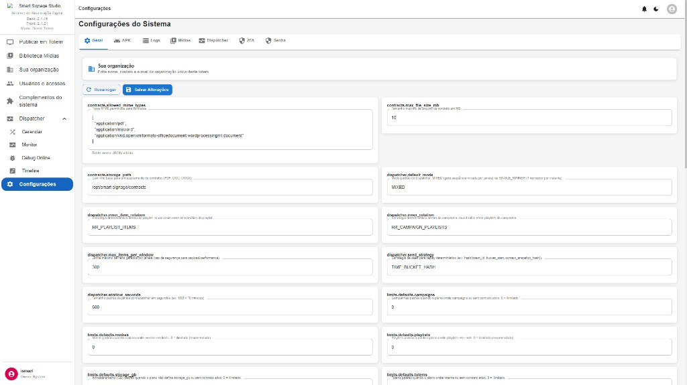

# 10 — Telas: Dispatcher

**Modo:** Direct Totem · **Front:** 2.1.21  
**Autor:** Julio Cesar Eyras (J.C.E.) / Eyras Sistemas e Soluções

O Dispatcher no Direct é **módulo locked** (sempre no menu): Gerenciar · Monitor · Debug Online · Timeline.

## 10.1 Gerenciador — sem totem seleccionado

| Recurso | Função |
|---|---|
| Combo Totem | Escolher o ecrã (Altimeyer, T1000, T01…) |
| Data/Hora | Ponto no tempo para simular o plano |
| Actualizar | Recalcula o dispatch |
| Tabela | Time Share · Playlist · Mídia ID · Mídia · Status · Acções |
| Estado vazio | «Selecione um totem» |

---

## 10.2 Gerenciador — escolher totem

A lista coincide com Publicar em Totem. Após escolher, o plano e os separadores preenchem-se.

---

## 10.3 Gerenciador — Estatísticas (Altimeyer / totem #7)

| Bloco | Função |
|---|---|
| Caixa verde do plano | Totem #7 (v1), 10 mídias; origem **mix**; cache NÃO (recalculado); tempo de execução |
| Separadores | Campanhas elegíveis · Playlists elegíveis · Mídia elegível · Timeline · Estatísticas |
| Cards 0/0/0 | Em Direct sem campanhas/playlists comerciais o mix vai **directo às mídias do totem** |
| Plano actual | Playlist Totem #7 (v1) · prioridade 1 · fonte mix · 100s · 10 itens |

---

## 10.4 Monitor — tempo real

Log de pedidos player ↔ servidor.

| Filtro | Uso |
|---|---|
| Endpoint / Event type / UIN / Status HTTP / Direcção | Afina o feed |
| Somente erros | Só falhas |
| Aplicar / Limpar | Aplica ou zera filtros |
| Agrupar por traceId | Junta request+response |
| Ocultar respostas | Só pedidos |
| Pausar / Actualizar | Congela ou recarrega o live |

Colunas: timestamp · direcção · endpoint (`/api/player/sync`, `/api/player/dispatch`) · mídia · UIN · HTTP · duração.

---

## 10.5 Monitor — detalhe de um dispatch

Trace ID, GET `/api/player/dispatch`, JSON: `success`, `plan` (totemId, playlistId, nome), `mediaItems` (url, tipo, duração, contentVersion). Útil para ver **exactamente** o que o Player-AD vai reproduzir.

---

## 10.6 Debug Online — Mensagens

Separadores: **Queries SQL** · **Mensagens**. Tabela: timestamp · Entrada/Saída · Totem/UIN · endpoint · duração · cache · status. Painel inferior: Request / Response JSON (ex. `syncId`, `eventAck`). **Fechar** esconde o detalhe.
