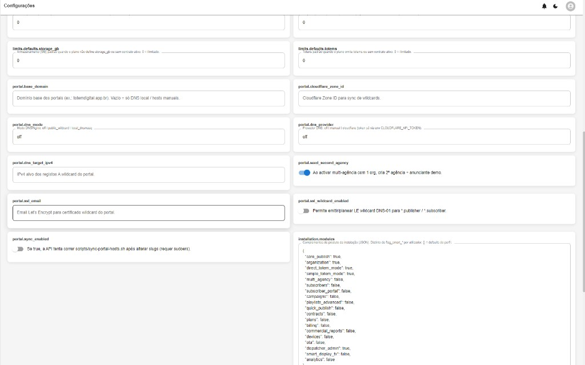
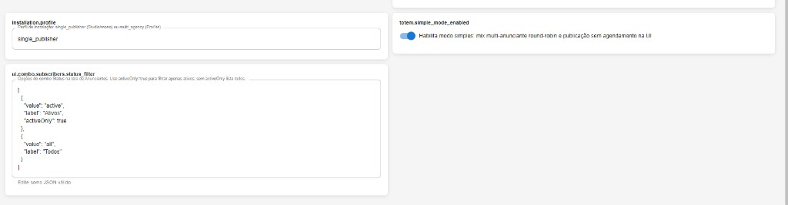
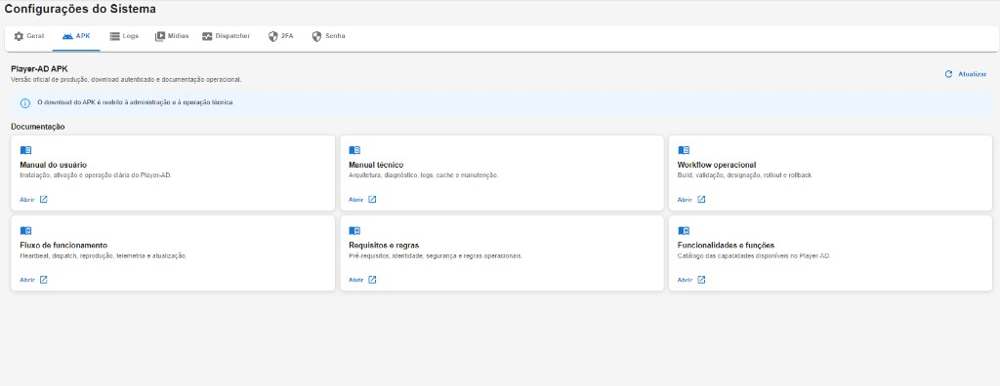
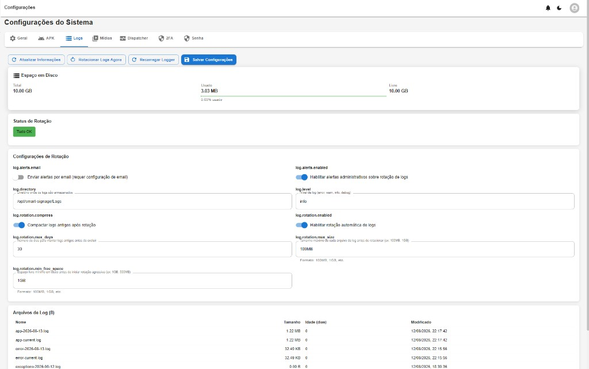
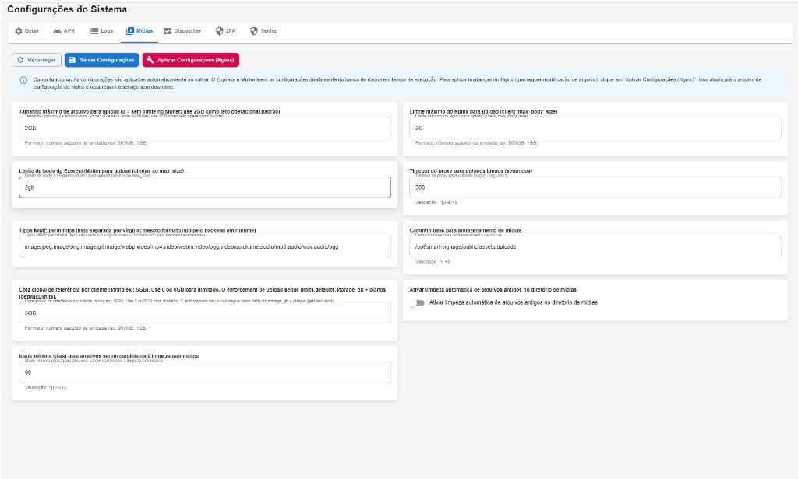
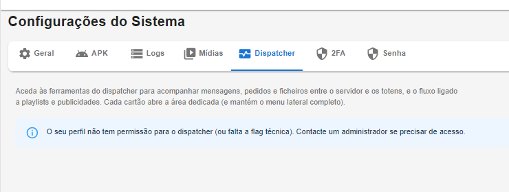
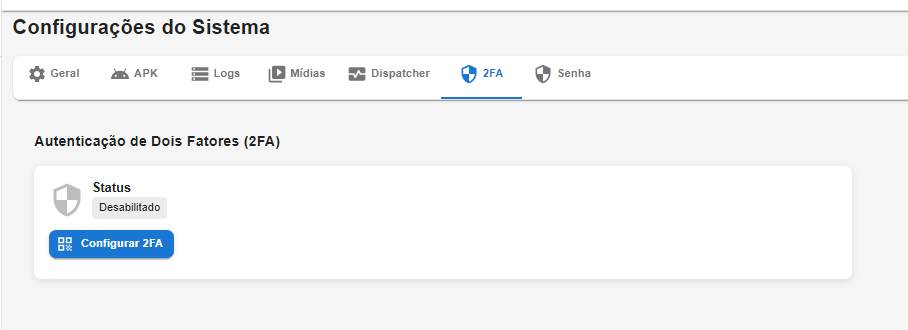
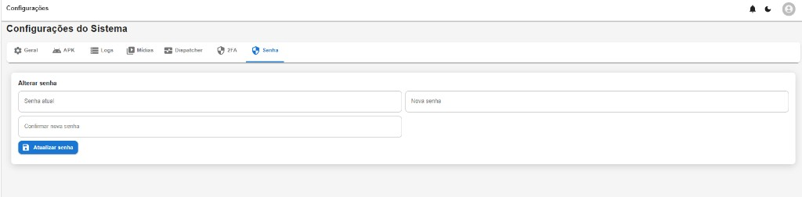

# 11 — Telas: Configurações do sistema

**Modo:** Direct Totem · **Front:** 2.1.21  
**Autor:** Julio Cesar Eyras (J.C.E.) / Eyras Sistemas e Soluções

Separadores: **Geral** · **APK** · **Logs** · **Mídias** · **Dispatcher** · **2FA** · **Senha**.

Em Direct, o bloco «Sua organização» no Geral edita a org única (nome, contacto, e-mail).

## 11.1 Geral — parâmetros técnicos (1)

| Chave | Função (desta captura) |
|---|---|
| contracts.allowed_mime_types / max_file_size_mb / storage_path | Contratos (Pro); em Direct pouco usados |
| dispatcher.default_mode | `MIXED` vs `SINGLE_WINNER` |
| dispatcher.inner_* / max_items_per_window / seed_strategy / window_seconds | Motor de mix determinístico |
| limits.defaults.* | Tectos quando não há plano; totens default **3** nesta captura |

**Recarregar** / **Salvar alterações**.

---

## 11.2 Geral — portal, DNS e `installation.modules`

| Chave | Função |
|---|---|
| portal.* | DNS/SSL de portais Lite/Pro (`dns_mode=off` no Direct) |
| portal.seed_second_agency | Ao ligar multi, cria 2.ª agência demo |
| **installation.modules** | JSON dos complementos: neste Direct `direct_totem_mode` + `organization` + `dispatcher_admin` = true; comercial = false |

---

## 11.3 Geral — perfil e modo simples

| Chave | Função |
|---|---|
| installation.profile | `single_publisher` (Direct/Studio) vs `multi_agency` |
| totem.simple_mode_enabled | Mix simples + publicação sem agenda pesada na UI (ligado) |
| ui.combo.subscribers.status_filter | Combo Status em Anunciantes (Lite/Pro); JSON |

---

## 11.4 APK — Player-AD oficial

Versão oficial de produção, download autenticado (só admin/operação técnica) e atalhos para manuais: utilizador, técnico, workflow, fluxo, requisitos, funcionalidades.

---

## 11.5 Logs

| Acção | Função |
|---|---|
| Actualizar informações | Disco + lista de ficheiros |
| Rotacionar logs agora | Rotação manual |
| Recarregar logger | Reaplica nível sem restart |
| Salvar configurações | Persistência |

Disco, status de rotação, e-mail de alertas, directório `/opt/smart-signage/Logs`, nível `info`, compressão, max dias/tamanho, espaço mínimo. Tabela dos `.log`.

---

## 11.6 Mídias (upload / Nginx)

Limites de upload (ex. 2GB), MIME permitidos, cota por cliente, idade para limpeza, `client_max_body_size`, timeout proxy, path `/opt/smart-signage/public/assets/uploads`, limpeza automática off.  
**Aplicar Configurações (Nginx)** recarrega o Nginx sem downtime quando o tamanho máximo muda.

---

## 11.7 Separador Dispatcher (dentro de Configurações)

Texto de ajuda + cartões para Gerenciar, Monitor, Debug e Timeline. `owner_system` / `admin_sql` / `admin` vêem o hub sem `flag_smart_2` (mesmo critério do menu lateral).

---

## 11.8 Senha

Senha actual · nova · confirmar · **Actualizar senha**. O separador **2FA** (ao lado) configura autenticação de dois factores (status Desabilitado → Configurar 2FA).
