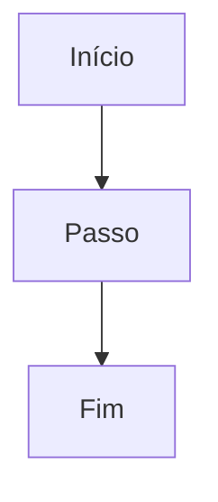
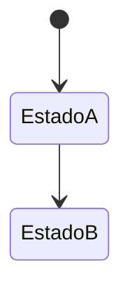

# `<slug>` — Nome do módulo

| Campo | Valor |
|-------|-------|
| **Slug** | `kebab-case` |
| **Modos** | Direct / Lite / Pro / all |
| **Atores** | roles |
| **UI** | paths |
| **API** | prefixes |
| **Status** | draft \| active |
| **Última revisão** | AAAA-MM-DD |

---

## 1. Visão e escopo

### Propósito
…

### Dentro do escopo
- …

### Fora do escopo
- …

### Vocabulário
| Termo | Significado |
|-------|-------------|
| … | … |

---

## 2. Requisitos (EARS)

Formato: `REQ-<MOD>-NNN` · Ubiquitous / Event-driven / State-driven / Unwanted / Optional.

| ID | Tipo | Requisito |
|----|------|-----------|
| REQ-…-001 | Ubiquitous | O sistema deve … |

---

## 3. Regras de negócio

Formato:

```text
RN-<MOD>-NNN — Título
Quando: …
Se: …
Então: …
Excepto: …
Motivo: …
```

| ID | Título | Resumo |
|----|--------|--------|
| RN-…-001 | … | … |

---

## 4. Fluxos

### Fluxo principal


### Fluxos alternativos / erro
| ID | Gatilho | Resultado |
|----|---------|-----------|
| FX-…-E01 | … | … |

---

## 5. Estados

| Estado | Significado | Transições típicas |
|--------|-------------|--------------------|
| … | … | … |



---

## 6. Critérios de aceite

```text
DADO …
QUANDO …
ENTÃO …
```

| ID | Cenário | Prioridade |
|----|---------|------------|
| AC-…-001 | … | P0 |

---

## 7. Dependências e referências

- Módulos: …
- Manuais: …
- ADR: …
- Código: …
