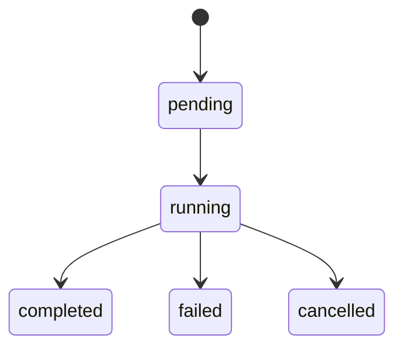

# `admin-tools` — Admin Tools

| Campo | Valor |
|-------|-------|
| **Slug** | `admin-tools` |
| **Modos** | all (menu típico Lite/Pro/técnico) |
| **Atores** | owner/admin/técnico |
| **UI** | `/admin-tools` |
| **API** | `/api/export-*, /api/advanced-schedules, /api/debug/*` |
| **Status** | active |
| **Profundidade** | L2 |
| **Última revisão** | 2026-08-09 |

---

## 1. Visão e escopo

### Propósito
Ferramentas administrativas: CronSQL (exports/schedules/executions), advanced schedules, e abas de debug (registration logs, totem details, system info).

### Dentro do escopo
- Export queries/schedules/executions (`requireModule('dispatcher_admin')`)
- Advanced schedules
- Debug/system info
- UI multi-aba AdminTools

### Fora do escopo
- Commercial purge (Complementos)
- Mudança de mode

### Vocabulário
| Termo | Significado |
|-------|-------------|
| export_execution.status | `pending` \| `running` \| `completed` \| `failed` \| `cancelled` |
| schedule_type | `campaign` \| `playlist` \| `campaign_activation` \| `playlist_generation` |

---

## 2. Requisitos (EARS)

| ID | Tipo | Requisito |
|----|------|-----------|
| REQ-ADM-001 | Ubiquitous | Ferramentas sensíveis exigem role elevada. |
| REQ-ADM-002 | State-driven | Exports gated por `dispatcher_admin`. |
| REQ-ADM-003 | Event-driven | Quando execution corre, status pending→running→completed/failed. |
| REQ-ADM-004 | Unwanted | Role insuficiente não executa CronSQL. |
| REQ-ADM-005 | Optional | Debug endpoints expõem logs de registo de player. |
| REQ-ADM-006 | Ubiquitous | Advanced schedules tipados pelo CHECK. |

---

## 3. Regras de negócio

### RN-ADM-001 — Auditoria

```text
RN-ADM-001 — Auditoria
Quando: export sensível
Se: sempre
Então: registar quem executou quando possível
Excepto: —
Motivo: Compliance
```


### RN-ADM-002 — Gate dispatcher_admin

```text
RN-ADM-002 — Gate dispatcher_admin
Quando: export-* APIs
Se: módulo off
Então: 403
Excepto: —
Motivo: Ops locked on na prática
```


### RN-ADM-003 — Execution lifecycle

```text
RN-ADM-003 — Execution lifecycle
Quando: correr schedule
Se: erro SQL
Então: status=failed
Excepto: —
Motivo: Observabilidade
```


### RN-ADM-004 — Cancel

```text
RN-ADM-004 — Cancel
Quando: execution running
Se: cancel pedido
Então: cancelled se suportado
Excepto: —
Motivo: Controlo ops
```


### RN-ADM-005 — Debug ≠ mutate prod data

```text
RN-ADM-005 — Debug ≠ mutate prod data
Quando: system-info
Se: sempre
Então: read-mostly
Excepto: —
Motivo: Segurança
```


---

## 4. Fluxos

```mermaid
flowchart TD
  A[/admin-tools] --> B[CronSQL]
  B --> C[export_queries]
  C --> D[export_schedules]
  D --> E[export_executions]
  A --> F[Debug tabs]
  F --> G[/api/debug/*]
```

---

## 5. Estados

| Campo | Valores |
|-------|---------|
| execution.status | `pending`, `running`, `completed`, `failed`, `cancelled` |
| query/schedule | `enabled` bool |



---

## 6. Critérios de aceite

### AC-ADM-001 (P0)

```text
DADO role insuficiente
QUANDO abrir/executar CronSQL
ENTÃO negado
```


### AC-ADM-002 (P0)

```text
DADO query válida agendada
QUANDO disparar execution
ENTÃO status termina completed ou failed explícito
```


### AC-ADM-003 (P0)

```text
DADO admin autorizado
QUANDO GET system-info/debug
ENTÃO 200 com dados de sistema
```


---

## 7. Dependências e referências

### Módulos
- [`users-access`](../users-access/MODULO.md), [`dispatcher`](../dispatcher/MODULO.md)

### Código de referência
- `backend/src/routes/export-queries.ts`, `export-schedules.ts`, `export-executions.ts`, `advanced-schedules.ts`, `debug.ts`
- `frontend/src/pages/AdminTools/AdminTools.tsx`
- `frontend/src/components/CronSQL.tsx`
- schema: `export_*`, `advanced_schedules`

### Lacunas conhecidas
- Abas debug dependem mais de `/api/debug` do que de export-*.
