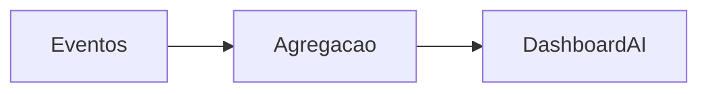

# `analytics-ai` — Analytics / IA

| Campo | Valor |
|-------|-------|
| **Slug** | `analytics-ai` |
| **Modos** | Pro |
| **Atores** | admin, marketing, publisher/subscriber |
| **UI** | `/analytics, /ai, /ai-context` |
| **API** | `/api/analytics, /api/ai` |
| **Status** | active |
| **Última revisão** | 2026-08-09 |

---

## 1. Visão e escopo

### Propósito
Analytics de reprodução/rede e assistentes IA.

### Dentro do escopo
- Métricas agregadas
- Assistentes

### Fora do escopo
- Controlo remoto

### Vocabulário
| Termo | Significado |
|-------|-------------|
| impression | exibição contabilizada |

---

## 2. Requisitos (EARS)

| ID | Tipo | Requisito |
|----|------|-----------|
| REQ-ANL-001 | State-driven | Módulo analytics on apenas no preset Pro. |

---

## 3. Regras de negócio

### RN-ANL-001 — Privacidade de escopo

```text
RN-ANL-001 — Privacidade de escopo
Quando: consultar analytics
Se: role limitada
Então: filtrar por tenant
Excepto: —
Motivo: ACL
```

---

## 4. Fluxos



---

## 5. Estados

| Estado | Significado | Transições típicas |
|--------|-------------|--------------------|
| enabled | Pro | → disabled noutros modes |

---

## 6. Critérios de aceite

### AC-ANL-001 (P0)

```text
DADO mode lite
QUANDO API analytics gate
ENTÃO 403 MODULE_DISABLED
```

---

## 7. Dependências e referências

### Módulos relacionados
- [`telemetry-heartbeat`](../telemetry-heartbeat/MODULO.md)
- [`campaigns`](../campaigns/MODULO.md)

### Referências
- —
