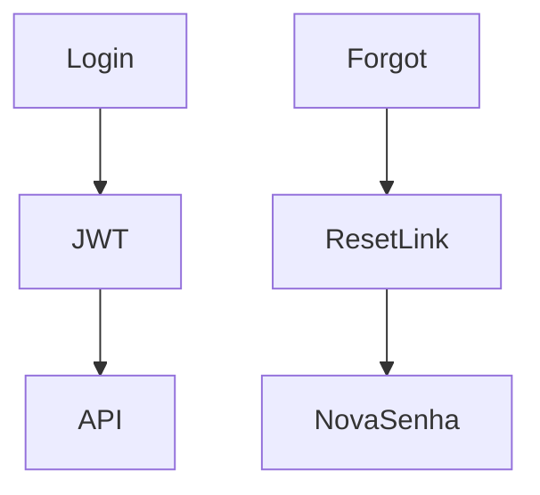

# `auth-security` — Autenticação e segurança

| Campo | Valor |
|-------|-------|
| **Slug** | `auth-security` |
| **Modos** | all |
| **Atores** | todos |
| **UI** | `/login, /forgot-password, /reset-password, Settings 2FA/Senha` |
| **API** | `/api/auth` |
| **Status** | active |
| **Última revisão** | 2026-08-09 |

---

## 1. Visão e escopo

### Propósito
Login, recuperação de senha, 2FA e sessão JWT do painel.

### Dentro do escopo
- Login
- Reset
- 2FA
- Sessão

### Fora do escopo
- Auth do Player por UIN/token de dispositivo

### Vocabulário
| Termo | Significado |
|-------|-------------|
| JWT | token do painel |
| device token | token do Player |

---

## 2. Requisitos (EARS)

| ID | Tipo | Requisito |
|----|------|-----------|
| REQ-AUTH-001 | Ubiquitous | Rotas autenticadas do painel exigem JWT válido. |
| REQ-AUTH-002 | Unwanted | JWT de painel não deve ser usado como credencial permanente do Player. |

---

## 3. Regras de negócio

### RN-AUTH-001 — Player separado

```text
RN-AUTH-001 — Player separado
Quando: Player autentica
Se: sempre
Então: usa UIN/token de dispositivo
Excepto: —
Motivo: Modelo edge
```

---

## 4. Fluxos



---

## 5. Estados

| Estado | Significado | Transições típicas |
|--------|-------------|--------------------|
| anonymous | sem sessão | → authenticated |
| authenticated | JWT válido | → expired/logged_out |

---

## 6. Critérios de aceite

### AC-AUTH-001 (P0)

```text
DADO JWT expirado
QUANDO chamar API autenticada
ENTÃO 401
```

---

## 7. Dependências e referências

### Módulos relacionados
- [`users-access`](../users-access/MODULO.md)

### Referências
- `docs/websocket-nginx-unexpected-response-200.md`
