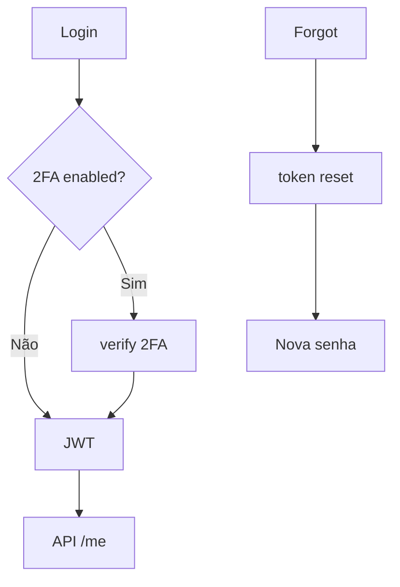
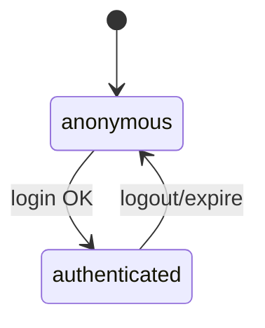

# `auth-security` — Autenticação e segurança

| Campo | Valor |
|-------|-------|
| **Slug** | `auth-security` |
| **Modos** | all |
| **Atores** | todos os utilizadores do painel |
| **UI** | `/login, /forgot-password, /reset-password, Settings 2FA/Senha` |
| **API** | `/api/auth` |
| **Status** | active |
| **Profundidade** | L2 |
| **Última revisão** | 2026-08-09 |

---

## 1. Visão e escopo

### Propósito
Login do painel (JWT), recuperação de senha, 2FA, refresh/logout e tipos de utilizador (`system_user` / `subscriber_user` / `publisher_user`).

### Dentro do escopo
- `POST /login`, `/subscriber-login`, `/register`, `/refresh`, `/logout`
- `/me`, change-password, forgot/reset
- 2FA setup/enable/disable/verify/backup codes
- Middleware `auth.middleware`

### Fora do escopo
- Auth do Player por UIN / `device_tokens` (player-ad)
- Gestão de roles/flags (users-access)

### Vocabulário
| Termo | Significado |
|-------|-------------|
| JWT | sessão do painel |
| 2FA | TOTP + backup codes |
| user_type | `system_user` \| `subscriber_user` \| `publisher_user` |

---

## 2. Requisitos (EARS)

| ID | Tipo | Requisito |
|----|------|-----------|
| REQ-AUTH-001 | Ubiquitous | Rotas autenticadas do painel exigem JWT válido. |
| REQ-AUTH-002 | Unwanted | JWT de painel não deve servir como credencial permanente do Player. |
| REQ-AUTH-003 | Event-driven | Quando 2FA está enabled, login deve exigir verify. |
| REQ-AUTH-004 | Event-driven | Forgot-password emite token de reset com validade. |
| REQ-AUTH-005 | Unwanted | Reset com token expirado/revogado deve falhar. |
| REQ-AUTH-006 | Ubiquitous | Refresh renova sessão sem re-login quando refresh válido. |

---

## 3. Regras de negócio

### RN-AUTH-001 — Player separado

```text
RN-AUTH-001 — Player separado
Quando: Player autentica
Se: sempre
Então: UIN/device token
Excepto: —
Motivo: Modelo edge
```


### RN-AUTH-002 — 2FA obrigatório se enabled

```text
RN-AUTH-002 — 2FA obrigatório se enabled
Quando: login
Se: user_two_factor.enabled
Então: exigir código
Excepto: —
Motivo: Segurança
```


### RN-AUTH-003 — Password reset one-shot

```text
RN-AUTH-003 — Password reset one-shot
Quando: usar token
Se: sucesso
Então: invalidar token
Excepto: —
Motivo: Replay
```


### RN-AUTH-004 — Subscriber-login isolado

```text
RN-AUTH-004 — Subscriber-login isolado
Quando: POST subscriber-login
Se: sempre
Então: emite sessão no contexto anunciante
Excepto: —
Motivo: Portal/tenant
```


### RN-AUTH-005 — JWT expirado

```text
RN-AUTH-005 — JWT expirado
Quando: API autenticada
Se: token inválido
Então: 401
Excepto: —
Motivo: Sessão
```


---

## 4. Fluxos



---

## 5. Estados

| Conceito | Valores |
|----------|---------|
| sessão | anonymous → authenticated → expired/logged_out |
| 2FA | disabled / enabled |
| device_tokens (fora escopo painel) | `active`, `revoked`, `expired` |



---

## 6. Critérios de aceite

### AC-AUTH-001 (P0)

```text
DADO JWT expirado
QUANDO chamar API autenticada
ENTÃO 401
```


### AC-AUTH-002 (P0)

```text
DADO 2FA enabled
QUANDO login só com password
ENTÃO não completa sem verify
```


### AC-AUTH-003 (P0)

```text
DADO token reset expirado
QUANDO POST reset-password
ENTÃO falha sem alterar senha
```


---

## 7. Dependências e referências

### Módulos
- [`users-access`](../users-access/MODULO.md), [`subscriber-portal`](../subscriber-portal/MODULO.md), [`settings`](../settings/MODULO.md)

### Código de referência
- `backend/src/routes/auth.ts`
- `backend/src/services/authService.ts`, `twoFactorService.ts`
- `backend/src/middleware/auth.middleware.ts`
- `frontend/src/pages/Auth/`
- schema: `users`, `user_two_factor`, `password_reset_tokens` (part2/part6)

### Lacunas conhecidas
- Superfície Player (`device_tokens`) documentada noutro módulo.
