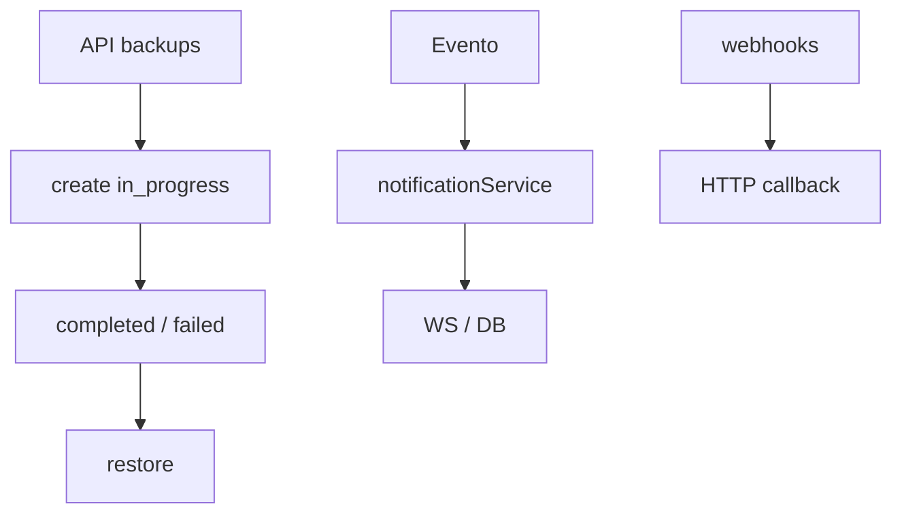
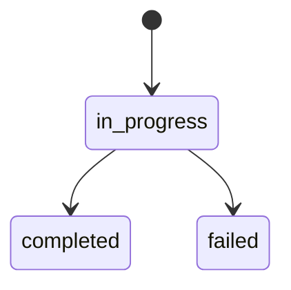

# `backups-notifications` — Backups e notificações

| Campo | Valor |
|-------|-------|
| **Slug** | `backups-notifications` |
| **Modos** | all |
| **Atores** | admin |
| **UI** | `APIs (+ toasts FE); sem página dedicada de backup` |
| **API** | `/api/backups, /api/notifications, /api/email, /api/webhooks` |
| **Status** | active |
| **Profundidade** | L2 |
| **Última revisão** | 2026-08-09 |

---

## 1. Visão e escopo

### Propósito
Backups do sistema (create/list/restore), canais de notificação (DB/WS), email de teste e webhooks operacionais.

### Dentro do escopo
- `POST /api/backups/create`, list, restore
- Notifications list/read
- Email status/test
- Webhooks CRUD + test

### Fora do escopo
- Backup do APK Player
- UI rica de gestão de backups (quase inexistente)

### Vocabulário
| Termo | Significado |
|-------|-------------|
| backup_type | `full` \| `database` \| `uploads` \| `config` |
| backup.status | `in_progress` \| `completed` \| `failed` |
| notif type | `info` \| `success` \| `warning` \| `error` |

---

## 2. Requisitos (EARS)

| ID | Tipo | Requisito |
|----|------|-----------|
| REQ-BKP-001 | Ubiquitous | Backups completados devem poder ser listados. |
| REQ-BKP-002 | Event-driven | Quando create inicia, status `in_progress`. |
| REQ-BKP-003 | Event-driven | Restore só a partir de backup `completed`. |
| REQ-BKP-004 | Optional | Webhooks enabled disparam em eventos configurados. |
| REQ-BKP-005 | Optional | Email test valida SMTP. |
| REQ-BKP-006 | Unwanted | Role insuficiente não restaura backup. |

---

## 3. Regras de negócio

### RN-BKP-001 — Restore completed only

```text
RN-BKP-001 — Restore completed only
Quando: POST :id/restore
Se: status≠completed
Então: rejeitar
Excepto: —
Motivo: Integridade
```


### RN-BKP-002 — Tipos CHECK

```text
RN-BKP-002 — Tipos CHECK
Quando: create
Se: backup_type inválido
Então: rejeitar
Excepto: —
Motivo: Schema
```


### RN-BKP-003 — Notificações WS+DB

```text
RN-BKP-003 — Notificações WS+DB
Quando: evento operacional
Se: serviço
Então: tentar persistir + push
Excepto: —
Motivo: Ops
```


### RN-BKP-004 — Webhook test

```text
RN-BKP-004 — Webhook test
Quando: POST :id/test
Se: enabled ou admin
Então: envia payload de teste
Excepto: —
Motivo: Diagnóstico
```


### RN-BKP-005 — UI toast local

```text
RN-BKP-005 — UI toast local
Quando: FE Notification center
Se: muitos fluxos
Então: usa localStorage/toast — pouco /api/notifications
Excepto: —
Motivo: Lacuna produto
```


---

## 4. Fluxos



---

## 5. Estados

| Campo | Valores |
|-------|---------|
| backup.status | `in_progress`, `completed`, `failed` |
| webhook | `enabled` bool |



---

## 6. Critérios de aceite

### AC-BKP-001 (P0)

```text
DADO backup completed
QUANDO POST restore
ENTÃO restauro inicia ou conclui sem corromper status
```


### AC-BKP-002 (P0)

```text
DADO backup failed
QUANDO POST restore
ENTÃO rejeitado
```


### AC-BKP-003 (P0)

```text
DADO admin
QUANDO POST /api/email/test com SMTP ok
ENTÃO status de sucesso
```


---

## 7. Dependências e referências

### Módulos
- [`settings`](../settings/MODULO.md), [`admin-tools`](../admin-tools/MODULO.md)

### Código de referência
- `backend/src/routes/backups.ts`, `notifications.ts`, `email.ts`, `webhooks.ts`
- `backend/src/services/backupService.ts`, `notificationService.ts`, `emailService.ts`
- schema part6 `backups`; part2 `webhooks` / `webhook_configs`

### Lacunas conhecidas
- **UI de backup praticamente inexistente.**
- Serviço de notifications referencia tabela `notifications` **sem CREATE TABLE definitivo** no schema v2.
- FE de notificações usa sobretudo toast/localStorage.
