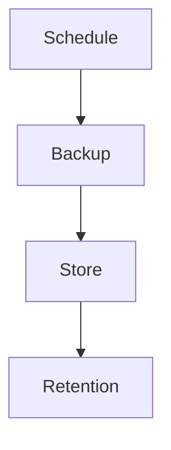

# `backups-notifications` — Backups e notificações

| Campo | Valor |
|-------|-------|
| **Slug** | `backups-notifications` |
| **Modos** | all |
| **Atores** | admin |
| **UI** | `Admin/Settings` |
| **API** | `/api/backups, /api/notifications, /api/email, /api/webhooks` |
| **Status** | active |
| **Última revisão** | 2026-08-09 |

---

## 1. Visão e escopo

### Propósito
Backups do sistema e canais de notificação operacional.

### Dentro do escopo
- Agendar/restaurar backup
- Notificações email/webhook

### Fora do escopo
- Backup do APK Player

### Vocabulário
| Termo | Significado |
|-------|-------------|
| retention | retenção de backups |

---

## 2. Requisitos (EARS)

| ID | Tipo | Requisito |
|----|------|-----------|
| REQ-BKP-001 | Ubiquitous | Backups completados devem respeitar retenção configurada. |

---

## 3. Regras de negócio

### RN-BKP-001 — Retenção

```text
RN-BKP-001 — Retenção
Quando: backup antigo além da política
Se: job de limpeza
Então: remover ficheiro+registo
Excepto: —
Motivo: Disco
```

---

## 4. Fluxos



---

## 5. Estados

| Estado | Significado | Transições típicas |
|--------|-------------|--------------------|
| pending | agendado | → running/completed/failed |

---

## 6. Critérios de aceite

### AC-BKP-001 (P0)

```text
DADO retenção N dias
QUANDO passar N
ENTÃO backups antigos removidos
```

---

## 7. Dependências e referências

### Módulos relacionados
- [`settings`](../settings/MODULO.md)

### Referências
- —
