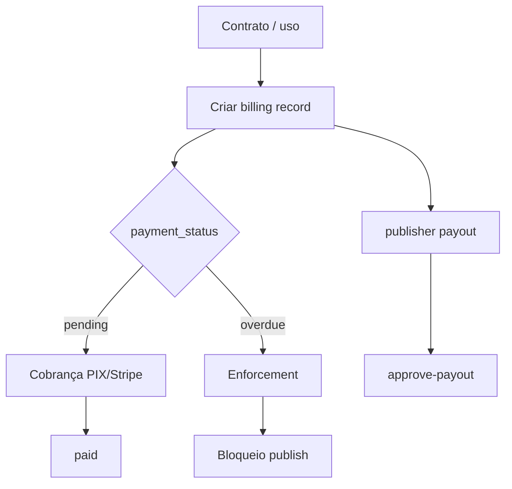
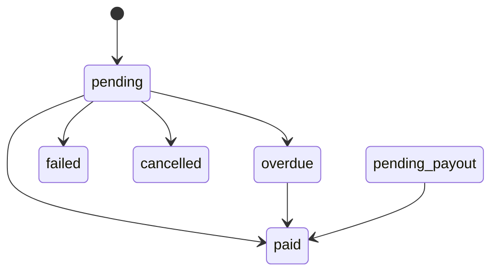

# `billing` — Faturamento e cobrança

| Campo | Valor |
|-------|-------|
| **Slug** | `billing` |
| **Modos** | Pro |
| **Atores** | owner/admin, operador_faturamento, publisher_user, subscriber_user |
| **UI** | `/billing; Settings → Financeiro` |
| **API** | `/api/subscriber-billing, /api/publisher-billing, /api/billing-control, /api/financial-admin` |
| **Status** | active |
| **Profundidade** | L2 |
| **Última revisão** | 2026-08-09 |

---

## 1. Visão e escopo

### Propósito
Registos de cobrança/pagamento de anunciantes e publishers, dashboard de controlo, emissão financeira (PIX/Stripe helpers) e enforcement por atraso.

### Dentro do escopo
- CRUD/consulta subscriber-billing e publisher-billing
- `billing-control/dashboard`, approve-payout
- `financial-admin` (issue invoices, etc.)
- Bloqueio operacional via `billingEnforcementService`

### Fora do escopo
- Direct (aba Financeiro oculta; módulo off)
- `/api/billing` legado (deprecated)

### Vocabulário
| Termo | Significado |
|-------|-------------|
| payment status | `pending` \| `paid` \| `overdue` \| `failed` \| … |
| payout | pagamento a publisher |
| direction | `incoming` \| `outgoing` |

---

## 2. Requisitos (EARS)

| ID | Tipo | Requisito |
|----|------|-----------|
| REQ-BIL-001 | State-driven | Billing apenas em mode=full. |
| REQ-BIL-002 | Event-driven | Quando fatura fica overdue e política activa, o sistema pode restringir publicações. |
| REQ-BIL-003 | Unwanted | Em Direct, Settings não deve mostrar Financeiro. |
| REQ-BIL-004 | Ubiquitous | Registos subscriber vs publisher usam APIs separadas. |
| REQ-BIL-005 | Event-driven | Approve-payout só em estados elegíveis. |
| REQ-BIL-006 | Optional | financial-admin pode emitir lotes de faturas. |

---

## 3. Regras de negócio

### RN-BIL-001 — Direct sem Financeiro

```text
RN-BIL-001 — Direct sem Financeiro
Quando: mode=off
Se: Settings
Então: aba Financeiro oculta
Excepto: —
Motivo: Preset Direct
```


### RN-BIL-002 — Bloqueio por atraso

```text
RN-BIL-002 — Bloqueio por atraso
Quando: política + overdue
Se: tentar publicar
Então: bloqueio conforme billing-control
Excepto: —
Motivo: Risco financeiro
```


### RN-BIL-003 — Gate módulo

```text
RN-BIL-003 — Gate módulo
Quando: APIs billing*
Se: billing off
Então: 403 MODULE_DISABLED
Excepto: —
Motivo: Pro only
```


### RN-BIL-004 — Legado deprecated

```text
RN-BIL-004 — Legado deprecated
Quando: cliente novo
Se: sempre
Então: usar subscriber/publisher-billing
Excepto: —
Motivo: Evitar /api/billing
```


### RN-BIL-005 — Payout pending

```text
RN-BIL-005 — Payout pending
Quando: approve-payout
Se: status ≠ pending_payout
Então: rejeitar
Excepto: —
Motivo: Integridade de caixa
```


---

## 4. Fluxos



---

## 5. Estados

| Campo | Valores |
|-------|---------|
| payment | `pending`, `pending_payout`, `paid`, `failed`, `refunded`, `cancelled`, `overdue` |
| subscriber billing types | `advertisement`, `campaign`, `media_upload`, `storage`, `subscription`, `exhibition_lot`, `totem_quantity`, `time_based`, `custom` |
| publisher billing types | `revenue_share`, `payout`, `subscription`, `platform_fee` |



---

## 6. Critérios de aceite

### AC-BIL-001 (P0)

```text
DADO mode off
QUANDO abrir Settings
ENTÃO sem aba Financeiro
```


### AC-BIL-002 (P0)

```text
DADO mode lite
QUANDO GET subscriber-billing
ENTÃO 403 MODULE_DISABLED
```


### AC-BIL-003 (P0)

```text
DADO política de bloqueio on e overdue
QUANDO tentar publish restrito
ENTÃO operação bloqueada
```


---

## 7. Dependências e referências

### Módulos
- [`contracts`](../contracts/MODULO.md), [`plans`](../plans/MODULO.md), [`subscribers`](../subscribers/MODULO.md), [`settings`](../settings/MODULO.md)

### Código de referência
- `backend/src/routes/subscriber-billing.ts`, `publisher-billing.ts`, `billing-control.ts`, `financial-admin.ts`
- `backend/src/services/subscriberBillingService.ts`, `billingEnforcementService.ts`, `billingControlService.ts`
- `frontend/src/pages/Billing/Billing.tsx`
- schema part4 `subscriber_billing`, `publisher_billing`

### Lacunas conhecidas
- `routes/billing.ts` marcado deprecated.
- Integrações PIX/Stripe dependem de configuração de ambiente.
