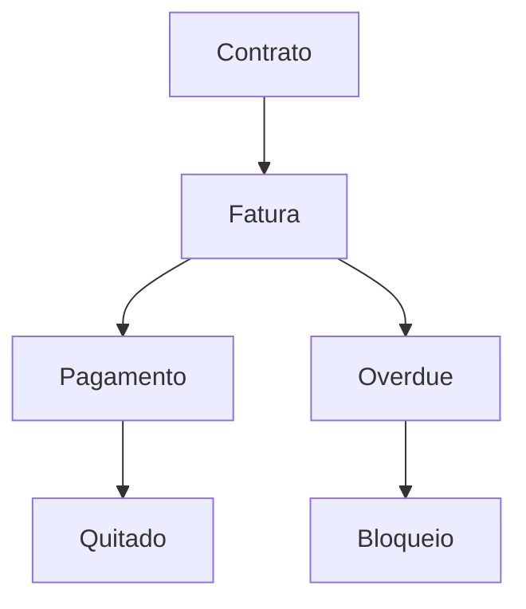

# `billing` — Faturamento e cobrança

| Campo | Valor |
|-------|-------|
| **Slug** | `billing` |
| **Modos** | Pro |
| **Atores** | owner/admin, operador_faturamento, publisher_user, subscriber_user |
| **UI** | `/billing, Settings Financeiro` |
| **API** | `/api/subscriber-billing, /api/publisher-billing, /api/billing-control, /api/financial-admin` |
| **Status** | active |
| **Última revisão** | 2026-08-09 |

---

## 1. Visão e escopo

### Propósito
Faturas, KPIs, cobrança (ex. PIX), bloqueio por atraso.

### Dentro do escopo
- Emissão/consulta faturas
- Status pagamento
- Bloqueio operacional por atraso

### Fora do escopo
- Direct Totem (aba financeira oculta)

### Vocabulário
| Termo | Significado |
|-------|-------------|
| overdue | atraso |
| payout | pagamento a publisher |

---

## 2. Requisitos (EARS)

| ID | Tipo | Requisito |
|----|------|-----------|
| REQ-BIL-001 | State-driven | Módulo billing apenas em mode=full. |
| REQ-BIL-002 | Event-driven | Quando fatura fica overdue conforme política, o sistema pode restringir publicações. |

---

## 3. Regras de negócio

### RN-BIL-001 — Direct sem Financeiro

```text
RN-BIL-001 — Direct sem Financeiro
Quando: mode=off
Se: Settings
Então: aba Financeiro oculta
Excepto: —
Motivo: Preset Direct
```

### RN-BIL-002 — Bloqueio por atraso

```text
RN-BIL-002 — Bloqueio por atraso
Quando: política activa e overdue
Se: tentar publicar
Então: bloqueio conforme billing-control
Excepto: —
Motivo: Risco financeiro
```

---

## 4. Fluxos



---

## 5. Estados

| Estado | Significado | Transições típicas |
|--------|-------------|--------------------|
| pending | a pagar | → paid/overdue |
| overdue | atrasada | → paid |
| paid | quitada | — |

---

## 6. Critérios de aceite

### AC-BIL-001 (P0)

```text
DADO mode off
QUANDO abrir Settings
ENTÃO sem aba Financeiro
```

---

## 7. Dependências e referências

### Módulos relacionados
- [`contracts`](../contracts/MODULO.md)
- [`plans`](../plans/MODULO.md)
- [`subscribers`](../subscribers/MODULO.md)

### Referências
- `docs/manuais/03-MODULOS-E-FORMAS-DE-TRABALHO.md`
