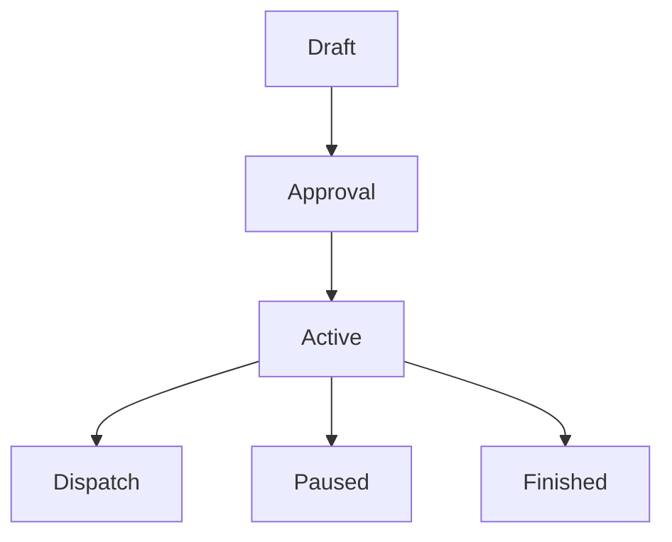

# `campaigns` — Campanhas

| Campo | Valor |
|-------|-------|
| **Slug** | `campaigns` |
| **Modos** | Lite, Pro |
| **Atores** | admin, comercial, marketing, subscriber_user |
| **UI** | `/campaigns` |
| **API** | `/api/campaigns` |
| **Status** | active |
| **Última revisão** | 2026-08-09 |

---

## 1. Visão e escopo

### Propósito
Campanhas publicitárias com elegibilidade, prioridade e calendário sobre a rede de totens.

### Dentro do escopo
- CRUD campanha
- Vínculo a mídias/playlists
- Elegibilidade de totens
- Estados draft→active

### Fora do escopo
- Publicação Direct sem anunciante

### Vocabulário
| Termo | Significado |
|-------|-------------|
| campaign | unidade comercial de entrega |
| schedule_config | janelas e dias |

---

## 2. Requisitos (EARS)

| ID | Tipo | Requisito |
|----|------|-----------|
| REQ-CMP-001 | Ubiquitous | Campanha deve ter subscriber dono. |
| REQ-CMP-002 | State-driven | No Pro, execução em totens exige contrato/plano válido quando aplicável. |

---

## 3. Regras de negócio

### RN-CMP-001 — Pro com contrato

```text
RN-CMP-001 — Pro com contrato
Quando: mode=full e campanha a executar
Se: sem contrato activo
Então: não entra no dispatch
Excepto: —
Motivo: Modelo comercial Pro
```

### RN-CMP-002 — Lite via SPA

```text
RN-CMP-002 — Lite via SPA
Quando: mode=lite
Se: SPA concede org
Então: campanha pode atingir totens da org
Excepto: —
Motivo: Caminho Lite
```

---

## 4. Fluxos



---

## 5. Estados

| Estado | Significado | Transições típicas |
|--------|-------------|--------------------|
| draft | rascunho | → pending_approval/active |
| active | elegível ao motor | → paused/finished/cancelled |
| paused | suspensa | → active |

---

## 6. Critérios de aceite

### AC-CMP-001 (P0)

```text
DADO Pro sem contrato
QUANDO activar campanha para dispatch
ENTÃO totens não recebem itens da campanha
```

---

## 7. Dependências e referências

### Módulos relacionados
- [`subscribers`](../subscribers/MODULO.md)
- [`plans`](../plans/MODULO.md)
- [`contracts`](../contracts/MODULO.md)
- [`subscriber-publisher-access`](../subscriber-publisher-access/MODULO.md)
- [`dispatcher`](../dispatcher/MODULO.md)

### Referências
- `docs/manuais/03-MODULOS-E-FORMAS-DE-TRABALHO.md`
