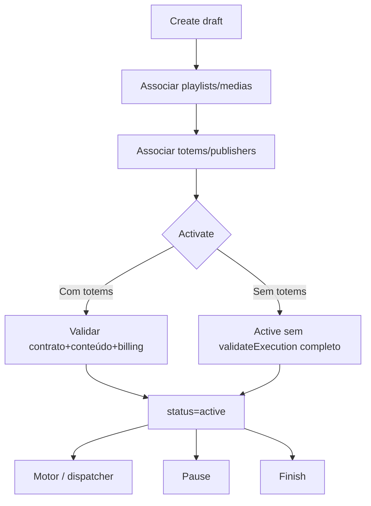
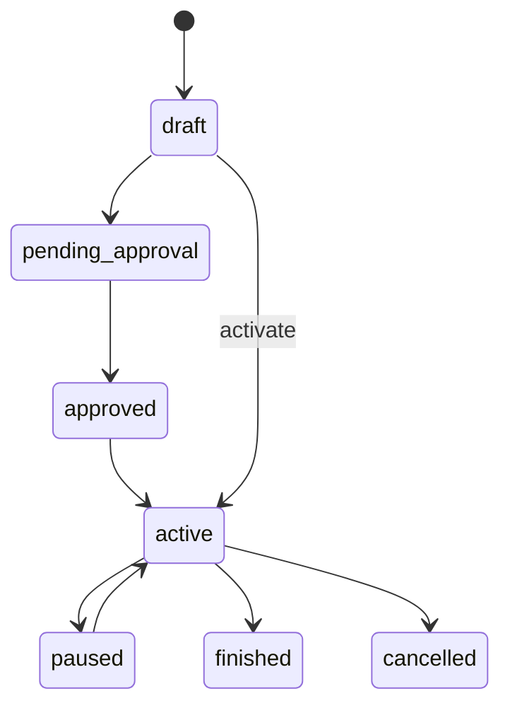

# `campaigns` — Campanhas

| Campo | Valor |
|-------|-------|
| **Slug** | `campaigns` |
| **Modos** | Lite, Pro (`requireModule('campaigns')`; off em Direct / Simple Totem) |
| **Atores** | admin, gerente_marketing (write); visualizador (stats); isolation por subscriber/publisher |
| **UI** | `/campaigns` |
| **API** | `/api/campaigns` |
| **Status** | active |
| **Profundidade** | L2 |
| **Última revisão** | 2026-08-09 |

---

## 1. Visão e escopo

### Propósito
Unidade comercial de entrega: calendário, prioridade, tier e vínculos a playlists/mídias/totems/publishers/locals para o motor de dispatch.

### Dentro do escopo
- CRUD campanha + activate / pause / finish
- Associações N:M (playlists, medias, totems, publishers, locals)
- Reorder de mídias/playlists na campanha
- Stats e listagens por client/totem
- Guards de limites de plano e billing publish

### Fora do escopo
- Direct Totem Mode (publicação sem campanha comercial)
- Materialização final da fila (`totem_playlists` — engine/dispatcher)

### Vocabulário
| Termo | Significado |
|-------|-------------|
| campaign | registo em `campaigns` com `subscriber_id` dono |
| `commercial_tier` | `premium` / `standard` / `remnant` |
| `campaign_playlists` | N:M + `priority` |
| `campaign_medias` | mídia directa (sem playlist) |
| `campaign_totems` | targeting de ecrãs |

---

## 2. Requisitos (EARS)

| ID | Tipo | Requisito |
|----|------|-----------|
| REQ-CAM-001 | Ubiquitous | Cada campanha deve ter `subscriber_id` dono. |
| REQ-CAM-002 | Ubiquitous | Playlist/mídia associada deve pertencer ao mesmo subscriber. |
| REQ-CAM-003 | Event-driven | Quando se activa uma campanha com totems, o sistema deve validar execução (contrato/conteúdo/acesso) e billing publish. |
| REQ-CAM-004 | State-driven | Enquanto `status` não for elegível (ex. não `active` + `is_active`), a campanha não deve ser listada para o totem como activa. |
| REQ-CAM-005 | Unwanted | Utilizador fora do escopo subscriber/publisher não deve mutar campanha alheia. |
| REQ-CAM-006 | Optional | Onde houver targeting, o sistema deve validar publishers/locals/totems alcançáveis via plano/SPA. |

---

## 3. Regras de negócio

### RN-CAM-001 — Dono subscriber

```text
RN-CAM-001 — Dono subscriber
Quando: create/update conteúdo
Se: sempre
Então: subscriber_id obrigatório; itens do mesmo anunciante
Excepto: —
Motivo: Isolamento comercial
```

### RN-CAM-002 — Activate com totems

```text
RN-CAM-002 — Activate com totems
Quando: POST /:id/activate
Se: há campaign_totems
Então: validateCampaignExecution (contrato active + vigência + conteúdo + acesso totem) + assertSubscriberCanPublish
Excepto: activate sem totems pode saltar validação de contrato/conteúdo
Motivo: Só exigir elegibilidade quando há delivery
```

### RN-CAM-003 — Pause / finish

```text
RN-CAM-003 — Pause / finish
Quando: pause ou finish
Se: sucesso
Então: is_active=false e status paused|finished
Excepto: —
Motivo: Retirar do motor sem apagar histórico
```

### RN-CAM-004 — Delete hard condicional

```text
RN-CAM-004 — Delete hard condicional
Quando: DELETE /api/campaigns/:id
Se: sem vínculos activos em junctions (playlists/totems/medias)
Então: hard DELETE permitido
Excepto: com vínculos → bloqueado / outro caminho
Motivo: Integridade referencial operacional
```

### RN-CAM-005 — Start date

```text
RN-CAM-005 — Start date
Quando: create/update datas
Se: start_date anterior a “hoje” (regra app)
Então: rejeitar
Excepto: —
Motivo: Evitar calendários inválidos de entrada
```

### RN-CAM-006 — Write roles

```text
RN-CAM-006 — Write roles
Quando: POST/PUT/DELETE/activate/pause/finish/reorder
Se: role ∉ admin|gerente_marketing (conforme rota)
Então: 403
Excepto: mutações de totems na campanha só com token (sem authorizeRole) — lacuna
Motivo: Controlo editorial/comercial
```

---

## 4. Fluxos

### Ciclo de vida


### Fluxos de erro
| ID | Gatilho | Resultado |
|----|---------|-----------|
| FX-CAM-E01 | Módulo off / Direct | 403 requireModule |
| FX-CAM-E02 | Activate sem elegibilidade | 4xx validação |
| FX-CAM-E03 | Fora de escopo subscriber | 403 / omitido |
| FX-CAM-E04 | Delete com vínculos | bloqueado |

---

## 5. Estados

| Campo | Valores canónicos (CHECK) |
|-------|---------------------------|
| `status` | `draft`, `pending_approval`, `approved`, `active`, `paused`, `finished`, `cancelled`, `deleted` |
| `campaign_type` | `general`, `scheduled`, `interactive`, `recurring` |
| `commercial_tier` | `premium`, `standard`, `remnant` |
| `priority` | 1–10 |
| `is_active` | bool |



---

## 6. Critérios de aceite

### AC-CAM-001 (P0)

```text
DADO campanha draft do subscriber A com playlist e totem elegível + contrato válido (Pro)
QUANDO POST activate
ENTÃO status=active e campanha fica elegível ao motor
```

### AC-CAM-002 (P0)

```text
DADO utilizador do subscriber B
QUANDO GET campanha do subscriber A
ENTÃO 403 ou omitida
```

### AC-CAM-003 (P0)

```text
DADO campanha active
QUANDO POST pause
ENTÃO is_active=false e status=paused
```

### AC-CAM-004 (P1)

```text
DADO instalação Direct (campaigns off)
QUANDO GET /api/campaigns
ENTÃO 403 requireModule
```

---

## 7. Dependências e referências

### Módulos
- [`subscribers`](../subscribers/MODULO.md), [`subscriber-publisher-access`](../subscriber-publisher-access/MODULO.md)
- [`playlists`](../playlists/MODULO.md), [`media-library`](../media-library/MODULO.md)
- [`contracts`](../contracts/MODULO.md), [`plans`](../plans/MODULO.md), [`billing`](../billing/MODULO.md)
- [`dispatcher`](../dispatcher/MODULO.md), [`totems`](../totems/MODULO.md), [`quick-publish`](../quick-publish/MODULO.md)

### Código de referência
- `backend/src/routes/campaigns.ts`
- `backend/src/services/campaignService.ts`
- `backend/src/validators/campaign.validators.ts`
- `frontend/src/pages/Campaigns/Campaigns.tsx`
- `database/smartchannel-db-v2-refactored-part3-tables-dependent.sql` (`campaigns`)
- `database/smartchannel-db-v2-refactored-part5-tables-relationships.sql` (`campaign_*`)

### Lacunas conhecidas
- `activate` com `is_active` já true pode falhar mesmo com `status=draft`.
- Activate sem totems não exige contrato/conteúdo; add totem exige.
- Reorder de playlists usa `priority`; schema de `campaign_playlists` sem `order_index` / possível mismatch `updated_at`.
- Stats `mediaCount` pode ignorar `campaign_medias` directas.
- Rotas de mutação de totems na campanha sem `authorizeRole`.
- Menu UI `/campaigns/stats` sem `<Route>` dedicado no `App.tsx` (só API).
