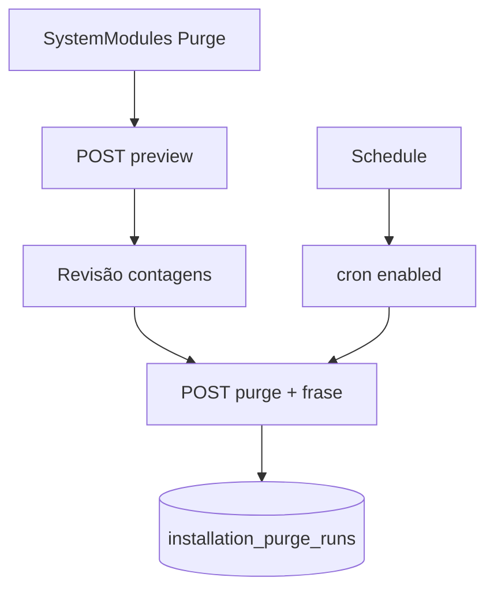

# `commercial-purge` — Purge comercial

| Campo | Valor |
|-------|-------|
| **Slug** | `commercial-purge` |
| **Modos** | Lite, Pro (admin) |
| **Atores** | owner_system, admin_sql |
| **UI** | `Complementos → Purge (`/settings/system-modules`)` |
| **API** | `/api/installation/commercial-purge/*` |
| **Status** | active |
| **Profundidade** | L2 |
| **Última revisão** | 2026-08-09 |

---

## 1. Visão e escopo

### Propósito
Apagar dados comerciais de forma explícita (preview/dry-run, scopes, schedule, auditoria). Nunca ligado automaticamente ao OFF do multi-agency.

### Dentro do escopo
- `POST .../preview`, `POST .../commercial-purge`
- `GET .../last`, schedule GET/PUT
- Scopes: billing, campaigns, playlists, contracts, subscribers, media_files, publishers_extra
- Frase de confirmação obrigatória

### Fora do escopo
- Apagar inventário de totens sem scope explícito
- Mode=off como gatilho

### Vocabulário
| Termo | Significado |
|-------|-------------|
| dryRun | simulação sem delete |
| scope | conjunto de entidades |
| confirm phrase | `APAGAR DADOS COMERCIAIS DESTA INSTALAÇÃO` |

---

## 2. Requisitos (EARS)

| ID | Tipo | Requisito |
|----|------|-----------|
| REQ-PRG-001 | Unwanted | Mode=off não deve disparar purge. |
| REQ-PRG-002 | Ubiquitous | Purge real exige confirmação explícita após dry-run/preview. |
| REQ-PRG-003 | Ubiquitous | Só owner_system/admin_sql executam. |
| REQ-PRG-004 | Event-driven | Cada execução regista run em `installation_purge_runs`. |
| REQ-PRG-005 | Optional | Schedule cron pode agendar purge com enabled. |
| REQ-PRG-006 | Unwanted | Sem frase de confirmação correcta, purge real falha. |

---

## 3. Regras de negócio

### RN-PRG-001 — OFF ≠ purge

```text
RN-PRG-001 — OFF ≠ purge
Quando: mudar para Direct
Se: sempre
Então: dados comerciais permanecem
Excepto: —
Motivo: Segurança
```


### RN-PRG-002 — Só owner/admin_sql

```text
RN-PRG-002 — Só owner/admin_sql
Quando: outro role
Se: chamar purge
Então: negado
Excepto: —
Motivo: Governança
```


### RN-PRG-003 — Preview primeiro

```text
RN-PRG-003 — Preview primeiro
Quando: UI recomendada
Se: sempre
Então: mostrar contagens antes do delete
Excepto: —
Motivo: Evitar desastre
```


### RN-PRG-004 — Scopes explícitos

```text
RN-PRG-004 — Scopes explícitos
Quando: POST purge
Se: scope omitido
Então: não apaga tudo por omissão
Excepto: —
Motivo: Princípio do menor estrago
```


### RN-PRG-005 — Audit

```text
RN-PRG-005 — Audit
Quando: execução
Se: sempre
Então: gravar run + resultado
Excepto: —
Motivo: Compliance
```


---

## 4. Fluxos



---

## 5. Estados

| Conceito | Valores |
|----------|---------|
| dryRun | true / false |
| schedule.enabled | true / false |
| run | preview → executed / failed / cancelled |

Tabelas: `installation_purge_runs`, `installation_purge_schedules` (part2).

---

## 6. Critérios de aceite

### AC-PRG-001 (P0)

```text
DADO dados Lite existentes
QUANDO mode off
ENTÃO dados ainda consultáveis
```


### AC-PRG-002 (P0)

```text
DADO frase de confirmação errada
QUANDO POST commercial-purge
ENTÃO rejeitado sem delete
```


### AC-PRG-003 (P0)

```text
DADO admin comum
QUANDO POST commercial-purge
ENTÃO 403/negado
```


---

## 7. Dependências e referências

### Módulos
- [`system-modules`](../system-modules/MODULO.md), [`product-modes`](../product-modes/MODULO.md), [`multi-agency`](../multi-agency/MODULO.md)

### Código de referência
- `backend/src/routes/installationModules.ts`
- `backend/src/services/commercialPurgeService.ts`
- `frontend/src/pages/Settings/SystemModules.tsx`
- schema part2 `installation_purge_runs`, `installation_purge_schedules`

### Lacunas conhecidas
- Sem rota de página própria — só painel em Complementos.
