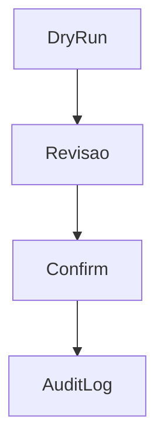

# `commercial-purge` — Purge comercial

| Campo | Valor |
|-------|-------|
| **Slug** | `commercial-purge` |
| **Modos** | Lite, Pro (admin) |
| **Atores** | owner_system, admin_sql |
| **UI** | `Complementos → Purge` |
| **API** | `/api/installation/commercial-purge/*` |
| **Status** | active |
| **Última revisão** | 2026-08-09 |

---

## 1. Visão e escopo

### Propósito
Apagar dados comerciais de forma explícita (dry-run, scopes, audit). Nunca ligado ao OFF do multi.

### Dentro do escopo
- Dry-run
- Purge por scope
- Auditoria

### Fora do escopo
- Apagar inventário de totens sem confirmação explícita de scope

### Vocabulário
| Termo | Significado |
|-------|-------------|
| dry-run | simulação sem delete |
| scope | conjunto de entidades |

---

## 2. Requisitos (EARS)

| ID | Tipo | Requisito |
|----|------|-----------|
| REQ-PRG-001 | Unwanted | Mode=off não deve disparar purge. |
| REQ-PRG-002 | Ubiquitous | Purge real exige confirmação explícita após dry-run. |

---

## 3. Regras de negócio

### RN-PRG-001 — OFF ≠ purge

```text
RN-PRG-001 — OFF ≠ purge
Quando: mudar para Direct
Se: sempre
Então: dados comerciais permanecem
Excepto: —
Motivo: Segurança
```

### RN-PRG-002 — Só owner/admin_sql

```text
RN-PRG-002 — Só owner/admin_sql
Quando: outro role
Se: chamar purge
Então: negado
Excepto: —
Motivo: Governança
```

---

## 4. Fluxos



---

## 5. Estados

| Estado | Significado | Transições típicas |
|--------|-------------|--------------------|
| preview | dry-run | → executed/cancelled |

---

## 6. Critérios de aceite

### AC-PRG-001 (P0)

```text
DADO dados Lite existentes
QUANDO mode off
ENTÃO dados ainda consultáveis até purge explícito
```

---

## 7. Dependências e referências

### Módulos relacionados
- [`system-modules`](../system-modules/MODULO.md)
- [`product-modes`](../product-modes/MODULO.md)

### Referências
- `docs/manuais/04-MANUAL-ADMINISTRATIVO.md`
