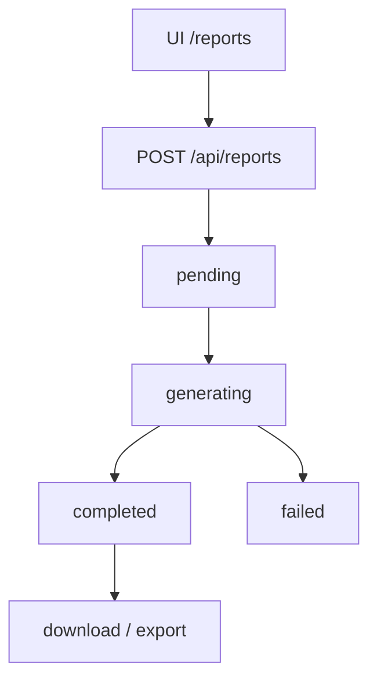
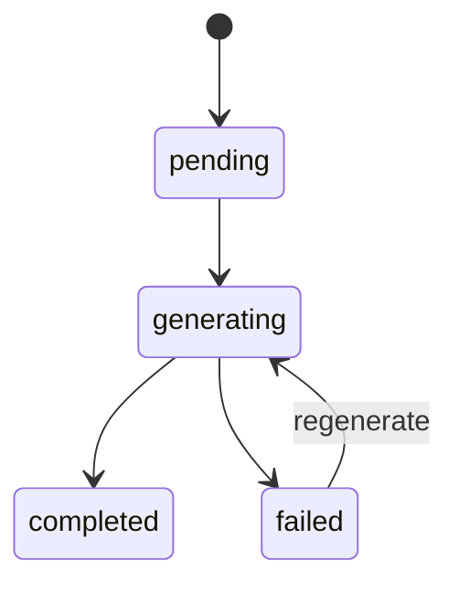

# `commercial-reports` — Relatórios comerciais

| Campo | Valor |
|-------|-------|
| **Slug** | `commercial-reports` |
| **Modos** | Pro |
| **Atores** | admin, comercial, faturamento |
| **UI** | `/reports` |
| **API** | `/api/reports` |
| **Status** | active |
| **Profundidade** | L2 |
| **Última revisão** | 2026-08-09 |

---

## 1. Visão e escopo

### Propósito
Geração, armazenamento e download de relatórios comerciais (campanha, billing, analytics, …) sob módulo `commercial_reports`.

### Dentro do escopo
- CRUD reports + regenerate + download
- Templates / formats / bulk-generate
- Export excel/pdf/csv
- Stats e types

### Fora do escopo
- Telemetria técnica de player (ver telemetry)
- Relatórios em preset Lite (módulo off)

### Vocabulário
| Termo | Significado |
|-------|-------------|
| report | artefacto em `reports` |
| status | `pending` \| `generating` \| `completed` \| `failed` |
| type | `campaign` \| `totem` \| `publisher` \| `subscriber` \| `media` \| `billing` \| `analytics` \| `custom` |

---

## 2. Requisitos (EARS)

| ID | Tipo | Requisito |
|----|------|-----------|
| REQ-REP-001 | State-driven | Disponível só com `commercial_reports` on (Pro). |
| REQ-REP-002 | Event-driven | Quando generate inicia, status passa a generating. |
| REQ-REP-003 | Event-driven | Quando falha, status=failed. |
| REQ-REP-004 | Unwanted | Role limitada não deve exportar dados fora do tenant. |
| REQ-REP-005 | Ubiquitous | Download só para reports completed. |
| REQ-REP-006 | Optional | bulk-generate cria N pedidos. |

---

## 3. Regras de negócio

### RN-REP-001 — Gate módulo

```text
RN-REP-001 — Gate módulo
Quando: API /reports
Se: módulo off
Então: 403
Excepto: —
Motivo: Preset Lite/Direct
```


### RN-REP-002 — Escopo ACL

```text
RN-REP-002 — Escopo ACL
Quando: gerar/exportar
Se: role limitada
Então: só dados autorizados
Excepto: —
Motivo: Privacidade
```


### RN-REP-003 — Download completed

```text
RN-REP-003 — Download completed
Quando: GET download/:id
Se: status≠completed
Então: rejeitar
Excepto: —
Motivo: Artefacto inexistente
```


### RN-REP-004 — Type válido

```text
RN-REP-004 — Type válido
Quando: POST
Se: type fora do enum (exceto legacy client)
Então: rejeitar ou mapear
Excepto: —
Motivo: Schema
```


### RN-REP-005 — Regenerate

```text
RN-REP-005 — Regenerate
Quando: POST :id/regenerate
Se: sempre
Então: novo ciclo pending→…
Excepto: —
Motivo: Actualizar dados
```


---

## 4. Fluxos



---

## 5. Estados

| Campo | Valores |
|-------|---------|
| status | `pending`, `generating`, `completed`, `failed` |
| format | `pdf`, `excel`, `csv`, `json` |



---

## 6. Critérios de aceite

### AC-REP-001 (P0)

```text
DADO mode lite
QUANDO GET /api/reports
ENTÃO 403 MODULE_DISABLED
```


### AC-REP-002 (P0)

```text
DADO report completed
QUANDO GET download/:id
ENTÃO ficheiro/stream disponível
```


### AC-REP-003 (P0)

```text
DADO utilizador escopo org A
QUANDO gerar relatório de billing
ENTÃO sem dados de org B
```


---

## 7. Dependências e referências

### Módulos
- [`billing`](../billing/MODULO.md), [`campaigns`](../campaigns/MODULO.md), [`subscribers`](../subscribers/MODULO.md), [`analytics-ai`](../analytics-ai/MODULO.md)

### Código de referência
- `backend/src/routes/reports.ts`
- `backend/src/services/reportsService.ts`
- `frontend/src/pages/Reports/Reports.tsx`
- schema part6 `reports`, `report_templates`

### Lacunas conhecidas
- Geração pode ser sintética/parcial por tipo.
- Type legacy `client` ainda aceite no service.
