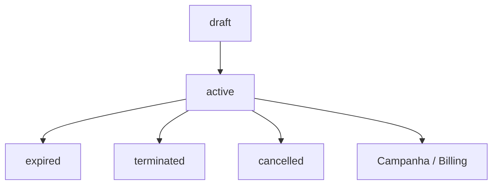
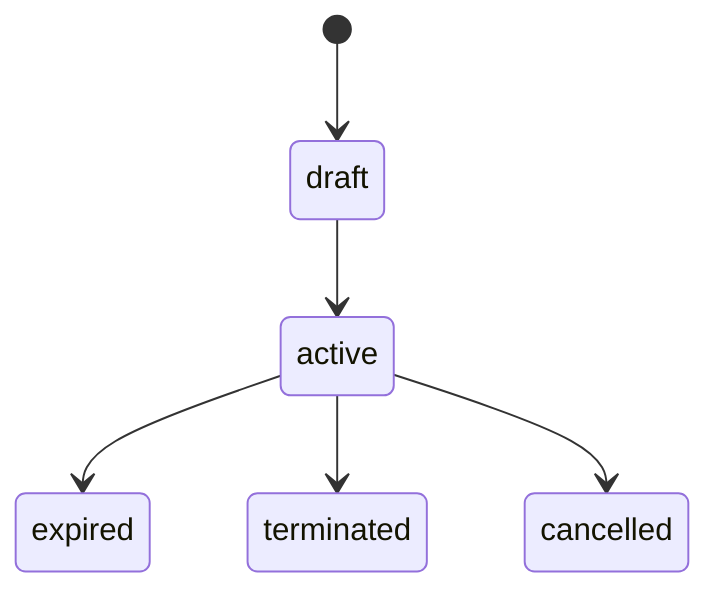

# `contracts` — Contratos

| Campo | Valor |
|-------|-------|
| **Slug** | `contracts` |
| **Modos** | Pro |
| **Atores** | admin, faturamento, comercial |
| **UI** | `/contracts, /subscriber-contracts, /publisher-contracts` |
| **API** | `/api/contracts` |
| **Status** | active |
| **Profundidade** | L2 |
| **Última revisão** | 2026-08-09 |

---

## 1. Visão e escopo

### Propósito
Contratos de anunciantes e organizações; no Pro amarram campanhas a `plan_id` e vigência (`draft`→`active`→…).

### Dentro do escopo
- CRUD subscriber contracts + publishers associados
- Publisher contracts (`/publisher-contracts`)
- Auditoria de contratos
- Estados de vigência

### Fora do escopo
- Obrigatório no Lite (SPA substitui)
- Cálculo de fatura (billing consome)

### Vocabulário
| Termo | Significado |
|-------|-------------|
| subscriber_contract | contrato do anunciante |
| publisher_contract | contrato da org |
| status | `draft` \| `active` \| `expired` \| `terminated` \| `cancelled` |

---

## 2. Requisitos (EARS)

| ID | Tipo | Requisito |
|----|------|-----------|
| REQ-CTR-001 | State-driven | Campanhas Pro executáveis devem ligar-se a contrato activo com plano quando a política exige. |
| REQ-CTR-002 | Unwanted | Contrato expirado/cancelled não deve autorizar novos binds de execução. |
| REQ-CTR-003 | Event-driven | Quando vigência termina, status tende a `expired`. |
| REQ-CTR-004 | Ubiquitous | Subscriber contract referencia subscriber e tipicamente plan_id. |
| REQ-CTR-005 | Ubiquitous | Só roles comerciais/admin gerem contratos. |
| REQ-CTR-006 | Optional | Audit trail regista mudanças críticas. |

---

## 3. Regras de negócio

### RN-CTR-001 — Sem contrato activo

```text
RN-CTR-001 — Sem contrato activo
Quando: dispatch campanha Pro
Se: contrato ausente/expirado
Então: não despacha
Excepto: —
Motivo: Modelo Pro
```


### RN-CTR-002 — Draft não executa

```text
RN-CTR-002 — Draft não executa
Quando: status=draft
Se: runtime
Então: inelegível
Excepto: —
Motivo: Ciclo de vida
```


### RN-CTR-003 — Tipos CHECK

```text
RN-CTR-003 — Tipos CHECK
Quando: create
Se: type inválido
Então: rejeitar
Excepto: —
Motivo: Schema subscriber/publisher types
```


### RN-CTR-004 — Publishers do contrato

```text
RN-CTR-004 — Publishers do contrato
Quando: vincular publisher
Se: fora da lista/plano
Então: rejeitar
Excepto: —
Motivo: Escopo comercial
```


### RN-CTR-005 — Terminate irreversível

```text
RN-CTR-005 — Terminate irreversível
Quando: terminated/cancelled
Se: reactivar
Então: só via novo contrato ou fluxo explícito
Excepto: —
Motivo: Compliance
```


---

## 4. Fluxos



---

## 5. Estados

| Entidade | Valores |
|----------|---------|
| contract.status | `draft`, `active`, `expired`, `terminated`, `cancelled` |
| subscriber type | `advertising`, `subscription`, `partnership` |
| publisher type | `revenue_share`, `subscription`, `partnership`, `hybrid` |



---

## 6. Critérios de aceite

### AC-CTR-001 (P0)

```text
DADO contrato expired
QUANDO dispatch campanha Pro ligada a ele
ENTÃO itens não entram
```


### AC-CTR-002 (P0)

```text
DADO contrato draft
QUANDO activar campanha que exige contrato active
ENTÃO bloqueado
```


### AC-CTR-003 (P0)

```text
DADO subscriber A
QUANDO GET contratos
ENTÃO não lista contratos de subscriber B
```


---

## 7. Dependências e referências

### Módulos
- [`plans`](../plans/MODULO.md), [`subscribers`](../subscribers/MODULO.md), [`campaigns`](../campaigns/MODULO.md), [`billing`](../billing/MODULO.md)

### Código de referência
- `backend/src/routes/contracts.ts`
- `backend/src/services/contractService.ts`, `publisherContractService.ts`, `contractAuditService.ts`
- `frontend/src/pages/Contracts/`
- schema part4 `subscriber_contracts`, `publisher_contracts`

### Lacunas conhecidas
- Fluxos legacy sem `contract_id` ainda podem existir em campanhas antigas.
