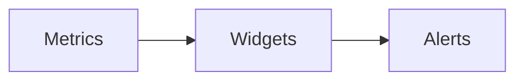

# `dashboard` — Dashboard

| Campo | Valor |
|-------|-------|
| **Slug** | `dashboard` |
| **Modos** | Lite, Pro (Direct usa Publicar como home) |
| **Atores** | todos com painel |
| **UI** | `/dashboard` |
| **API** | `/api/dashboard, /api/alerts` |
| **Status** | active |
| **Última revisão** | 2026-08-09 |

---

## 1. Visão e escopo

### Propósito
Visão operacional/comercial (totens offline, KPIs).

### Dentro do escopo
- Widgets de estado
- Alertas

### Fora do escopo
- Substitui Publicar em Totem no Direct

### Vocabulário
| Termo | Significado |
|-------|-------------|
| KPI | indicador |

---

## 2. Requisitos (EARS)

| ID | Tipo | Requisito |
|----|------|-----------|
| REQ-DSH-001 | State-driven | No Direct a home operacional é Publicar em Totem. |

---

## 3. Regras de negócio

### RN-DSH-001 — Escopo

```text
RN-DSH-001 — Escopo
Quando: dashboard
Se: role publisher
Então: só dados da org
Excepto: —
Motivo: ACL
```

---

## 4. Fluxos



---

## 5. Estados

| Estado | Significado | Transições típicas |
|--------|-------------|--------------------|
| ok | sem alertas críticos | → warning/critical |

---

## 6. Critérios de aceite

### AC-DSH-001 (P0)

```text
DADO totem offline
QUANDO abrir dashboard
ENTÃO alerta/indicador reflecte offline
```

---

## 7. Dependências e referências

### Módulos relacionados
- [`totems`](../totems/MODULO.md)
- [`telemetry-heartbeat`](../telemetry-heartbeat/MODULO.md)

### Referências
- —
