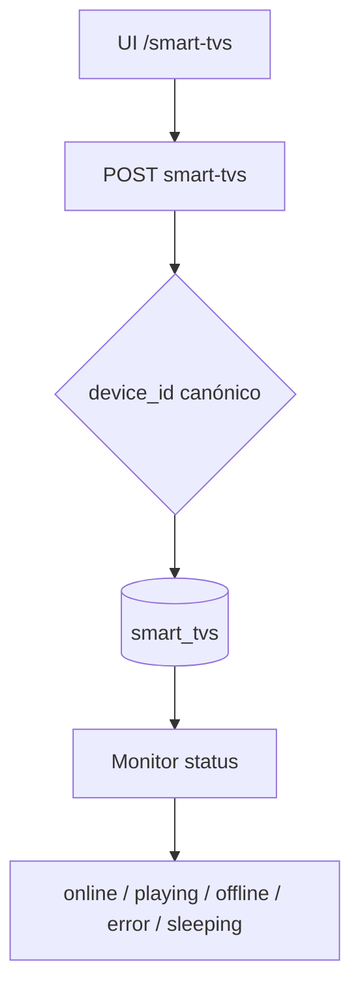
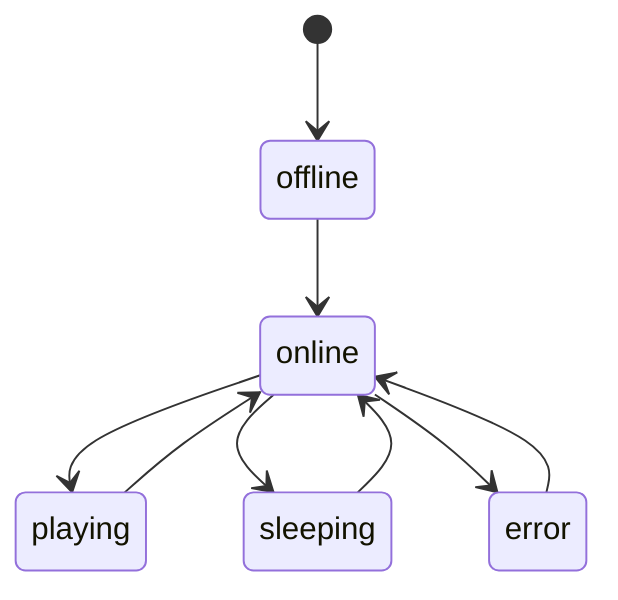

# `devices-smart-tvs` — Smart TVs e players

| Campo | Valor |
|-------|-------|
| **Slug** | `devices-smart-tvs` |
| **Modos** | Lite, Pro |
| **Atores** | admin, operador_tecnico |
| **UI** | `/smart-tvs` |
| **API** | `/api/smart-tvs` |
| **Status** | active |
| **Profundidade** | L2 |
| **Última revisão** | 2026-08-09 |

---

## 1. Visão e escopo

### Propósito
Inventário técnico de Smart TVs (`smart_tvs`) ligadas a totens, com status e orientação — complemento ao inventário de totens.

### Dentro do escopo
- CRUD `/api/smart-tvs` (`requireModule('devices')`)
- Lookup por totem; normalização de `device_id`
- Status operacional e orientação

### Fora do escopo
- Substituir cadastro de totens
- Auth do Player-AD (UIN)

### Vocabulário
| Termo | Significado |
|-------|-------------|
| smart_tv | display/player registado |
| device_id | identificador canónico UPPER |
| status | `offline` \| `online` \| `playing` \| `error` \| `sleeping` |

---

## 2. Requisitos (EARS)

| ID | Tipo | Requisito |
|----|------|-----------|
| REQ-DEV-001 | Ubiquitous | Devices devem normalizar `device_id` (trim+upper) quando informado. |
| REQ-DEV-002 | State-driven | Módulo `devices` off ⇒ API responde MODULE_DISABLED. |
| REQ-DEV-003 | Ubiquitous | Smart TV deve poder associar-se a um `totem_id` válido. |
| REQ-DEV-004 | Unwanted | Lookup case-sensitive não deve duplicar o mesmo device. |
| REQ-DEV-005 | Event-driven | Quando status muda (online/offline/…), listagens reflectem o valor persistido. |
| REQ-DEV-006 | Optional | UI Publishers pode gerir smart TVs além de `/smart-tvs`. |

---

## 3. Regras de negócio

### RN-DEV-001 — Canonical device_id

```text
RN-DEV-001 — Canonical device_id
Quando: create/update/lookup
Se: device_id informado
Então: UPPER(TRIM)
Excepto: —
Motivo: Pareamento estável
```


### RN-DEV-002 — Gate devices

```text
RN-DEV-002 — Gate devices
Quando: rotas /api/smart-tvs
Se: módulo off
Então: 403
Excepto: —
Motivo: Preset instalação
```


### RN-DEV-003 — Totem válido

```text
RN-DEV-003 — Totem válido
Quando: POST com totem_id
Se: totem inexistente
Então: rejeitar
Excepto: —
Motivo: FK inventário
```


### RN-DEV-004 — Orientação CHECK

```text
RN-DEV-004 — Orientação CHECK
Quando: PUT orientation
Se: fora de landscape/portrait
Então: rejeitar
Excepto: —
Motivo: Schema
```


### RN-DEV-005 — Não substitui totem

```text
RN-DEV-005 — Não substitui totem
Quando: operação de publish
Se: só smart_tv
Então: exige totem canónico
Excepto: —
Motivo: Cadeia publisher→local→totem
```


---

## 4. Fluxos



---

## 5. Estados

| Campo | Valores |
|-------|---------|
| `status` | `offline`, `online`, `playing`, `error`, `sleeping` |
| `orientation` | `landscape`, `portrait` |



---

## 6. Critérios de aceite

### AC-DEV-001 (P0)

```text
DADO device_id 'abc'
QUANDO guardar e procurar 'ABC'
ENTÃO mesmo registo
```


### AC-DEV-002 (P0)

```text
DADO módulo devices off
QUANDO GET /api/smart-tvs
ENTÃO 403 MODULE_DISABLED
```


### AC-DEV-003 (P0)

```text
DADO totem_id inexistente
QUANDO POST smart-tvs
ENTÃO rejeitado
```


---

## 7. Dependências e referências

### Módulos
- [`totems`](../totems/MODULO.md), [`player-ad`](../player-ad/MODULO.md), [`telemetry-heartbeat`](../telemetry-heartbeat/MODULO.md), [`system-modules`](../system-modules/MODULO.md)

### Código de referência
- `backend/src/routes/smart-tvs.ts`
- `backend/src/services/smartTvService.ts`
- `frontend/src/pages/SmartTvs/SmartTvs.tsx`
- `database/smartchannel-db-v2-refactored-part3-tables-dependent.sql` (`smart_tvs`)

### Lacunas conhecidas
- Doc gerador menciona `/api/players` — inventário principal é `smart-tvs`.
- Página “devices” genérica não existe; foco Smart TV.
