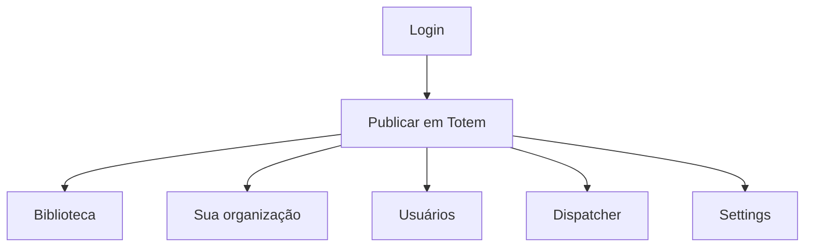

# `direct-totem-mode` — Direct Totem (UI mínima)

| Campo | Valor |
|-------|-------|
| **Slug** | `direct-totem-mode` |
| **Modos** | Direct |
| **Atores** | owner_system, admin_sql, admin, operator |
| **UI** | `/publish-totem (home), /media, /publishers, /users, /dispatcher-*, /settings` |
| **API** | `perfil compact / single_publisher` |
| **Status** | active |
| **Última revisão** | 2026-08-09 |

---

## 1. Visão e escopo

### Propósito
Experiência monousuário: publicar mídias nos totens da própria organização sem menus comerciais.

### Dentro do escopo
- Menu curto
- Home em Publicar em Totem
- Uma organização implícita

### Fora do escopo
- Anunciantes, planos, billing, OTA admin (presets off)

### Vocabulário
| Termo | Significado |
|-------|-------------|
| single_publisher | perfil Direct |
| core_publish | publicação + mídias |

---

## 2. Requisitos (EARS)

| ID | Tipo | Requisito |
|----|------|-----------|
| REQ-DIR-001 | State-driven | Enquanto mode=off, o menu Direct deve ser o menu principal. |
| REQ-DIR-002 | Unwanted | Itens exclusivos Lite/Pro não devem aparecer no menu Direct. |

---

## 3. Regras de negócio

### RN-DIR-001 — Home Direct

```text
RN-DIR-001 — Home Direct
Quando: Login em mode=off
Se: sempre
Então: destino operacional principal é Publicar em Totem
Excepto: —
Motivo: Ciclo curto de publicação
```

---

## 4. Fluxos



---

## 5. Estados

| Estado | Significado | Transições típicas |
|--------|-------------|--------------------|
| activo | mode=off | → inactivo quando lite/full |

---

## 6. Critérios de aceite

### AC-DIR-001 (P0)

```text
DADO mode=off e owner_system
QUANDO abrir menu
ENTÃO vê Publicar, Biblioteca, Organização, Usuários, Complementos, Dispatcher, Configurações
```

---

## 7. Dependências e referências

### Módulos relacionados
- [`product-modes`](../product-modes/MODULO.md)
- [`publish-totem`](../publish-totem/MODULO.md)
- [`media-library`](../media-library/MODULO.md)

### Referências
- `docs/manuais/02-GUIA-PRIMEIRA-VEZ-UTILIZADOR.md`
