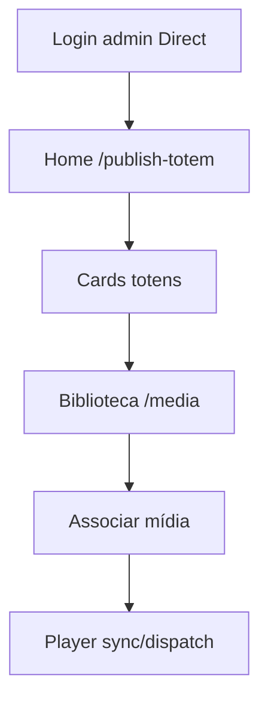

# `direct-totem-mode` — Direct Totem (UI mínima)

| Campo | Valor |
|-------|-------|
| **Slug** | `direct-totem-mode` |
| **Modos** | Direct (`product-modes` = off) |
| **Atores** | menu: owner_system, admin_sql, admin |
| **UI** | home `/publish-totem`; menu curto |
| **API** | núcleo sem requireModule comercial; flag `direct_totem_mode` |
| **Status** | active |
| **Profundidade** | L2 |
| **Última revisão** | 2026-08-09 |

---

## 1. Visão e escopo

### Propósito
Perfil de produto single-publisher: operação de totens e mídia sem superfície comercial multi-anunciante.

### Dentro do escopo
- Home e menu Direct
- Upload/media sem subscriber obrigatório
- Org única (`is_system_owner`)
- Esconder financeiro em Settings

### Fora do escopo
- Campanhas, SPA, billing, OTA admin
- Definição completa do catálogo (ver `system-modules`)

### Vocabulário
| Termo | Significado |
|-------|-------------|
| Direct | mode off + `direct_totem_mode` |
| menu mínimo | Publish, Media, Org, Users*, Settings*, Dispatcher* |
| capabilities | fonte frontend (`getInstallationCapabilities`) |
| env Direct | `DIRECT_TOTEM_MODE` no backend (legado) |

---

## 2. Requisitos (EARS)

| ID | Tipo | Requisito |
|----|------|-----------|
| REQ-DIR-001 | State-driven | Enquanto Direct activo, a home deve ser `/publish-totem`. |
| REQ-DIR-002 | State-driven | Enquanto Direct, o menu comercial deve estar ausente. |
| REQ-DIR-003 | Event-driven | Quando lite/full, Direct deve desligar. |
| REQ-DIR-004 | Ubiquitous | Upload de mídia em Direct deve funcionar sem subscriber. |
| REQ-DIR-005 | Unwanted | Roles fora de owner/admin_sql/admin não devem ver menu Direct. |
| REQ-DIR-006 | Optional | Dispatcher permanece locked on mesmo em Direct. |

---

## 3. Regras de negócio

### RN-DIR-001 — Home Publish

```text
RN-DIR-001 — Home Publish
Quando: getAppHomePath / Navigate root
Se: Direct
Então: /publish-totem
Excepto: —
Motivo: Operação first
```

### RN-DIR-002 — Menu curto

```text
RN-DIR-002 — Menu curto
Quando: getDirectTotemMenu
Se: Direct
Então: só entradas do preset Direct
Excepto: items condicionados a role
Motivo: UX mínima
```

### RN-DIR-003 — Roles de menu

```text
RN-DIR-003 — Roles de menu
Quando: montar menu Direct
Se: role ∉ owner_system|admin_sql|admin
Então: menu vazio
Excepto: —
Motivo: Superfície restrita (código actual)
```

### RN-DIR-004 — Upload sem subscriber

```text
RN-DIR-004 — Upload sem subscriber
Quando: POST /api/media/upload
Se: Direct
Então: amarrar publisher_id; subscriber opcional/null
Excepto: —
Motivo: Single publisher
```

### RN-DIR-005 — Settings sem financeiro

```text
RN-DIR-005 — Settings sem financeiro
Quando: Settings em Direct
Se: sempre
Então: ocultar secções financeiras
Excepto: —
Motivo: Produto não comercial
```

### RN-DIR-006 — Env vs capabilities (lacuna)

```text
RN-DIR-006 — Env vs capabilities
Quando: backend decide Direct em media
Se: DIRECT_TOTEM_MODE env
Então: pode divergir do frontend capabilities
Excepto: alinhar ambos à installation.modules
Motivo: Dívida técnica documentada
```

---

## 4. Fluxos



---

## 5. Estados

| Condição | Direct? |
|----------|---------|
| mode=off + direct_totem_mode | sim |
| mode=lite\|full | não |
| env DIRECT_TOTEM_MODE=false | backend trata como não-Direct (mesmo se UI diga o contrário) |

---

## 6. Critérios de aceite

### AC-DIR-001 (P0)

```text
DADO mode=off
QUANDO login admin
ENTÃO aterra em /publish-totem e não vê Campanhas
```

### AC-DIR-002 (P0)

```text
DADO Direct
QUANDO upload em /media sem subscriber
ENTÃO sucesso com publisher_id
```

### AC-DIR-003 (P0)

```text
DADO operator (se existir)
QUANDO login em Direct
ENTÃO menu vazio ou sem entradas Direct (conforme RN-DIR-003)
```

---

## 7. Dependências e referências

### Módulos
- [`product-modes`](../product-modes/MODULO.md), [`system-modules`](../system-modules/MODULO.md)
- [`publish-totem`](../publish-totem/MODULO.md), [`media-library`](../media-library/MODULO.md)
- [`organization`](../organization/MODULO.md), [`users-access`](../users-access/MODULO.md)

### Código de referência
- `frontend/src/utils/menuHierarchy.tsx` (`getDirectTotemMenu`)
- `frontend/src/config/directTotemMode.ts`
- `backend/src/config/directTotemMode.ts`
- `backend/src/policy/installationModules.ts` (`buildCoreOperationPreset`)

### Lacunas conhecidas
- Env backend vs capabilities frontend.
- Docs antigas mencionam operator no Direct; menu código restringe a 3 roles.
