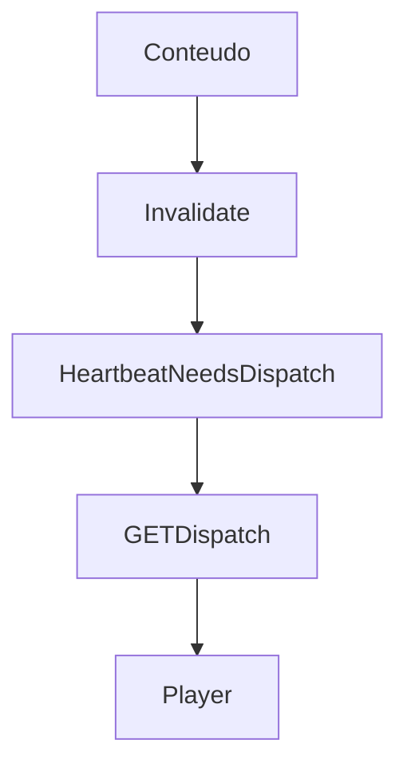

# `dispatcher` — Dispatcher

| Campo | Valor |
|-------|-------|
| **Slug** | `dispatcher` |
| **Modos** | all (locked on) |
| **Atores** | owner/admin, operador técnico |
| **UI** | `/dispatcher-manager, /dispatcher-monitor, /dispatcher-debug` |
| **API** | `/api/dispatcher-totem, /api/dispatcher-debug, /api/player/dispatch` |
| **Status** | active |
| **Última revisão** | 2026-08-09 |

---

## 1. Visão e escopo

### Propósito
Motor e monitorização do tráfego servidor↔totens (dispatch plan, timeline, debug).

### Dentro do escopo
- Gerar/servir DispatchPlan
- Monitor incoming/outgoing
- Debug

### Fora do escopo
- UI de publicação comercial

### Vocabulário
| Termo | Significado |
|-------|-------------|
| needsDispatch | heartbeat indica plano novo |
| planVersion | fingerprint do plano |

---

## 2. Requisitos (EARS)

| ID | Tipo | Requisito |
|----|------|-----------|
| REQ-DSP-001 | Ubiquitous | dispatcher_admin permanece activo em todos os modes. |
| REQ-DSP-002 | Event-driven | Mudança de conteúdo relevante deve invalidar cache e marcar needsDispatch. |

---

## 3. Regras de negócio

### RN-DSP-001 — Plan versioning

```text
RN-DSP-001 — Plan versioning
Quando: player envia knownPlanVersion
Se: igual ao servidor
Então: needsDispatch=false
Excepto: —
Motivo: Poupar banda
```

### RN-DSP-002 — EMPTY vs UNAVAILABLE

```text
RN-DSP-002 — EMPTY vs UNAVAILABLE
Quando: sem mídias
Se: intencional
Então: EMPTY_PLAN; falha de rede ≠ empty
Excepto: —
Motivo: Estabilidade Player
```

---

## 4. Fluxos



---

## 5. Estados

| Estado | Significado | Transições típicas |
|--------|-------------|--------------------|
| plan_cached | player tem versão | → outdated |
| needs_dispatch | buscar plano | → applied |

---

## 6. Critérios de aceite

### AC-DSP-001 (P0)

```text
DADO mode off
QUANDO abrir dispatcher monitor
ENTÃO acessível ao owner
```

---

## 7. Dependências e referências

### Módulos relacionados
- [`totems`](../totems/MODULO.md)
- [`campaigns`](../campaigns/MODULO.md)
- [`publish-totem`](../publish-totem/MODULO.md)
- [`player-ad`](../player-ad/MODULO.md)

### Referências
- `docs/DESENHO-SONOLENCIA-BATIMENTO-POLL-ADAPTIVE.md`
