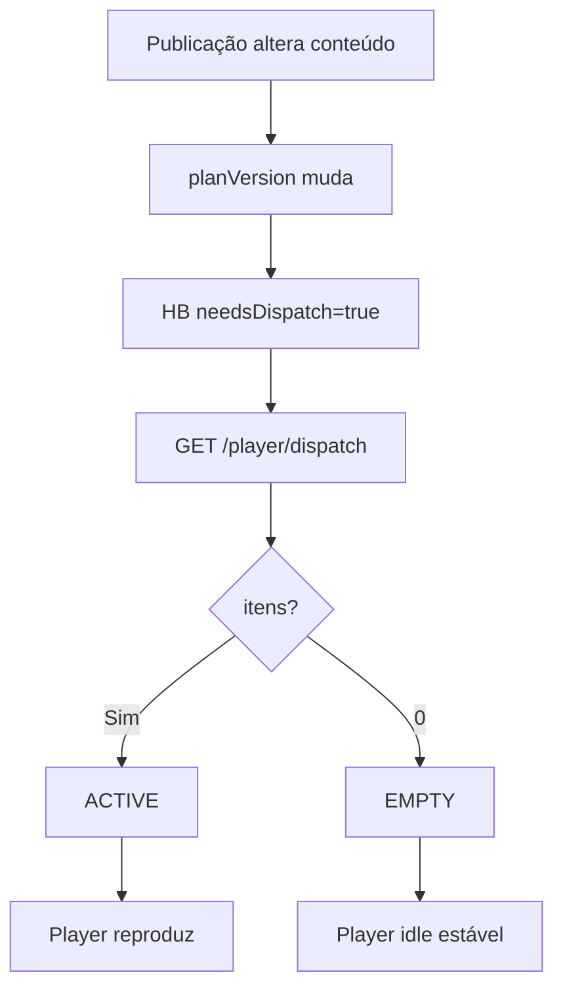

# `dispatcher` — Dispatcher

| Campo | Valor |
|-------|-------|
| **Slug** | `dispatcher` |
| **Modos** | all (módulo locked on) |
| **Atores** | ops com `flag_smart_2`; Player consome plano |
| **UI** | `/dispatcher-manager`, `/dispatcher-monitor`, `/dispatcher-debug`, `/playlist-mix` |
| **API** | `/api/dispatcher-totem/*`, `/api/dispatcher-debug/*`, `/api/player/dispatch` |
| **Status** | active |
| **Profundidade** | L2 |
| **Última revisão** | 2026-08-09 |

---

## 1. Visão e escopo

### Propósito
Calcular e servir o **plano de reprodução** por totem (versão, candidatos, cache) e diagnosticar decisões.

### Dentro do escopo
- GET dispatch por totem (ops + player)
- History / candidates / diagnostics
- Cache config
- Debug Redis/queries/messages
- Integração `needsDispatch` no heartbeat

### Fora do escopo
- CRUD de campanhas/playlists (só consome)
- Comandos remotos (pode invalidar plano via refresh)

### Vocabulário
| Termo | Significado |
|-------|-------------|
| planVersion | hash/versão do plano actual |
| needsDispatch | HB flag: Player deve GET dispatch |
| EMPTY vs UNAVAILABLE | vazio válido vs falha |
| decision | registo em dispatcher_decisions* |

---

## 2. Requisitos (EARS)

| ID | Tipo | Requisito |
|----|------|-----------|
| REQ-DSP-001 | Ubiquitous | O Player deve obter plano via GET `/api/player/dispatch` quando necessário. |
| REQ-DSP-002 | Event-driven | Quando `knownPlanVersion == planVersion`, needsDispatch deve ser false. |
| REQ-DSP-003 | Ubiquitous | planState ACTIVE exige itens; EMPTY exige zero itens. |
| REQ-DSP-004 | Event-driven | Quando invalidate/refresh_dispatch, o Player deve voltar a pedir plano. |
| REQ-DSP-005 | Optional | Ops podem inspeccionar candidates/diagnostics com flag. |
| REQ-DSP-006 | Unwanted | Acesso cross-totem fora de scope deve ser negado. |

---

## 3. Regras de negócio

### RN-DSP-001 — Version short-circuit

```text
RN-DSP-001 — Version short-circuit
Quando: peek HB
Se: knownPlanVersion == planVersion
Então: needsDispatch=false
Excepto: refresh forçado
Motivo: Poupar bandwidth/CPU
```

### RN-DSP-002 — EMPTY vs UNAVAILABLE

```text
RN-DSP-002 — EMPTY vs UNAVAILABLE
Quando: resolver planState
Se: 0 itens válidos por regra de negócio
Então: EMPTY (não erro)
Excepto: falha de cálculo → UNAVAILABLE
Motivo: Evitar reboot em totem sem conteúdo
```

### RN-DSP-003 — Invalidate força refresh

```text
RN-DSP-003 — Invalidate força refresh
Quando: comando refresh_dispatch / invalidate cache
Se: sucesso
Então: próximo ciclo needsDispatch=true
Excepto: —
Motivo: Propagar publicação
```

### RN-DSP-004 — Cache configurável

```text
RN-DSP-004 — Cache configurável
Quando: GET/POST cache/config
Se: autorizado
Então: ttl/maxSize aplicáveis
Excepto: —
Motivo: Tuning ops
```

### RN-DSP-005 — Scope por totem

```text
RN-DSP-005 — Scope por totem
Quando: /dispatcher-totem/:totemId/*
Se: fora do escopo do user
Então: 403
Excepto: super-admin
Motivo: Multi-tenant
```

### RN-DSP-006 — Locked module

```text
RN-DSP-006 — Locked module
Quando: installation modules
Se: dispatcher_admin
Então: sempre enabled
Excepto: —
Motivo: Núcleo Player
```

---

## 4. Fluxos



---

## 5. Estados

| Estado | Significado |
|--------|-------------|
| plan_cached | cache hit |
| needs_dispatch | Player deve buscar |
| ACTIVE / EMPTY | planState |
| cache on/off | config |

---

## 6. Critérios de aceite

### AC-DSP-001 (P0)

```text
DADO planVersion inalterado
QUANDO heartbeat com knownPlanVersion
ENTÃO needsDispatch=false
```

### AC-DSP-002 (P0)

```text
DADO totem sem mídias elegíveis
QUANDO dispatch
ENTÃO EMPTY_PLAN (não erro fatal)
```

### AC-DSP-003 (P0)

```text
DADO refresh_dispatch
QUANDO próximo HB
ENTÃO needsDispatch=true e novo GET altera/confirma plano
```

---

## 7. Dependências e referências

### Módulos
- [`player-ad`](../player-ad/MODULO.md), [`playlists`](../playlists/MODULO.md)
- [`campaigns`](../campaigns/MODULO.md), [`playlist-mix`](../playlist-mix/MODULO.md)
- [`remote-control`](../remote-control/MODULO.md), [`publish-totem`](../publish-totem/MODULO.md)

### Código de referência
- `backend/src/services/dispatcherTotemService.ts`, `dispatcherRouter.ts`
- `backend/src/routes/dispatcher-totem.ts`, `dispatcher-debug.ts`
- `frontend/src/pages/DispatcherManager|Monitor|Debug/`
- schema part6 `dispatcher_*`
- `docs/DESENHO-SONOLENCIA-BATIMENTO-POLL-ADAPTIVE.md`
