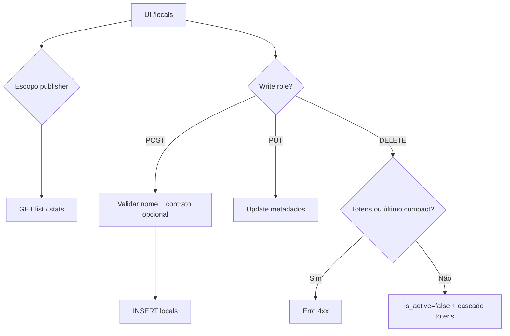
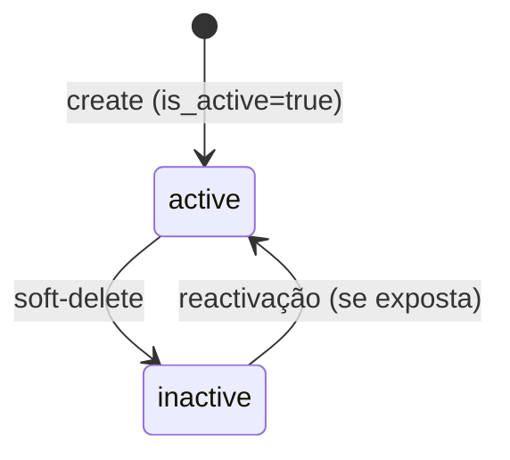

# `locals` — Unidades / locais

| Campo | Valor |
|-------|-------|
| **Slug** | `locals` |
| **Modos** | all (núcleo; Direct / Lite / Pro) |
| **Atores** | admin*, owner_system; create/delete por roles Studio/Pro; update pode incluir `publisher_user` (Studio) |
| **UI** | `/locals` |
| **API** | `/api/locals` (núcleo — sem `requireModule`) |
| **Status** | active |
| **Profundidade** | L2 |
| **Última revisão** | 2026-08-09 |

---

## 1. Visão e escopo

### Propósito
Cadastro de unidades físicas/lógicas do publisher onde se instalam totens e Smart TVs; base de inventário e de targeting comercial.

### Dentro do escopo
- CRUD de locais (escopo por publisher / compact owner)
- Soft-delete (`is_active=false`)
- Stats e listagem de totens do local
- Vínculo opcional a contrato (`created_via_contract_id`)
- Defaults geográficos (`country`, `timezone`)

### Fora do escopo
- CRUD de totens (ver `totems`)
- Targeting de campanha (`campaign_locals`)
- Autorização comercial por plano (`plan_local_access` / SPA)

### Vocabulário
| Termo | Significado |
|-------|-------------|
| local | registo em `locals` com `publisher_id` obrigatório |
| `is_active` | soft-off do cadastro (não há enum `status`) |
| compact owner | publisher único da instalação Direct/compact |
| `created_via_contract_id` | rastreio opcional de origem comercial |

---

## 2. Requisitos (EARS)

| ID | Tipo | Requisito |
|----|------|-----------|
| REQ-LOC-001 | Ubiquitous | Cada local deve referenciar um `publisher_id` (constraint `chk_local_owner`). |
| REQ-LOC-002 | Ubiquitous | O nome do local deve ser único por `publisher_id` (validação de aplicação). |
| REQ-LOC-003 | Event-driven | Quando se cria/actualiza um local, o sistema deve persistir metadados e auditar a operação. |
| REQ-LOC-004 | State-driven | Enquanto `is_active=false`, o local não deve aparecer nas listagens com `active_only` por omissão na API. |
| REQ-LOC-005 | Unwanted | O sistema não deve apagar (soft) um local que ainda tenha totens associados, nem o último local activo do publisher em instalação compact. |
| REQ-LOC-006 | Optional | Onde `created_via_contract_id` for informado, o contrato deve estar `active` ou `draft` e não expirado. |

---

## 3. Regras de negócio

### RN-LOC-001 — Publisher obrigatório

```text
RN-LOC-001 — Publisher obrigatório
Quando: create/update de local
Se: sempre
Então: publisher_id NOT NULL (schema + escopo de serviço)
Excepto: —
Motivo: Isolamento multi-tenant e inventário por org
```

### RN-LOC-002 — Escopo de listagem

```text
RN-LOC-002 — Escopo de listagem
Quando: GET /api/locals
Se: utilizador não é admin global da rota
Então: filtrar pelo publisher do contexto (compact owner ou req.user.publisherId)
Excepto: roles admin listadas em locals.ts (visão ampla)
Motivo: Multi-tenant
```

### RN-LOC-003 — Nome único por org

```text
RN-LOC-003 — Nome único por org
Quando: create ou rename
Se: já existe nome igual no mesmo publisher_id
Então: rejeitar
Excepto: —
Motivo: Evitar duplicados operacionais (UNIQUE só na app, não no DB)
```

### RN-LOC-004 — Soft-delete com bloqueios

```text
RN-LOC-004 — Soft-delete com bloqueios
Quando: DELETE /api/locals/:id
Se: existem totens (activos ou não) no local, OU é o último local activo do owner compact
Então: operação negada
Excepto: —
Motivo: Integridade de inventário e instalação mínima
```

### RN-LOC-005 — Cascade ao desactivar

```text
RN-LOC-005 — Cascade ao desactivar
Quando: local passa a is_active=false (trigger)
Se: há totens do local
Então: totens → is_active=false e status='offline'
Excepto: —
Motivo: Totem sem unidade activa não deve operar
```

### RN-LOC-006 — Roles de escrita assimétricas

```text
RN-LOC-006 — Roles de escrita assimétricas
Quando: POST/DELETE vs PUT
Se: instalação Studio
Então: create/delete usam getLocalsWriteRoles(); update usa getLocalsUpdateRoles() (inclui publisher_user)
Excepto: Pro com subset diferente de roles
Motivo: Controlo de inventário vs operação do publisher
```

---

## 4. Fluxos

### CRUD principal


### Fluxos de erro
| ID | Gatilho | Resultado |
|----|---------|-----------|
| FX-LOC-E01 | Fora de escopo / ownership | 403 / 404 |
| FX-LOC-E02 | Nome duplicado no publisher | 4xx validação |
| FX-LOC-E03 | Delete com totens ou último local compact | bloqueado |
| FX-LOC-E04 | Role sem write | 403 |

---

## 5. Estados

| Campo | Valores canónicos |
|-------|-------------------|
| `is_active` | `true` / `false` (sem CHECK de `status` em `locals`) |
| `country` | default `'BR'` |
| `timezone` | default `'America/Sao_Paulo'` |



**Nota:** “active/inactive” no produto = `is_active`, não coluna `status`.

---

## 6. Critérios de aceite

### AC-LOC-001 (P0)

```text
DADO publisher A com local "Loja Centro"
QUANDO criar outro local com o mesmo nome no publisher A
ENTÃO a API rejeita a criação
```

### AC-LOC-002 (P0)

```text
DADO local com pelo menos um totem
QUANDO DELETE /api/locals/:id
ENTÃO operação falha e o local permanece activo
```

### AC-LOC-003 (P0)

```text
DADO utilizador scoped ao publisher B
QUANDO GET /api/locals
ENTÃO só vê locais do publisher B (salvo admin global)
```

### AC-LOC-004 (P1)

```text
DADO instalação compact com um único local activo
QUANDO tentar soft-delete desse local
ENTÃO operação bloqueada
```

---

## 7. Dependências e referências

### Módulos
- [`organization`](../organization/MODULO.md) — `publisher_id`
- [`totems`](../totems/MODULO.md) — inventário sob o local
- [`contracts`](../contracts/MODULO.md) — `created_via_contract_id` opcional
- [`campaigns`](../campaigns/MODULO.md) — targeting via `campaign_locals` (fora deste CRUD)
- [`plans`](../plans/MODULO.md) — `plan_local_access` (fora deste CRUD)

### Código de referência
- `backend/src/routes/locals.ts`
- `backend/src/services/localService.ts`
- `frontend/src/pages/Locals/Locals.tsx`
- `frontend/src/utils/installationModuleAccess.ts` (`CORE_PREFIXES` inclui `/locals`)
- `database/smartchannel-db-v2-refactored-part3-tables-dependent.sql` (`locals`)
- `database/smartchannel-db-v2-refactored-part9-triggers-functions.sql` (cascade desactivar)

### Lacunas conhecidas
- FE Studio pode oferecer create/delete a `publisher_user`; BE só inclui `publisher_user` em **update** → risco de 403 na UI.
- API default `active_only=true` quando query omitida; FE pode listar com `activeOnlyFilter=false` por omissão.
- Unicidade `(name, publisher_id)` só na aplicação — sem UNIQUE no schema.
- Sem `requireModule` (núcleo); documentar como inventário sempre disponível quando a UI core está activa.
