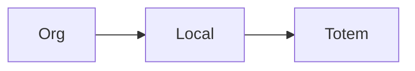

# `locals` — Unidades / locais

| Campo | Valor |
|-------|-------|
| **Slug** | `locals` |
| **Modos** | all |
| **Atores** | admin, publisher, comercial |
| **UI** | `/locals` |
| **API** | `/api/locals` |
| **Status** | active |
| **Última revisão** | 2026-08-09 |

---

## 1. Visão e escopo

### Propósito
Locais físicos/lógicos da organização onde os totens são instalados.

### Dentro do escopo
- CRUD local
- Vínculo a publisher

### Fora do escopo
- Autorização comercial (SPA/planos)

### Vocabulário
| Termo | Significado |
|-------|-------------|
| local | unidade da org |

---

## 2. Requisitos (EARS)

| ID | Tipo | Requisito |
|----|------|-----------|
| REQ-LOC-001 | Ubiquitous | Cada local deve referenciar um publisher. |

---

## 3. Regras de negócio

### RN-LOC-001 — Totem exige local

```text
RN-LOC-001 — Totem exige local
Quando: criar totem
Se: sem local válido
Então: criação inválida/bloqueada
Excepto: —
Motivo: Integridade inventário
```

---

## 4. Fluxos



---

## 5. Estados

| Estado | Significado | Transições típicas |
|--------|-------------|--------------------|
| active | aceita totens | → inactive |

---

## 6. Critérios de aceite

### AC-LOC-001 (P0)

```text
DADO local inactivo
QUANDO atribuir novo totem
ENTÃO operação rejeitada ou impedida na UI
```

---

## 7. Dependências e referências

### Módulos relacionados
- [`organization`](../organization/MODULO.md)
- [`totems`](../totems/MODULO.md)

### Referências
- —
