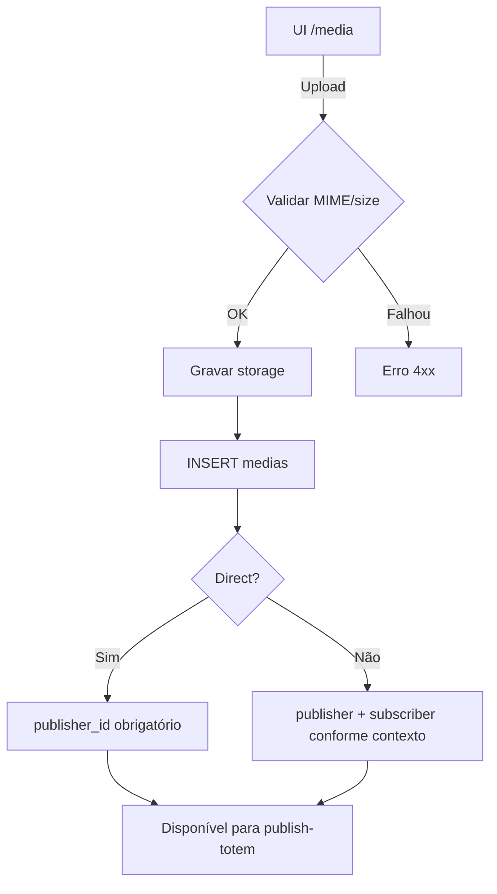
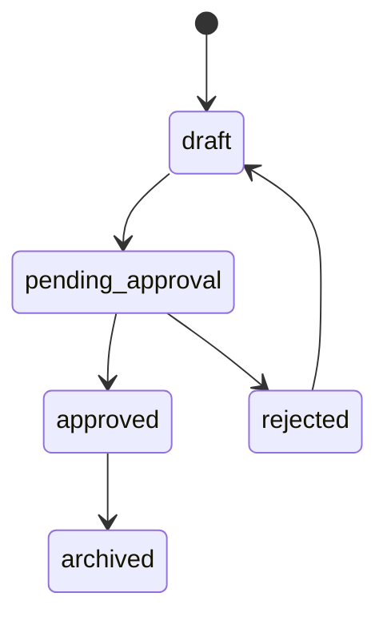

# `media-library` — Biblioteca de mídias

| Campo | Valor |
|-------|-------|
| **Slug** | `media-library` |
| **Modos** | all (menu Direct; Lite/Pro) |
| **Atores** | owner_system, admin_sql, admin, operator, publisher_user (+ subscriber conforme escopo) |
| **UI** | `/media` |
| **API** | `/api/media` |
| **Status** | active |
| **Profundidade** | L2 |
| **Última revisão** | 2026-08-09 |

---

## 1. Visão e escopo

### Propósito
Repositório canónico de ficheiros de mídia (vídeo, imagem, etc.) com upload, metadados, quota e associação a publishers/subscribers.

### Dentro do escopo
- Listar / filtrar / pesquisar mídias
- Upload simples e múltiplo
- Actualizar metadados e estado
- Thumbnail / download
- Stats de storage e quota por subscriber
- Transform / reprocess (ops)

### Fora do escopo
- Associação mídia↔totem (ver `publish-totem` / `totems`)
- Campanhas e playlists (consomem mídia; não CRUD aqui)
- ACL fina por pasta (não existe)

### Vocabulário
| Termo | Significado |
|-------|-------------|
| mídia | registo em `medias` + ficheiro em storage |
| `publisher_id` | org dona (obrigatório em Direct no upload) |
| `subscriber_id` | anunciante opcional (Lite/Pro); pode ser NULL em Direct |
| `status` | ciclo de vida editorial (`draft`…`archived`) |
| `approval_status` | aprovação (`pending`/`approved`/`rejected`) |
| `is_active` | soft-off: omitida de listagens activas |

---

## 2. Requisitos (EARS)

| ID | Tipo | Requisito |
|----|------|-----------|
| REQ-MED-001 | Ubiquitous | O sistema deve listar mídias apenas no escopo publisher/subscriber do utilizador. |
| REQ-MED-002 | Event-driven | Quando um upload é aceite, o sistema deve persistir ficheiro + registo e devolver metadados. |
| REQ-MED-003 | Unwanted | O sistema não deve aceitar MIME/tamanho fora da política Multer. |
| REQ-MED-004 | State-driven | Enquanto `is_active=false`, a mídia não deve aparecer nas listagens activas por omissão. |
| REQ-MED-005 | Event-driven | Quando em Direct Totem Mode, o upload deve amarrar `publisher_id` da instalação. |
| REQ-MED-006 | Optional | Onde existir subscriber, o sistema deve expor quota e stats de storage. |

---

## 3. Regras de negócio

### RN-MED-001 — Escopo de listagem

```text
RN-MED-001 — Escopo de listagem
Quando: GET /api/media
Se: utilizador não é super-admin global
Então: filtrar por publisher_id e/ou subscriber_id do contexto
Excepto: admins com flag explícita de inactivos
Motivo: Isolamento multi-tenant
```

### RN-MED-002 — Upload Direct com publisher

```text
RN-MED-002 — Upload Direct com publisher
Quando: POST /api/media/upload em Direct
Se: isDirectTotemMode()
Então: forçar publisher_id da org single-publisher
Excepto: —
Motivo: Direct não exige anunciante
```

### RN-MED-003 — Inactivas omitidas

```text
RN-MED-003 — Inactivas omitidas
Quando: listagem padrão
Se: is_active = false
Então: omitir do resultado
Excepto: pedidos admin com includeInactive
Motivo: Evitar mídia morta no fluxo operacional
```

### RN-MED-004 — Validação de ficheiro

```text
RN-MED-004 — Validação de ficheiro
Quando: upload
Se: MIME ou tamanho inválido
Então: rejeitar (Multer / validadores)
Excepto: —
Motivo: Segurança e custo de storage
```

### RN-MED-005 — Dualidade status / approval

```text
RN-MED-005 — Dualidade status / approval
Quando: UI actualiza aprovação
Se: campo approvalStatus alterado
Então: manter status editorial coerente na UI
Excepto: APIs legadas que só mexem num dos campos
Motivo: Compatibilidade schema dual
```

### RN-MED-006 — GetById e subscriber

```text
RN-MED-006 — GetById e subscriber
Quando: GET /api/media/:id
Se: resolução de subscriber_id falhar (null) em caminhos que o exigem
Então: pode responder 404
Excepto: fluxos Direct só com publisher_id (lacuna conhecida)
Motivo: Código legado assume vínculo subscriber em alguns paths
```

---

## 4. Fluxos

### Upload


### Fluxos de erro
| ID | Gatilho | Resultado |
|----|---------|-----------|
| FX-MED-E01 | Fora de escopo | 403 / lista vazia |
| FX-MED-E02 | MIME inválido | 400 Multer |
| FX-MED-E03 | GetById sem subscriber resolvido | 404 (ver RN-MED-006) |

---

## 5. Estados

| Campo | Valores canónicos |
|-------|-------------------|
| `status` | `draft`, `pending_approval`, `approved`, `rejected`, `archived` |
| `approval_status` | `pending`, `approved`, `rejected` (ou NULL) |
| `is_active` | true / false |
| `media_type` | `video`, `image`, `html`, `widget`, `iframe`, `audio`, `pdf` |



---

## 6. Critérios de aceite

### AC-MED-001 (P0)

```text
DADO utilizador no escopo da org A
QUANDO listar /api/media
ENTÃO só vê mídias da org A (e subscriber do contexto, se aplicável)
```

### AC-MED-002 (P0)

```text
DADO Direct Totem Mode activo
QUANDO fazer upload de vídeo válido
ENTÃO mídia fica com publisher_id preenchido e aparece em /media
```

### AC-MED-003 (P0)

```text
DADO ficheiro com MIME não permitido
QUANDO upload
ENTÃO operação falha sem criar registo útil
```

### AC-MED-004 (P1)

```text
DADO mídia is_active=false
QUANDO listagem padrão
ENTÃO não aparece
```

---

## 7. Dependências e referências

### Módulos
- [`publish-totem`](../publish-totem/MODULO.md) — consome mídia
- [`organization`](../organization/MODULO.md) — `publisher_id`
- [`direct-totem-mode`](../direct-totem-mode/MODULO.md) — upload sem subscriber
- [`subscribers`](../subscribers/MODULO.md) — quota / vínculo Lite-Pro
- [`campaigns`](../campaigns/MODULO.md) / [`playlists`](../playlists/MODULO.md) — consumidores

### Código de referência
- `backend/src/routes/media.ts`
- `backend/src/services/mediaService.ts`
- `frontend/src/pages/Media/Media.tsx`
- `database/smartchannel-db-v2-refactored-part3-tables-dependent.sql` (`medias`)

### Lacunas conhecidas
- ~~`GET /:id` pode 404 em mídias só-`publisher_id` (Direct)~~ — **resolvido** (`getMediaScopeIds`).
- Validadores Joi legados vs express-validator nas rotas activas.
- Doc antiga “sem duplicar no totem” pertence a `publish-totem`, não à biblioteca.
