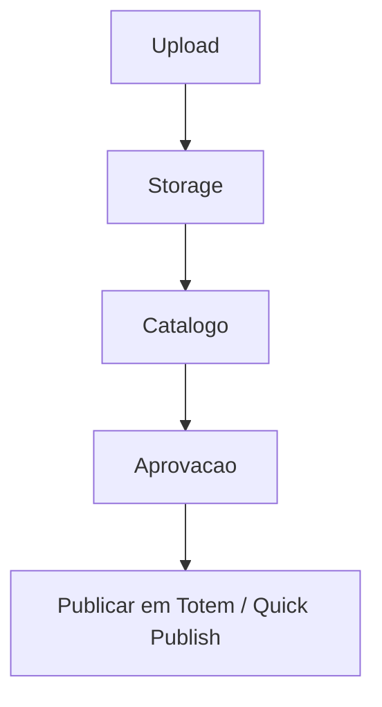

# `media-library` — Biblioteca de mídias

| Campo | Valor |
|-------|-------|
| **Slug** | `media-library` |
| **Modos** | all |
| **Atores** | owner/admin, marketing, publisher |
| **UI** | `/media` |
| **API** | `/api/media` |
| **Status** | active |
| **Última revisão** | 2026-08-09 |

---

## 1. Visão e escopo

### Propósito
Upload, catalogação, aprovação e reutilização de vídeos/imagens/HTML para publicação.

### Dentro do escopo
- Upload
- Metadados
- Aprovação/activação
- Thumbnails
- Associação a totens via publicação

### Fora do escopo
- Edição gráfica publish-board
- Motor de campanhas

### Vocabulário
| Termo | Significado |
|-------|-------------|
| media_id | PK da mídia |
| approval_status | pending/approved/rejected |
| is_active | disponível para publicação |

---

## 2. Requisitos (EARS)

| ID | Tipo | Requisito |
|----|------|-----------|
| REQ-MED-001 | Ubiquitous | Toda mídia deve ter tipo, nome e armazenamento associado. |
| REQ-MED-002 | Unwanted | Mídia inactiva não deve aparecer como disponível para adicionar a totem. |
| REQ-MED-003 | Event-driven | Quando o upload conclui, a mídia deve ficar referenciável por media_id. |

---

## 3. Regras de negócio

### RN-MED-001 — Disponibilidade

```text
RN-MED-001 — Disponibilidade
Quando: Listar biblioteca para totem
Se: is_active=false
Então: mídia omitida da lista disponível
Excepto: —
Motivo: Evitar conteúdo desactivado
```

### RN-MED-002 — Sem duplicar no totem

```text
RN-MED-002 — Sem duplicar no totem
Quando: Adicionar da biblioteca
Se: já associada ao totem
Então: não listar novamente
Excepto: —
Motivo: Evitar duplicatas na fila
```

---

## 4. Fluxos



---

## 5. Estados

| Estado | Significado | Transições típicas |
|--------|-------------|--------------------|
| pending_approval | aguarda aprovação | → approved/rejected |
| approved/active | publicável | → inactive |
| inactive | oculta | → active |

---

## 6. Critérios de aceite

### AC-MED-001 (P0)

```text
DADO mídia inactiva na biblioteca
QUANDO abrir Da biblioteca num totem
ENTÃO mídia não aparece
```

---

## 7. Dependências e referências

### Módulos relacionados
- [`publish-totem`](../publish-totem/MODULO.md)
- [`quick-publish`](../quick-publish/MODULO.md)

### Referências
- `frontend/src/pages`
- `backend/src/routes`
