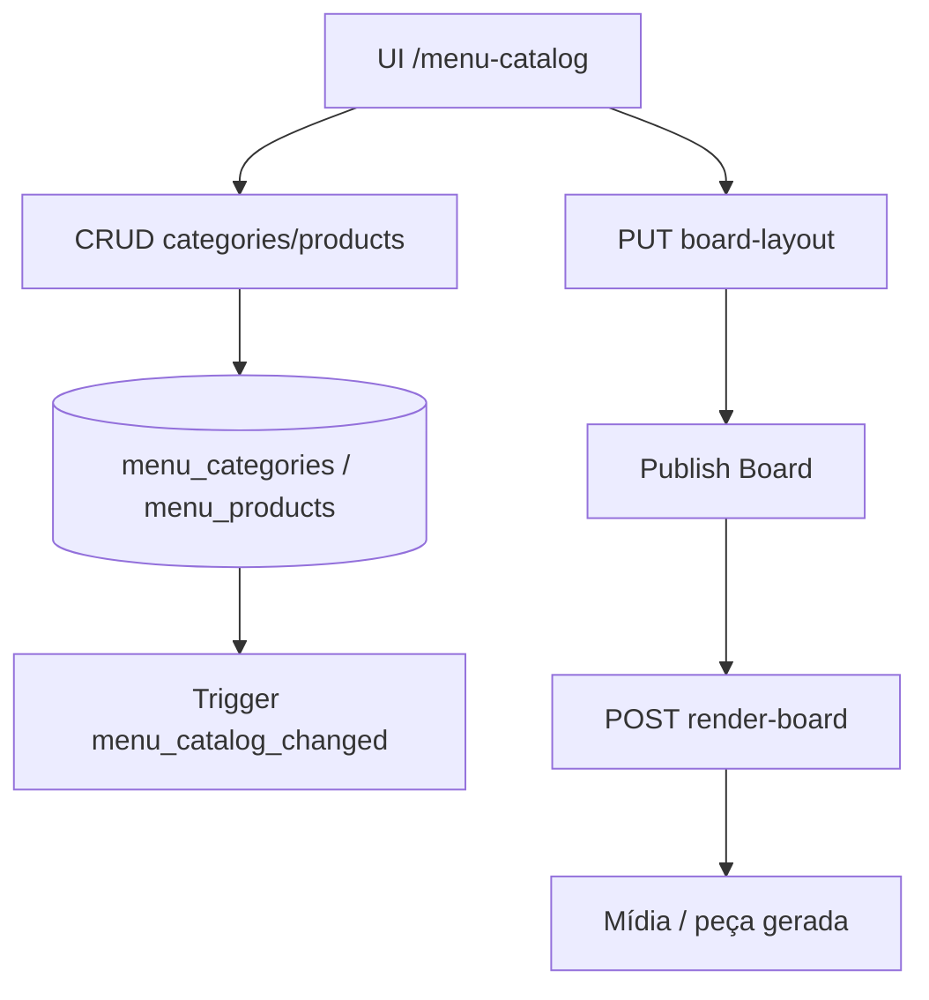
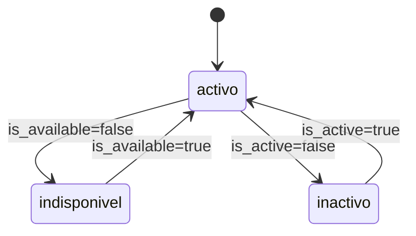

# `menu-catalog` — Cardápio por cliente

| Campo | Valor |
|-------|-------|
| **Slug** | `menu-catalog` |
| **Modos** | Lite, Pro |
| **Atores** | admin, gerente_marketing, subscriber_user |
| **UI** | `/menu-catalog` |
| **API** | `/api/subscribers/:subscriberId/menu-catalog` |
| **Status** | active |
| **Profundidade** | L2 |
| **Última revisão** | 2026-08-09 |

---

## 1. Visão e escopo

### Propósito
Catálogo de categorias e produtos (cardápio digital) por anunciante, consumido pelo publish-board (`render-board` / presets menu).

### Dentro do escopo
- CRUD de categorias e produtos por `subscriber_id`
- Layout de board (`GET/PUT .../board-layout`)
- Render de board a partir do catálogo (`POST .../render-board`)
- Flags `is_active` / `is_available`
- Trigger de mudança (`menu_catalog_changed`) para invalidar consumidores

### Fora do escopo
- POS / caixa / stock real
- Billing de itens
- Cardápio global multi-subscriber

### Vocabulário
| Termo | Significado |
|-------|-------------|
| category | linha em `menu_categories` |
| product | linha em `menu_products` |
| board-layout | configuração visual no publish-board |
| preset `menu` | template que consome o catálogo |

---

## 2. Requisitos (EARS)

| ID | Tipo | Requisito |
|----|------|-----------|
| REQ-MC-001 | Ubiquitous | Categorias e produtos devem pertencer a um `subscriber_id`. |
| REQ-MC-002 | Unwanted | O sistema não deve listar itens de outro anunciante no mesmo pedido. |
| REQ-MC-003 | Event-driven | Quando o catálogo muda, o sistema deve emitir/registar evento para consumidores (board). |
| REQ-MC-004 | State-driven | Enquanto `is_available=false`, o produto não deve ser oferecido no render operacional. |
| REQ-MC-005 | Optional | Onde existir board-layout, PUT deve persistir e GET devolver a configuração do subscriber. |
| REQ-MC-006 | Event-driven | Quando `render-board` é pedido, o sistema deve gerar peça a partir do catálogo+layout. |

---

## 3. Regras de negócio

### RN-MC-001 — Isolamento por subscriber

```text
RN-MC-001 — Isolamento por subscriber
Quando: GET categories/products
Se: subscriberId no path
Então: só dados desse subscriber
Excepto: —
Motivo: Multi-tenant
```


### RN-MC-002 — Produto sob categoria

```text
RN-MC-002 — Produto sob categoria
Quando: POST product
Se: category_id de outro subscriber
Então: rejeitar
Excepto: —
Motivo: Integridade referencial
```


### RN-MC-003 — Indisponível omitido

```text
RN-MC-003 — Indisponível omitido
Quando: render-board / listagem operativa
Se: is_available=false
Então: omitir ou marcar indisponível
Excepto: —
Motivo: Evitar promoção de item morto
```


### RN-MC-004 — Soft-off categoria

```text
RN-MC-004 — Soft-off categoria
Quando: categoria is_active=false
Se: listagem padrão
Então: produtos da categoria não usáveis no board
Excepto: —
Motivo: Controlo editorial
```


### RN-MC-005 — Board amarra subscriber

```text
RN-MC-005 — Board amarra subscriber
Quando: PUT board-layout
Se: sempre
Então: layout fica no contexto do subscriber do path
Excepto: —
Motivo: Um cardápio por anunciante
```


---

## 4. Fluxos



### Fluxos de erro
| ID | Gatilho | Resultado |
|----|---------|-----------|
| FX-MC-E01 | subscriber inexistente / fora de escopo | 403/404 |
| FX-MC-E02 | category_id inválido no produto | 400 |
| FX-MC-E03 | render sem layout/itens | 4xx ou board vazio |

---

## 5. Estados

| Campo | Valores canónicos |
|-------|-------------------|
| `is_active` (categoria/produto) | true / false |
| `is_available` (produto) | true / false |
| presets board | `menu`, `promotion`, `ad`, `announcement`, `institutional` |



---

## 6. Critérios de aceite

### AC-MC-001 (P0)

```text
DADO dois anunciantes A e B com produtos
QUANDO GET menu-catalog de A
ENTÃO não inclui produtos de B
```


### AC-MC-002 (P0)

```text
DADO categoria válida do subscriber A
QUANDO POST produto com category de B
ENTÃO operação rejeitada
```


### AC-MC-003 (P0)

```text
DADO produto is_available=false
QUANDO render-board operativo
ENTÃO produto não aparece como disponível
```


### AC-MC-004 (P1)

```text
DADO layout guardado
QUANDO GET board-layout
ENTÃO devolve a configuração persistida
```


---

## 7. Dependências e referências

### Módulos
- [`subscribers`](../subscribers/MODULO.md) — dono do catálogo
- [`publish-board`](../publish-board/MODULO.md) — consome layout/render
- [`publish-templates`](../publish-templates/MODULO.md) — presets `menu`
- [`media-library`](../media-library/MODULO.md) — mídia resultante

### Código de referência
- `backend/src/routes/menu-catalog.ts`
- `backend/src/services/menuCatalogService.ts`
- `backend/src/services/menuCatalogTriggerService.ts`
- `frontend/src/pages/MenuCatalog/MenuCatalog.tsx`
- `database/smartchannel-db-v2-refactored-part6-tables-other.sql` (`menu_categories`, `menu_products`)

### Lacunas conhecidas
- Sem POS/stock; preços são metadados de conteúdo.
- Integração board depende de presets; falhas de render podem ser pouco verbosas.
