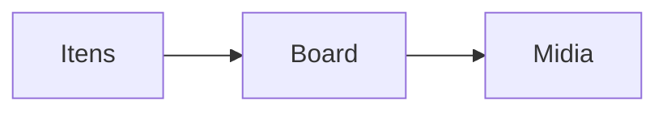

# `menu-catalog` — Cardápio por cliente

| Campo | Valor |
|-------|-------|
| **Slug** | `menu-catalog` |
| **Modos** | Lite, Pro |
| **Atores** | admin, marketing, anunciante |
| **UI** | `/menu-catalog` |
| **API** | `/api/subscribers/:id/menu-catalog` |
| **Status** | active |
| **Última revisão** | 2026-08-09 |

---

## 1. Visão e escopo

### Propósito
Catálogo de produtos/cardápio digital por anunciante, integrado ao publish-board.

### Dentro do escopo
- CRUD itens
- Preços/categorias
- Uso em presets

### Fora do escopo
- POS/caixa

### Vocabulário
| Termo | Significado |
|-------|-------------|
| menu item | produto do cardápio |

---

## 2. Requisitos (EARS)

| ID | Tipo | Requisito |
|----|------|-----------|
| REQ-MC-001 | Ubiquitous | Itens pertencem a um subscriber. |

---

## 3. Regras de negócio

### RN-MC-001 — Isolamento

```text
RN-MC-001 — Isolamento
Quando: Listar cardápio
Se: subscriber X
Então: só itens de X
Excepto: —
Motivo: Multi-tenant
```

---

## 4. Fluxos



---

## 5. Estados

| Estado | Significado | Transições típicas |
|--------|-------------|--------------------|
| activo | usável | → inactivo |

---

## 6. Critérios de aceite

### AC-MC-001 (P0)

```text
DADO dois anunciantes
QUANDO listar catálogo de A
ENTÃO não inclui itens de B
```

---

## 7. Dependências e referências

### Módulos relacionados
- [`subscribers`](../subscribers/MODULO.md)
- [`publish-board`](../publish-board/MODULO.md)

### Referências
- —
