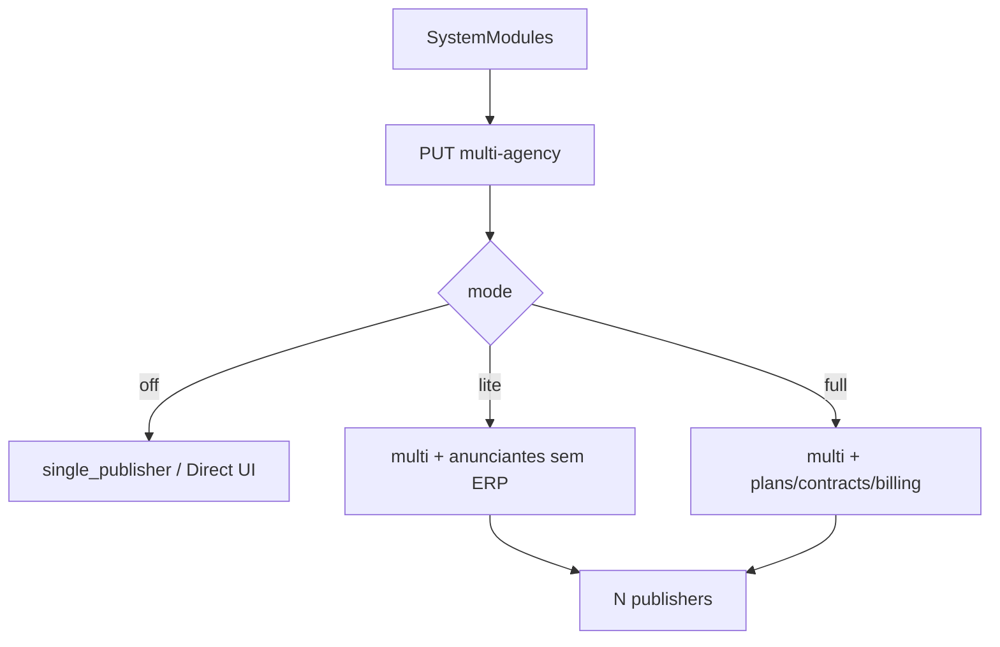
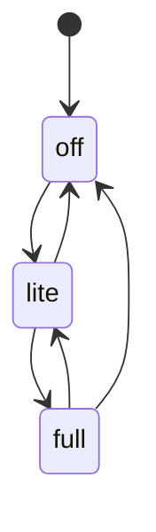

# `multi-agency` — Multi-agência

| Campo | Valor |
|-------|-------|
| **Slug** | `multi-agency` |
| **Modos** | Lite, Pro |
| **Atores** | owner_system, admin_sql, admin, publisher_user |
| **UI** | `/settings/system-modules; /publishers` |
| **API** | `PUT /api/installation/multi-agency; /api/installation/modules` |
| **Status** | active |
| **Profundidade** | L2 |
| **Última revisão** | 2026-08-09 |

---

## 1. Visão e escopo

### Propósito
Master-switch / perfil que habilita várias organizações na instalação (`multi_agency`) e os presets Lite/Pro — base do modelo multi-tenant comercial.

### Dentro do escopo
- `PUT /api/installation/multi-agency` (mode off|lite|full)
- Persistência `installation.profile` / `installation.modules`
- Isolamento de listagens por org quando multi está on
- UI Complementos (`SystemModules`)

### Fora do escopo
- Purge comercial (módulo separado)
- CRUD de publishers (ver `organization`)

### Vocabulário
| Termo | Significado |
|-------|-------------|
| mode | `off` (Direct) \| `lite` \| `full` (Pro) |
| profile | `single_publisher` \| `multi_agency` |
| multi_agency | flag de módulo |

---

## 2. Requisitos (EARS)

| ID | Tipo | Requisito |
|----|------|-----------|
| REQ-MA-001 | State-driven | Enquanto mode lite\|full, `multi_agency` deve estar on. |
| REQ-MA-002 | Event-driven | Quando mode→off, perfil volta a single_publisher sem apagar dados. |
| REQ-MA-003 | Unwanted | Mode off não deve executar commercial-purge. |
| REQ-MA-004 | Ubiquitous | Publisher_user só vê a sua org. |
| REQ-MA-005 | Ubiquitous | Só owner/admin_sql alteram o master-switch. |
| REQ-MA-006 | State-driven | Presets Lite/Pro ligam/desligam módulos (plans, billing, …) conforme policy. |

---

## 3. Regras de negócio

### RN-MA-001 — Isolamento multi-tenant

```text
RN-MA-001 — Isolamento multi-tenant
Quando: listagens publishers/totems
Se: utilizador org A
Então: não vê org B sem ACL
Excepto: —
Motivo: Multi-tenant
```


### RN-MA-002 — OFF ≠ purge

```text
RN-MA-002 — OFF ≠ purge
Quando: mudar para Direct
Se: sempre
Então: dados comerciais permanecem
Excepto: —
Motivo: Segurança — ver commercial-purge
```


### RN-MA-003 — Soberania owner

```text
RN-MA-003 — Soberania owner
Quando: PUT multi-agency
Se: role ≠ owner/admin_sql
Então: negado
Excepto: —
Motivo: Governança
```


### RN-MA-004 — Preset coerente

```text
RN-MA-004 — Preset coerente
Quando: mode=lite
Se: sempre
Então: plans/billing off no preset
Excepto: —
Motivo: Product modes
```


### RN-MA-005 — Profile sync

```text
RN-MA-005 — Profile sync
Quando: mode lite|full
Se: sucesso
Então: installation.profile=multi_agency
Excepto: —
Motivo: Runtime compact vs multi
```


---

## 4. Fluxos



---

## 5. Estados

| Campo | Valores |
|-------|---------|
| mode | `off`, `lite`, `full` |
| profile | `single_publisher`, `multi_agency` |
| multi_agency flag | on / off |



---

## 6. Critérios de aceite

### AC-MA-001 (P0)

```text
DADO duas orgs e publisher_user da A
QUANDO listar publishers
ENTÃO só vê A
```


### AC-MA-002 (P0)

```text
DADO instalação lite com dados
QUANDO mode off
ENTÃO dados comerciais ainda consultáveis
```


### AC-MA-003 (P0)

```text
DADO operator comum
QUANDO PUT /api/installation/multi-agency
ENTÃO negado
```


---

## 7. Dependências e referências

### Módulos
- [`product-modes`](../product-modes/MODULO.md), [`system-modules`](../system-modules/MODULO.md), [`organization`](../organization/MODULO.md), [`commercial-purge`](../commercial-purge/MODULO.md)

### Código de referência
- `backend/src/routes/installationModules.ts`
- `backend/src/policy/installationModules.ts`
- `backend/src/services/installationModulesService.ts`
- `frontend/src/pages/Settings/SystemModules.tsx`
- `system_settings` keys `installation.profile`, `installation.modules`

### Lacunas conhecidas
- Não é domínio CRUD — é switch de instalação; docs que o tratem como “agência” com entidades próprias confundem com publishers.
