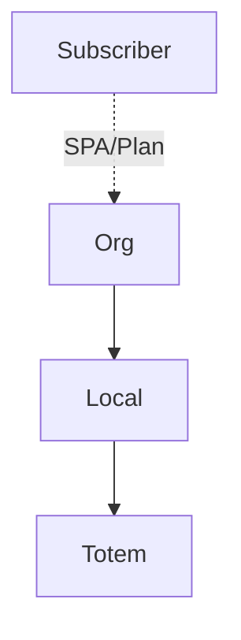

# `network-topology` — Rede visual / topologia

| Campo | Valor |
|-------|-------|
| **Slug** | `network-topology` |
| **Modos** | Lite, Pro |
| **Atores** | admin, técnico, publisher/subscriber |
| **UI** | `/network-topology` |
| **API** | `/api/network` |
| **Status** | active |
| **Última revisão** | 2026-08-09 |

---

## 1. Visão e escopo

### Propósito
Visualização da hierarquia org → locais → totens / anunciantes.

### Dentro do escopo
- Visualização
- Navegação

### Fora do escopo
- Alterar ACL comercial

### Vocabulário
| Termo | Significado |
|-------|-------------|
| topologia | grafo da rede |

---

## 2. Requisitos (EARS)

| ID | Tipo | Requisito |
|----|------|-----------|
| REQ-NET-001 | Ubiquitous | A topologia deve reflectir apenas entidades autorizadas ao utilizador. |

---

## 3. Regras de negócio

### RN-NET-001 — Escopo por role

```text
RN-NET-001 — Escopo por role
Quando: abrir topologia
Se: publisher_user
Então: só a sua org
Excepto: —
Motivo: Isolamento
```

---

## 4. Fluxos



---

## 5. Estados

| Estado | Significado | Transições típicas |
|--------|-------------|--------------------|
| view | somente leitura | — |

---

## 6. Critérios de aceite

### AC-NET-001 (P0)

```text
DADO publisher A
QUANDO abrir topologia
ENTÃO não vê totens da org B
```

---

## 7. Dependências e referências

### Módulos relacionados
- [`organization`](../organization/MODULO.md)
- [`locals`](../locals/MODULO.md)
- [`totems`](../totems/MODULO.md)
- [`subscribers`](../subscribers/MODULO.md)

### Referências
- —
