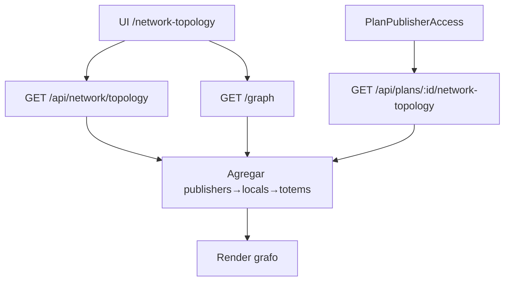

# `network-topology` — Rede visual / topologia

| Campo | Valor |
|-------|-------|
| **Slug** | `network-topology` |
| **Modos** | Lite, Pro |
| **Atores** | admin, operador_tecnico, publisher_user, subscriber_user |
| **UI** | `/network-topology` |
| **API** | `/api/network (+ /api/plans/:id/network-topology)` |
| **Status** | active |
| **Profundidade** | L2 |
| **Última revisão** | 2026-08-09 |

---

## 1. Visão e escopo

### Propósito
Visualização read-model da hierarquia publishers → locals → totems → smart_tvs (e grafo relacionado), sem alterar ACL comercial.

### Dentro do escopo
- `GET /api/network/topology`, `/graph`, nearby/related
- Topologia de plano `GET /api/plans/:id/network-topology`
- UI grafo (`HoloGraphNetwork`, `?view=graph`)

### Fora do escopo
- Mutação de inventário ou SPA
- Tabela dedicada de topologia

### Vocabulário
| Termo | Significado |
|-------|-------------|
| topology | árvore org→local→totem |
| graph | vista de relações / filtros tempo |
| plan topology | subset da rede coberta pelo plano |

---

## 2. Requisitos (EARS)

| ID | Tipo | Requisito |
|----|------|-----------|
| REQ-NET-001 | Ubiquitous | A topologia deve reflectir apenas entidades no escopo do utilizador. |
| REQ-NET-002 | Unwanted | Publisher_user não deve ver totens de outra org. |
| REQ-NET-003 | Optional | Filtros dayOfWeek/time no grafo devem restringir arestas quando aplicados. |
| REQ-NET-004 | Event-driven | Quando inventário muda, próximo GET reflecte dados actuais (sem cache stale obrigatória). |
| REQ-NET-005 | State-driven | Em mode Direct, a vista deve colapsar para a org single-publisher. |
| REQ-NET-006 | Optional | Plan topology só com módulo plans (Pro). |

---

## 3. Regras de negócio

### RN-NET-001 — Escopo por role

```text
RN-NET-001 — Escopo por role
Quando: GET topology/graph
Se: publisher_user
Então: só a sua org
Excepto: —
Motivo: Isolamento
```


### RN-NET-002 — Read-only

```text
RN-NET-002 — Read-only
Quando: UI topologia
Se: sempre
Então: não muta inventário
Excepto: —
Motivo: Ferramenta de visualização
```


### RN-NET-003 — Sem schema próprio

```text
RN-NET-003 — Sem schema próprio
Quando: persistência
Se: sempre
Então: agrega publishers/locals/totems/smart_tvs
Excepto: —
Motivo: Read-model
```


### RN-NET-004 — Plan subset

```text
RN-NET-004 — Plan subset
Quando: GET plans/:id/network-topology
Se: plano com acessos
Então: só rede do plano
Excepto: —
Motivo: Comercial Pro
```


### RN-NET-005 — Subscriber via SPA/plano

```text
RN-NET-005 — Subscriber via SPA/plano
Quando: vista anunciante
Se: sem acesso
Então: nós de org omitidos
Excepto: —
Motivo: ACL comercial
```


---

## 4. Fluxos



---

## 5. Estados

| Conceito | Valores |
|----------|---------|
| vista | tree / graph |
| device status (herdado) | online/offline/… |
| plan topology | disponível só se plans on |

Sem máquina de estados própria (read-model).

---

## 6. Critérios de aceite

### AC-NET-001 (P0)

```text
DADO publisher A autenticado
QUANDO abrir topologia
ENTÃO não vê totens da org B
```


### AC-NET-002 (P0)

```text
DADO utilizador sem acesso a org X
QUANDO GET /api/network/topology
ENTÃO nós de X ausentes
```


### AC-NET-003 (P0)

```text
DADO plano com 1 publisher
QUANDO GET network-topology do plano
ENTÃO só esse publisher e descendentes autorizados
```


---

## 7. Dependências e referências

### Módulos
- [`organization`](../organization/MODULO.md), [`locals`](../locals/MODULO.md), [`totems`](../totems/MODULO.md), [`plans`](../plans/MODULO.md), [`subscriber-publisher-access`](../subscriber-publisher-access/MODULO.md)

### Código de referência
- `backend/src/routes/network.ts`
- `backend/src/services/planService.ts` (`getPlanNetworkTopology`)
- `frontend/src/pages/NetworkTopology/NetworkTopology.tsx`
- `frontend/src/components/HoloGraphNetwork/HoloGraphNetwork.tsx`

### Lacunas conhecidas
- Sem tabela `network_*`; documentação antiga que fale em schema próprio está desactualizada.
