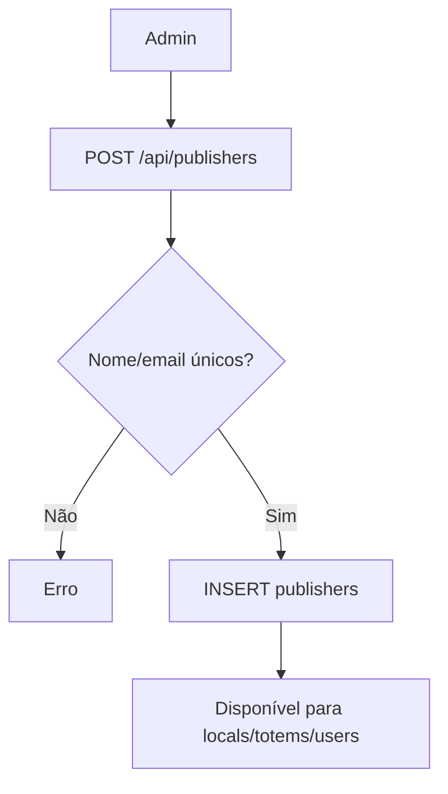

# `organization` — Organização (publishers)

| Campo | Valor |
|-------|-------|
| **Slug** | `organization` |
| **Modos** | all |
| **Atores** | owner_system, admin_sql, admin, operador_comercial (API create também operadores faturamento) |
| **UI** | `/publishers` (“Sua organização” no Direct) |
| **API** | `/api/publishers` |
| **Status** | active |
| **Profundidade** | L2 |
| **Última revisão** | 2026-08-09 |

---

## 1. Visão e escopo

### Propósito
Gerir a entidade **publisher** (organização dona de locais/totens), incluindo stats e relações com inventário.

### Dentro do escopo
- CRUD de publishers (delete = soft)
- Listar locais/totens/smart-tvs/stats por org
- Campanhas mixed (leitura) por org/totem
- Identidade de dono do sistema (`is_system_owner`)

### Fora do escopo
- Billing detalhado (`billing` / `/api/publisher-billing`)
- Portal tenant DNS/SSL (`system-modules` portal)
- CRUD de locais (módulo `locals`)

### Vocabulário
| Termo | Significado |
|-------|-------------|
| publisher / organização | registo em `publishers` |
| system owner | único `is_system_owner=true` |
| soft delete | `is_active=false` |
| portal_slug | slug público do portal da org |

---

## 2. Requisitos (EARS)

| ID | Tipo | Requisito |
|----|------|-----------|
| REQ-ORG-001 | Ubiquitous | Toda organização deve ser um publisher (`is_publisher=true`, não subscriber). |
| REQ-ORG-002 | Unwanted | Não pode existir mais do que um `is_system_owner`. |
| REQ-ORG-003 | Event-driven | Quando se cria publisher, nome/email devem ser únicos. |
| REQ-ORG-004 | Event-driven | Quando se “apaga”, o sistema deve desactivar (`is_active=false`), não hard-delete. |
| REQ-ORG-005 | State-driven | Em contexto portal tenant, listagem deve restringir à org do host. |
| REQ-ORG-006 | Optional | Onde houver contrato no create, só draft/active são aceites. |

---

## 3. Regras de negócio

### RN-ORG-001 — Publisher ≠ subscriber

```text
RN-ORG-001 — Publisher ≠ subscriber
Quando: INSERT/UPDATE publishers
Se: sempre
Então: CHECK is_subscriber=false e is_publisher=true / client_type=publisher
Excepto: —
Motivo: Separar anunciante de organização
```

### RN-ORG-002 — Um system owner

```text
RN-ORG-002 — Um system owner
Quando: marcar is_system_owner
Se: já existe outro
Então: índice parcial único bloqueia
Excepto: —
Motivo: Instância single-owner estável
```

### RN-ORG-003 — Soft delete

```text
RN-ORG-003 — Soft delete
Quando: DELETE /api/publishers/:id
Se: sucesso
Então: is_active=false
Excepto: —
Motivo: Preservar histórico e FKs
```

### RN-ORG-004 — Unicidade nome/email

```text
RN-ORG-004 — Unicidade nome/email
Quando: create/update
Se: conflito
Então: erro de unicidade
Excepto: —
Motivo: Identidade operacional clara
```

### RN-ORG-005 — Portal tenant

```text
RN-ORG-005 — Portal tenant
Quando: listagem em host de portal
Se: tenant resolvido
Então: só a org desse host
Excepto: admins em host principal
Motivo: Isolamento white-label
```

### RN-ORG-006 — Create roles API vs menu

```text
RN-ORG-006 — Create roles API vs menu
Quando: POST /
Se: role ∈ admin|admin_sql|owner_system|operador_faturamento|operador_comercial
Então: API permite create
Excepto: menu UI mais restrito (admin*)
Motivo: Lacuna documentada — UI ≠ API
```

---

## 4. Fluxos

### Criar organização


### Fluxos de erro
| ID | Gatilho | Resultado |
|----|---------|-----------|
| FX-ORG-E01 | Nome duplicado | 409 / erro serviço |
| FX-ORG-E02 | Segundo system owner | violação índice |

---

## 5. Estados

| Campo | Significado |
|-------|-------------|
| `is_active=true` | org operacional |
| `is_active=false` | soft-deleted |
| `is_system_owner` | dono da instalação (≤1) |

---

## 6. Critérios de aceite

### AC-ORG-001 (P0)

```text
DADO instalação Direct
QUANDO abrir /publishers
ENTÃO vê a organização (system owner) editável conforme role
```

### AC-ORG-002 (P0)

```text
DADO publisher activo
QUANDO DELETE
ENTÃO is_active=false e deixa de aparecer em listagens activas
```

### AC-ORG-003 (P0)

```text
DADO já existe is_system_owner
QUANDO tentar criar outro system owner
ENTÃO operação falha
```

---

## 7. Dependências e referências

### Módulos
- [`locals`](../locals/MODULO.md), [`totems`](../totems/MODULO.md)
- [`users-access`](../users-access/MODULO.md) — `users.publisher_id`
- [`direct-totem-mode`](../direct-totem-mode/MODULO.md), [`multi-agency`](../multi-agency/MODULO.md)
- [`contracts`](../contracts/MODULO.md), [`billing`](../billing/MODULO.md)

### Código de referência
- `backend/src/routes/publishers.ts`
- `backend/src/services/publisherService.ts`
- `database/smartchannel-db-v2-refactored-part2-tables-base.sql` (`publishers`)
- `frontend/src/pages/Publishers/` (página `/publishers`)

### Lacunas conhecidas
- Paths `/publishers/new` e `/publishers/details` no menu sem `<Route>` dedicado em `App.tsx` (provável dialog).
- Roles de create na API mais amplos que o menu.
